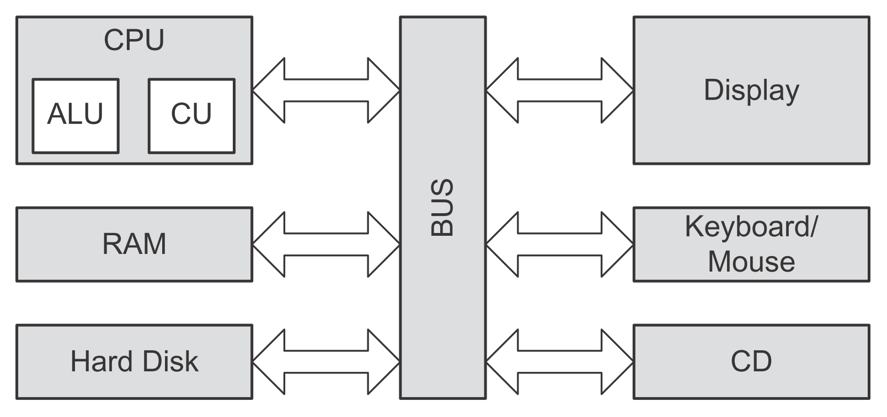
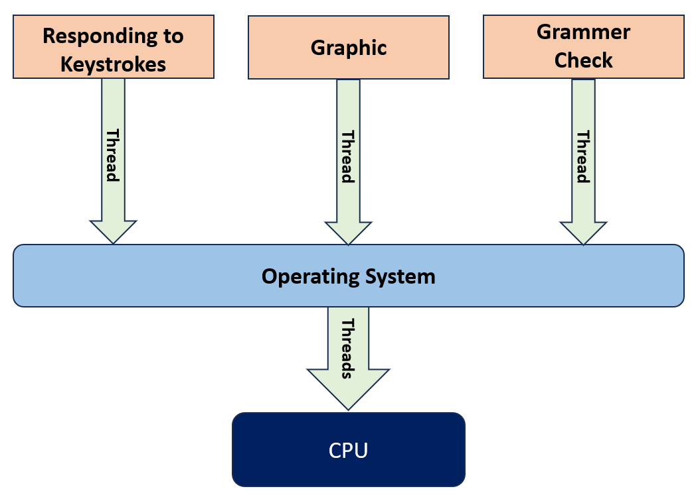
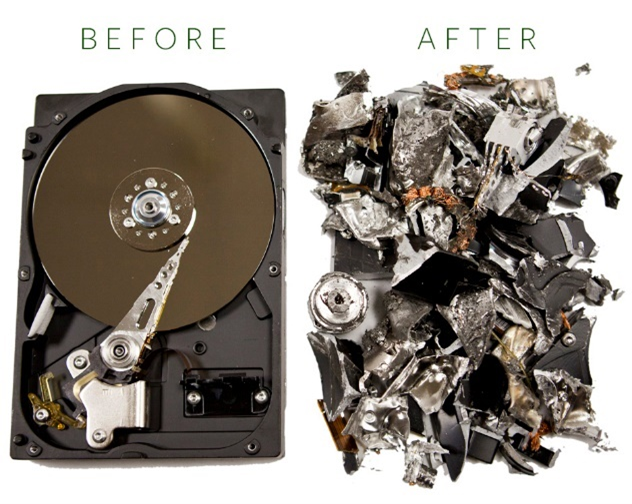
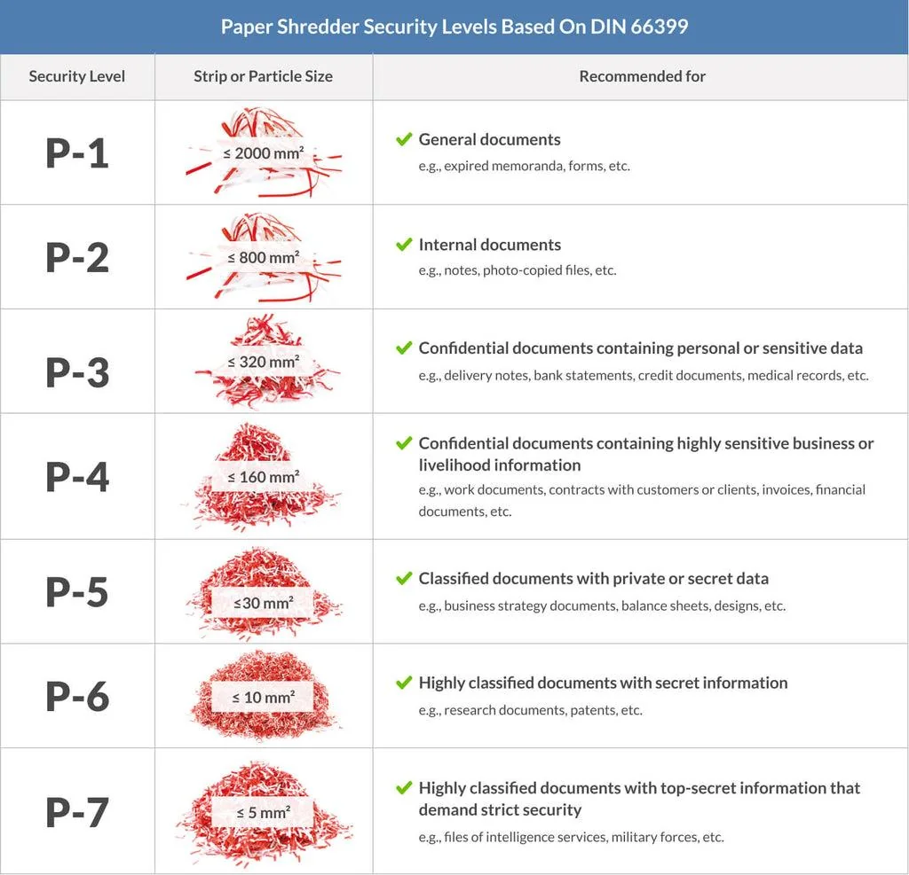
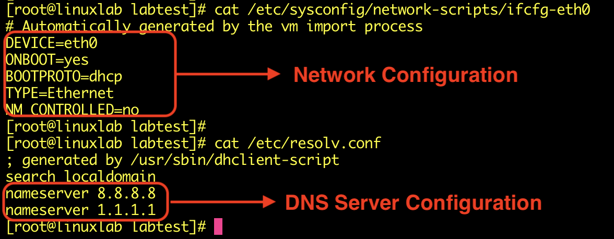

## Modèles d’Architecture Informatique
- Les systèmes informatiques modernes reposent sur plusieurs **modèles architecturaux** qui définissent notamment :
    - organisation CPU / mémoire ;
    - circulation des données et instructions ;
    - jeu d’instructions ;
    - séparation des privilèges.
### Architecture de Von Neumann
- L'architecture de Von Neumann est un modèle d'architecture informatique qui établit les principes de conception de base des ordinateurs modernes.
- Ce modèle de base a jeté les fondations de la conception des ordinateurs modernes et est encore largement utilisé aujourd'hui.
- Modèle fondamental proposé en **1945**.
- Selon ce modèle, une architecture informatique de base se compose : 
	- d'une unité de traitement centrale (**CPU**) ;
	- d'une structure de mémoire qui collecte les données ;
    - périphériques d’entrée/sortie ;
    - bus permettant les communications.
```
Input / Output
      ↕
     CPU
      ↕
    Memory
```
#### CPU — Central Processing Unit
- Le CPU est l'unité de traitement centrale de l'architecture de Von Neumann et des systèmes informatiques.
- Lit les instructions depuis la mémoire.
- Les interprète et traite les données.
- Il comprend deux composants fondamentaux :
```
CPU
├─ ALU → Arithmetic Logic Unit
└─ CU  → Control Unit
```
- **ALU** → opérations arithmétiques et logiques.
- **CU** → contrôle et coordination de l’exécution.

#### Memory
- Dans l’architecture Von Neumann :
	- **instructions et données utilisent la même mémoire** ;
	- La mémoire sert à la fois pour les instructions et les données, permettant le stockage simultané des programmes et des données ;
	- le CPU lit et écrit dans cette mémoire.
```
Memory
├─ Instructions
└─ Data
```
- C’est la caractéristique principale à retenir pour la comparaison avec Harvard.
#### Instruction Set
- Ensemble des instructions que le processeur peut comprendre et exécuter.
- Ces instructions sont lues depuis la mémoire, interprétées et exécutées par le processeur.
Exemples conceptuels :
```
LOAD
STORE
ADD
SUB
JUMP
```
```
Memory → Fetch Instruction → Decode → Execute
```
#### Data Bus & Address Bus
- **Data Bus** → permet de transporter les données à l'intérieur de l'ordinateur.
- **Address Bus** → transporte les adresses, et les instructions, indiquant où lire/écrire en mémoire.
```
Data Bus    → quoi ?
Address Bus → où ?
```


#### Input / Output Devices
- Permettent au système de communiquer avec l’extérieur :
	- keyboard ;
	- mouse ;
	- monitor ;
	- printer ;
	- périphériques externes.
### Architecture Harvard
- L'architecture Harvard, tout comme l'architecture de Von Neumann, est un modèle qui définit l'architecture informatique de base.
- Bien qu'elle soit basée sur l'architecture de Von Neumann en termes de conception, elle propose quelques améliorations.
- L'architecture Harvard a favorisé le développement d'un modèle plus rapide et plus efficace grâce à ses améliorations par rapport à l'architecture de Von Neumann.
- La principale différence avec Von Neumann est la **séparation entre mémoire des instructions et mémoire des données**. Les grandes différences sont : 

#### Memory Management
- L'architecture Harvard propose une structure dans laquelle les données et les instructions sont stockées dans des mémoires physiques séparées.
- Elle facilite un accès rapide à diverses données grâce à deux mémoires distinctes : la mémoire de données et la mémoire d'instructions.
```
Von Neumann
→ Instructions + Data = même mémoire

Harvard
→ Instruction Memory ≠ Data Memory
```
→ chaque type peut avoir son propre chemin d’accès.
#### Speed et Performance
- Les différentes structures de mémoire proposées dans le cadre de l'architecture Harvard permettent de traiter simultanément les instructions et les données, ce qui augmente la vitesse du processeur.
- Cette séparation permet :
	- accès simultané aux instructions et aux données ;
	- réduction de certains conflits d’accès mémoire ;
	- meilleures performances dans certains systèmes.

> Complément : beaucoup de processeurs modernes utilisent une **Modified Harvard Architecture** : espace mémoire globalement unifié, mais caches séparés pour instructions et données (`I-Cache` / `D-Cache`).

#### Parallel Processing
- L'architecture Harvard propose des chemins et des unités de traitement séparés pour les instructions et les données.
- Cela facilite le traitement parallèle et permet au processeur de fonctionner plus rapidement.
#### Von Neumann vs Harvard

|                           | Von Neumann            | Harvard                             |
| ------------------------- | ---------------------- | ----------------------------------- |
| Mémoire instructions/data | Commune                | Séparée                             |
| Bus / chemins             | Souvent partagés       | Séparés                             |
| Accès simultané           | Plus limité            | Plus facile                         |
| Complexité                | Plus simple            | Plus complexe                       |
| Performance potentielle   | Limitée par le partage | Plus élevée dans certains workloads |


```
Von Neumann → shared instructions/data path
Harvard     → separate instructions/data paths
```
### Instruction Set Architecture — ISA
- Une **ISA** définit définit les instructions des systèmes informatiques, leur fonctionnalité et leur mode de fonctionnement
- Elle détermine l'interaction entre le processeur (CPU) et le logiciel :
	- instructions disponibles ;
	- registres ;
	- types de données ;
	- modes d’adressage ;
	- comportement des instructions.

```
Software
   ↓
  ISA
   ↓
CPU Hardware
```
> L’ISA n’est pas une alternative à Von Neumann ou Harvard : elle décrit surtout **ce que le processeur expose au logiciel**. C'est une approche architecturale qui modélise le traitement des jeux d'instructions au sein des architectures basées sur elles.

- Deux grandes familles classiques :
```
ISA
├─ CISC
└─ RISC
```
#### CISC — Complex Instruction Set Computer
- L'architecture CISC (Ordinateur à jeu d'instructions complexe) Offre plus de généralité et de flexibilité dans le traitement d'une grande variété d'instructions.
- Architecture est utilisée dans les processeurs des ordinateurs modernes à usage général :
	- (**Intel x86**, etc.).
- Jeu d’instructions riche et complexe.
- Une instruction peut effectuer plusieurs opérations.
##### Caractéristiques
- Jeu d'instruction complexe : emploie un jeu d'instructions contenant un large éventail d'instructions complexes, qui englobent de multiples opérations et exécutent diverses tâches en une seule instruction.
- Utilisation réduite des registres : utilisent généralement moins de registres de processeur et certaines des instructions opèrent en mémoire. Cela peut entraîner des accès fréquents à la mémoire.
- Modes d'adressage complexes : peuvent avoir des modes d'adressage complexes, rendant l'accès à la mémoire plus flexible et complexe.
- Dépendances de haut niveau : peuvent être interdépendantes, nécessitant un traitement séquentiel des instructions. Cela peut parfois amener les processeurs à prendre plus de temps.
- Exemple conceptuel :
```
Instruction complexe
→ Load
→ Calculate
→ Store
```
#### RISC — Reduced Instruction Set Computer
- L'architecture RISC (Ordinateur à jeu d'instructions réduit) est particulièrement privilégiée pour les ordinateurs à haute performance et les appareils mobiles. Exemples :
    - **ARM** ;
    - **PowerPC**.
- Jeu d’instructions plus simple et généralement plus régulier.
- Les opérations utilisent fortement les **registers**.
##### Caractéristiques
- instructions simples : utilise un jeu d'instructions limité et simple. Chaque instruction est conçue pour effectuer une opération de base.
- davantage de registres : utilisent généralement plus de registres de processeur et opèrent les instructions sur ces registres. Cela réduit l'accès à la mémoire.
- modes d’adressage plus simples : ont des modes d'accès à la mémoire simples et directs, ce qui rend l'accès à la mémoire plus rapide et plus cohérent.
- moins de dépendances : ne dépendent généralement pas les unes des autres, et les processeurs peuvent traiter les instructions de manière plus indépendante.
```
RISC
→ simple instructions
→ register-oriented
→ predictable execution
```
#### CISC vs RISC

|CISC|RISC|
|---|---|
|Instructions plus complexes|Instructions plus simples|
|Nombreux modes d’adressage|Modes plus simples|
|Peut opérer directement en mémoire|Beaucoup d’opérations via registres|
|Exemple : x86-64|Exemple : ARM|

> Aujourd’hui, la frontière est moins stricte : les processeurs modernes combinent de nombreuses optimisations internes. Un CPU x86 peut par exemple traduire certaines instructions complexes en **micro-operations** plus simples.
### Architecture en anneaux - Protection Ring Architecture
- Les **Protection Rings** séparent le code selon son niveau de privilège.
- Plus le numéro est proche de `0`, plus les privilèges sont élevés.

#### Ring 0
- Niveau le plus privilégié.
- Généralement utilisé par :
    - kernel ;
    - composants noyau ;
    - drivers exécutés en kernel mode.
- Peut accéder directement à :
	- mémoire ;
	- CPU ;
	- périphériques ;
	- ressources système critiques.
```
Ring 0
→ Kernel Mode
→ Full privileges
```
- Une compromission en Ring 0 est donc particulièrement critique.
#### Rings 1 & 2
- Ils existent dans l’architecture x86 mais sont **rarement utilisés par les OS modernes généralistes**.
- Windows et Linux utilisent principalement :
```
Ring 0 → Kernel
Ring 3 → User applications
```
> ⚠️ Le cours inverse/confond ici certains rôles : **Ring 3 est bien un niveau de privilège matériel x86 et correspond normalement au user mode**. Les Rings 1 et 2 sont généralement inutilisés dans Windows/Linux modernes. Le passage indiquant que Ring 2 contient les applications et que Ring 3 « n’est pas réellement un anneau matériel » est donc incorrect.
#### Ring 3
- Niveau où s’exécutent généralement les **applications utilisateur**.
- Les programmes n’accèdent pas directement aux ressources privilégiées.
```
Application
   ↓
Ring 3
   ↓ System Call
Kernel
   ↓
Ring 0
```
- Pour effectuer une opération privilégiée, une application doit passer par les mécanismes contrôlés du système d’exploitation.
#### Intérêt sécurité des Rings
- La séparation des privilèges limite ce qu’un programme compromis peut faire.
```
Malware en Ring 3
→ accès limité

Privilege Escalation
→ Ring 0
→ contrôle beaucoup plus important du système
```
- Un processus utilisateur compromis **ne peut pas simplement accéder au kernel** : il doit exploiter une vulnérabilité, obtenir des privilèges supplémentaires ou utiliser une interface autorisée.

## À retenir

```
Von Neumann
→ Instructions + Data dans la même mémoire

Harvard
→ Instructions et Data séparées
```

```
ISA
→ interface CPU ↔ software

CISC → instructions plus complexes
RISC → instructions plus simples
```

```
Protection Rings

Ring 0 → Kernel / highest privilege
Ring 3 → User Mode / lowest privilege
```

Le point sécurité essentiel est la **séparation des privilèges** : une application utilisateur s’exécute normalement dans un contexte limité, tandis que le kernel dispose d’un accès beaucoup plus puissant au système.

## CPU et Types d’Exécution

### Microprocesseur / CPU et structure— Central Processing Unit
- Le **CPU** est l’unité centrale chargée d’exécuter directement les calculs complexes qui permettent aux systèmes informatiques d'accomplir les tâches pour lesquelles ils sont prévus.
- Bien que les CPU soient des structures assez complexes, 3 composants forment leur structure de base :
    - **ALU** ;
    - Unité de contrôle / **Control Unit (CU)** ;
    - Registres / **Registers**.

```
CPU
├─ ALU
├─ Control Unit
└─ Registers
```


> ⚠️ Un **CPU** et un **microprocesseur** sont souvent assimilés dans les PC modernes, mais ce ne sont pas strictement des synonymes : un microprocesseur est une implémentation du CPU sur un circuit intégré.
#### ALU — Arithmetic Logic Unit / Unité Arithmétique et Logique
- Sous-système d'un processeur qui effectue les opérations mathématiques et logiques de base.
- L'élément de base de tous les processeurs, de ceux qui effectuent les opérations les plus simples aux systèmes informatiques les plus complexes.
- L'ALU se compose de deux parties principales :
	- **Arithmetic Unit** - Unité arithmétique : Effectue des opérations arithmétiques telles que l'addition, la soustraction, la multiplication et la division.
	- **Logic Unit** - : Effectue des opérations logiques comme : AND, OR, NOT, XOR
→ l’ALU constitue une partie essentielle de l’exécution des instructions.
#### CU - Control Unit / Unité de Contrôle
- La CU récupère les instructions de la mémoire, les envoie à l'ALU et retransmet les résultats à la mémoire pendant le fonctionnement du processeur.
- En résumé, elle agit comme un pont entre le CPU et la mémoire.
```
Fetch
→ Decode
→ Execute
```
- Responsabilités principales :
	- `Lecture et interprétation des instructions` :  La CU reçoit les instructions de la mémoire et les interprète. Cela implique de déterminer la fonction de l'instruction.
	- `Exécution des instructions :` La CU envoie les instructions à l'ALU. L'ALU les exécute et renvoie les résultats à la CU.
	- `Ordonnancement des instructions :` La CU met les instructions en ordre. Cela garantit qu'elles sont exécutées dans le bon ordre.
	- `Interruption des instructions :` La CU peut interrompre les instructions. Cela permet au CPU d'exécuter une autre tâche.

> La CU ne « renvoie » pas systématiquement elle-même chaque résultat en mémoire : elle **contrôle et coordonne** les unités qui réalisent les opérations.
#### Registers — Registres
- Petites zones de mémoire **très rapides**, directement intégrées au CPU.
- Ils contiennent les données et les adresses que le CPU utilise pour exécuter les instructions.
- Utilisées pour conserver temporairement :
    - données ;
    - adresses ;
    - résultats intermédiaires ;
    - informations nécessaires à l’exécution.
```
Registers
→ très petits
→ très rapides
→ directement accessibles par le CPU
```
- Ils réduisent le nombre d’accès nécessaires à la RAM.
- Exemples courants de registres selon l’architecture :
	- registres généraux ;
	- **Program Counter / Instruction Pointer** ;
	- **Stack Pointer** ;
	- registres de flags/status.
> ⚠️ Dire qu’un CPU 32 bits possède uniquement des registres de 32 bits est une simplification. La taille des registres dépend de l’ISA et du type de registre.
### Types d’Exécution du CPU
Les systèmes peuvent organiser l’exécution des tâches de plusieurs manières :
```
Multiprocessing
Multitasking
Multiprogramming
Multithreading
```
#### Multiprocessing — Multitraitement

- Utilisation de **plusieurs processeurs ou plusieurs unités de traitement** (coeurs) pour exécuter plusieurs travaux.
- Permet une véritable exécution parallèle si plusieurs CPU/cores sont disponibles.
```
CPU/Core 1 → Task A
CPU/Core 2 → Task B
CPU/Core 3 → Task C
```
- Avantages :
	- parallélisme ;
	- meilleures performances ;
	- meilleure capacité à traiter plusieurs workloads simultanément.
- Aujourd’hui, les processeurs multicœurs rendent ce modèle très courant.
- en pratique moderne, le terme _multiprocessing_ peut aussi désigner l'utilisation de **plusieurs unités d'exécution CPU**, donc plusieurs cœurs. Il faut distinguer trois niveaux :

|Terme|Exemple|Physiquement|
|---|---|---|
|**CPU / socket**|2 × AMD EPYC|2 processeurs physiques|
|**Core / cœur**|8 cœurs par CPU|plusieurs cœurs dans un même processeur|
|**Thread logique**|SMT / Hyper-Threading|plusieurs CPU logiques par cœur|
- Cas 1 — plusieurs processeurs physiques : Historiquement, le multiprocessing ressemblait surtout à ça :
	- Deux processeurs physiques travaillent en parallèle. C'est ce qu'on appelle typiquement un système **multiprocesseur**, souvent avec une architecture **SMP** (_Symmetric Multiprocessing_).
```
Carte mère
 ├── CPU 1
 │    └── Core
 └── CPU 2
      └── Core
```
- Cas 2 — un seul CPU avec plusieurs cœurs : Aujourd'hui, beaucoup de machines sont plutôt :
	- Il n'y a qu'**un seul processeur physique**, mais quatre cœurs capables d'exécuter du travail en parallèle.
	- Du point de vue du système d'exploitation, cela permet quand même du **multiprocessing parallèle**.
	- C'est pourquoi l'expression « plusieurs processeurs » est un peu ambiguë.
```
CPU physique
 ├── Core 0
 ├── Core 1
 ├── Core 2
 └── Core 3
```
- Et avec **Hyper-Threading** / **SMT**. Ça peut encore se compliquer :
```
1 CPU physique
│
├── Core 0
│   ├── Thread logique 0
│   └── Thread logique 1
│
├── Core 1
│   ├── Thread logique 2
│   └── Thread logique 3
│
├── Core 2
│   ├── Thread logique 4
│   └── Thread logique 5
│
└── Core 3
    ├── Thread logique 6
    └── Thread logique 7
```
- Donc la machine peut avoir :
	- **1 socket CPU**
	- **4 cœurs physiques**
	- **2 threads par cœur**
	- donc **8 CPU logiques**
#### Multitasking — Multitâche
- Capacité d’un OS à faire progresser **plusieurs tâches/processus** de façon concurrente.
- Chaque processus possède généralement son propre :
	- espace mémoire virtuel ;
	- contexte d’exécution ;
	- ressources.
		- ce qui entraîne une augmentation des besoins en mémoire.
- Exemple :
```
Word
Excel
Browser
Media Player
```
- Sur un seul cœur :
```
Task A
→ Task B
→ Task C
→ Task A
```
- Le scheduler attribue de courts intervalles de CPU à chaque tâche, créant l’impression de simultanéité.
> ⚠️ Le multitasking n’est pas limité à **un seul cœur**. Sur un système multicœur, plusieurs tâches peuvent aussi être exécutées réellement en parallèle.
#### Multiprogramming — Multiprogrammation
- Technique consistant à conserver **plusieurs programmes en mémoire** afin que le CPU puisse en exécuter un autre lorsqu’un programme attend une ressource, notamment une opération I/O.
- Exemple :
```
Program A → attend le disque
              ↓
CPU exécute Program B
```
- Objectif principal :
```
Garder le CPU occupé
→ améliorer l'utilisation des ressources
```
- Historiquement très utilisée dans les systèmes mainframe et batch.
> ⚠️ La différence avec le multitasking n’est pas simplement « mainframe vs PC » ou « application spécifique vs OS courant ». Le **multiprogramming** vise surtout à maximiser l’utilisation du CPU, tandis que le **multitasking** ajoute généralement une logique de partage du temps et de réactivité pour plusieurs tâches.
#### Multithreading

- Le multithreading, au-delà de l'exécution parallèle de multiples processus ou tâches, est le concept d'exécuter en parallèle plusieurs opérations au sein d'une même tâche.
- Un **processus** peut contenir plusieurs **threads**.
- Les threads représentent différents flux d’exécution au sein de la même application.
```
Process
├─ Thread 1
├─ Thread 2
└─ Thread 3
```
- Exemple avec un traitement de texte :
```
Thread 1 → saisie utilisateur
Thread 2 → spell checking
Thread 3 → autosave
```
- Les threads d’un même processus partagent généralement :
	- espace mémoire ;
	- code ;
	- certaines ressources.
- Mais disposent notamment de leur propre :
	- stack ;
	- état d’exécution ;
	- registres CPU lorsqu’ils sont planifiés.

> ⚠️ Le multithreading permet la **concurrence** ; il devient réellement parallèle lorsque plusieurs threads sont exécutés simultanément sur plusieurs cores.
### Process vs Thread

|Process|Thread|
|---|---|
|Instance d’un programme|Flux d’exécution dans un processus|
|Espace mémoire généralement isolé|Partage la mémoire du processus|
|Plus lourd à créer|Plus léger|
|Communication plus contrôlée|Partage de données plus direct|

```
Process
→ container de ressources

Thread
→ unité d'exécution
```
### Multitasking vs Multiprocessing vs Multithreading

| Concept              | Principe                                                         |
| -------------------- | ---------------------------------------------------------------- |
| **Multitasking**     | Plusieurs tâches progressent dans le temps                       |
| **Multiprocessing**  | Plusieurs CPU/cores exécutent plusieurs travaux                  |
| **Multiprogramming** | Plusieurs programmes en mémoire pour maximiser l’utilisation CPU |
| **Multithreading**   | Plusieurs flux d’exécution dans un même processus                |

```
Multitasking
→ plusieurs tâches

Multiprocessing
→ plusieurs unités de calcul

Multithreading
→ plusieurs threads dans un process
```
### À retenir

```
CPU
├─ ALU → calculs / logique
├─ CU  → coordination de l'exécution
└─ Registers → stockage ultra-rapide
```

```
Fetch
→ Decode
→ Execute
```

```
Multiprocessing → parallélisme entre CPU/cores
Multitasking    → plusieurs tâches concurrentes
Multiprogramming → maintenir le CPU occupé
Multithreading  → plusieurs threads dans un processus
```

Le point important est de distinguer **concurrence** et **parallélisme** : plusieurs tâches peuvent progresser de façon concurrente sans forcément être exécutées exactement au même instant.

## Structures de CPU Spécifiques aux Applications
- Les CPU sont le composant exécutif de base de tous les systèmes informatiques, en particulier des PC et des systèmes de serveurs.
- Les CPU sont également développés et utilisés sous diverses formes en fonction d'exigences spécifiques.
- Tous les systèmes n’utilisent pas un CPU généraliste comme ceux des PC/serveurs. Selon les besoins, on utilise aussi des architectures spécialisées :
```
Microcontrôleur
FPGA
ASIC
```
- Le choix dépend notamment de :
	- performance ;
	- consommation ;
	- coût ;
	- flexibilité ;
	- capacité de reprogrammation ;
	- usage prévu.
### Microcontrôleur — MCU
- Un **microcontrôleur** regroupe dans un même circuit intégré :
    - CPU ;
    - mémoire ;
    - ports I/O ;
    - timers / counters ;
    - parfois interfaces de communication.
```
Microcontroller
├─ CPU
├─ RAM / Flash
├─ GPIO
├─ Timers
└─ Communication Interfaces
```
#### Caractéristiques
- faible consommation ;
- faible coût ;
- petite taille ;
- programmable ;
- conçu généralement pour une tâche spécifique.
Le logiciel embarqué est souvent appelé **firmware**.
```
Hardware
+
Firmware
→ Embedded Device
```
#### Domaines d’utilisation
Les microcontrôleurs sont très présents dans les **Systèmes embarqués** :
- IoT ;
- automobile ;
- dispositifs médicaux ;
- équipements industriels ;
- appareils électroniques.
- Exemples de familles :
	- PIC12 / PIC16 / PIC18 / PIC32 ;
	- MSP430 ;
	- STM32 ;
	- NXP LPC / S32K ;
	- Renesas RA / RX.
#### Limites
- Généralement moins puissants qu’un CPU généraliste moderne.
	- Cette structure flexible entraîne une perte de vitesse et de performance par rapport aux CPU.
	- Peuvent pas être utilisés dans des environnements qui nécessitent grande puissance de traitement.
- Optimisés pour :
    - contrôle ;
    - faible consommation ;
    - temps réel ;
    - tâches spécifiques,
plutôt que pour exécuter des workloads lourds de PC ou serveur.
> En sécurité, les microcontrôleurs sont importants car une vulnérabilité dans le **firmware** peut compromettre directement un équipement embarqué ou IoT.
### FPGA — Field-Programmable Gate Array
- Un **FPGA** est un circuit intégré contenant des blocs logiques et interconnexions **reconfigurables**.
- Contrairement à un microcontrôleur, on ne programme pas seulement le logiciel exécuté : on peut modifier la **logique matérielle elle-même**.
```
Microcontroller
→ hardware fixe
→ software programmable

FPGA
→ logique hardware reconfigurable
```
#### Programmation
- Les FPGA sont généralement décrits avec des **Hardware Description Languages (HDL)** :
	- Verilog ;
	- VHDL.
```
VHDL / Verilog
→ Hardware Description
→ Synthesis
→ FPGA Configuration
```
- Ils permettent de créer :
	- circuits logiques spécifiques ;
	- accélérateurs ;
	- interfaces matérielles ;
	- parfois un processeur soft-core.
#### Caractéristiques
- Avantages :
	- forte parallélisation ;
	- haute performance sur certains traitements ;
	- reprogrammable ;
	- architecture personnalisable.
- Inconvénients :
	- coûts plus élevés que les microcontrôleurs, tant en termes d'acquisition que de mise en œuvre ;
	- développement plus complexe ;
	- besoin de compétences hardware/HDL.
#### Domaines d’utilisation
- systèmes militaires ;
- satellites ;
- systèmes de traitement du signal nécessitant une grande vitesse ;
- télécommunications ;
- traitement du signal ;
- accélération matérielle ;
- applications nécessitant une faible latence.
Fournisseurs cités :
- Xilinx ;
- Lattice Semiconductor ;
- Intel / Altera ;
- Microchip ;
- QuickLogic.
> Xilinx appartient aujourd’hui à **AMD**, mais le nom Xilinx reste très présent dans l’écosystème FPGA.
### ASIC — Application-Specific Integrated Circuit
- Un **ASIC** est un circuit intégré conçu pour une **fonction précise**.
- Contrairement au FPGA, sa logique est essentiellement fixée lors de la fabrication.
```
FPGA
→ reconfigurable après fabrication

ASIC
→ architecture fixée à la fabrication
```
#### Caractéristiques
Les ASIC sont optimisés pour une tâche particulière, ce qui permet généralement :
- performances élevées ;
- faible consommation ;
- faible latence ;
- meilleure efficacité pour la fonction ciblée.
Mais :
- conception complexe ;
- coût initial très élevé ;
- fabrication longue ;
- erreurs de design difficiles ou impossibles à corriger après production.
```
ASIC
→ High Development Cost
→ High Efficiency
→ Low Flexibility
```
#### Domaines d’utilisation
Les ASIC peuvent être utilisés dans :
- smart cards ;
- cartes bancaires ;
- passeports électroniques ;
- équipements réseau ;
- accélérateurs cryptographiques ;
- hardware spécialisé.
> Une **smart card** peut contenir un circuit spécialisé avec CPU, mémoire et fonctions cryptographiques ; ce n’est pas forcément un ASIC « simple » au sens strict.
### Comparaison MCU / FPGA / ASIC

|               | Microcontrôleur      | FPGA                     | ASIC                             |
| ------------- | -------------------- | ------------------------ | -------------------------------- |
| Hardware      | Fixe                 | Reconfigurable           | Fixe                             |
| Programmation | Firmware/software    | HDL / logique matérielle | Conception avant fabrication     |
| Flexibilité   | Élevée côté software | Très élevée              | Faible                           |
| Performance   | Modérée              | Élevée selon usage       | Très élevée                      |
| Consommation  | Faible               | Variable                 | Très optimisée                   |
| Coût initial  | Faible               | Moyen / élevé            | Très élevé                       |
| Usage         | Embedded / IoT       | Traitement spécialisé    | Fonction dédiée à grande échelle |


```
MCU
→ flexible par software

FPGA
→ flexible par hardware

ASIC
→ optimisé pour une fonction fixe
```
### Vue sécurité

Ces composants peuvent présenter des surfaces d’attaque différentes :
#### MCU
- firmware vulnérable ;
- debug interfaces ;
- insecure boot ;
- extraction de firmware.
#### FPGA
- bitstream exposé ;
- configuration malveillante ;
- protection insuffisante de la logique.
#### ASIC
- vulnérabilité matérielle difficile à corriger ;
- backdoor hardware ;
- erreurs de conception permanentes.
```
Plus le hardware est fixe
→ plus une erreur de conception peut être difficile à corriger
```

## Rémanence des et assainissement des données
- Lorsqu'une donnée est supprimée, elle peut parfois rester partiellement ou totalement récupérable sur le support.
- Deux concepts sont donc importants :
	- Data Remanence -> persistance de données après suppression ;
	- Data Sanitization -> suppression sécurisée et permanente des données sensibles.

```
Delete ≠ Data Gone

Data Remanence
→ données encore récupérables

Data Sanitization
→ rendre les données irrécupérables
```
### Mémoire volatile 
- Les mémoires volatiles comme : 
	- RAM ;
	- Cache ;
- Perdent normalement leur contenu lorsque l'alimentation est coupée.
	- Cependant, il existe une attaque spécifique : **Cold boot Attack**
#### Cold boot attack
- Exploite le fait que les données présentes en RAM ne disparaissent pas toujours instantanément après coupure d'alimentation.
- Le refroidissement de la mémoire peut ralentir la disparition des données et permettre leur extraction.
- Principe :
```
System running
→ sensitive data in RAM
→ RAM cooled
→ power removed / RAM moved
→ memory contents extracted
```

- Pendant l’exécution d’un système, certaines données sensibles peuvent être présentes temporairement en mémoire, parfois sous une forme directement exploitable :
	- clés cryptographiques ;
	- credentials ;
	- secrets applicatifs ;
	- données déchiffrées.
> ⚠️ Le cours simplifie en parlant de données « gelées » dans la RAM. Le refroidissement **ralentit la dégradation électrique des bits**, il ne fige pas littéralement les données.
##### Protections
- éteindre complètement les systèmes lorsqu’ils se trouvent dans un environnement physiquement non sécurisé ;
- utiliser des protections mémoire adaptées sur les systèmes critiques.
Compléments utiles :
- full shutdown plutôt que sleep ;
- Secure Boot ;
- full-disk encryption ;
- limitation de l’accès physique ;
- memory encryption lorsque le hardware le supporte.
> Le chiffrement de disque ne protège pas forcément les clés déjà chargées dans la RAM lorsque le système fonctionne.
### Mémoire non volatile
- Les HDD, SSD, Flash, EEPROM, EFROM, ROM... peuvent conserver des données sans alimentation.
- Pour les assainir :
	- Clear / Delete ;
	- Overwrite ;
	- Degauss ;
	- Destroy.
#### Suppression / Reformatage
- Une suppression classique ou un formatage peut simplement retirer les références logiques aux données.
- Les données peuvent donc rester récupérables avec des outils spécialisés.
#### Overwriting - Réécriture
- Consiste à écraser les données avec : 
	- 0 ;
	- 1 ;
	- valeurs aléatoires.
- Le cours cite des outils comme :
	- BitRaser ;
	- BitWiper ;
	- CCleaner ;
	- DBAN.
> ⚠️ L’overwriting fonctionne bien sur les **HDD**, mais est moins fiable sur les **SSD/Flash** à cause du wear leveling et des blocs remappés. Pour ces supports, il vaut mieux utiliser les commandes de **secure erase / sanitize** prévues par le constructeur ou le standard du périphérique.
#### Degaussing - Démagnétisation 
- Détruit ou neutralise les données en perturbant le champ magnétique du support.
- Adapté aux supports magnétiques comme :
	- HDD ;
	- Bandes magnétiques.
- Avantages :
	- très efficace ;
	- utile même lorsqu’un disque n’est plus accessible logiciellement.
- Inconvénient :
	- le support peut devenir inutilisable.
> Le degaussing **ne fonctionne pas sur SSD/Flash**, car ces supports ne stockent pas les données magnétiquement.

### Destruction physique
- Pour les données très sensibles ou lorsque le support est inutilisable, la destruction physique peut être nécessaire.
- Cas typiques :
	- disque défectueux ;
	- secure erase impossible ;
	- support destiné à ne jamais être réutilisé ;
	- données de très haute sensibilité.
- Supports concernés :
	- - HDD ;
	- SSD ;
	- Flash ;
	- ROM ;
	- EPROM / EEPROM ;
	- supports optiques.

#### ROM / EPROM / EEPROM
- **ROM** → données souvent fixes ou difficilement modifiables.
- **EPROM** → peut être effacée avec un mécanisme spécifique, historiquement UV.
- **EEPROM** → peut être effacée/reprogrammée électriquement.
Le cours souligne que, pour certains supports où l’effacement fiable est difficile ou impossible, la **destruction physique** reste la méthode la plus sûre.
### Supports optiques 
- Les CD/DVD et autres supports optiques ont des capacités d'effacement limitées selon leur type.
- Pour des données critiques, la destruction physique est souvent privilégiée. 

### NIST & Sanitization
Pour choisir une méthode d’assainissement, il faut tenir compte :
- du type de support ;
- de la sensibilité des données ;
- de la possibilité de réutiliser le support ;
- des exigences réglementaires.
Une classification utile est :
```
Clear
→ suppression logique / overwrite adapté

Purge
→ méthode plus forte : secure erase, degauss, crypto erase...

Destroy
→ destruction physique du support
```
> Cette classification est notamment utilisée dans les bonnes pratiques **NIST SP 800-88**.
### Crypto Erase
Complément particulièrement utile pour SSD et stockage chiffré :
- si toutes les données sont chiffrées avec une clé forte ;
- détruire la clé peut rendre les données restantes inutilisables.
```
Encrypted Data
+
Destroy Encryption Key
→ Crypto Erase
```
→ très rapide, à condition que le chiffrement et la gestion des clés soient correctement implémentés.
### Papier


### Comparaison des méthodes

|Méthode|HDD|SSD / Flash|Réutilisable ?|
|---|---|---|---|
|Delete / Format|⚠️ insuffisant|⚠️ insuffisant|Oui|
|Overwrite|Oui|Pas toujours fiable|Oui|
|Secure Erase / Sanitize|Oui|Oui|Oui|
|Degaussing|Oui|Non|Souvent non|
|Crypto Erase|Si chiffré|Si chiffré|Oui|
|Physical Destruction|Oui|Oui|Non|

## Considération sur le matériel et les appareils
### BIOS /UEFI
- Le BIOS contient le code nécessaire à l’initialisation du matériel et permet de configurer différents paramètres via le setup BIOS/CMOS.
- Côté sécurité :
	- contrôler le **boot order** ;
	- éviter le boot depuis :
	    - USB ;
	    - CD/DVD ;
	    - réseau/PXE ;
	- privilégier le disque local.

```
Boot externe autorisé
→ attaquant démarre sur un Live OS
→ peut tenter d'accéder aux données locales
```

→ Protéger également l’accès au BIOS/UEFI avec un mot de passe administrateur.
### Sécurité USB
- Les clés USB facilitent le transport de données hors de l’entreprise.
- Mesures :
	- définir quelles données peuvent être stockées sur USB ;
	- interdire les supports personnels si nécessaire ;
	- mettre en place station blanche ;
	- dans les environnements sensibles, **désactiver complètement les ports USB**.

```
USB → risque d'exfiltration + introduction de malware
```
### Smartphones & Tablettes
- Les appareils mobiles contiennent souvent :
	- contacts professionnels ;
	- documents ;
	- emails ;
	- accès Internet et applications internes.
- Mesures principales :
	- gestion du cycle de vie, via mdm ;
	- verrouillage de l’appareil ;
	- chiffrement des données ;
	- analyser les vulnérabilités des appareils utilisés dans l’organisation.
- Vulnérables à plusieurs types d'attaques : 
	- Bluesnarfing : Connexion Bluetooth non autorisée permettant de **récupérer des données** depuis l’appareil.
	- Bluejacking : Envoi de **messages non sollicités** entre appareils Bluetooth.
	- Bluebugging : Exploit Bluetooth qui permet à un pirate d'accéder aux fonctionnalités du téléphone. Peut permettre, par exemple, de passer des appels via des commandes AT.
```
Bluesnarfing → récupérer des données
Bluejacking  → envoyer des messages
Bluebugging  → contrôler certaines fonctions
```
### Stockage amovible
- Les supports amovibles peuvent :
	- introduire des malwares ;
	- permettre l’exfiltration de données ;
	- être perdus ou volés.
- Exemple :
```
USB personnel infecté
→ connecté au poste professionnel
→ malware introduit sur le réseau
```
- Mesures :
	- interdire les supports amovibles si possible ;
	- interdire les supports personnels ;
	- interdire la sortie des supports ;
	- mettre en place station blanche ;
	- formaliser cette règle dans la politique de sécurité ;
	- lorsqu’ils sont nécessaires :
	    - les retirer lorsque l’utilisateur quitte son poste ;
	    - les stocker dans une armoire sécurisée.
	- La même logique peut s’appliquer aux laptops laissés sans surveillance.
### Stockage en réseau (NAS)
- Un **NAS** fournit un stockage central accessible via le réseau.
- La sauvegarde des données sur un NAS est essentielle, car il peut stocker toutes les données de l'entreprise en un seul endroit.
- Caractéristiques :
	- ses paramètres peuvent être gérés via une interface web ;
	- plusieurs disques ;
	- souvent RAID / tolérance aux pannes ;
	- partage de fichiers centralisé ;
	- compatible avec différents OS/protocoles.
- Exemples :
```
Windows → SMB
Linux   → NFS
```
#### Risques / protections
- **Access Control**
    - un NAS compromis peut exposer une grande quantité de données ;
    - éviter son exposition directe à Internet.
- **Malware**
    - un malware peut toucher de nombreux fichiers centralisés ;
    - scanner régulièrement les données.
- **Authentication / Authorization**
    - contrôler précisément qui peut accéder aux fichiers.
- **Encryption**
    - protéger les données stockées et, si possible, les communications.
- **Backups**
    - RAID ≠ backup ;
    - conserver des sauvegardes séparées du NAS.
### PBX  - Téléphonie
- Un **PBX (Private Branch Exchange)** est un système téléphonique utilisé au sein d'une entreprise pour gérer tous les appels téléphoniques internes, permettant de gérer plusieurs extensions à partir de l’infrastructure téléphonique de l’entreprise.
-  Il permet à une entreprise d'avoir une seule ligne téléphonique externe tout en prenant en charge plusieurs systèmes et numéros de téléphone internes. Chaque téléphone de l'entreprise se voit attribuer un numéro de poste unique.
- Mesures de sécurité :
	-  Contrôle physique :
		- placer le PBX dans une salle verrouillée ;
		- accès limité ;
		- dispositifs anti-sabotage ;
		- inspection régulière du matériel.
	- Paramètres par défaut :
		- changer les comptes/passwords par défaut ;
		- sécuriser l’administration distante.
### Risques de sécurité avec les systèmes embarqués et spécialisés
#### Raspberry Pi
- petit système contenant CPU, RAM et interfaces ;
- utilisé pour créer des systèmes personnalisés.
Sécurité :
- désactiver les fonctionnalités inutiles, ex. Bluetooth.
#### FPGA - **Field-Programmable Gate Array**
- circuit intégré pouvant être programmé pour exécuter des fonctions matérielles personnalisées.
#### Arduino
- carte basée sur microcontrôleurs ;
- utilisée pour créer des systèmes électroniques ;
- généralement programmée en C/C++.
##### Autres systèmes embarqués

| Technologie                                                | À savoir                                                                                                                                          |
| ---------------------------------------------------------- | ------------------------------------------------------------------------------------------------------------------------------------------------- |
| **HVAC / CVC**                                             | Systèmes informatisés contrôlant chauffage, ventilation, climatisation                                                                            |
| Système sur une puce **SoC**                               | Puce intégrant diverses fonctionnalités comme des processeurs (CPU) et des processeurs graphiques (GPU). Exemple : Raspberry Pi.                  |
| Système d'exploitation en temps réel **RTOS**              | OS conçus pour traiter les données en temps réel.                                                                                                 |
| Imprimantes/Appareils multifonctions **MFD / Imprimantes** | Peuvent stocker des documents dans leur mémoire/disque et exposer une interface Web                                                               |
| **Surveillance Systems**                                   | Comprennent des caméras avec des systèmes embarqués qui peuvent se connecter à un serveur central ou à Internet, posant des risques d'exposition. |
| **Drones**                                                 | Véhicules aériens pilotés à distance                                                                                                              |
| **VoIP**                                                   | Technologie pour la communication vocale sur des réseaux TCP/IP comme Internet.                                                                   |
### SCADA / ICS
#### SCADA - Supervisory Control and Data Acquisition
- utilisé pour superviser et contrôler des processus industriels.
- Exemples :
    - HVAC ;
    - éclairage ;
    - réfrigération ;
    - systèmes industriels.
- La sécurité physique est importante car une manipulation peut perturber :
	- supervision ;
	- alarmes ;
	- fonctionnement industriel.
#### ICS - Industrial Control Systems
- Terme plus large (qui inclut les systèmes SCADA) regroupant les systèmes utilisés pour surveiller/contrôler des équipements industriels.
```
ICS
 ├─ SCADA
 └─ autres systèmes de contrôle industriel
```
- Présents notamment dans :
	- usines ;
	- manufacturing ;
	- production d’énergie.
### IoT - Internet of Things 
- Les appareils **IoT** communiquent avec d’autres systèmes via Internet ou des réseaux locaux.
- Leur sécurité peut être faible lorsque les fabricants privilégient la **connectivité et la simplicité** aux contrôles de sécurité.
-  Catégories
	- **Sensors**
	    - thermostats ;
	    - caméras ;
	    - capteurs environnementaux.
	- **Smart Devices** : appareils connectés au réseau qui communiquent avec d'autres en utilisant des technologies telles que :
	    - Wi-Fi ;
	    - Bluetooth ;
	    - réseau cellulaire.
	- **Wearables**
	    - smartwatch ;
	    - objets portés sur le corps ;
	    - souvent reliés au smartphone.
	- **Facility Automation** : Systèmes conçus pour contrôler les éléments de :
	    - HVAC/CVC ( (chauffage, ventilation et climatisation)) ;
	    - automatisation du bâtiment.
- Weak Default Settings
	- Problème fréquent :
```
Default username/password
Default services
Default network settings
```
→ les attaquants connaissent souvent ces configurations.
- Mesures :
	- changer les credentials par défaut ;
	- désactiver les services inutiles ;
	- patcher/mettre à jour si possible ;
	- segmenter les appareils IoT du reste du réseau.

## Systèmes d’exploitation — Operating Systems
- Un **Operating System (OS)** est un ensemble de logiciels qui gère le matériel et les applications d’un ordinateur en attribuant des ressources (mémoire, processeur, périphériques d’entrée/sortie, stockage des fichiers, etc.).
- C'est le composant central qui gère l’interaction entre :
    - utilisateurs ;
    - applications ;
    - matériel ;
    - ressources système.

- La compréhension de l’OS est essentielle en sécurité car une grande partie des mécanismes de protection sont directement gérés par celui-ci.
### Catégories de systèmes d’exploitation
#### Desktop OS
- Systèmes destinés aux postes personnels et professionnels :
	- Windows ;
	- macOS ;
	- distributions Linux :
	    - Ubuntu ;
	    - Fedora ;
	    - Debian ;
	    - etc.
- Principaux usages :
```
User Workstation
→ applications
→ navigation
→ bureautique
→ accès aux ressources de l'entreprise
```
#### Mobile OS
- Conçus pour smartphones, tablettes et autres appareils mobiles.
- Exemples :
	- Android ;
	- iOS ;
	- Windows Phone.
> ⚠️ **Windows Phone est aujourd’hui abandonné** et n’est plus un OS mobile actuel.

- Les problématiques de sécurité concernent notamment :
	- applications mobiles ;
	- permissions ;
	- chiffrement ;
	- authentification ;
	- gestion centralisée des devices.
#### Server OS
- Conçus pour fournir des services à d’autres systèmes sur un réseau.
- Exemples :
	- Windows Server ;
	- Linux ;
	- UNIX :
	    - Solaris ;
	    - IBM AIX.
- Fonctions possibles :
	- services réseau ;
	- stockage ;
	- bases de données ;
	- serveurs Web ;
	- authentification ;
	- applications métier.
```
Clients
  ↓
Server OS
  ↓
Web / DB / File / Authentication Services
```
### Desktop vs Server Security
- Les exigences de sécurité dépendent du rôle du système.
#### Desktop
- Davantage exposé à :
	- phishing ;
	- navigation Web ;
	- pièces jointes ;
	- logiciels téléchargés ;
	- périphériques USB ;
	- erreurs utilisateur.
#### Server
- Davantage orienté vers :
	- services réseau exposés ;
	- contrôle des accès ;
	- configuration des services ;
	- patch management ;
	- disponibilité ;
	- limitation des privilèges.

```
Même OS
≠ même modèle de sécurité

Sécurité
→ dépend du rôle et de l'exposition du système
```
### Types courants de systèmes d’exploitation

|OS|Description|
|---|---|
|**Windows**|OS Microsoft largement utilisé sur les postes de travail|
|**macOS**|OS Apple destiné aux ordinateurs Mac|
|**Linux**|Famille open source avec de nombreuses distributions|
|**UNIX**|Famille historique multi-utilisateur et multitâche|
|**iOS**|OS mobile Apple|
|**Android**|OS mobile largement utilisé, basé sur un projet open source|
|**Windows Server**|Famille Windows destinée aux environnements serveur|
|**ChromeOS**|OS Google principalement utilisé sur les Chromebooks|
|**FreeBSD**|OS libre de la famille BSD, orienté fiabilité, sécurité et performances|
|**IBM z/OS**|OS IBM pour environnements mainframe|
## Gestion des Processus et de la Mémoire
- Le système d’exploitation sert d’interface entre **hardware et software** et gère notamment :
    - processus ;
    - mémoire ;
    - fichiers ;
    - réseau.
- Comprendre ces mécanismes est important en **Incident Response** et **Threat Hunting**, car beaucoup d’activités malveillantes apparaissent sous forme de processus, threads ou modifications mémoire.
### Gestion des Processus — Process Management
- Le système d’exploitation gère les processus en cours d’exécution et leur attribue les ressources nécessaires :
    - CPU ;
    - mémoire ;
    - périphériques d’I/O.
- Il gère notamment leur création, leur état, leur priorité et leur temps CPU.
#### Processus
- Un **processus** est une instance d’un programme en cours d’exécution.
- Il possède notamment :
    - un espace mémoire ;
    - des ressources ;
    - un identifiant (**PID**) ;
    - un ou plusieurs threads.
```
Program → fichier/code sur disque
Process → instance de ce programme en exécution
Thread  → unité d'exécution au sein du processus
```
- En sécurité, le couple **processus parent / enfant** est particulièrement utile pour détecter des comportements suspects.
```
winword.exe
   ↓
powershell.exe
```
→ peut mériter une investigation selon le contexte.
#### État d’un processus
- Un processus peut passer par plusieurs états selon l’OS, par exemple :
```
Ready → Running → Waiting
          ↓
      Terminated
```
- **Running** → actuellement exécuté par le CPU.
- **Ready** → prêt à être exécuté, en attente de CPU.
- **Waiting / Blocked** → attend un événement ou une ressource.
- **Terminated** → exécution terminée.

> Les noms exacts et le nombre d’états varient selon le système d’exploitation.
#### Process Scheduling
- Le **scheduler** décide quel processus/thread obtient du temps CPU et à quel moment.
- Il cherche à répartir efficacement les ressources entre les différentes tâches.
- Critères possibles :
	- priorité ;
	- temps CPU déjà utilisé ;
	- état du processus ;
	- type de charge ;
	- politique de scheduling de l’OS.
#### Time Sharing
- Le CPU peut être partagé entre plusieurs processus en leur attribuant de petites périodes d’exécution appelées **time slices / quanta**.
- Offrant aux utilisateurs un temps de réponse rapide.
```
CPU
→ Process A
→ Process B
→ Process C
→ Process A
```
→ donne l’impression que plusieurs programmes s’exécutent simultanément.
> Sur plusieurs cœurs CPU, plusieurs threads peuvent réellement s’exécuter **en parallèle**.
#### Priorisation
- Le système d’exploitation attribue des niveaux de priorité aux processus/threads.
- Une priorité plus élevée peut permettre à une tâche d’obtenir plus rapidement du temps CPU.
```
High Priority
→ planifié avant une tâche moins prioritaire
```
→ cela ne signifie pas forcément qu’elle reçoit systématiquement toutes les ressources disponibles.
#### Ordre d’exécution
- L’ordre dépend de plusieurs facteurs :
	- priorité ;
	- état `Ready/Waiting` ;
	- algorithme de scheduling ;
	- temps CPU disponible ;
	- événements système.
#### Concurrence / Parallélisme / Synchronisme
- À distinguer :
```
Concurrency
→ plusieurs tâches progressent dans le temps

Parallelism
→ plusieurs tâches s'exécutent réellement en même temps
```
Le parallélisme nécessite généralement plusieurs cœurs/processeurs.
#### Intérêt sécurité des processus
- En Incident Response / Threat Hunting, on examine souvent :
	- PID / PPID ;
	- nom et chemin de l’exécutable ;
	- utilisateur ayant lancé le processus ;
	- ligne de commande ;
	- parent / enfant ;
	- connexions réseau ;
	- processus inhabituels ou non signés.
```
Process Tree
+ Command Line
+ User
+ Network Connections
→ contexte d'investigation
```
### Gestion de la Mémoire — Memory Management
- Le système d’exploitation gère :
    - allocation ;
    - suivi ;
    - partage ;
    - libération des zones mémoire.
- Objectifs :
    - utiliser efficacement la RAM ;
    - isoler les processus ;
    - garantir stabilité et performances.
#### Hiérarchie mémoire
Une hiérarchie simplifiée :
```
Registers
↓
CPU Cache
↓
RAM
↓
SSD / HDD
```
- Plus on monte :
	- plus rapide ;
	- plus petit ;
	- plus coûteux.
- Plus on descend :
	- plus lent ;
	- plus grande capacité.
#### Mémoire principale — RAM
- La **RAM** contient notamment :
    - code actuellement exécuté ;
    - données des programmes ;
    - structures utilisées par l’OS.
- Elle est volatile :
```
Power Off
→ contenu RAM perdu
```
#### Mémoire virtuelle — Virtual Memory
- La mémoire virtuelle fournit à chaque processus un **espace d’adressage virtuel** indépendant.
- Le système d’exploitation traduit les adresses virtuelles vers la mémoire physique.
- Un mécanisme d'extension de la mémoire créé sur un disque dur ou un autre périphérique de stockage, utilisé pour soutenir la mémoire principale.

```
Process
→ Virtual Address
→ OS / MMU
→ Physical RAM
```
- Lorsqu’il manque de RAM, certaines pages peuvent être déplacées vers un stockage secondaire :
	- Windows → **pagefile**
	- Linux → **swap**

> ⚠️ La mémoire virtuelle n’est pas simplement « de la RAM supplémentaire sur disque ». C’est avant tout un **mécanisme d’abstraction et de gestion de l’espace mémoire** ; le disque peut servir de backing storage.
#### Opérations de gestion de la mémoire
- Cela inclut des processus tels que l'allocation, le suivi, la libération et le partage des espaces mémoire effectués par le système d'exploitation. Voici quelques-unes des principales opérations de gestion de la mémoire :
##### Allocation
- L’OS réserve de la mémoire aux processus selon leurs besoins.
```
Process requests memory
→ OS allocates memory
```
##### Suivi
- Le système maintient l’état des zones mémoire :
	- utilisées ;
	- libres ;
	- associées à certains processus ;
	- partagées.
##### Désallocation / Deallocation
- Lorsqu’une zone n’est plus nécessaire, elle peut être libérée et réutilisée.
```
Process ends
→ memory released
→ available again
```
##### Shared Memory
- Plusieurs processus peuvent partager certaines zones mémoire.
- Permet notamment :
    - communication inter-processus (**IPC**) ;
    - réduction des duplications ;
    - meilleure utilisation des ressources.
```
Process A ─┐
           ├→ Shared Memory
Process B ─┘
```
#### Stratégies de gestion mémoire
-  Les stratégies de gestion de la mémoire du système d'exploitation concernent l'allocation de mémoire, la libération de mémoire, le partage de mémoire et la fragmentation de la mémoire. Voici quelques stratégies courantes de gestion de la mémoire :
##### Mémoire physique
- Le système d'exploitation alloue des blocs de mémoire physique aux programmes et effectue un suivi.

|Stratégie|Principe|
|---|---|
|**First-fit**|Utilise le premier bloc suffisamment grand|
|**Best-fit**|Cherche le bloc qui correspond le mieux à la taille nécessaire|
|**Worst-fit**|Utilise le plus grand bloc disponible|

→ elles illustrent les problématiques d’allocation et de **fragmentation**.

> Ces stratégies sont surtout associées aux modèles classiques d’allocation contiguë ; les OS modernes utilisent largement des mécanismes de **paging** et d’allocation plus complexes.
##### Gestion de la mémoire virtuelle
- L"'OS gère la mémoire dans une structure qui peut basculer entre la mémoire principale et la mémoire virtuelle
- Cela permet :
    - d’exécuter davantage de programmes ;
    - d’isoler leurs espaces mémoire ;
    - d’utiliser plus efficacement la RAM.
```
RAM pleine
→ certaines pages déplacées vers swap/pagefile
→ RAM libérée
```
- Un usage excessif du swap/pagefile peut cependant fortement dégrader les performances.
#### Mémoire et sécurité
La mémoire est également importante lors d’une investigation car elle peut contenir :
- processus actifs ;
- connexions ;
- commandes ;
- clés/credentials présents temporairement ;
- malware exécuté uniquement en mémoire.
```
Fileless Malware
→ peu ou pas de fichier sur disque
→ activité principalement en mémoire
```
→ l’**analyse mémoire** peut donc révéler des éléments absents du disque.
## Gestion des fichiers et du réseau
### Gestion des fichiers — File Management
- Le système d’exploitation gère le **stockage, l’organisation, l’accès, la protection et la suppression des données**.
- Il fournit les mécanismes permettant aux utilisateurs et applications de manipuler les fichiers de façon structurée.
#### File
- Un **fichier** est une unité où les informations sont stockées et nommées de manière structurée.
- Exemples :
    - documents ;
    - exécutables ;
    - bases de données ;
    - fichiers multimédias ;
    - fichiers de configuration ;
    - logs.
- Un fichier possède généralement des **métadonnées** :
```
Filename
Size
Owner
Permissions
Timestamps
Location
```
#### Système de fichiers - Filesystem
- C'est le système qui assure l'organisation et le stockage des fichiers.
- Les systèmes de fichiers incluent le partitionnement des fichiers en volumes, la création de répertoires, le contrôle des droits d'accès et le placement des données sur des supports de stockage physiques.
- Le **filesystem** définit comment les fichiers et répertoires sont :
    - organisés ;
    - stockés ;
    - retrouvés ;
    - protégés sur un support.
- Exemples :

|OS / environnement|Filesystem|
|---|---|
|Windows|NTFS, ReFS|
|Linux|ext4, XFS, Btrfs|
|macOS|APFS|

#### File Naming
- Le nom et le chemin permettent d’identifier un fichier.
Exemple Windows :

```
C:\Users\Alice\Documents\report.txt
```
Exemple Linux :
```
/home/alice/documents/report.txt
```
- Les conventions et restrictions de nommage varient selon l’OS et le filesystem.
#### File Access
- Les opérations courantes sont :
```
Read
Write
Modify
Delete
Execute
```
- L’OS contrôle si un utilisateur ou un processus est autorisé à réaliser ces opérations.
→ important en sécurité : un malware possède les **droits du contexte dans lequel il s’exécute**, sauf s’il obtient des privilèges supplémentaires.
#### Directories
- Les **directories / folders** regroupent les fichiers dans une structure hiérarchique.
- Les systèmes de fichiers utilisent des répertoires pour organiser et gérer les fichiers.
```
/
├── home
├── etc
└── var
    └── log
```
ou :
```
C:\
├── Windows
├── Program Files
└── Users
```
→ facilite l’organisation et permet aussi d’appliquer certains contrôles d’accès à des ensembles de fichiers.
#### File Security
- L’OS protège les fichiers grâce aux **permissions et mécanismes de contrôle d’accès**.
- Exemples :
```
Windows → ACL / NTFS Permissions
Linux   → Owner / Group / rwx / ACL
```
- Principes importants :
	- **Least Privilege** ;
	- limiter les droits d’écriture ;
	- protéger les fichiers sensibles ;
	- éviter les permissions excessives ;
	- journaliser les accès critiques lorsque nécessaire.
```
User autorisé
→ Read

User non autorisé
→ Access Denied
```
#### File Backup
- Les sauvegardes permettent :
    - de limiter les pertes de données ;
    - de récupérer après corruption/suppression ;
    - de soutenir le **disaster recovery**.
> Le système d’exploitation peut fournir des mécanismes ou outils de sauvegarde, mais dans une entreprise, le backup est généralement géré par une **solution dédiée** et une politique globale de sauvegarde.
#### Disk Management
- Cela inclut les processus par lesquels les fichiers sont gérés sur des supports de stockage physiques.
- La gestion des disques comprend notamment :
	- partitions ;
	- volumes ;
	- allocation d’espace ;
	- formatage ;
	- montage des filesystems ;
	- gestion du stockage ;
	- récupération selon les outils disponibles.

```
Physical Disk
→ Partition / Volume
→ Filesystem
→ Files
```


### Gestion du réseau — Network Management
- L’OS fournit les mécanismes permettant au système de **communiquer sur le réseau**.
- Il permet notamment de configurer, surveiller et sécuriser les interfaces et services réseau.

####  Gestion du réseau - Network Configuration
- Configuration possible au niveau d’un hôte :
	- adresse IP ;
	- subnet mask / prefix ;
	- default gateway ;
	- DNS ;
	- interfaces réseau ;
	- routes ;
	- parfois VLANs selon l’environnement.
```
Host
→ IP Address
→ Subnet
→ Gateway
→ DNS
→ Network
```

> ⚠️ La **topologie globale du réseau** et la configuration des switches/routers relèvent surtout de l’administration réseau. L’OS gère principalement la configuration réseau de l’hôte sur lequel il fonctionne.
#### Network Security
- Le système peut participer à la sécurité réseau via :
	- host firewall ;
	- authentification ;
	- autorisation ;
	- chiffrement ;
	- contrôle des services exposés.
- Exemples :
```
Windows Defender Firewall
Linux nftables / iptables
SSH
TLS
```
- Objectif :
```
Allow required traffic
+
Block unnecessary traffic
```
→ réduire la surface d’attaque réseau du système.
#### Network Monitoring & Performance
- Surveiller :
    - connexions actives ;
    - interfaces ;
    - utilisation de bande passante ;
    - erreurs réseau ;
    - latence ;
    - services en écoute.
- Exemples d’outils :
```
Windows → ipconfig, netstat, Get-NetTCPConnection
Linux   → ip, ss, ping, traceroute
```
- En sécurité, ces informations permettent notamment d’identifier :
	- port inhabituel en écoute ;
	- connexion vers une IP suspecte ;
	- communication C2 ;
	- trafic anormal.
#### Network Services Management
- L’environnement réseau peut fournir différents services :

|Service|Fonction|
|---|---|
|**DNS**|Résolution nom ↔ IP|
|**DHCP**|Attribution automatique de configuration IP|
|**File Sharing**|Partage de fichiers sur le réseau|
|**Web Server**|Hébergement de services HTTP/HTTPS|
|**SSH / RDP**|Administration distante|

- Leur sécurité nécessite :
```
Configure
→ Patch
→ Restrict Access
→ Monitor
```
#### Network Troubleshooting
- L’OS fournit des outils permettant de diagnostiquer :
	- perte de connectivité ;
	- mauvaise configuration IP ;
	- problèmes DNS ;
	- routes incorrectes ;
	- ports bloqués ;
	- services indisponibles.
- Workflow simple :
```
Interface UP ?
→ IP correcte ?
→ Gateway joignable ?
→ DNS fonctionne ?
→ Port/service accessible ?
```
#### Network Backup & Recovery
- Le cours inclut également la sauvegarde et la récupération dans la gestion réseau.
- Cela peut concerner :
	- données accessibles sur le réseau ;
	- configurations ;
	- serveurs ;
	- services critiques.

> En pratique, la sauvegarde de la **configuration des équipements réseau** et le disaster recovery sont souvent gérés via des outils spécialisés plutôt que directement par l’OS.
### Intérêt en sécurité
- La gestion des fichiers et du réseau fournit deux sources majeures d’artefacts lors d’une investigation :
```
Filesystem
→ fichiers créés/modifiés
→ malware
→ persistence
→ logs

Network
→ connexions
→ ports
→ destinations
→ C2 / exfiltration
```
- Un analyste IR / Threat Hunter doit donc pouvoir répondre à deux questions simples :
```
Qu'est-ce qui a changé sur le système ?
Avec quoi le système a-t-il communiqué ?
```

## Sécurité Physique — Physical Security
- La **sécurité physique** protège les actifs, installations, équipements et employés contre les menaces physiques.
- Elle participe directement à :
    - la protection des données ;
    - la continuité d’activité ;
    - la sécurité des infrastructures.
- Principales menaces :
```
Menaces internes
→ accès non autorisé
→ violations par le personnel

Menaces externes
→ vol
→ sabotage
→ espionnage
→ attaques
→ catastrophes naturelles
```
## Risk Assessment
- La sécurité physique commence par une **évaluation des risques**.
- Il faut identifier :
    - les actifs ;
    - les activités critiques ;
    - les menaces ;
    - les vulnérabilités ;
    - les mesures prioritaires à mettre en place.
```
Assets
+ Threats
+ Vulnerabilities
→ Risk Assessment
→ Priorisation des protections
```
### Sécurité des installations
- Concerne notamment :
	- bâtiments ;
	- bureaux ;
	- entrepôts ;
	- usines.
- L’objectif est de protéger les **personnes, actifs et informations** présents sur le site.
#### Sécurité environnementale
- Utiliser des barrières physiques pour limiter les accès non autorisés :
	- clôtures ;
	- barrières ;
	- checkpoints ;
	- points d’entrée/sortie contrôlés ;
	- éclairage ;
	- agents de sécurité ;
	- caméras.
```
Perimeter
→ Detect
→ Deter
→ Restrict Access
```
#### Gestion des visiteurs
- Les visiteurs doivent être contrôlés via :
	- vérification d’identité ;
	- enregistrement ;
	- badges/cartes temporaires ;
	- accompagnement par un employé.
```
Visitor
→ Identify
→ Register
→ Temporary Access
→ Escort si nécessaire
```
#### Éclairage & Security Lighting
- Un bon éclairage permet :
    - d’identifier plus facilement les menaces ;
    - d’améliorer les images des caméras ;
    - de faciliter la surveillance ;
    - de dissuader les intrusions.
#### Personnel de sécurité
- Le personnel de sécurité doit :
    - surveiller les installations ;
    - appliquer les procédures ;
    - réagir rapidement aux incidents ;
    - recevoir une formation régulière.
#### Visiteurs & médias portables
- Contrôler également les équipements amenés dans les locaux :
    - clés USB ;
    - disques externes ;
    - autres supports portables.
- Ils peuvent être vérifiés afin de détecter des menaces potentielles.
### Préparation aux urgences
- Prévoir :
	- plans d’évacuation ;
	- procédures de gestion de crise ;
	- systèmes de communication ;
	- procédures adaptées aux incendies, catastrophes ou attaques.
- Ces plans doivent être :
```
Create
→ Review regularly
→ Train personnel
→ Update
```
### Sécurité des Data Centers
- Les centres de données hébergent des ressources critiques :
	- données ;
	- serveurs ;
	- systèmes ;
	- infrastructure réseau.
#### Contrôle d’accès
- L’accès doit être limité au personnel autorisé.
- Mécanismes possibles :
    - systèmes de contrôle d’accès ;
    - protections physiques ;
    - biométrie.
#### Firewall & Network Security
- Le trafic du datacenter doit être surveillé et protégé par :
    - firewalls ;
    - équipements de sécurité réseau.
- Objectifs :
```
Unauthorized Access → Prevent
Malicious Traffic   → Detect / Block
```
#### Physical Security
- Mesures possibles :
	- CCTV ;
	- détecteurs de mouvement ;
	- alarmes ;
	- systèmes de surveillance ;
	- personnel de sécurité.
→ permettent de détecter ou empêcher :
- accès non autorisé ;
- vol ;
- dommages matériels.
#### Incendie & contrôle climatique
- Un datacenter doit disposer de :
	- détection de fumée ;
	- systèmes anti-incendie ;
	- extinction incendie ;
	- contrôle de la température ;
	- contrôle de l’humidité.
→ protège le matériel et les données contre les risques environnementaux.
#### UPS / ASI & sauvegardes
- Les **UPS / ASI** maintiennent temporairement l’alimentation lors :
    - d’une panne ;
    - d’une perturbation électrique.
- Les systèmes de sauvegarde contribuent à assurer la continuité des données et services.
```
Power Failure
→ UPS
→ service maintenu temporairement
```
#### Monitoring & Logging
- Surveiller :
    - systèmes ;
    - trafic réseau ;
    - événements de sécurité.
- Journaliser les événements permet :
    - détection rapide ;
    - investigation ;
    - traçabilité ;
    - troubleshooting.
#### Redondance
- Utiliser :
    - datacenters redondants ;
    - systèmes de secours ;
    - infrastructures alternatives.
- Objectif :

```
Primary Data Center DOWN
→ Secondary / Backup Infrastructure
→ Services continue
```
#### Audits & Compliance
- Réaliser régulièrement :
    - audits de sécurité ;
    - révision des policies ;
    - identification des vulnérabilités ;
    - vérification de conformité aux standards.
#### Personnel & Least Privilege
- Former régulièrement le personnel.
- Adapter les autorisations pour que chacun possède uniquement les accès nécessaires.
```
Personnel
→ Awareness
→ Authorized Access Only
→ Least Privilege
```
### Sécurité des postes de travail et du matériel
- Les postes de travail et équipements doivent être protégés contre l’accès physique non autorisé.
- Les zones sensibles peuvent utiliser :
    - portes sécurisées ;
    - casiers ;
    - barrières ;
    - contrôles d’accès.
- Objectifs :
	- protéger les données sensibles ;
	- réduire les risques de fuite/perte ;
	- assurer la continuité d’activité ;
	- protéger les équipements volés/perdus ;
	- répondre aux exigences de conformité.

## Menaces sur la sécurité physique
### Espionnage - Snooping
- **Snooping** : accès non autorisé à des informations confidentielles par observation ou fouille.
- Exemples :
    - **Dumpster Diving** : récupérer des documents jetés ;
    - fouiller bureaux, tiroirs ou armoires d’autres employés.
- Prévention
	- **Clean Desk Policy** : ne pas laisser de documents sensibles sans surveillance.
	- Stocker les documents dans des **armoires verrouillées** et zones sécurisées.
	- **Détruire/shredder** les documents avant de les jeter.
```
Document sensible
→ stockage sécurisé
→ destruction avant élimination
```
### Asset Lost / Stolen
Les laptops, smartphones et tablettes perdus ou volés peuvent exposer des données sensibles.
- Ne pas laisser les appareils visibles dans une voiture → risque de **smash-and-grab**.
- Les placer dans un endroit non visible/sécurisé, par exemple le coffre.
- Au bureau, utiliser des **lockdown/security cables** pour attacher :
    - laptops ;
    - écrans ;
    - projecteurs ;
    - desktops.

> Les câbles antivol sont surtout un **moyen de dissuasion** : ils ne résistent pas forcément à un attaquant déterminé.
### Remote Device Reset / Wipe
- Un appareil perdu ou volé doit être **signalé immédiatement**.
- **Remote Wipe** : le serveur envoie une commande demandant au device d’effacer :
    - données ;
    - configurations.

```
Device perdu
→ signalement
→ Remote Wipe
→ données supprimées
```

→ réduit le risque d’exposition des données présentes sur l’appareil.
### Device Security Measures

#### Smartphones / Mobile Devices
Mesures principales :
- password/PIN ;
- **auto-lock** après une période d’inactivité ;
- fonctions de **device tracking** ;
- remote wipe.
L’objectif est qu’un appareil volé ne puisse pas être utilisé directement par l’attaquant.
#### Laptops
Mesures possibles au niveau BIOS/UEFI :
- **Power-on password** ;
- password administrateur BIOS/UEFI ;
- limiter/modifier le **boot order** pour empêcher facilement le démarrage sur USB/CD externe.
```
Boot externe bloqué
→ plus difficile de démarrer un OS contrôlé par l'attaquant
```
#### Full-Disk Encryption
Si un attaquant possède physiquement le disque, le chiffrement complet protège les données au repos.
Exemple Windows :
- **BitLocker**.
```
Disque volé
+
BitLocker
→ données chiffrées
```
**Complément :** BitLocker n’est pas simplement un « boot password ». Il chiffre le disque ; avec une configuration **TPM + PIN**, il peut également imposer une authentification avant le démarrage de Windows.
### Employee Mistakes
Les erreurs humaines peuvent provoquer des dégâts physiques.
#### ESD — Electrostatic Discharge
- Une personne peut accumuler de l’électricité statique.
- En touchant un composant, cette charge peut être transférée et :
    - endommager ;
    - voire détruire le composant.
Exemple :
```
Technicien
→ électricité statique
→ touche motherboard/RAM
→ ESD
→ composant endommagé
```
Prévention :
- former les équipes support ;
- utiliser un **anti-static wrist strap** relié à la terre avant de manipuler les composants.
### Malicious Interference / Sabotage
- **Sabotage** : action volontaire visant à endommager ou perturber les systèmes.
- Peut notamment provenir d’un **disgruntled employee**, mais pas uniquement.
Exemple :
```
Employé malveillant
→ modification/suppression d'une base de données
→ interruption du service
```
Prévention / Résilience
- identifier les systèmes particulièrement exposés au sabotage ;
- limiter les privilèges ;
- disposer d’un **Recovery Plan** détaillé ;
- prévoir :
    - procédures de restauration ;
    - backups ;
    - pièces de rechange nécessaires.
Le but n’est pas seulement d’empêcher le sabotage, mais aussi de pouvoir **restaurer rapidement le service** après un incident.
