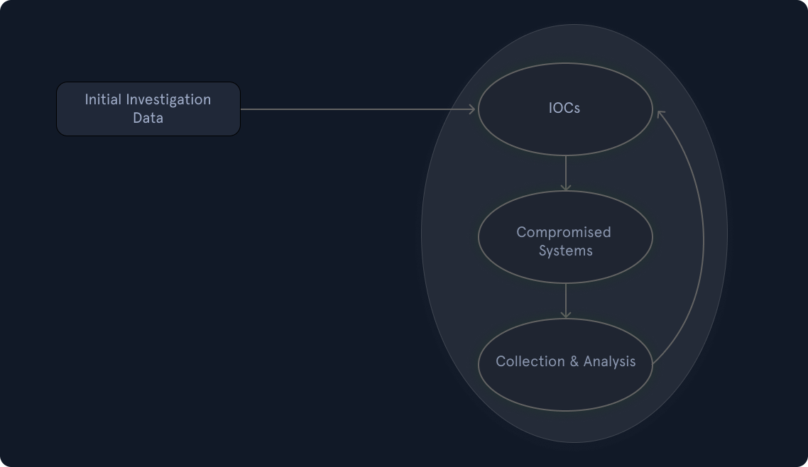

# Gestion des incidents
## Définition et portée de la gestion des incidents
- **Incident Handling — IH** désigne la capacité d’une organisation à gérer et répondre de manière structurée aux incidents de sécurité.
- Même avec des mesures préventives, une organisation doit être capable de réagir lorsqu’un incident affecte :
    - confidentialité ;
    - intégrité ;
    - disponibilité.
- Cette capacité peut être :
    - interne ;
    - externalisée auprès d’un prestataire ;
    - hybride.
- La gestion des incidents est un ensemble de procédures clairement définies pour gérer et répondre aux incidents de sécurité, permettant de : 
	- identifier ;
	- analyser ;
	- contenir ;
	- éradiquer ;
	- récupérer ;
	- documenter les incidents.
### Cycle de vie
```
Preparation
    ↓
Detection & Analysis
    ↓
Containment
    ↓
Eradication
    ↓
Recovery
    ↓
Post-Incident Activity
    ↺
```

- Le processus est **itératif** :
    - les enseignements tirés d’un incident améliorent la préparation future.
- L’objectif final est de restaurer les opérations normales aussi rapidement et efficacement que possible.

> Un événement suspect peut devoir être traité **comme un incident jusqu’à preuve du contraire**, car sa nature réelle n’est parfois visible qu’après investigation initiale.
## Événement vs Incident
### Événement — Event
- Un **événement** est une action qui se produit dans un système ou un réseau.

Exemples :
- Un utilisateur envoie un e-mail.
- Un clic de souris.
- Un pare-feu autorise une demande de connexion.
→ un événement n’est **pas forcément malveillant ou problématique**.
### Incident
- Un **incident** est un événement ayant une conséquence négative.

Exemples :
- panne système ;
- accès non autorisé ;
- perte de disponibilité ;
- catastrophe naturelle ;
- panne électrique.
### Incident de sécurité informatique
- Il n’existe pas une définition universelle unique.
- Dans le cours, un incident de sécurité est considéré comme un événement dirigé contre un système avec une intention claire de causer un préjudice.

Exemples :
- vol de données ;
- vol de fonds ;
- accès non autorisé ;
- installation de malware ;
- utilisation d’outils d’accès à distance.
```
Event
→ activité observée

Incident
→ conséquence négative

Security Incident
→ événement malveillant ou compromission nécessitant une réponse
```
## Portée de la gestion des incidents
- La gestion des incidents ne concerne pas uniquement les intrusions.
Elle couvre aussi :
- insider threat ;
- availability issues ;
- perte de propriété intellectuelle ;
- compromission de données ;
- incidents techniques ;
- incidents physiques ou environnementaux.
```
Incident Handling
≠ seulement intrusion réseau
```
## Valeur de la gestion des incidents
- Les incidents peuvent toucher :
    - quelques endpoints ;
    - un système critique ;
    - une grande partie de l’environnement.
- Une équipe spécialisée permet d’appliquer une réponse :
    - structurée ;
    - cohérente ;
    - documentée ;
    - reproductible.
Objectifs :
```
Incident
→ Investigation
→ Remediation
→ Minimize Impact
```
La réponse cherche notamment à limiter :
- vol d’informations ;
- interruption de service ;
- propagation ;
- impact métier.
## Priorisation des incidents
- Tous les incidents n’ont pas la même criticité.
Il faut évaluer :
- gravité ;
- impact ;
- nombre de systèmes concernés ;
- données touchées ;
- criticité métier ;
- urgence.
```
High Severity
→ Immediate Response
→ More Resources

Lower Severity
→ Initial Investigation
→ Confirm / Reject Incident
```
## Équipe de réponse aux incidents
- L’équipe de gestion des incidents est souvent appelée **Incident Response Team**.
- Elle peut être dirigée par :
    - SOC Manager ;
    - CISO / RSSI ;
    - CIO / DSI ;
    - prestataire tiers de confiance.
### Incident Manager
- Coordonne les activités de réponse.
- Doit pouvoir :
    - obtenir les informations nécessaires ;
    - mobiliser d’autres équipes ;
    - suivre l’avancement ;
    - centraliser la communication.
```
Incident Manager
→ Coordination
→ Communication
→ Tracking
→ Decision Support
```
- Il agit comme **point de communication unique** pendant l’incident.
# Incidents réels, rapports et scénario

## Exemples de causes d’incidents réels

### Fuites d'identifiants - Credentials compromis
#### Rançongiciel contre Colonial Pipeline 
- Le Colonial Pipeline, un important système d'oléoducs américain, a été victime d'une attaque par rançongiciel (ransomware).
- Cette [attaque](https://en.wikipedia.org/wiki/Colonial_Pipeline_ransomware_attack) provenait d'un MDP personnel d'un employé qui avait été compromis, probablement trouvé sur le dark web, plutôt que d'une attaque directe sur le réseau de l'entreprise.
- Les attaquants ont accédé aux systèmes de l'entreprise en utilisant un mot de passe compromis pour un compte VPN inactif, qui n'avait pas la MFA activée.
```
- Compromission d’un compte VPN.
- Password compromis.
- Compte inactif.
- MFA non activée.

Compromised Password
+
No MFA
→ VPN Access
→ Incident
```
### Identifiants faibles / par défaut
#### Botnet Mirai (2016)
- Botnet Mirai scan d’équipements IoT utilisant des identifiants d'usine ou par défaut
- Les appareils compromis sont intégrés dans un botnet DDoS massif.
- La cause première était que les appareils étaient livrés avec des identifiants par défaut non modifiés.
#### Incident LogicMonitor (2023)
- Certains comptes clients avait été fournis avec des MDP par défaut faibles.
- Les clients concernés ont subi des incidents de rançongiciel consécutifs ou des accès non autorisés.
- Conséquences :
    - accès non autorisé ;
    - ransomware pour certains clients.
### Logiciels obsolètes / systèmes non patchés
#### Fuite de données d'Equifax — 2017
- Exploitation d'une vuln Apache Struts (CVE-2017-5638) dans l'application web d'Equifax.
- Le correctif était disponible mais n’avait pas été appliqué à temps.
- Résultat :
    - fuite massive de données personnelles.
    - Cette faille a exposé les données personnelles d'environ 143 à 147 millions de personnes, entraînant des conséquences réglementaires et juridiques majeures.
#### WannaCry — 2017
- Ransomware avec propagation de type worm en utilisant l'exploit SMB EternalBlue.
- Exploit :
```
EternalBlue
→ SMB
→ MS17-010
```
- Plus de 200 000 systèmes affectés dans plus de 150 pays.
- Cet incident était dû à des systèmes Windows non corrigés, bien que le correctif MS17-010 ait été disponible avant l'épidémie.
### Menace interne - Insider Threat
#### CCash App / Block Inc. (Divulgation en 2021 ; Avis public en 2022)
- Un ancien employé a accédé aux informations personnelles de millions d'utilisateurs de Cash App.
- Environ 8,2 millions de clients actuels et anciens ont été potentiellement touchés, ce qui a entraîné un examen réglementaire et des règlements.
- Cause principale :
    - abus d’un accès légitime ;
    - contrôles internes insuffisants ;
    - monitoring insuffisant.
```
Legitimate Access
→ Misuse
→ Data Exposure
```
### Phishing / Social Engineering
- Le phishing peut servir à :
    - voler des credentials ;
    - délivrer un malware ;
    - obtenir un foothold ;
    - faciliter la fraude.
#### Attaque par hameçonnage du Département de l'Intérieur des États-Unis
- Les attaquants ont utilisé une technique de "evil twin" pour inciter les individus à se connecter à un faux Wi-Fi, permettant aux pirates de voler des identifiants et d'accéder au réseau
- Cet incident a révélé un manque d'infrastructure de réseau sans fil sécurisée et des mesures de sécurité insuffisantes, notamment une authentification utilisateur faible et des tests de réseau inadéquats.
#### Twitter — 2020
- Compromission de comptes à forte visibilité pour promouvoir une arnaque au bitcoin.
 - Accès aux outils d'administration de Twitter, leur permettant de modifier les comptes et de publier directement des tweets.
- Social engineering contre des employés.
### Supply Chain Attack
#### SolarWinds Orion — 2020
- Compromission, par acteurs étatiques, de l’environnement de build/publication.
- Backdoor ajoutée aux updates Orion.
- Distribution à des milliers de clients de la mise à jour compromise à de nombreux clients.
- Cela a provoqué un espionnage et un accès non autorisé à grande échelle dans les secteurs gouvernemental et privé
```
Vendor Compromise
→ Malicious Update
→ Customers Install Update
→ Widespread Access
```
## Rapports d’incident
- Un rapport d’incident doit documenter les événements de manière **chronologique et séquentielle**.
- Il peut être aligné sur :
	- Cyber Kill Chain ;
	- MITRE ATT&CK.
- Exemple de rapport : 
	- DFIR Labs : https://thedfirreport.com/2025/02/24/confluence-exploit-leads-to-lockbit-ransomware/
	- La plateforme DFIR Labs contient de nombreux autres rapports d'incident. : https://thedfirreport.com/
	- Cybereason : https://www.cybereason.com/hubfs/dam/collateral/reports/11-2020-Chaes-e-commerce-malware-research.pdf
Exemple de progression :
```
Initial Access
→ Execution
→ Persistence
→ Privilege Escalation
→ Lateral Movement
→ Exfiltration
→ Impact
```
### Rapports spécifiques à un incident
- Se concentre sur **un incident particulier**.
- Décrit notamment :
    - comment l’attaquant est entré ;
    - quelles actions ont été réalisées ;
    - comment l’incident a été détecté ;
    - quels systèmes ont été affectés ;
    - quel impact a été observé.
```
One Incident
→ Detailed Timeline
→ Technical Findings
→ Lessons Learned
```
#### Rapports globaux sur la réponse aux incidents
- Agrège les données issues de nombreux incidents.
- Objectifs :
    - identifier les tendances ;
    - observer les TTP récurrentes ;
    - repérer les menaces émergentes ;
    - produire des statistiques ;
    - proposer des recommandations générales.
```
Many Incidents
→ Aggregate Data
→ Trends
→ Threat Landscape
```
- Par exemple rapport de l'Unit 42 :
	- https://www.paloaltonetworks.com/engage/unit42-2025-global-incident-response-report
## Scénario (fictif) d'incident
- Le module utilise un scénario fictif autour de **Insight Nexus**, entreprise manipulant des données concurrentielles sensibles.
- Deux threat actors distincts opèrent simultanément dans son environnement.
### Premier acteur de menace
- Après une mise à jour, les administrateurs n’avaient pas modifié les credentials par défaut.
Point d’entrée :
```
ManageEngine ADManager Plus
→ Internet-facing
→ default credentials admin/admin
```
Progression :
```
Default Credentials
→ Initial Access
→ Reconnaissance
→ User / Machine Enumeration
→ Privileged AD Account Creation
→ Pivot
→ Exposed RDP
→ Increased Control
→ GPO Abuse
→ MSI Deployment
→ Spyware on Multiple Endpoints
```
Ce scénario illustre plusieurs faiblesses combinées :
- default credentials ;
- service Internet-facing ;
- création de comptes privilégiés ;
- mauvaise configuration RDP ;
- abuse de GPO ;
- déploiement de malware à grande échelle.
# Phase de préparation — Preparation
- La phase **Preparation** poursuit deux objectifs distincts :
    1. mettre en place une **capacité de gestion/réponse aux incidents** ;
    2. réduire la probabilité et l’impact des incidents grâce à des mesures préventives.
```
Preparation
├─ Incident Response Capability
└─ Preventive Security Controls
```
Les mesures préventives peuvent inclure :
- endpoint / server hardening ;
- Active Directory tiering ;
- MFA ;
- PAM — Privileged Access Management ;
- segmentation ;
- patch management ;
- logging / monitoring.

> L’équipe Incident Response n’est pas nécessairement responsable de tous ces contrôles préventifs, mais leur qualité influence directement sa capacité à gérer efficacement un incident.
## Prérequis pour la préparation
Une organisation doit disposer au minimum de :
- membres IR qualifiés ;
- compétences internes minimales même si l’IR est externalisée ;
- personnel sensibilisé et formé ;
- politiques et procédures documentées ;
- outils logiciels et matériels adaptés.
```
People
+
Processes
+
Technology
→ Incident Response Readiness
```
## Équipe de réponse aux incidents
- Les membres doivent connaître :
    - incident handling ;
    - investigation ;
    - containment ;
    - forensic basics ;
    - outils utilisés dans l’environnement.
- Certaines compétences peuvent être externalisées, mais l’organisation doit conserver suffisamment de connaissances en interne pour :
    - comprendre l’incident ;
    - coordonner les actions ;
    - prendre des décisions.
```
Internal Capability
+
External Expertise if needed
→ Effective Response
```
## Politiques & documentation
La documentation doit être **préparée avant l’incident** et maintenue à jour.
### Contacts et responsabilités
Conserver les coordonnées de :
- Incident Response Team ;
- Legal / Compliance ;
- management ;
- IT Support ;
- Communication / PR ;
- fournisseurs / prestataires ;
- ISP ;
- facilities ;
- forces de l’ordre lorsque nécessaire ;
- Incident Response provider externe.
```
Incident
→ Who must be contacted?
→ Who can authorize what?
```
L’objectif est d’éviter de chercher les responsables et coordonnées au milieu d’une crise.
### Incident Response Policy / Plan / Procedures

Il faut distinguer :
#### Policy - Politique
- Définit les règles et attentes générales de l’organisation.
#### Plan
- Définit l’organisation globale de la réponse :
    - rôles ;
    - responsabilités ;
    - communication ;
    - priorités.
#### Procedures / Playbooks
- Décrivent les actions opérationnelles à réaliser selon le type d’incident.
```
Policy
→ What / Why

Plan
→ Who / When

Procedure / Playbook
→ How
```
Exemples de playbooks :
- ransomware ;
- phishing ;
- compromised account ;
- malware ;
- data breach ;
- lost device.

### Information Sharing Policy
- Déterminer :
    - quelles informations peuvent être partagées ;
    - avec qui ;
    - à quel moment ;
    - par quelle personne autorisée.
Cela concerne notamment :
- clients ;
- partenaires ;
- vendors ;
- autorités ;
- médias
> Une communication non coordonnée pendant un incident peut créer des risques juridiques, opérationnels ou réputationnels.
## Baselines / Golden Images
- Conserver des **baselines** représentant un état normal et sain des systèmes et réseaux.
Exemples :
- services normalement actifs ;
- processus ;
- ports ;
- configurations ;
- fichiers système ;
- trafic réseau attendu.

```
Known-Good Baseline
        ↓
Current State
        ↓
Difference?
→ Potential Indicator
```

#### Golden Image
- Image de référence validée servant à :
    - reconstruire un système ;
    - comparer son état ;
    - restaurer un environnement propre
> **Golden Image ≠ Backup** : elle représente une configuration de référence, pas nécessairement les données actuelles du système.
## Schémas réseau
- Les diagrammes réseau doivent être :
    - disponibles ;
    - précis ;
    - à jour.
Ils permettent de comprendre rapidement :
```
Internet
→ Firewall
→ DMZ
→ Internal Network
→ Critical Systems
```
Utiles pour :
- identifier les chemins possibles de propagation ;
- comprendre la segmentation ;
- isoler des systèmes ;
- suivre le lateral movement.
## Asset Management
- Disposer d’un inventaire central des assets :
```
Hostname
IP
OS
Owner
Location
Criticality
Role
Software
```
Sans inventaire fiable :
```
Unknown Asset
→ difficult to investigate
→ difficult to contain
```
L’asset inventory est donc directement utile à l’Incident Response.
## Comptes privilégiés dédiés à l’IR
- Prévoir des comptes avec les privilèges nécessaires pour intervenir sur les systèmes critiques.
- Ils ne devraient pas être utilisés en permanence.
Approche recommandée :
```
Incident confirmed
→ Enable IR Privileged Account
→ Perform actions
→ Disable account
→ Rotate credentials
```
Avantages :
- réduction de l’exposition permanente ;
- meilleure traçabilité ;
- accès disponible rapidement en cas d’urgence.
> Cela s’apparente à une approche **Just-In-Time / Break Glass**, à condition que l’usage soit strictement contrôlé et audité.
## Capacité d’achat d’urgence
- Un incident peut nécessiter rapidement :
    - stockage supplémentaire ;
    - forensic tools ;
    - licences ;
    - consultants ;
    - matériel.
Prévoir une procédure permettant un achat rapide jusqu’à un certain montant.
```
Incident
→ Need Tool Now
→ Emergency Procurement
→ No multi-week approval delay
```
## Cheat Sheets / Runbooks
- Préparer des aide-mémoires opérationnels pour :
    - acquisition disque ;
    - memory capture ;
    - live response ;
    - log collection ;
    - triage ;
    - IOC search ;
    - forensic analysis.
Objectif :
```
Stressful Incident
→ Standardized Checklist
→ Less Error
```
## Legal & Compliance
Certains incidents peuvent nécessiter :
- notification réglementaire ;
- communication clients ;
- notification partenaires ;
- coordination avec les autorités ;
- conservation spécifique des preuves.

Les exigences dépendent notamment :
- du type de données ;
- de la juridiction ;
- du secteur ;
- de la localisation de l’organisation et des personnes concernées.

> ⚠️ Le cours simplifie le RGPD : une violation de données personnelles susceptible d’engendrer un risque doit généralement être notifiée à **l’autorité de contrôle compétente**, pas automatiquement aux forces de l’ordre. Des obligations supplémentaires peuvent exister selon le contexte.

→ Legal / Compliance doit donc être impliqué **avant l’incident**, pas découvert au moment de la crise.
## Documentation pendant l’incident
 - La documentation ne doit pas seulement exister avant l’incident : elle doit être maintenue **pendant toute l’investigation**. 
 - Faire une main courante.
Pour chaque action :
```
Timestamp
Who
What
Where
Why
How
Result
```
Exemple :
```
02:31
SOC Analyst
→ isolated HOST-42 from network
→ EDR isolation
→ successful
```

#### Questions fondamentales
```
Who?
What?
When?
Where?
Why?
How?
```
- Cette timeline aide pour :
    - investigation ;
    - coordination ;
    - forensic reporting ;
    - legal/compliance ;
    - lessons learned.
> Les actions de l’équipe IR elles-mêmes doivent être documentées, car elles peuvent modifier l’état du système ou des preuves.
## Outils logiciels & matériels
- L’équipe IR doit disposer des outils nécessaires **avant** qu’un incident ne survienne.
### Forensic Workstation
- Poste dédié à :
    - forensic imaging ;
    - memory analysis ;
    - log analysis ;
    - malware analysis ;
    - processing evidence.
```
Evidence
→ Dedicated Forensic Workstation
→ Analysis
```
- Il doit être isolé et traité comme un environnement potentiellement dangereux.
> Le cours évoque la désactivation de l’antivirus parce que des échantillons malveillants peuvent être manipulés. Cela doit se faire sur une **workstation/lab isolé**, pas sur un poste connecté normalement au réseau de production.
### Disk Forensics
Prévoir :
- forensic imaging tools ;
- disques de stockage dédiés ;
- write blockers.
#### Write Blocker
- Empêche la modification du support original pendant l’acquisition.
```
Original Disk
→ Write Blocker
→ Forensic Workstation
→ Forensic Image
```
Objectif :
- préserver l’intégrité de la preuve.
### Memory Forensics
Prévoir des outils pour :
```
RAM
→ Capture
→ Memory Dump
→ Analysis
```
La mémoire peut révéler :
- processes ;
- network connections ;
- loaded modules ;
- injected code ;
- credentials/secrets temporaires ;
- malware fileless.
### Live Response
- Acquisition d’informations sur une machine encore active.
Exemples :
- running processes ;
- users ;
- network connections ;
- logged-on sessions ;
- services ;
- volatile data.
```
Running System
→ Live Response
→ Volatile Evidence
```
> Certaines informations disparaissent après extinction : il faut donc décider avec prudence entre **live acquisition** et arrêt du système.

### Log Analysis
Prévoir des outils capables d’analyser :
- Windows Event Logs ;
- firewall logs ;
- EDR ;
- authentication logs ;
- application logs ;
- proxy / DNS ;
- SIEM.
```
Multiple Log Sources
→ Timeline / Correlation
→ Incident Reconstruction
```
### Network Capture & Analysis
Outils nécessaires pour :
- packet capture ;
- PCAP analysis ;
- flow analysis ;
- protocol analysis.
```
Network Traffic
→ PCAP / Flow
→ Analysis
→ C2 / Exfiltration / Lateral Movement
```
### IOC Management
Disposer d’une capacité à :
1. créer/enrichir des IOC ;
2. rechercher ces IOC dans tout l’environnement.
Exemples :
```
Hash
IP
Domain
URL
Filename
Registry Key
```

```
IOC identified on HOST-A
→ Search enterprise-wide
→ HOST-B / HOST-C also affected?
```

→ essentiel pour déterminer le **scope** réel de l’incident.
## Chain of Custody — Chaîne de possession
- Les preuves doivent être traçables depuis leur collecte jusqu’à leur stockage/analyse.
Documenter notamment :
```
Evidence ID
→ Collected by
→ Date / Time
→ Location
→ Transfer
→ Storage
→ Analyst
```
Objectifs :
- intégrité ;
- traçabilité ;
- admissibilité éventuelle ;
- démontrer qui a manipulé la preuve.
## Ticketing / Case Management
- Utiliser un système de suivi pour centraliser :
```
Incident
├─ Alerts
├─ Evidence
├─ Actions
├─ Timeline
├─ Owners
└─ Status
```
Cela facilite :
- coordination ;
- handover ;
- documentation ;
- reporting.
## Jump Bag
- Ensemble de matériel et outils **préparés à l’avance**, disponibles immédiatement en cas d’incident.
Peut contenir :
- forensic drives ;
- write blockers ;
- câbles ;
- network switch ;
- adaptateurs ;
- outils matériels ;
- software/media ;
- chain-of-custody forms ;
- alimentation.
```
Incident occurs
→ Grab Jump Bag
→ Respond immediately
```
Sans préparation :
```
Incident
→ Search for cables/tools/drives
→ Delay
→ Evidence / containment opportunity lost
```
## Infrastructure indépendante
- Un point particulièrement important : certains outils IR doivent être **indépendants de l’environnement potentiellement compromis**.
Cela concerne notamment :
- incident management ;
- documentation ;
- communication ;
- stockage de certaines informations critiques.
```
Corporate Domain
→ Assume Compromised

IR Infrastructure
→ Separate / Secure
```
Pourquoi ?
- AD peut être compromis ;
- email peut être lu ;
- file shares peuvent être indisponibles ;
- collaboration tools peuvent être contrôlés ;
- credentials internes peuvent être compromis.
### Out-of-Band Communication
Pendant un incident grave :
```
Do not assume:
Corporate Email = Safe
Teams/Slack = Safe
AD = Safe
```

Prévoir un canal **Out-of-Band — OOB** :
- comptes séparés ;
- infrastructure distincte ;
- téléphone sécurisé ;
- plateforme de communication indépendante.
```
Compromised Environment
      X
IR Communication Channel
```

> Principe : **Assume Breach**. Si le domaine entier est compromis, l’attaquant ne doit pas pouvoir observer les communications et décisions de l’équipe de réponse.
### Vue d'ensemble
```
Preparation
│
├─ People
│  ├─ IR Team
│  └─ Trained Staff
│
├─ Processes
│  ├─ Policies
│  ├─ Plans
│  ├─ Playbooks
│  ├─ Legal / Compliance
│  └─ Reporting
│
├─ Knowledge
│  ├─ Asset Inventory
│  ├─ Network Diagrams
│  └─ Baselines / Golden Images
│
├─ Tools
│  ├─ Forensic Workstation
│  ├─ Disk / Memory Tools
│  ├─ Network Tools
│  ├─ IOC Search
│  └─ Jump Bag
│
└─ Resilience
   ├─ Independent IR Platform
   └─ Out-of-Band Communications
```
- Le point central de la phase **Preparation** est d’éviter de découvrir pendant l’incident qu’il manque les **personnes, procédures, accès, outils, informations ou moyens de communication** nécessaires pour y répondre.
# Phase de préparation — Partie 2 : Protection & prévention
- La phase **Preparation** ne consiste pas uniquement à préparer l’équipe Incident Response.
- Elle comprend aussi la mise en place de contrôles capables de :
    - prévenir les incidents ;
    - limiter leur impact ;
    - améliorer leur détection ;
    - fournir des artefacts utiles à l’investigation.
```
Preparation
├─ Incident Response Readiness
└─ Preventive / Detective Controls
```
## Protection des e-mails
### DMARC
- **DMARC — Domain-based Message Authentication, Reporting & Conformance** protège principalement contre l’**usurpation directe d’un domaine**.
- L'idée est de rejeter les e-mails qui "prétendent" provenir d'une organisation.
- Il s’appuie sur :
    - **SPF** ;
    - **DKIM** ;
    - leur alignement avec le domaine visible dans le champ `From:`.
```
SPF
+
DKIM
+
Domain Alignment
→ DMARC
```
#### SPF
- Définit quels serveurs sont autorisés à envoyer des e-mails pour un domaine.
#### DKIM
- Ajoute une **signature cryptographique** permettant de vérifier :
    - l’origine du message ;
    - son intégrité.
#### DMARC
- Définit la politique à appliquer lorsque les contrôles échouent.
Politiques principales :
```
p=none
→ monitor

p=quarantine
→ considérer le message comme suspect

p=reject
→ refuser le message
```
> DMARC ne bloque pas **tout le phishing**. Il protège surtout contre le spoofing du domaine ; un attaquant peut toujours utiliser un domaine ressemblant au domaine légitime.
Exemple :
```
company.com
vs
cornpany.com
```
#### Déploiement
- Tester avant d’appliquer une politique stricte.
- Vérifier notamment :
    - services SaaS envoyant des e-mails ;
    - plateformes marketing ;
    - systèmes de ticketing ;
    - prestataires envoyant « au nom de » l’entreprise.
```
Monitor
→ Fix legitimate senders
→ Quarantine
→ Reject
```
-> Un mauvais déploiement peut bloquer des messages légitimes.
## Endpoint Hardening & EDR
- Les endpoints représentent une surface d’attaque importante car les utilisateurs :
    - naviguent sur Internet ;
    - ouvrent des documents ;
    - téléchargent des fichiers ;
    - exécutent des applications.
- Les baselines de hardening peuvent notamment s’appuyer sur :
    - **CIS Benchmarks** ;
    - recommandations Microsoft. Markdown collé
### Désactivation de LLMNR / NetBIOS
- Désactiver lorsque ces protocoles ne sont pas nécessaires.
Pourquoi ?
```
Name Resolution Failure
→ LLMNR / NBT-NS
→ Attacker Spoofing
→ Credential Capture
```
Ils peuvent faciliter des attaques de type :
- poisoning ;
- NTLM credential capture ;
- relay selon le contexte.
### Windows LAPS
- Utiliser **Windows LAPS** pour gérer les mots de passe des comptes administrateurs locaux.
```
Machine A → Unique Password
Machine B → Unique Password
Machine C → Unique Password
```
Objectifs :
- éviter un mot de passe local partagé ;
- rotation automatique ;
- limiter le lateral movement.
### Retrait des privilèges administrateur
- Les utilisateurs standards ne doivent pas être **Local Administrator** sans besoin réel.
```
Standard User
→ Least Privilege

Admin Rights
→ uniquement lorsque nécessaire
```
Une compromission d’un utilisateur administrateur augmente fortement l’impact potentiel.
### PowerShell
Le cours recommande notamment de restreindre PowerShell avec :
```
Constrained Language Mode
```
- **ConstrainedLanguage** limite certaines fonctionnalités puissantes de PowerShell.
- Peut faire partie d’une stratégie de hardening, mais ne doit pas être considéré comme une protection autonome.
Contrôles complémentaires :
- Script Block Logging ;
- Module Logging ;
- AMSI ;
- WDAC / AppLocker ;
- EDR.
### Attack Surface Reduction — ASR
- Les **Microsoft Defender ASR Rules** permettent de bloquer certains comportements couramment utilisés par les attaquants.
Exemples :
```
Office
→ Child Process
→ Block

Office Macro
→ Win32 API
→ Block

Credential Stealing
→ LSASS
→ Block / Restrict
```
Objectif :
```
Reduce exploitable behaviors
→ Attack Surface ↓
```
## Application Allowlisting
- Autoriser uniquement les applications ou comportements nécessaires.
- Technologies possibles :
    - AppLocker ;
    - Windows Defender Application Control — WDAC.
Le cours recommande au minimum de contrôler l’exécution depuis des emplacements inscriptibles par l’utilisateur comme :
```
Downloads
Desktop
AppData
Temp
```
et certains types de scripts :
```
.hta
.vbs
.js
.cmd
.bat
```
Markdown collé
### LOLBins
- **LOLBins — Living Off The Land Binaries** :
    - binaires légitimes présents sur le système ;
    - détournés pour réaliser des actions malveillantes.
Exemples classiques :
```
powershell.exe
mshta.exe
rundll32.exe
regsvr32.exe
certutil.exe
```
```
Trusted Binary
→ Abused Functionality
→ Malicious Action
```
> ⚠️ Le cours parle de « bloquer le trafic sortant vers les LOLBins ». Techniquement, les LOLBins sont des **binaires**, pas des destinations réseau. Leur usage est plutôt contrôlé via **WDAC/AppLocker/ASR/EDR**, tandis que le firewall limite les communications réseau qu’ils pourraient initier.
## Host-Based Firewall
- Utiliser un firewall sur les endpoints.
- Contrôler :
    - inbound ;
    - outbound ;
    - communications inter-workstations.
Exemple :
```
Workstation A
   X
Workstation B
```
Bloquer les communications poste-à-poste inutiles peut réduire :
- lateral movement ;
- SMB abuse ;
- propagation de malware.
## EDR — Endpoint Detection & Response
- Déployer un **EDR** pour obtenir :
    - telemetry ;
    - behavioral detection ;
    - investigation ;
    - containment ;
    - response.
### AMSI
- **AMSI — Antimalware Scan Interface** permet aux produits de sécurité d’inspecter notamment certains contenus scriptés avant ou pendant leur exécution.
Particulièrement utile pour :
- PowerShell ;
- scripts ;
- contenu obfusqué.
```
Script
→ AMSI
→ Security Product
→ Inspect
→ Allow / Detect
```
## Protection réseau
### Segmentation
- Segmenter le réseau pour empêcher qu’une compromission locale devienne une compromission globale.
- Les systèmes critiques doivent être isolés.
- N’autoriser que les communications réellement nécessaires. Markdown collé
```
User Network
   ↓ limited
Application Network
   ↓ limited
Database Network
```
Principe :
```
Compromise
→ Segmentation
→ Blast Radius ↓
```
### DMZ
- Les services qui doivent être exposés à Internet peuvent être placés dans une **DMZ**.
```
Internet
   ↓
Firewall
   ↓
DMZ
   ↓ restricted
Internal Network
```
- Les ressources internes ne devraient pas être directement exposées lorsque cela n’est pas nécessaire. Markdown collé
### IDS / IPS
#### IDS
```
Traffic
→ Detection
→ Alert
```
#### IPS
```
Traffic
→ Detection
→ Block / Prevent
```
- Ils peuvent détecter :
    - signatures ;
    - protocol anomalies ;
    - comportements suspects ;
    - certains patterns d’exploitation.
#### TLS Inspection
- Le trafic HTTPS étant chiffré, son contenu n’est normalement pas directement visible par les équipements réseau.
- Une organisation peut utiliser une **TLS inspection / interception** pour inspecter certains flux. Markdown collé
```
Client
→ TLS Inspection
→ Security Analysis
→ TLS
→ Server
```
> Cela nécessite une conception rigoureuse : gestion des certificats, confidentialité, conformité, performance et exclusion éventuelle de certaines catégories de trafic sensible.
### Network Access Control
#### 802.1X
- **802.1X** permet de contrôler quels utilisateurs/appareils peuvent accéder au réseau.
```
Device
→ Authentication
→ Network Access
```
Peut réduire les risques liés aux :
- équipements inconnus ;
- appareils personnels ;
- dispositifs malveillants.
Markdown collé
#### Conditional Access
Dans les environnements cloud / Microsoft Entra ID :
```
User
+
Device State
+
Location
+
Risk
→ Access Decision
```
Exemple :
```
Managed Device
+
MFA
→ Allow

Unmanaged Device
→ Block / Restrict
```
### Gestion des identités à privilèges / MFA / Mots de passe
#### Privileged Identity Management
- Les comptes privilégiés sont des cibles particulièrement importantes.
- Éviter :
    - mots de passe faibles ;
    - passwords réutilisés ;
    - même password entre compte standard et compte admin. Markdown collé
```
Daily Account
≠
Administrative Account
```
### Passwords / Passphrases
Le cours met l’accent sur les **passphrases** :
```
Long
+
Memorable
+
Hard to Guess
```
Un mot de passe comme :
```
Password1!
```
respecte plusieurs règles classiques de complexité mais reste extrêmement prévisible.
> La longueur et la résistance aux mots de passe compromis sont plus importantes qu’une complexité artificielle seule.
## MFA
- Mettre en œuvre le **Multi-Factor Authentication** au minimum pour :
    - comptes administrateurs ;
    - remote access ;
    - applications critiques ;
    - accès privilégiés.
Markdown collé
```
Password
→ Something You Know

Security Key
→ Something You Have

= MFA
```
Lorsque possible, préférer des méthodes **phishing-resistant** comme :
- FIDO2 ;
- WebAuthn ;
- hardware security keys.
## Vulnerability Management
- Réaliser des vulnerability scans régulièrement ou continuellement.
- Identifier :
    - CVE ;
    - versions obsolètes ;
    - mauvaises configurations ;
    - services vulnérables. Markdown collé
```
Scan
→ Identify
→ Prioritize
→ Remediate
→ Verify
```
> Le cours propose de corriger au minimum les vulnérabilités `High` et `Critical`. En pratique, la priorité ne devrait pas dépendre uniquement de la sévérité.
Considérer aussi :
```
CVSS
+
Exploitability
+
Active Exploitation
+
Internet Exposure
+
Asset Criticality
+
Business Impact
```
### Si le patch est impossible
Mettre en place des **compensating controls** :
- segmentation ;
- firewall rules ;
- désactivation du service ;
- restriction d’accès ;
- IPS / virtual patching ;
- monitoring renforcé.
```
Cannot Patch
→ Reduce Exposure
→ Monitor
```
## Security Awareness Training
- Former les utilisateurs à :
    - identifier les comportements suspects ;
    - reconnaître le phishing ;
    - signaler rapidement les incidents. Markdown collé
Des simulations peuvent être organisées :
- phishing simulations ;
- exercices de social engineering ;
- scénarios USB contrôlés.
Objectif principal :
```
User Detects Suspicious Activity
→ Reports Quickly
→ SOC Investigates
```
> Les exercices doivent mesurer et améliorer les comportements de sécurité, pas uniquement « piéger » les utilisateurs.
## Active Directory Security Assessment
- Auditer régulièrement Active Directory depuis une perspective attaquant.
- Objectif :
    - trouver les chemins d’escalade avant un adversaire ;
    - supprimer les « easy wins » ;
    - augmenter le nombre d’étapes nécessaires à la compromission. Markdown collé
```
Compromised Endpoint
        ↓
Can attacker immediately become Domain Admin?
```
Rechercher notamment :
- privilèges excessifs ;
- ACL faibles ;
- comptes privilégiés mal protégés ;
- mauvaises délégations ;
- services mal configurés ;
- chemins d’attaque vers des Tier 0 assets.
Principe défensif :
```
More attacker actions required
→ More telemetry
→ More opportunities for detection
```
## Purple Team Exercises
- Une **Purple Team** rapproche :
    - Red Team / offensive security ;
    - Blue Team / defensive security.
- La Red Team exécute des techniques adverses.
- La Blue Team vérifie :
    - visibilité ;
    - logging ;
    - detection ;
    - alerting ;
    - response. Markdown collé
```
Red Team
→ Execute TTP

Blue Team
→ Detect / Investigate / Respond

        ↓

Purple Team
→ Share Findings
→ Improve Defenses
```
### Objectifs
Tester concrètement :
- EDR ;
- SIEM ;
- detection rules ;
- playbooks ;
- logging ;
- SOC response ;
- incident handling procedures.
```
Attack Simulated
→ Detected?
├─ Yes → Test Response
└─ No  → Detection Gap
```
Une technique non détectée devient une opportunité pour :
```
Improve Logging
→ Create Detection
→ Update Playbook
→ Retest
```
## Défense en profondeur
Les différentes mesures de cette section ne doivent pas être considérées isolément.
```
Email Security
        ↓
Endpoint Hardening
        ↓
EDR
        ↓
Identity / MFA / PAM
        ↓
Network Segmentation
        ↓
IDS / IPS
        ↓
Vulnerability Management
        ↓
Monitoring
        ↓
Incident Response
```
→ l’objectif est qu’une défaillance d’un contrôle ne suffise pas à compromettre entièrement l’environnement.
```
Prevent
+
Detect
+
Contain
+
Respond
→ Defense in Depth
```
# Phase de détection et d'analyse
- La phase **Detection & Analysis** consiste à :
    - détecter les événements potentiellement malveillants ;
    - déterminer s’ils constituent réellement un incident ;
    - établir leur contexte ;
    - mesurer leur portée et leur gravité ;
    - commencer à reconstruire la chronologie de l’attaque.
```
Telemetry / Alert
→ Detection
→ Initial Triage
→ Context
→ Analysis
→ Incident Confirmed / Rejected
```
# Sources de détection
Un incident peut être détecté depuis plusieurs sources.
## Utilisateur / employé
- Un utilisateur remarque un comportement anormal :
    - pop-up inhabituel ;
    - fichier suspect ;
    - connexion étrange ;
    - comportement système anormal ;
    - email de phishing.
```
User
→ Suspicious Activity
→ Report
→ SOC / IR
```
## Outils de sécurité
Alertes provenant de :
- EDR ;
- AV ;
- IDS / IPS ;
- firewall ;
- SIEM ;
- email security ;
- application logs ;
- IAM / authentication systems.
```
Telemetry
→ Detection Rule
→ Alert
→ Analyst
```
> **Alert ≠ Incident** : une alerte est un signal nécessitant analyse et contextualisation.
## Threat Hunting
- Recherche **proactive** de comportements suspects qui n’ont pas forcément déclenché d’alerte.
```
Hypothesis
→ Search Telemetry
→ Suspicious Behavior
→ Investigation
```
Exemple :
```
"Un attaquant pourrait utiliser LSASS dumping"

→ rechercher T1003.001
→ process access
→ memory dump
→ suspicious tool execution
```
## Notification externe
Un tiers peut signaler une compromission :
- fournisseur ;
- partenaire ;
- CERT / CSIRT ;
- researcher ;
- law enforcement ;
- MSSP ;
- Threat Intelligence provider.
```
Third Party
→ IOC / Evidence
→ Internal Investigation
```
# Détection en profondeur
La détection doit être répartie sur plusieurs couches.
```
Internet
   ↓
Perimeter
   ↓
Internal Network
   ↓
Endpoint
   ↓
Application
```
## Périmètre réseau
Outils :
- firewall ;
- Internet-facing IDS / IPS ;
- DMZ monitoring ;
- proxy ;
- secure web gateway.
Permet notamment de détecter :
- reconnaissance ;
- exploitation externe ;
- connexions vers C2 ;
- trafic entrant/sortant inhabituel.
## Réseau interne
Outils :
- Pare-feu locaux ;
- IDS / NIDS ;
- network monitoring ;
- flow monitoring.
Objectifs :
- détecter lateral movement ;
- communications inhabituelles ;
- scans internes ;
- SMB / RDP suspects ;
- mouvements entre segments.
## Endpoint
Outils :
- AV ;
- EDR ;
- HIDS ;
- OS logs.
Permet de détecter :
- process suspects ;
- persistence ;
- credential dumping ;
- malware ;
- PowerShell abuse ;
- modifications système.
## Application
Sources : Principalement les journaux :
- application logs ;
- service logs ;
- database logs ;
- web server logs ;
- authentication logs.
Permet notamment d’identifier :
- abus de comptes ;
- injection ;
- accès anormal ;
- modifications non autorisées ;
- exploitation applicative.
# Enquête initiale — Initial Triage
- Lorsqu’un événement suspect est détecté, il faut d’abord **établir le contexte** avant de déclencher une réponse à incident à grande échelle.
```
Alert
→ Contextualize
→ Validate
→ Scope
→ Prioritize
```
-> Une information isolée peut être trompeuse.
Exemple :
```
Admin account
→ login to 10.10.10.15
→ 03:00
```
Sans contexte :
- quel système correspond à cette IP ?
- quel timezone ?
- utilisateur légitime ?
- maintenance planifiée ?
- source habituelle ?
- MFA validée ?
- activité associée ?
→ impossible de conclure correctement.
# Informations à collecter initialement
## Informations générales
Documenter :
- date / heure du signalement ;
- personne ayant détecté ou signalé l’incident ;
- méthode de détection ;
- type d’incident présumé.
Exemples :
```
Phishing
Malware
Account Compromise
Data Breach
System Outage
Unauthorized Access
```
## Systèmes impactés
Pour chaque système :
- hostname ;
- IP address ;
- OS ;
- physical / logical location ;
- owner ;
- fonction métier ;
- criticality ;
- état actuel ;
- utilisateurs ayant accédé au système.
```
Asset
├─ Hostname
├─ IP
├─ OS
├─ Owner
├─ Business Function
├─ Criticality
└─ Current State
```
## Activité observée
Documenter :
- actions effectuées ;
- comptes impliqués ;
- connexions ;
- changements réalisés ;
- activité encore en cours ou arrêtée.
```
Suspicious Activity
→ Still Active?
├─ Yes → containment may become urgent
└─ No  → preserve and investigate
```
## Malware
Si un malware est impliqué, collecter :
- date / heure de détection ;
- famille / type si connu ;
- systèmes impactés ;
- fichiers associés ;
- copies des samples ;
- hashes ;
- network indicators ;
- autres artefacts forensiques.
Exemples :
```
SHA-256
Filename
Path
IP
Domain
URL
Process
Registry Key
```
> Les samples doivent être manipulés dans un environnement adapté et isolé.
# Contexte métier
- La même compromission technique peut avoir une criticité très différente selon l’asset.
```
Compromised Intern Laptop
≠
Compromised CEO Laptop
≠
Compromised Domain Controller
```
Il faut donc toujours corréler :
```
Technical Impact
+
Asset Criticality
+
Business Impact
→ Incident Priority
```
# Construction de la timeline
- Dès l’enquête initiale, commencer une **chronologie de l’incident**.
Objectif :
- organiser les événements ;
- comprendre la progression de l’attaque ;
- corréler différentes sources ;
- identifier ce qui s’est produit avant/après un événement donné.
```
Evidence
→ Normalize Timestamps
→ Sort Chronologically
→ Build Timeline
```
## Structure minimale

|Date|Time|Hostname|Event|Data Source|
|---|---|---|---|---|
|09/09/2021|13:31 CET|SQLServer01|Mimikatz detected|Antivirus|

La timeline doit enregistrer notamment :
- authentifications ;
- process execution ;
- network connections ;
- file downloads ;
- account creation ;
- privilege changes ;
- lateral movement ;
- persistence ;
- exfiltration.
## Ordre de découverte ≠ ordre des événements
- Pendant l’enquête :
```
Evidence discovered
→ pas forcément dans l'ordre réel
```
Exemple :
```
Aujourd'hui :
Payload found on HOST-B

Puis :
Logs reveal same payload existed 2 weeks earlier on HOST-A
```

Après reconstruction :
```
HOST-A compromise
→ 2 weeks later
→ HOST-B compromise
```
-> La timeline permet donc de replacer chaque preuve dans son **contexte temporel réel**.
# Synchronisation temporelle
Pour construire une timeline fiable, vérifier :
- timezone ;
- UTC vs local time ;
- clock drift ;
- NTP ;
- format des timestamps.
```
Source A → UTC
Source B → CET
Source C → local time

→ Normalize
→ Unified Timeline
```
> Une mauvaise normalisation temporelle peut donner une fausse représentation de la séquence d’attaque.
# Gravité et étendue de l’incident
- Après le triage initial, déterminer :
```
Severity
→ How bad is it?

Scope
→ How far has it spread?
```
## Questions essentielles
### Impact
- Quel est l’impact de l’exploitation ?
- Confidentialité affectée ?
- Intégrité ?
- Disponibilité ?
- Impact métier ?
### Conditions d’exploitation
- Quelles conditions sont nécessaires ?
- Authentification requise ?
- Privileges requis ?
- Interaction utilisateur ?
- Accès réseau préalable ?
```
Exploitability
→ prerequisites?
→ complexity?
→ privileges?
```
### Assets critiques
- Des systèmes business-critical peuvent-ils être affectés ?

Exemples :
- Domain Controller ;
- database ;
- ERP ;
- production systems ;
- backup infrastructure ;
- privileged accounts.
### Remédiation
- Existe-t-il :
    - patch ;
    - workaround ;
    - IOC ;
    - mitigation ;
    - configuration fix ?
### Scope
- Combien de systèmes sont touchés ?
```
1 endpoint
≠
50 endpoints
≠
Entire domain
```
→ plus le scope est large, plus l’incident doit être escaladé.
### Exploitation active
- L’exploit est-il utilisé **in the wild** ?
- Existe-t-il des campagnes connues ?
- La vulnérabilité est-elle activement exploitée ?
### Wormable
- Le mécanisme peut-il se propager automatiquement ?
```
Compromise Host A
→ automatically exploit Host B
→ Host C
→ Host D
```
-> Une capacité **wormable** peut transformer très rapidement un incident local en incident majeur.
# Priorisation
- La priorité peut être représentée conceptuellement par :
```
Severity
+
Scope
+
Asset Criticality
+
Exploitability
+
Business Impact
→ Incident Priority
```
Exemple :
```
Domain Controller
+
Credential Dumping
+
Active Adversary
+
Multiple Hosts
→ Critical Incident
```
# Confidentialité de l’incident
- Les informations liées à un incident doivent être diffusées selon le principe :
```
Need to Know
```

Pourquoi ?
- un insider peut être impliqué ;
- l’attaquant peut surveiller les communications ;
- des données sensibles peuvent être concernées ;
- implications juridiques ;
- communication publique à contrôler ;
- risque réputationnel.
```
Incident Information
→ Only Authorized Personnel
```
# Communication
La communication doit être coordonnée avec :
- Incident Manager ;
- management ;
- Legal ;
- Compliance ;
- Communication / PR.
```
IR Team
→ Incident Manager
→ Legal / Management
→ Authorized External Communication
```

> Les analystes ne doivent pas communiquer directement et spontanément aux clients, médias ou tiers sur un incident sensible.
# Attentes de l’enquête
Au début de l’investigation, définir :
- type d’incident supposé ;
- sources de preuves disponibles ;
- scope initial ;
- objectifs ;
- durée approximative ;
- limites de l’analyse.
```
Investigation
├─ What do we know?
├─ What evidence exists?
├─ What do we need to prove?
├─ What is the scope?
└─ What are our limitations?
```
Ces éléments peuvent évoluer avec l’apparition de nouvelles preuves.
# Reporting continu
Pendant l’incident, maintenir les parties concernées informées de :
- nouvelles découvertes ;
- changement de scope ;
- évolution de la gravité ;
- actions réalisées ;
- risques persistants ;
- prochaines étapes.
```
Investigation
→ Findings
→ Update Stakeholders
→ Adjust Response
```
Le point central de cette phase est de **transformer une alerte ou un signal brut en incident contextualisé, priorisé et documenté**, avec une compréhension initiale fiable de sa chronologie, de son impact et de son étendue.
# Phase de détection et d’analyse — Partie 2
- Une investigation cherche principalement à répondre à deux questions :
```
What happened?
+
How did it happen?
```
- Comprendre uniquement **ce qui s’est passé** ne suffit pas.
- Il faut aussi déterminer :
    - comment l’attaquant est entré ;
    - quels systèmes ont été touchés ;
    - quels outils / techniques ont été utilisés ;
    - jusqu’où l’attaque s’est propagée.
Sans cela, une simple reconstruction des systèmes risque de laisser intact le **même attack path**, permettant à l’adversaire de revenir. Markdown collé
```
Initial Access
→ Attack Path
→ Compromise
→ Remediation

Si Attack Path non corrigé
→ Recompromise possible
```
# Investigation
- L’investigation fonctionne comme un **processus cyclique** :
```
Initial Investigation Data
        ↓
Create / Identify IOCs
        ↓
Search for New Leads
        ↓
Identify Impacted Systems
        ↓
Collect & Analyze Data
        ↓
New IOCs / New Leads
        ↺
```

Les trois activités principales sont :
- création et utilisation d’**IOC** ;
- identification de nouvelles pistes et nouveaux systèmes compromis ;
- collecte et analyse des données associées.

## Données d'enquête initiales
- L’enquête commence avec les informations limitées obtenues pendant le triage initial.
- Les conclusions doivent être construites à partir de **pistes validées** au fur et à mesure de l’investigation.
Il faut éviter le **tunnel vision** :
```
Known Malicious Tool Found
        ↓
"Everything must be related to this tool"
        ↓
Premature Conclusion
        ↓
Incomplete Scope
```
- Une investigation ne doit pas se focaliser uniquement sur :
    - un malware connu ;
    - une IP ;
    - un hash ;
    - une alerte particulière.
- De nouvelles hypothèses doivent être continuellement recherchées.
# IOC — Indicators of Compromise
- Un **IOC — Indicator of Compromise** est un artefact pouvant indiquer qu’une compromission a eu lieu.
Exemples :
```
IP Address
Domain
URL
File Hash
Filename
File Path
Registry Key
Mutex
Email Address
```
- Un IOC ne doit pas être interprété seul.
- Une IP peut être :
	- réellement malveillante ;
	- partagée par plusieurs services ;
	- réattribuée ;
	- utilisée temporairement ;
	- issue d’un CDN / cloud provider.

> **IOC hit ≠ preuve définitive de compromission**.
# Formats et outils pour les IOC
- Il existe plusieurs mécanismes permettant de représenter, partager ou rechercher des artefacts. 
## OpenIOC
- Format permettant de représenter des indicateurs de compromission de manière structurée.
## STIX — Structured Threat Information eXpression
- Standard utilisé pour représenter et échanger des informations de **Cyber Threat Intelligence**.
- Format machine-readable, généralement sérialisé en JSON.
- Peut contenir :
    - IOC ;
    - threat actors ;
    - malware ;
    - attack patterns ;
    - relations entre objets.
Exemple conceptuel :
```
Threat Actor
→ Malware
→ Infrastructure
→ IOC
→ Victim
```
Le cours montre par exemple un objet STIX décrivant un fichier en se basant sur le rapport https://www.cisa.gov/news-events/alerts/2025/08/06/cisa-releases-malware-analysis-report-associated-microsoft-sharepoint-vulnerabilities :
- filename ;
- size ;
- MD5 ;
- SHA-1 ;
- SHA-256 ;
- SHA-512 ;
- SSDEEP ;
- informations PE. Markdown collé
## YARA
- **YARA** permet de rechercher des patterns dans :
    - fichiers ;
    - mémoire ;
    - malware samples.
Exemple conceptuel :
```
Strings
+
Binary Patterns
+
Conditions
→ YARA Rule
```
> ⚠️ YARA n’est pas réellement un **format d’échange d’IOC comparable à STIX**. C’est avant tout un langage de règles permettant d’identifier des fichiers ou contenus correspondant à certains patterns.
```
STIX
→ CTI representation / exchange

YARA
→ Pattern-based detection
```
# IOC Search / Enterprise-Wide Hunting
- Une fois un IOC identifié, il faut pouvoir le rechercher sur l’ensemble de l’environnement.
```
IOC discovered on HOST-A
        ↓
Search Enterprise-Wide
        ↓
HOST-B → Hit
HOST-C → Hit
HOST-D → No Hit
```
- Cela permet de déterminer le **scope** réel de l’incident.
Le cours mentionne notamment :
- PowerShell ;
- WMI ;
- outils natifs ;
- outils tiers ;
- plateformes de sécurité centralisées.

Aujourd’hui, cette recherche peut également être réalisée via :
```
EDR
SIEM
XDR
Threat Hunting Platform
```
# Credential Hygiene pendant l’investigation
- Les analystes doivent éviter d’exposer des **credentials privilégiés** sur des machines potentiellement compromises.
Problème :
```
IR Admin Credentials
→ Compromised Host
→ Credential Exposure
→ Attacker obtains IR privileges
```
Il faut donc :
- utiliser des comptes IR dédiés ;
- réduire l’usage de credentials très privilégiés ;
- privilégier des mécanismes d’administration adaptés ;
- connaître précisément le comportement des outils utilisés.

- Le cours souligne notamment que différents modes d’utilisation d’un même outil peuvent laisser des artefacts ou exposer différemment les credentials.
> Principe : **Know Your Tools**. Une action d’investigation ne doit pas elle-même faciliter la compromission.
# Identification de nouvelles pistes et systèmes impactés
Après avoir recherché les IOC :
```
IOC Search
→ Hits
→ Validate
→ True Positive / False Positive
```
- Certains IOC peuvent être trop génériques.
- Tous les hits ne sont donc pas forcément liés à l’incident étudié.
Exemple :
```
filename = update.exe
→ beaucoup trop générique
→ nombreux False Positives possibles
```
Il faut :
- contextualiser les résultats ;
- éliminer les False Positives ;
- identifier les systèmes réellement compromis ;
- prioriser les systèmes susceptibles de fournir de nouvelles preuves.
# Identification de nouvelles pistes et systèmes impactés

Après avoir recherché les IOC :

```
IOC Search
→ Hits
→ Validate
→ True Positive / False Positive
```

- Certains IOC peuvent être trop génériques.
- Tous les hits ne sont donc pas forcément liés à l’incident étudié.

Exemple :

```
filename = update.exe
→ beaucoup trop générique
→ nombreux False Positives possibles
```

Il faut :

- contextualiser les résultats ;
- éliminer les False Positives ;
- identifier les systèmes réellement compromis ;
- prioriser les systèmes susceptibles de fournir de nouvelles preuves
# Cycle complet d’investigation
```
Initial Alert
      ↓
Initial Investigation
      ↓
IOC Creation
      ↓
Enterprise Search
      ↓
New Compromised Hosts
      ↓
Evidence Collection
      ↓
Forensic Analysis
      ↓
New IOC / Lead
      ↺
```

Ce cycle continue jusqu’à ce que l’équipe puisse raisonnablement déterminer :
```
How did they get in?
What did they do?
Which systems were affected?
What access do they still have?
How can we prevent recurrence?
```
# Utilisation de l’IA dans la détection et l’Incident Response
L’**Artificial Intelligence** pour assister les analystes dans le traitement d’un grand volume d’alertes et de données. Markdown collé
## Automated Triage & Alert Prioritization

```
Thousands of Alerts
→ AI Analysis
→ Correlation
→ Prioritized Cases
```

L’IA peut aider à :

- regrouper des alertes similaires ;
- identifier les systèmes impliqués ;
- mettre en évidence les événements importants ;
- réduire le bruit.
## Incident Correlation

Plusieurs alertes isolées peuvent appartenir à une seule attaque :

```
Alert 1 → Suspicious File
Alert 2 → chmod
Alert 3 → Execution
Alert 4 → Network Connection
          ↓
       Correlation
          ↓
      Attack Story
```

Le cours donne l’exemple d’**Elastic Attack Discovery**, qui utilise des LLM pour regrouper et résumer plusieurs alertes dans une vue cohérente de l’attaque. Markdown collé
## Timeline Reconstruction

L’IA peut aider à transformer :

```
Logs
+
Alerts
+
Hosts
+
Users
+
Timestamps
```

en :

```
Chronological Attack Sequence
```

et à associer certains comportements à **MITRE ATT&CK**.
## Automated Response Playbooks

Le cours mentionne aussi l’utilisation de l’IA dans l’automatisation de certaines réponses :

```
Detection
→ Analysis
→ Recommended / Automated Action
```

par exemple :

- enrichissement d’IOC ;
- triage ;
- création de case ;
- regroupement d’alertes ;
- déclenchement de playbooks.

Markdown collé
## Post-Incident Analysis

L’IA peut également assister dans :

- résumé de l’incident ;
- reconstruction de timeline ;
- corrélation de données ;
- identification de patterns ;
- préparation des lessons learned.

```
Incident Data
→ AI-assisted Analysis
→ Findings
→ Lessons Learned
```
## Limites de l’IA

À garder en tête dans tes notes :

```
AI
→ Assistance
≠ Ground Truth
```

- Les conclusions doivent être validées par l’analyste.
- Un modèle peut :
    - mal corréler des événements ;
    - produire des False Positives ;
    - manquer du contexte ;
    - halluciner une relation inexistante.

Donc :

```
AI Output
→ Analyst Validation
→ Evidence
→ Decision
```

L’IA accélère l’investigation, mais **ne remplace pas la validation forensique ni le raisonnement de l’analyste**.
# Vue globale — Detection & Analysis

```
Detection
   ↓
Initial Triage
   ↓
Contextualization
   ↓
IOC Creation
   ↓
Enterprise Search
   ↓
Identify Scope
   ↓
Collect Evidence
   ↓
Forensic Analysis
   ↓
Timeline Update
   ↓
New Leads / IOCs
   ↺
```

Le point central de cette partie est que l’investigation n’est **pas une recherche linéaire** : chaque preuve peut révéler de nouveaux IOC, de nouveaux systèmes ou de nouvelles pistes, ce qui relance le cycle jusqu’à obtenir une compréhension suffisamment complète de **l’accès initial, du comportement de l’adversaire, du scope et de l’impact réel de l’incident**.
# Phase de confinement, d’éradication et de rétablissement

Après avoir suffisamment compris :
- la nature de l’incident ;
- son impact ;
- les systèmes concernés ;
- le comportement de l’adversaire ;
- les principales pistes de compromission ;

on passe à la phase de **Containment → Eradication → Recovery**.

```
Detection & Analysis
        ↓
Containment
        ↓
Eradication
        ↓
Recovery
        ↓
Normal Operations
```

> ⚠️ En pratique, le confinement ne nécessite pas toujours d’attendre la fin complète de l’investigation. Si l’incident est actif ou menace de se propager, certaines actions de confinement peuvent être prises immédiatement, tout en poursuivant l’analyse.

# Confinement — Containment
- Objectif : **empêcher l’incident de continuer à se propager ou à causer davantage de dégâts**.
- Le confinement doit idéalement être :
    - coordonné ;
    - simultané sur les systèmes concernés ;
    - documenté ;
    - proportionné à l’impact métier.

```
Compromised Systems
→ Containment
→ Spread / Damage ↓
```

Un confinement mal coordonné peut alerter l’adversaire :

```
Attacker detects defensive action
→ Changes TTPs
→ Removes traces
→ Establishes new persistence
```

## Stratégie de confinement

Avant d’agir, il faut considérer :

- criticité du système ;
- impact métier d’une isolation ;
- propagation possible ;
- nécessité de préserver des preuves ;
- activité encore en cours ;
- capacité de l’adversaire à conserver un accès ;
- disponibilité de systèmes de remplacement.

```
Security Need
+
Business Impact
+
Evidence Preservation
→ Containment Decision
```
# Confinement à court terme — Short-Term Containment

- Actions rapides et généralement réversibles.
- Objectif :
    - stopper ou ralentir l’attaquant ;
    - limiter le blast radius ;
    - gagner du temps pour préparer une remédiation durable.

Exemples :
- isoler l’endpoint via EDR ;
- placer le système dans un VLAN isolé ;
- débrancher le réseau ;
- bloquer une IP / domaine ;
- appliquer temporairement une règle firewall ;
- désactiver temporairement un compte compromis ;
- rediriger un domaine C2 vers un **sinkhole**.

```
Compromised Host
→ Network Isolation
→ Attacker Communication X
```
## DNS Sinkholing
- Consiste à rediriger un domaine malveillant vers :
    - une adresse contrôlée par les défenseurs ;
    - une adresse non routable / inexistante.

```
Malware
→ c2.attacker.com
→ DNS Sinkhole
→ Controlled / Null Destination
```

Utilités :
- couper le C2 ;
- identifier d’autres machines infectées ;
- observer les tentatives de communication.
# Préservation des preuves
- Le confinement doit éviter autant que possible de détruire les artefacts utiles à l’investigation.
Avant une action destructive, envisager :
- memory dump ;
- disk image ;
- logs ;
- active connections ;
- process list ;
- volatile data.
```
Contain
≠
Destroy Evidence
```
- Le cours parle d’une sous-phase de **backup**, mais dans une logique DFIR il est plus précis de parler de :
```
Evidence Preservation
+
Forensic Acquisition
```
# Arrêt d’un système
- Éteindre une machine peut être nécessaire, mais entraîne la perte de données volatiles :
```
Shutdown
→ RAM lost
→ Active Connections lost
→ Processes lost
```
Avant un shutdown :
- évaluer la valeur des données volatiles ;
- obtenir l’autorisation nécessaire ;
- coordonner avec le métier ;
- documenter l’action.
# Confinement à long terme — Long-Term Containment
- Mesures plus durables permettant de maintenir l’environnement sécurisé jusqu’à l’éradication complète.

Exemples :
- changement / rotation de passwords ;
- révocation de sessions ;
- suppression de tokens ;
- firewall rules permanentes ;
- patching ;
- host-based IDS / EDR controls ;
- désactivation d’un service vulnérable ;
- arrêt d’un système à risque.

```
Temporary Containment
→ Stable Defensive State
→ Eradication
```
> Patcher un système compromis ne signifie pas que l’incident est terminé : l’attaquant peut déjà avoir installé une persistence, créé des comptes ou compromis d’autres systèmes.
# Rotation des credentials
Si une compromission d’identité est possible :
```
Password Reset Only
≠ Always Enough
```

Selon le cas, il peut être nécessaire de :
- changer passwords ;
- révoquer sessions ;
- invalider tokens ;
- renouveler secrets/API keys ;
- révoquer certificats ;
- désactiver comptes compromis.

Particulièrement important pour :
- privileged accounts ;
- service accounts ;
- domain accounts ;
- cloud identities.
# Éradication — Eradication
- Une fois l’incident contenu, l’objectif devient :
```
Remove Attacker
+
Remove Persistence
+
Remove Root Cause
```
L’éradication doit supprimer :
- malware ;
- backdoors ;
- webshells ;
- scheduled tasks ;
- malicious services ;
- comptes créés par l’attaquant ;
- persistence mechanisms ;
- fichiers malveillants ;
- configurations compromises.
## Root Cause
- Il ne suffit pas de supprimer le malware.
- Il faut éliminer **la cause ayant permis la compromission**.
- Exemple :
```
Malware Removed
+
Vulnerability Still Present
→ Reinfection Possible
```

La remédiation peut donc inclure :
- patch ;
- correction de configuration ;
- fermeture d’un service exposé ;
- suppression d’un compte faible ;
- activation MFA ;
- changement de credentials ;
- correction d’ACL ;
- durcissement ;
- segmentation supplémentaire.
# Reconstruction vs nettoyage

Selon le niveau de compromission :

```
Minor / Well-understood compromise
→ Clean / Remediate

Deep / Privileged compromise
→ Rebuild
```

Une reconstruction complète peut être préférable lorsque :

- Domain Admin / root compromis ;
- persistence inconnue ;
- rootkit ;
- intégrité du système impossible à garantir ;
- nombreux changements non maîtrisés.

```
Trusted Golden Image
→ Rebuild
→ Patch
→ Harden
→ Restore Data
```

---

# Restauration depuis backup

- Certains systèmes peuvent être restaurés depuis des sauvegardes fiables.

Mais :

```
Backup
→ Must be known-good
```

Il faut vérifier :

- date de compromission ;
- date du backup ;
- présence éventuelle du malware dans la sauvegarde ;
- intégrité des données restaurées.

> Restaurer un backup déjà compromis peut réintroduire l’attaquant.

---

# Hardening après compromission

L’éradication peut également servir à renforcer :

- système affecté ;
- systèmes similaires ;
- parfois l’ensemble de l’environnement.

Exemples :

- supprimer services inutiles ;
- appliquer patches ;
- renforcer ACL ;
- appliquer MFA ;
- activer EDR ;
- revoir segmentation ;
- renforcer logging.

```
Incident Findings
→ Hardening
→ Future Attack Surface ↓
```

---

# Rétablissement — Recovery

- Objectif : remettre les systèmes dans un **état de fonctionnement normal et fiable**.

```
Eradicated System
→ Validate
→ Restore
→ Production
```

Avant réintégration :

- vérifier que le système fonctionne ;
- vérifier l’intégrité des données ;
- confirmer que les malwares / persistence ont disparu ;
- vérifier patches et hardening ;
- tester services et dépendances.

---

# Réintégration progressive

Pour un incident important, il est préférable de restaurer progressivement :

```
Critical Services
→ Controlled Restoration
→ Validation
→ Additional Systems
→ Full Production
```

Cela limite le risque de remettre simultanément en production des systèmes encore compromis.

---

# Monitoring renforcé

Les systèmes restaurés doivent être surveillés plus intensivement.

À rechercher :

### Connexions inhabituelles

- utilisateur jamais vu sur l’hôte ;
- service account inhabituel ;
- authentification depuis une nouvelle source ;
- connexions à des horaires atypiques.

### Processus inhabituels

```
Unexpected Process
Unexpected Parent/Child
Unknown Binary
Suspicious Script
```

### Modifications système

- registry keys ;
- scheduled tasks ;
- services ;
- autoruns ;
- firewall rules ;
- startup folders.

```
Recovered Host
→ Enhanced Monitoring
→ Detect Recompromise
```

---

# Recompromise

Un système récemment restauré constitue une cible importante si l’attaquant possède encore :

- credentials valides ;
- persistence ailleurs ;
- accès C2 ;
- système compromis adjacent ;
- vulnerability non corrigée.

```
Attacker Still Present Elsewhere
        ↓
Recovered System
        ↓
Recompromise
```

→ le recovery doit donc être évalué à l’échelle de **tout l’environnement**, pas uniquement machine par machine.

---

# Recovery à grande échelle

Lors d’un incident majeur, le rétablissement peut durer :

- plusieurs jours ;
- plusieurs semaines ;
- parfois plusieurs mois.

### Première phase

Priorité aux **Quick Wins** :

- fermer expositions critiques ;
- rotation credentials ;
- MFA ;
- patching urgent ;
- segmentation ;
- suppression des easy targets.

### Phases suivantes

Changements structurels :

- redesign réseau ;
- amélioration IAM ;
- PAM ;
- nouvelles baselines ;
- hardening généralisé ;
- amélioration monitoring / detection ;
- refonte de certains systèmes.

```
Immediate Recovery
→ Quick Wins

Long-Term Recovery
→ Structural Improvements
```

---

# Différence entre les trois phases

|Phase|Objectif|
|---|---|
|**Containment**|Stopper la propagation et limiter les dégâts|
|**Eradication**|Supprimer l’attaquant, la persistence et la cause racine|
|**Recovery**|Restaurer les systèmes et reprendre les opérations normales|

```
Containment
→ Stop it

Eradication
→ Remove it

Recovery
→ Restore safely
```

# Workflow global

```
Incident Confirmed
        ↓
Containment Strategy
        ↓
Preserve Evidence
        ↓
Short-Term Containment
        ↓
Long-Term Containment
        ↓
Eradication
        ↓
Root Cause Remediation
        ↓
Rebuild / Restore
        ↓
Validation
        ↓
Recovery
        ↓
Enhanced Monitoring
        ↓
Normal Operations
```

Le point important est que **Containment, Eradication et Recovery ne sont pas simplement “isoler → nettoyer → rallumer”** : il faut préserver les preuves, empêcher l’adversaire de réagir, supprimer son accès et la cause racine, puis remettre progressivement les systèmes en production avec une surveillance renforcée.
# Phase d’activité post-incident — Post-Incident Activity

- Une fois l’incident résolu, l’objectif est de :
    - documenter ce qui s’est passé ;
    - évaluer l’efficacité de la réponse ;
    - identifier les causes profondes ;
    - améliorer les contrôles de sécurité ;
    - mettre à jour les procédures ;
    - capitaliser sur les **Lessons Learned**.

```
Incident Resolved
        ↓
Post-Incident Review
        ↓
Lessons Learned
        ↓
Root Cause Analysis
        ↓
Improvements
        ↓
Better Preparation
        ↺
```

- Cette phase permet de transformer un incident en **amélioration mesurable de la posture de sécurité**.

---

# Post-Incident Review — PIR

- Une réunion de **Post-Incident Review** est généralement organisée quelques jours après l’incident.
    
- Elle réunit les stakeholders impliqués :
    
    - Incident Response ;
    - SOC ;
    - IT / Infrastructure ;
    - Security Engineering ;
    - management ;
    - Legal / Compliance ;
    - éventuellement métiers concernés.

Objectifs :

```
What happened?
What worked?
What failed?
Why?
What should change?
```

> L’objectif n’est pas de rechercher un responsable individuel, mais d’identifier les défaillances de **processus, contrôles, architecture ou organisation** ayant contribué à l’incident.
# Rapport final d’incident

Le **Final Incident Report** constitue la référence officielle de l’incident.

Il doit permettre de comprendre :

- ce qui s’est passé ;
- quand ;
- comment ;
- quels systèmes ont été affectés ;
- quel impact a été observé ;
- comment l’organisation a répondu ;
- quelles mesures ont été prises ;
- quelles améliorations sont nécessaires.

## Contenu typique

```
Executive Summary
Incident Timeline
Technical Findings
Affected Assets
Root Cause
Containment Actions
Eradication Actions
Recovery Actions
Business Impact
Lessons Learned
Recommendations
```

---

## Questions auxquelles répondre

### Que s’est-il passé ?

- vecteur initial ;
- actions adverses ;
- systèmes compromis ;
- données affectées ;
- timeline.

```
Initial Access
→ Execution
→ Persistence
→ Lateral Movement
→ Impact
```

---

### Comment l’équipe a-t-elle répondu ?

Comparer les actions réalisées avec :

- Incident Response Plan ;
- playbooks ;
- procedures ;
- policies.

```
Expected Procedure
        vs
Actual Response
```

Identifier :

- procédures efficaces ;
- étapes manquantes ;
- actions trop lentes ;
- problèmes de coordination.

---

### Les informations nécessaires étaient-elles disponibles ?

Évaluer notamment :

- asset inventory ;
- network diagrams ;
- logs ;
- baselines ;
- contacts ;
- accès privilégiés ;
- documentation.

Exemple :

```
Need firewall logs
→ logs unavailable
→ investigation delayed
```

→ devient un **gap à corriger**.

---

### Quelles actions ont permis de contenir et éradiquer l’incident ?

Documenter :

- isolation des hosts ;
- firewall rules ;
- account disablement ;
- password / token rotation ;
- malware removal ;
- rebuild ;
- patching ;
- hardening.

---

### Comment empêcher la récurrence ?

Exemples :

```
Root Cause
→ Weak Password
→ MFA + Password Policy

Root Cause
→ Vulnerable Internet-facing Service
→ Patch + Reduce Exposure

Root Cause
→ Excessive Privileges
→ Least Privilege + PAM
```

---

### Que faut-il améliorer pour mieux détecter l’incident ?

Identifier les **detection gaps**.

Exemple :

```
Attacker used T1003.001
→ no alert generated
→ create LSASS access detection
→ validate with Purple Team
```

Améliorations possibles :

- nouvelles SIEM rules ;
- EDR detections ;
- additional logging ;
- Threat Intelligence ;
- monitoring réseau ;
- nouveaux IOC ;
- ATT&CK mappings.

---

# Root Cause Analysis — RCA

- La **Root Cause Analysis** cherche à identifier pourquoi l’incident a pu se produire, et pas uniquement ce que l’attaquant a fait.

```
Incident
→ Immediate Cause
→ Contributing Factors
→ Root Cause
```

Exemple :

```
Account Compromise
        ↓
Password stolen through phishing
        ↓
No MFA
        ↓
Privileged account usable remotely
        ↓
Insufficient identity controls
```

> Supprimer uniquement le malware traite un **symptôme**. Une RCA vise à éliminer les conditions ayant permis l’incident.

---

## Contributing Factors

Un incident possède rarement une seule cause.

Exemple :

```
Incident
├─ Unpatched System
├─ Internet Exposure
├─ Weak Credentials
├─ No MFA
├─ Excessive Privileges
└─ Insufficient Monitoring
```

→ la remédiation doit donc souvent porter sur plusieurs couches.

---

# Lessons Learned

Les **Lessons Learned** identifient :

```
What worked?
What did not work?
What was missing?
What should be changed?
```

Exemples :

### Ce qui a fonctionné

- EDR a détecté l’attaque ;
- segmentation a limité le lateral movement ;
- backups étaient utilisables ;
- équipe IR disponible rapidement.

### Ce qui doit être amélioré

- logs insuffisants ;
- playbook incomplet ;
- inventaire obsolète ;
- communication trop lente ;
- permissions excessives ;
- manque de formation.

---

# Mise à jour des procédures

Après l’incident, mettre à jour si nécessaire :

- Incident Response Plan ;
- policies ;
- procedures ;
- playbooks ;
- escalation paths ;
- contact lists ;
- forensic procedures.

```
Incident Experience
→ Update Playbooks
→ Future Response Faster
```

Exemple :

```
Ransomware Incident
→ missing isolation procedure
→ update Ransomware Playbook
```

---

# Amélioration des règles de détection

Les artefacts découverts pendant l’enquête peuvent devenir de nouvelles capacités de détection.

```
Incident Evidence
→ IOC / TTP
→ Detection Engineering
→ New Detection Rule
```

Exemples :

- Sigma rules ;
- SIEM queries ;
- YARA rules ;
- EDR detections ;
- network signatures.

---

## IOC vs TTP

```
IOC
→ hash / IP / domain
→ utile immédiatement
→ souvent facilement modifiable

TTP Detection
→ comportement
→ plus durable
```

Les techniques MITRE ATT&CK observées pendant l’incident peuvent donc servir à mesurer la couverture défensive.

---

# Validation des nouvelles détections

Une règle créée après l’incident doit être **testée**.

```
Incident TTP
→ Create Detection
→ Purple Team / Replay
→ Detection Works?
├─ Yes → Deploy
└─ No  → Tune
```

→ évite de considérer une nouvelle règle comme efficace sans validation.

---

# Knowledge Sharing

- Les connaissances acquises doivent être partagées avec les équipes appropriées.

Exemples :

- SOC ;
- Incident Response ;
- Detection Engineering ;
- IT ;
- Threat Hunting ;
- Vulnerability Management ;
- Red / Purple Team.

```
Incident Knowledge
→ Documentation
→ Team Training
→ Future Investigations
```

Un ancien incident peut devenir :

- training material ;
- playbook ;
- hunting hypothesis ;
- detection use case.

---

# Formation des analystes

Les rapports d’incident sont particulièrement utiles pour former les nouveaux membres.

Ils permettent d’étudier :

```
Alert
→ Investigation
→ Evidence
→ Decision
→ Containment
→ Recovery
```

et de comprendre **pourquoi** certaines décisions ont été prises.

---

# Évaluation de la capacité IR

La phase post-incident doit également évaluer :

## People

- compétences ;
- disponibilité ;
- staffing ;
- répartition des rôles.

## Processes

- playbooks ;
- escalation ;
- communication ;
- coordination.

## Technology

- SIEM ;
- EDR ;
- forensic tools ;
- logging ;
- case management.

```
People
+
Processes
+
Technology
→ Incident Response Capability
```

---

# Metrics — Mesure de la réponse

Les rapports permettent de produire des métriques sur l’efficacité du programme IR.

Exemples :

```
Number of Incidents
Time to Detect
Time to Contain
Time to Recover
Incident Severity
Systems Affected
```

### MTTD — Mean Time To Detect

```
Compromise
→ Detection
```

Temps moyen nécessaire pour détecter un incident.

### MTTC — Mean Time To Contain

```
Detection
→ Containment
```

Temps nécessaire pour limiter la propagation.

### MTTR

Selon l’organisation, `MTTR` peut désigner :

- Mean Time To Respond ;
- Mean Time To Remediate ;
- Mean Time To Recover.

> Toujours préciser la définition utilisée, car l’acronyme n’est pas interprété de manière uniforme.

### Mean Time to Inventory (MTTI)

# Impact & coûts

Le rapport peut également servir à évaluer :

- downtime ;
- pertes de données ;
- heures de travail ;
- coûts forensiques ;
- coût de restauration ;
- pertes commerciales ;
- coûts juridiques ;
- impact réputationnel.

```
Technical Impact
+
Operational Impact
+
Financial Impact
→ Business Impact
```

---

# Aspects juridiques

Un rapport d’incident peut devenir une pièce importante lors :

- d’une enquête ;
- d’un audit ;
- d’un contentieux ;
- d’une procédure réglementaire.

Il faut donc conserver :

- timeline ;
- preuves ;
- Chain of Custody ;
- décisions ;
- actions effectuées ;
- responsables des actions.

```
Evidence
+
Chain of Custody
+
Incident Report
→ Defensible Investigation
```

---

# Reporting à la direction

Le rapport destiné au management ne nécessite généralement pas le même niveau de détail qu’un rapport technique.

### Rapport technique

```
Logs
IOCs
TTPs
Timeline
Forensics
Hosts
Commands
```

### Executive Report

```
What happened?
Business impact?
Is the threat removed?
What remains at risk?
What must be improved?
```

→ adapter le niveau d’information au public cible.

---

# Clôture de l’incident

Un incident ne devrait être clôturé qu’après avoir vérifié que :

- containment terminé ;
- eradication terminée ;
- recovery validé ;
- monitoring renforcé effectué ;
- documentation terminée ;
- actions correctives identifiées ;
- responsables désignés.

```
Incident Resolved
        ↓
Final Report
        ↓
Lessons Learned
        ↓
Corrective Actions
        ↓
Owners + Deadlines
        ↓
Case Closure
```

> Les recommandations sans responsable ni échéance risquent de ne jamais être appliquées.

---

# Boucle d’amélioration continue

La phase post-incident revient directement alimenter la phase de préparation :

```
Preparation
    ↓
Detection & Analysis
    ↓
Containment
    ↓
Eradication
    ↓
Recovery
    ↓
Post-Incident Activity
    ↓
Lessons Learned
    ↓
Improved Preparation
    ↺
```

Le but n’est donc pas simplement de déclarer **« incident terminé »**, mais de s’assurer que l’organisation ressort de l’incident avec de meilleurs **contrôles, détections, procédures, outils et compétences** qu’avant celui-ci.
