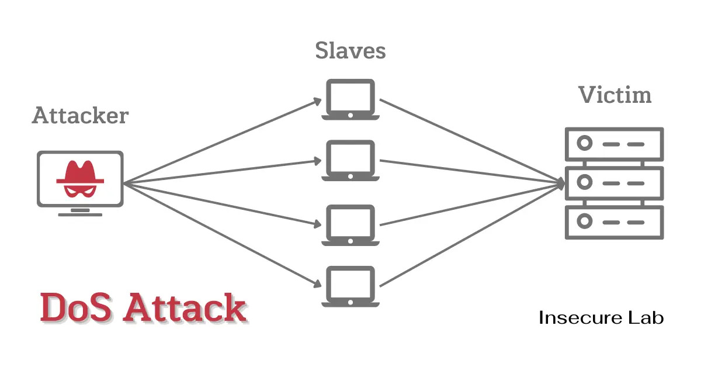

## Social Engineering Attacks
- Exploite principalement le facteur humain plutôt qu'une vulnérabilité technique : confiance, peur, urgence, autorité, curiosité...

| Attaque                   | À savoir                                                                                                                                                          |
| ------------------------- | ----------------------------------------------------------------------------------------------------------------------------------------------------------------- |
| **Smishing**              | Phishing via **SMS**.                                                                                                                                             |
| **Spim**                  | Spam/phishing via **messagerie instantanée**. Des bots peuvent identifier des IDs/comptes de messagerie puis leur envoyer automatiquement des liens malveillants. |
| **Spear Phishing**        | Phishing **ciblé et personnalisé**.                                                                                                                               |
| **Spam**                  | Envoi massif de messages non sollicités, pas forcément malveillants.                                                                                              |
| **Credential Harvesting** | Collecte d’identifiants afin de réutiliser les comptes. Souvent via faux portail Microsoft 365, banque, VPN, formulaire ou page SSO copiée.                       |
| **Eliciting Information** | Amener une personne à révéler des informations utiles à une future attaque.                                                                                       |
| **Prepending**            | Ajouter du contenu au début d’un message/lien pour tromper ou augmenter sa crédibilité.                                                                           |
| **Identity Fraud**        | Vol puis utilisation d’informations personnelles pour usurper une identité ou commettre une fraude.                                                               |
| **Invoice Scam**          | Fausse facture/demande de paiement menant vers un site ou document malveillant.                                                                                   |
| **Reconnaissance**        | Collecte d’informations pour préparer l’attaque : OSINT, employés, emails, IP, ping sweep, port scan, services exposés…                                           |
| **Influence Campaign**    | Faux comptes/contenus destinés à influencer l’opinion publique.                                                                                                   |
| **Hybrid Warfare**        | Combinaison de cyberattaques, propagande et autres moyens conventionnels/non conventionnels.                                                                      |
| **Quishing**              | Variante par QR Code.                                                                                                                                             |
- Pourquoi les gens sont-ils vulnérables aux attaques d'ingénierie sociale ? La plupart des gens ignorent les différentes techniques de manipulation sociale et ne sont donc pas préparés à de telles situations.

| Principe                     | Exploitation                                                                                                                                                                                                           |
| ---------------------------- | ---------------------------------------------------------------------------------------------------------------------------------------------------------------------------------------------------------------------- |
| **Authority**                | Se faire passer pour une personne ayant de l’autorité.                                                                                                                                                                 |
| **Intimidation**             | Faire peur pour pousser à agir.                                                                                                                                                                                        |
| **Consensus / Social Proof** | Faire croire que les autres ont déjà validé/fait l’action.                                                                                                                                                             |
| **Scarcity**                 | Créer un sentiment d'urgence par le biais de courriels ou d'appels, incitant les victimes à agir rapidement pour profiter d'une offre à durée limitée.                                                                 |
| **Urgency**                  | Créer un sentiment d'urgence dans leurs communications, les attaquants font pression sur leurs victimes pour qu'elles règlent immédiatement leurs problèmes sans tenir compte des risques potentiels pour la sécurité. |
| **Familiarity / Liking**     | Créer sympathie/proximité avec la victime.                                                                                                                                                                             |
| **Trust**                    | Exploiter la confiance et la volonté d’aider.                                                                                                                                                                          |
- Prévention
	- **Employee Training** & **Regular Update**
	    - sensibilisation régulière aux scénarios de Social Engineering.
	- **Verification Procedures**
	    - vérifier les demandes inhabituelles, idéalement via un **second canal** type question secrète pour changer MDP.
	- **Phishing Protection**
	    - Sensibilisation des agents ;
	    - filtrage email/URL ;
	    - sandbox des pièces jointes ;
	    - MFA ;
	    - signalement des messages suspects.
	- **Physical Security**
	    - badges ;
	    - mantrap ;
	    - contrôle visiteurs ;
	    - restrictions USB.
	- **Least Privilege**
	    - limiter l’impact si un utilisateur est trompé.

- Shoulder Surfing : Observer directement par-dessus l'épaule pour récupérer des informations sensibles. 
	- Prévention : privacy screen, masquer la saisie du PIN, clean desk policy
- Dumpster Diving : Fouiller les déchets d'une personne/organisation pour récupérer des informations exploitables (documents internes, noms/emails, info techniques...).
	- Prévention : destruction sécurisée des documents/supports...
- Tailgating : Accès physique non autorisé en suivant une personne autorisée après ouverture d'une porte sécurisée.
	- Prévention : sensibilisation, badges individuels, contrôles visiteurs, mantrap (zone entre deux portes verrouillées : la seconde ne s'ouvre qu'une fois la première refermée)
- Hoaxes : Fausse information destinée à provoquer une action chez la victime.
- Attaques physiques : Obtenir un accès physique à un système ou un appareil afin d'y effectuer des actions non autorisées ou d'en extraire des informations.
	- Malicious USB câble : Câble USB modifié pouvant permettre injection de commandes ou contrôle à distance.
	- Malicious Flash Drive : Clé USB contenant un payload/malware déclenché lorsqu’elle est utilisée.
	- Card cloning : Copier les données d’une carte sur une autre carte.
	- Skimming : Utilisation d’un dispositif pour capturer les données de la bande magnétique d’une carte et les codes PIN saisis par les utilisateurs.
- Supply-chain attack : Compromettre un fournisseur, partenaire, logiciel ou composant pour atteindre indirectement la cible principale.
	- Attaquant -> Fournisseur/éditeur compromis -> Produit/Update/Relation de confiance -> Entreprise cible.
	- Ex : MAJ Logicielle compromise, dépendance/package malveillant, fournisseur IT/MSP compromis

## Network Attacks
- Vise principalement la disponibilité, l'intégrité ou la confidentialité des communications. 
#### Déni de Service - Denial of Service (DoS) 

- Saturer une machine/service avec tellement de requêtes qu'il ne peut plus répondre aux utilisateurs légit.
- Attaquant → énormément de requêtes → serveur saturé → service indisponible
- Peut viser :
	- Bande passante ;
	- CPU / RAM ;
	- Tables de connexion ;
	- Application / service spécifique.
- Ex : Flood d'un serveur Web empêchant les users legit d'accéder au site.
#### ## Déni de Service Distribué - Destributed Denial of Service (DDoS)

- Même objectif qu'un DoS, mais l'attaque provient de nombreuses machines distribués, ce qui lui permet de générer un grand volume de requêtes.
- Les machines compromises sont souvent appelées bots/zombies et forment un botnet.
- Types DDoS :

| Type                 | Objectif                                                                 |
| -------------------- | ------------------------------------------------------------------------ |
| **Network-based**    | Saturer bande passante ou équipements réseau                             |
| **Application DDoS** | Saturer une application/service avec des requêtes légitimes en apparence |
| **OT/ICS DoS**       | Perturber équipements/services nécessaires à des processus industriels   |
- Smurf Attack : Ancienne attaque DDoS basée sur ICMP :
	1. L'attaque envoie des requêtes ICMP avec IP source spoofée = IP victime.
	2. Plusieurs machines répondent.
	3. Toutes les réponses arrivent vers la victime -> amplification/saturation.

#### Spoofing - Usurpation 
- Falsifier une identité/source pour faire croire que les données viennent d'un autre système.

|Type|Principe|
|---|---|
|**IP Spoofing**|Modifier l’IP source d’un paquet|
|**MAC Spoofing**|Modifier l’adresse MAC source|
|**Email Spoofing**|Falsifier l’adresse `From:` d’un email|
- Souvent utilisé pour contourner certains contrôles basés uniquement sur une identité réseau :
	- ACL autorise 192.168.1.10 → attaquant falsifie cette IP
	- Wi-Fi autorise MAC AA:BB:CC... → attaquant reprend cette MAC
- Outils :
    - macchanger : modifier la MAC locale :
        
        - `r` → MAC aléatoire.
            
            ```
            sudo macchanger -r eth0
            ```
            
        - MAC spécifique :
            
            ```powershell
            sudo macchanger -m AA:BB:CC:DD:EE:FF eth0
            ```
            
    - hping : génération de paquets TCP/IP personnalisés :
        
        ```powershell
        sudo hping2 -S -p 80 -c 3 -s 12345 <target>
        
        # -S : SYN
        # -p 80 : port destination
        # -c 3 : 3 paquets
        #-s 12345 : port source
        ```
        
    - Nemesis : crafting/injection de paquets ARP, TCP, UDP, ICMP, etc.
        
        ```powershell
        sudo nemesis arp -r -d eth0 -S 192.168.1.1 -D 192.168.1.2 -h 0A:0B:0C:0D:0E:0F -m 10.0.0.1
        ```

#### Eavesdropping / Sniffing 
- Eavesdropping, connue aussi sous le nom de sniffing : intercepter/capturer le trafic réseau pour analyser des paquets. 
- Peut exposer : 
	- credentials ;
	- cookie/session tokens ;
	- données personnelles ;
	- info bancaires ;
	- protocoles non chiffrés.
- Les switchs filtrent généralement le trafic et n'envoient les données qu'au port de destination. Un attaquant peut tenter de contourner cela via :
	- MAC flooding : remplir table CAM/MAC du switch avec de fausses entrées ;
	- ARP spoofing / MITM ;
	- accès à un port miroir / SPAN.
- Outils : 
	- Wireshark (graphique) / Tshark (CLI) : analyse de paquets. 
	- tcpdump : capture CLI .
        
        ```powershell
        sudo tcpdump -i eth0 -w output.pcap
        ```
	- airodump-ng : capture du trafic Wi-Fi. 
	
        ```powershell
        sudo airodump-ng wlan0 -w wepfile
        ```

#### Attaque par rejeu - Replay attack
- Une attaque par rejeu consiste à capturer une communication, la conserver et la retransmettre plus tard. L'attaquant peut modifier le trafic avant de le rejouer, ou simplement l'utiliser pour générer du trafic supp.

Victime → paquet valide → serveur
             ↓
          capturé
             ↓
Attaquant → rejoue le paquet → serveur

- Exemple historique Wi-Fi : sur **WEP**, rejouer des paquets permettait de générer davantage de trafic/IV afin d’accélérer la récupération de la clé.
- Outils
	- `tcpreplay`Rejouer une capture réseau :
		
		```
		tcpreplay -i eth0 captured_traffic.pcap
		```
	- `aireplay-ng` permet des opérations similaires sur Wi-Fi :
		
		```
		aireplay-ng -0 5 -a 00:14:6C:7E:40:80 wlan0
		```

Ici `-0` correspond à l’envoi de trames de **deauthentication**, donc ce n’est pas exactement un exemple générique de “rejouer une capture”.

- Protection contre Replay
	- Les protocoles modernes utilisent notamment :
		- nonces ;
		- timestamps ;
		- sequence numbers ;
		- tokens à durée de vie limitée ;
		- mécanismes anti-replay.

#### Man-in-the-Middle (MiTM)
- MiTM/ ON-Path : l'attaquant se place entre deux systèmes qui pensent communiquer directement.
- L'attaquant peut :
	- écouter le trafic ;
	- capturer des données ;
	- modifier les messages ;
	- rediriger les communications ;
	- voler les sessions.
- Exemples de techniques :
	- ARP spoofing ;
	- rogue Wi-Fi / Evil Twin ;
	- DNS spoofing ;
	- proxy malveillant.
#### Man-in-the-Browser (MiTB)
- Variante où un trojan/module malveillant est présent dans le navigateur.
- Peut intercepter/modifier les informations avant leur chiffrement TLS ou après déchiffrement dans le navigateur. Donc même une connexion HTTPS peut ne pas suffire si **l’endpoint lui-même est compromis**.

## Attaques basés sur le réseau et stratégies de prévention
### Attaques de la couche 2 
#### ARP Poisoning 
- ARP associe une adresse IP <-> MAC sur un LAN.
- ARP Poisoning / ARP Spoofing : envoyer de fausses réponses ARP pour modifier le cache ARP d'une victime.
- L'attaquant associe sa propre MAC à l'IP d'un équipement légitime, souvent la gateway.
- Victime pense : 192.168.1.1 (Gateway) → MAC Attaquant → Le trafic peut alors passer par l’attaquant : **MITM**, sniffing, modification/redirection du trafic.
#### MAC Flooding 
- Un switch maintient une CAM/MAC table pour associer : MAC Address -> Switch port
- L'attaquant envoie énormément de trames avec de fausses MAC pour saturer cette table.
- Sur certains équipements/comportements, le switch peut alors flooder les frames inconnues sur plusieurs ports, facilitant le sniffing.
#### MAC Cloning / MAC Spoofing
- Modifier sa MAC pour imiter un autre équipement.
- Peut contourner des contrôles faibles basés uniquement sur la MAC :
	- MAC filtering Wi-FI ;
	- port security mal configurée ;
	- restrictions d'accès simples.

### Attaques DNS
#### DNS Poisoning
- Manipuler des données DNS pour faire résoudre un domaine légitime vers une IP contrôlée par l'attaquant.
- bank.com -> DNS compromis -> 10.10.10.50 (attaquant) : → permet phishing, interception ou distribution de malware.
#### DNS Cache Poisoning 
- Corrompre le cache DNS d'un resolver/client afin qu'il conserve une fausse résolution.
- Même si le DNS autoritaire est sain, le client peut continuer à recevoir la mauvaise IP tant que l'entrée empoisonnée reste en cache.
#### Pharming 
- Redirection silencieuse vers un faux site en manipulant :
	- DNS ;
	- cache DNS ;
	- fichier local **host**
- → le système utilisera cette résolution locale sans interroger le DNS normalement.
#### Domain Hijacking 
- Prendre le contrôle d'un domaine sans autorisation du propriétaire.
- Peut passer par : 
	- Compromission du compte registrar ;
	- social engineering ;
	- vol de credentials ;
	- mauvaise conf.
- Attaquant peut modifier DNS, mail, site Web...
#### URL Redirection
- Faire rediriger un user d'une URL légitime vers une destination malveillante.
- Peut être réalisée via :
	- DNS compromis ;
	- site Web compromis ;
	- redirection HTTP ;
	- configuration applicative malveillante.
#### Domain Reputation
- éputation associée à l'historique d'un domaine basé sur : spam, phishing, malware, ancienneté, comportement email...
- Un domaine ayant une mauvaise réputation peut être placé sur des **blocklists**, et ses emails seront filtrés.
- Maintenir une bonne réputation de domaine est important pour assurer la délivrabilité des e-mails et prévenir les problèmes de sécurité liés au spam.

### Pass-the-Hash (PtH)
- Technique principalement liée à l'authentification NTLM sous Windows.
- L'attaquant récupère un hash NTLM puis l'utilise directement pour s'authentifier sans connaître le MDP en clair.
- Les hashes peuvent provenir de différentes sources : SAM, mémoire, dumps de credentials, etc.
- Kerberos réduit certains usages de NTLM mais ne “supprime” pas automatiquement le risque PtH.
- La vraie défense passe aussi par limitation NTLM, segmentation, Credential Guard, comptes admins séparés, LAPS/Windows LAPS, etc.
### Amplification 
- Augmenter puissance/gain d'une carte ou antenne Wi-Fi permet d'atteindre un réseau plus loin.
- Un attaquant peut donc tenter de se connecter sans être physiquement proche du bâtiment.
- C’est davantage une **capacité radio/physique** qu’une attaque réseau à elle seule.
- Défense possible :
	- ajuster correctement la puissance des AP ;
	- placer les AP intelligemment ;
	- utiliser WPA2/WPA3 + authentification forte.
### Spam 
- Envoi massif de messages non sollicités.
- Peut servir à :
	- pub ;
	- phishing ;
	- diffusion de malware ;
	- escroquerie.
- Défense :
	- antispam ;
	- réputation domaine/IP ;
	- filtrage URL/PJ.
### Privilege Escalation
- Passer d'un niveau de privilège faible vers un niveau supérieur. User → Administrator → SYSTEM
- Peut exploiter :
	- vulnérabilité OS/software ;
	- permissions faibles ;
	- service mal configuré ;
	- credentials privilégiés.
- Prévention : patching, least privilege, hardening, contrôle des permissions.
### Port Scanning
- Permet d'identifier les ports ouverts et donc les services potentiellement attaquables.
- Différents types de scans de ports incluent :
	- Scan de connexion TCP : Initie une poignée de main TCP complète avec chaque port pour déterminer s'il est ouvert.
	- SYN scan / Half-Open : Envoie un SYN sans terminer la poignée de main, réduisant la détectabilité en générant moins de trafic.
	- XMAS scan : Envoie paquets avec des flags spécifiques (PSH, URG, FIN), pour sonder les ports.
### Antiquated / Insecure Protocols
- Protocoles historiques conçus sans chiffrement ou protections modernes.
- Ex : 
	- HTTP  → HTTPS
	- FTP   → SFTP / FTPS
	- POP3  → POP3S / TLS
	- SMTP  → SMTP avec TLS / STARTTLS
	- Telnet → SSH
- Nuance : HTTP, FTP, SMTP ou POP3 existent toujours ; ce sont surtout leurs **utilisations non chiffrées** qui posent problème.
### Session Hijacking
- Vol ou réutilisation d'une session déjà authentifiée afin d'usurper l'utilisateur.
- Exemple web : Victime login -> Session Cookie -> Cookie volé -> Attaquant réutilise la session
### CLient-Side Attack
- Exploitent une vulnérabilité présente dans une application utilisée par la victime.
- Ex : navigateur, client mail, lecteur PDF, application de messagerie, Office.
### Watering Hole Attack
- Compromettre un site web fréquemment visité par la population ciblée.
- Le site légitime devient le vecteur de compromission.
- Attaquant -> Site utilisé par la cible compromis -> victimes visitent naturellement le site -> code/payload malveillant.
### Typosquatting / URL Hijacking
- Enregistrer des domaines ressemblant à un domaine légitime en anticipant les fautes de frappe.
- Ex : 
	- google.com
	- gogle.com
	- gooogle.com
- Peut servir à :
	- phishing ;
	- malware ;
	- pub ;
	- credential harvesting.

### Prévention 
#### Sécurité physique
- Empêcher qu’un individu non autorisé puisse connecter directement un équipement au réseau.
- Contrôle d’accès, visiteurs, salles réseau sécurisées.
#### Switch Hardening
- Désactiver les ports inutilisés.
- Utiliser **Port Security** pour limiter les MAC autorisées par port.
- Autres protections pertinentes selon infrastructure :
    - DHCP Snooping ;
    - Dynamic ARP Inspection (DAI) ;
    - VLAN segmentation ;
    - 802.1X / NAC.
#### DNS
- protéger les comptes registrar ;
- MFA ;
- surveiller les changements DNS ;
- DNSSEC lorsqu’applicable ;
- sécuriser les resolvers.
#### Network Monitoring
- IDS/IPS ;
- firewall ;
- SIEM ;
- NetFlow ;
- détection scans / anomalies ;
- segmentation réseau.

## Attaques basées sur les MDP
### Types d'attaques 
#### Attaque par dictionnaire
- Teste des MDP provenant d'une wordlist : mots courants, password issus de leaks, variantes fréquentes...
  Rapide car l'attaquant ne génère pas toutes les combinaisons possibles.
- Efficace contre passwords faibles/prévisibles.
- Inefficace si le password n’est pas présent ou dérivable de la wordlist.
#### Attaque par force brute
- Teste toutes les combinaisons possibles selon un charset et une longueur donnés.
- Avantage : avec suffisamment de temps, les attaques par force brute peuvent finir par casser n'importe quel mot de passe.
- Inconvénient :  est le temps que cela prend. En raison du grand nombre de mots de passe possibles, il pourrait falloir des années pour casser un mot de passe avec cette méthode.
#### Attaque hybride
- Combine dictionnaire + brute force.
- Commence avec un fichier de dictionnaire, mais ensuite le logiciel de cassage de mot de passe modifie les mots du dictionnaire. 
- Exemple, il pourrait ajouter des chiffres à la fin d'un mot ou remplacer certains caractères par d'autres.

### Password Spraying
- Tester un même mot de passe (ou quelques-uns) contre beaucoup de comptes.
- But : éviter les mécanismes de lockout qui se déclencheraient en testant beaucoup de passwords sur un seul compte.
- Ex :
	- Password123 → alice
	- Password123 → bob
	- Password123 → admin
	- Password123 → john
### Credential Stuffing 
- Réutiliser des couples email:password issus d'une fuite de données sur d'autres services.
- Exploite la réutilisation des mots de passe.
Leak site A
alice@email.com : Winter2025!

        ↓ testé sur

VPN / O365 / Gmail / Site B
- → Ce n’est pas du brute force : les credentials testés sont déjà connus.
### Rainbow tables 
- Tables pré-calculées permettant d'accélérer la recherche d'un mot de passe correspondant à un hash.
- Evitent de recalculer les mêmes hashes à chaque attaque.
#### Défense : Sel
- Un salt aléatoire ajouté avant le hash rend les rainbow tables pré-calculées beaucoup moins utiles.
- Deux utilisateurs avec le même password obtiennent alors des hashes différents.

### Plaintext / Known-Plaintext Attack (KPA)
- En cryptanalyse, l'attaquant possède :
	- Une donnée en clair (plaintext/crib) ;
	- le ciphertext correspondant.
- Il tente d'en déduire des informations sur la clé ou le mécanisme de chiffrement.
### Cryptographic Attacks 
#### Collision de hash / Birthday Attack
- Une collision apparaît lorsque deux entrées différentes produisent le même hash.
Input A ─┐
         ├→ même Hash
Input B ─┘
#### Downgrade Attack 
- Forcer deux systèmes à utiliser un protocole/algorithme moins sécurisé que celui normalement disponible.
- Ex :
	- Ancienne version TLS ;
	- chiffrement plus faible ;
	- fallback vers protocole legacy.
#### Online vs Offline Attacks
- Online : Attaquant teste directement contre le service : Attacker -> SSH / VPN / Web Login / RDP. Risques pour l'attaquant :
	- Logs, détection, rate limiting, account lockout, blocage IP.
- Offline : Attaquant récupère les hashes puis travaille sur sa propre machine. Database / SAM / dump -> hashes récupérés -> Hashcat / John. Avantage :
	- pas de lockout, pas de trafic vers la victime, très grand nombre d'essais possibles, possibilité d'utiliser CPU/GPU puissants. 
### Outils de Password Cracking

|Outil|Usage|
|---|---|
|**John the Ripper**|Cracking offline : dictionary, brute-force, règles/hybride|
|**Hashcat**|Cracking offline très performant, notamment GPU, nombreux formats de hash|
|**Hydra**|Attaques **online** contre SSH, FTP, HTTP, RDP et autres services|
|**Cain & Abel**|Ancien outil Windows de cracking/sniffing ; surtout historique aujourd’hui|

## Recap - 4 grandes familles d’attaques

|Type|Principe|Exemples|
|---|---|---|
|**Social Engineering**|Manipuler une personne pour contourner la sécurité|Phishing, smishing, dumpster diving, tailgating|
|**Network-Based**|Exploiter/intercepter les communications ou services réseau|Sniffing, DoS/DDoS, MITM, ARP/DNS poisoning|
|**Password-Based**|Deviner, récupérer ou réutiliser des credentials|Dictionary, brute-force, spraying, hybrid|
|**Application-Based**|Exploiter des vulnérabilités présentes dans des logiciels/applications|Client-side exploit, vulnérabilité Web, logiciel non patché|