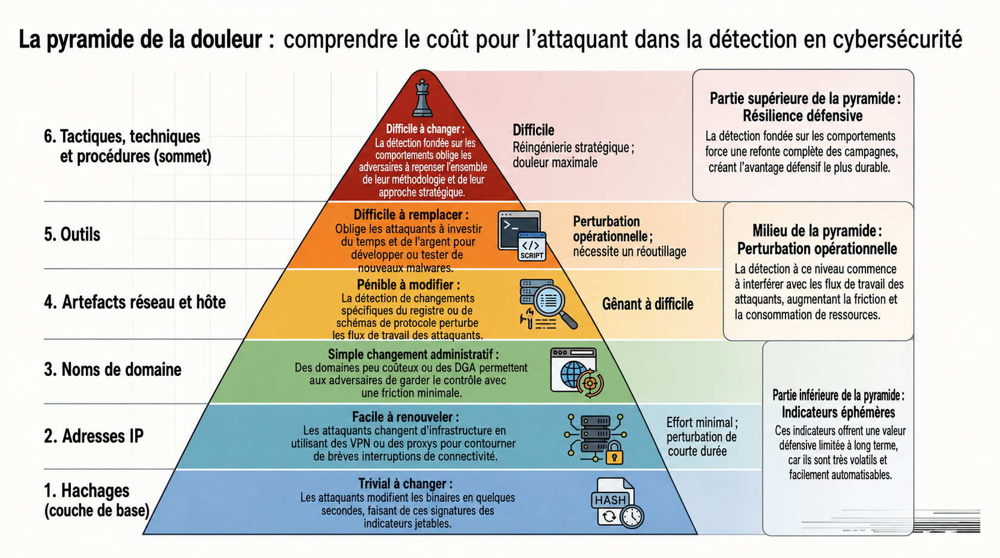

### Pyramids of pain

Moyen qui va évaluer la difficulté pour un attaquant de modifier un IoC


#### Hash values (empreintes de fichiers) — trivial

- Valeur numérique fixe qui identifie de façon condensée un fichier ou une donnée, produite par un algo de hachage, plus petit changement dans le fichier, le hash changera du tout au tout.
- Algorithmes :
	- MD5 : Très répandu historiquement mais plus sûr : collisions connues.
	- SHA-1 : Déprécié par le NIST
	- SHA-2 (ex : 256) : Recommandé comme alternative aujourd’hui.
- Utilité : Recherche et classification, sources publiques, usage opérationnel.
- Limite : Modifier un seul bit du fichier change hash, l’attaquant peut asiément créer une variante si on ne s’appuie que sur les hashs.
- Outils : Virustotal, MetaDefender…
- Commandes :
	- **Get-FileHash fichier.ext -Algorithm MD5**


#### IP addresses

- IP identifie un appareil sur un réseau
- Attaquant peut facilement la changer : Nouvelle IP publique, proxys, VPS, utilisation de machine compro…
- Bloquer/Filtrer IP sur firewall donne un gain immédiat mais peu durable.
- Technique qui complique : Fast Flux
	- Technique DNS employée par botnets pour masquer l’infrastructure C2. https://unit42.paloaltonetworks.com/fast-flux-101/
	- Principe : Un même nom de domaine pointe vers beaucoup d’adresses IP qui changent très souvent. Les IP sont souvent des machines compro faisant office de proxies.
	- But : Rendre C2 / site malveillant résilient et difficile à détecter.
	- Conséquence : Bloquer IP individuelles devient inefficace.

#### Domain names

- Associer nom humainement lisible à une adresse IP
- Plus compliqué qu’une IP, doit acheter/maintenir domaine, configurer DNS? potentiellement payer/renouveler, gérer certificats. Même si fournisseurs DNS proposent API et process automatisés.
- Techniques :
	- Punnycode / IDN homograph attack
		- Attaquants créent domaines qui ressemblent à des légit en utilisant caractères Unicode (ex : [adıdas.de](http://xn--addas-o4a.de/)) ; convertis en ASCII ces domaines deviennent du Punycode comme [adıdas.de](http://xn--addas-o4a.de/). A première vue URL semble legit visuellement, mais c’ets un leurre.
	- URL shorteners :
		- Attaquants cachent destination réelle derrière des services de raccourcissement. Astuce défensive simple : Certains raccourcisseurs ajoutent ajoute après l’URL dans le navigateur, la page de dest.
	- Analyse en sandbox (any.run) :
		- Exécutent échantillon et montrent les échanges DNS… Pour ne pas avoir à visiter directement.

#### Network/Host artifacts (ex : clés de registre, chemins, mutex, patterns réseau)

- Compliqué pour l’attaquant d’agir sur ces aspects
- Process d’exécution suspect de Word


- Event suspects qui suivent l’ouverture d’une application


- Fichier déposé / modifié par l’attaquant


- Requête HTTP qui peuvent être détectés avec Wireshark ou Tshark


- tshark --Y http.request -T fields -e http.host -e http.user_agent -r analysis_file.pcap


  

#### Tools (outils ou binaires employés par l’attaquant

- A ce niveau ça devient coûteux car doit recréer outils, réapprendre, réinvestir.
- Leviers principaux : Signature AV, règles de détection. YARA, Marketplaces (MalwareBazaar, Malshare) pour obtenir échantillons et indicateurs, Fuzzy hashing (SSDEEP) peut faire de la similarité entre variantes, utile quand les hashes classiques changent.
- Sources / Plateformes :
	- MalwareBazaar, Malshare : sources pour récupérer échantillons connus. Toujours manipuler en environnement isolé (VM/sandbox hors réseau de prod).
	- SOC Prime Threat Detection Marketplace : règles de détection partagées (Sigma, YARA, signatures) — utile pour récupérer règles et les adapter.
	- *VirusTotal / Any.run : pour enrichissement et visualisation comportementale (HTTP requests, DNS, connexions) sans exécuter toi-même le sample.
	- **YARA** = Recherche de patterns dans les **fichiers** (statique).
	- **SIGMA** = Recherche de patterns dans les **logs/événements** (SIEM).

#### TTPs (Tactics, Techniques, Procedures)

- Décrit comportement global d’un attaquant, pas juste un indicateur technique.
	- Tactics : Le pourquoi : Objectif de l’adversaire (obtenir un accès initial, élever ses privilèges, exfiltrer des données…)
	- Techniques : Le comment général : Méthode employée (hameçonnage, exploitation de vulnérabilité, vol d’identifiants…)
	- Procedures : Le comment précis : L’exécution concrète (Pièce jointe Excel avec macro malveillante envoyée via email)
        
		```jsx
		Tactic : Credential Access
		Technique : Pass-the-Hash (MITRE T1550.002)
		Procedure : L’attaquant utilise mimikatz pour extraire un hash NTLM et se connecter à un autre poste via psexec.
		```
        

### Cyber Kill Chain (RALEICA)


Reconnaissance : But de l’attaquant : collecter des infos publiques ou directement interagir pour construire un profil ciblé (employés, technos exposées, emails, sous-domaines…).

- Phase de recherche et de planning pour l’attaque. Récup des info sur la cible pour se préparer aux étapes suivante. Peut inclure des info sur l’infra, les employées, les process business, techno exposées.
- OSINT : Collecter depuis : Moteur de recherche, magazine et média en ligne, réseaux sociaux, forum et blog, base de donnée publiques, WHOIS et donnée technique.
- Reco passive : Pas d’interaction directe : WHOIS lookups, social media scrapping, data breach. Reco active : Contact direct avec la cible, social engineering, port scanning, banner grabbing, ou recherches de services ouverts.

Armement (Weaponization) : But : transformer l’info en charge actionable (maldoc, exploit pack, payload).Livraison (Delivery) : phishing (spear), watering-hole, USB drops, OAuth consent frauds, liens raccourcis.


Exploitation : But : exécuter le code, tirer parti d’une vulnérabilité (CVE connue ou 0-day), exécuter macro, drive-by.
  

Installation : But : garantir un accès récurrent (backdoor, webshell, services, run keys, scheduled tasks).

- Persistence :
	- Installer web shell sur webservers : Script malicieux utilisé pour maintenir un accès sur le système compromis.
	- Installer backdoor : Attaquant peut utiliser Meterpreter pour installer backdoor sur la victime.
	- Créer ou modifier service.
	- Ajouter une entrée dans les “run keys” pour le payload dans l’éditeur de registre.

Command & Control : But : canal de commande pour contrôler la machine compromise (beaconing, exfiltration).

- Machine compromise pourra communiquer vers un serveur externe mis en place par un attaquant. Après cela établit, attaquant aura contrôle total sur la machine de la victime.
- Canal C2 les plus communs :
	- HTTP sur le port 80 et HTTPS sur le port 443, permet à l’attaquant de se noyer dans la masse et passer Firewall.
	- DNS : Machine infectée va faire constamment des requêtes DNS au serveur DNS contrôlé par l’attaquant, connu sous DNS Tunneling

Actions sur l’objectif : But : l’adversaire atteint son objectif — vol de credentials, exfiltration, sabotage, chiffrement (ransomware).


### Kill Chain Unifiée (UKC)

Intéressante car plus moderne (2017 update en 2022) et prend en compte les nouvelles tendances.

La UKC regroupe **18 phases**, organisées en **3 macro-phases** :

1. **In** → Gagner un accès initial (Initial Foothold)
2. **Through** → Se propager et consolider sa position (Network Propagation)
3. **Out** → Atteindre les objectifs (Actions on Objectives)


#### Phase 1 - In - Initial foothold : Obtenir premier point d’entrée dans la cible

##### 1. Reconnaissance (MITRE : TA0043)

- Collecte d’information sur la cible (OSINT, scans, services, emails…)
- Passive (WHOIS, Linkedin…) & Active (Port scanning)
- Sert à identifier des vulnérabilités exploitables, employés ou creds exposés

##### 2. Weaponization (TA0001)

- Préparation de l’attaque : Création ou acquisition d’outils malveillants.
- Exemple : Configurer C2, générer payload…

##### 3. Social Engineering (TA0001)

- Manipulation humaine pour obtenir un accès.
- Exemples : phishing, spear-phishing, faux sites de login, appels téléphoniques d’ingénierie sociale.

##### 4️⃣ Exploitation (TA0002)

- Exploitation technique d’une faille (logicielle ou humaine).
- Exemples : exécution de code via une vulnérabilité web, macros malveillantes, injections, exploits 0-day.

##### 5️⃣ Persistence (TA0003)

- Maintenir un accès même après un redémarrage ou un nettoyage.
- Exemples : création de services Windows, modification de clés de registre, installation d’un web shell.

##### 6️⃣ Defence Evasion (TA0005)

- Techniques pour **éviter la détection** par les antivirus, EDR, ou IDS.
- Exemples : obfuscation, chiffrement, timestomping, désactivation de logs.

##### 7️⃣ Command & Control (TA0011)

- Mise en place d’un **canal de communication** entre l’attaquant et la machine compromise.
- Exemples : C2 via HTTP/HTTPS, DNS tunneling, ou protocoles chiffrés personnalisés.

##### 8️⃣ Pivoting (TA0008)

- Utiliser une machine compromise comme **base d’opérations** pour atteindre d’autres systèmes internes.
- Exemples : SSH tunneling, proxychains, RDP vers d’autres hôtes internes.

  

#### Phase 2 - Through (Propagation réseau) : Étendre l’accès dans le réseau et accroître les privilèges.

##### 9️⃣ Pivoting (TA0008)

- Utiliser un point d’entrée pour attaquer d’autres segments du réseau (intranet, serveurs internes).

##### 🔟 Discovery (TA0007)

- Identifier les systèmes, utilisateurs, services et configurations internes.
- Exemples : `net view`, `ipconfig /all`, `whoami`, `Get-ADUser`.

##### 1️⃣1️⃣ Privilege Escalation (TA0004)

- Obtenir des droits supérieurs (Admin, Root).
- Exemples : exploitation de vulnérabilités locales, abus de services, jetons, ou permissions faibles.

##### 1️⃣2️⃣ Execution (TA0002)

- Exécuter du code malveillant sur le système.
- Exemples : scripts PowerShell, scheduled tasks, injection de processus.

##### 1️⃣3️⃣ Credential Access (TA0006)

- Vol de mots de passe, hash, tokens ou cookies.
- Exemples : keylogging, Mimikatz, LSASS dump, vol de sessions RDP.

##### 1️⃣4️⃣ Lateral Movement (TA0008)

- Déplacement d’un système à un autre pour étendre le contrôle.
- Exemples : Pass-the-Hash, RDP, SMB exploitation.

#### Phase 3 - Out - (Actions sur objectifs) : Réaliser les buts de l’attaque (vol, destruction, rançon, etc.).

##### 1️⃣5️⃣ Collection (TA0009)

- Rassembler les données sensibles.
- Exemples : documents, bases de données, historiques de navigation, emails.

##### 1️⃣6️⃣ Exfiltration (TA0010)

- Extraire les données du réseau vers l’extérieur.
- Exemples : transfert via C2, FTP, cloud, ou dissimulation dans un flux chiffré.

##### 1️⃣7️⃣ Impact (TA0040)

- Dégrader ou détruire les ressources du système.
- Exemples : ransomware, effacement de disques, DDoS, sabotage, défacement.

##### 1️⃣8️⃣ Objectives

- Réalisation finale de la mission de l’adversaire.
- Exemples : gain financier (ransomware), espionnage, sabotage, atteinte à la réputation

|**Macro-phase**|**Objectif**|**Phases principales**|
|---|---|---|
|**IN**|Gagner un accès initial|Recon, Weaponization, Social Eng., Exploit, Persistence, Defence Evasion, C2, Pivoting|
|**THROUGH**|Se propager dans le réseau|Discovery, Priv. Escalation, Execution, Credential Access, Lateral Movement|
|**OUT**|Atteindre les objectifs finaux|Collection, Exfiltration, Impact, Objectives|

### Modèle Diamant

Représente l’unité fondamentale d’une activité malveillante à travers quatre éléments principaux reliés en forme de diamant. Chaque attaque peut être décrite par ces quatre points interconnectés, qui expliquent qui fait quoi, comment et contre qui.


#### Adversary (Attaquant)

L’acteur malveillant à l’origine de l’attaque

- Adversary Operator : Personne réalisation concrètement l’attaque.
- Adversary Customer : Commanditaire ou bénéficiaire de l’attaque (Entreprise, État, groupe criminel…)
- Exemple : Groupe APT chinois (Customer) mandate des opérateurs pour compro une société FR d’aéronautique afin de voler de la PI.

#### Victime (Cible)

Entité visée par l’adversaire : Une organisation, individu, domaine, IP…

- Victim Persona : Personne ou organisations ciblées (RH, dirigeants…)
- Victim Assets : Systèmes, serveurs, mail, réseaux exploités…
- Ex : Employée du service financier reçoit mail piégé, elle devient la victim persona, son ordi et son adresse mail sont les victim assets

#### Capability (Outils et techniques)

Moyens techniques utilisés par l’adversaire pour exécuter l’attaque, reflètent TTP.

- Capability Capacity : Ensemble des vuln et expositions exploitables.
- Adversary Arsenal : Ensemble des capacités de l’adversaire.
- Ex : Exploits, malwares, rootkits, scripts, techniques d’hameçonnage, brute force, obfuscation

#### Infrastructure (Moyens de déploiement)

Ressources logiques ou physiques utilisées pour livrer, héberger ou contrôler les capacités.

- Type 1 : Infra directement contrôlée par l’adversaire (Son propre serveur C2)
- Type 2 : Infra intermédiaire (serveurs compro, domaines legits piratés)
- Ex : Serveur C2, domaines de phishing, emails mailveillants, USB infecté…

#### Meta-features (informations supplémentaires)

Éléments contextualisant un événement pour l’analyse et la corrélation :

|Meta-feature|Description|Exemple|
|---|---|---|
|**Timestamp**|Date et heure de l’événement|2025-10-09 02:10:12|
|**Phase**|Étape dans la kill chain|Exploitation, Exfiltration|
|**Result**|Succès, échec, inconnu|"Integrity compromised"|
|**Direction**|Sens de l’attaque|Infrastructure → Victim|
|**Methodology**|Type d’attaque|Phishing, DDoS, Breach|
|**Resources**|Moyens nécessaires à l’attaque|Serveurs, argent, accès réseau|

#### Axes complémentaires

- Composant Social-Politique : Décrit l’intention & motivation de l’adversaire
	- Gai financier, espionnage industriel ou étatique, hacktivisme…
- Composant technologique : Décrit la relation entre la capacité et l’infrastructure
	- Comment les outils (capabilities) interagissent avec les serveurs ou vecteurs techniques (infrastructures), met en évidence les méthodes d’attaque spécifiques.

### MITRE

Organisation à but non lucratif qui créée des projets liés à la cybersécurité :

- Terminology :

|Terme|Signification|
|---|---|
|**APT** (_Advanced Persistent Threat_)|Groupe organisé (souvent étatique) menant des attaques prolongées et ciblées.|
|**TTPs**|Décrit comportement global d’un attaquant, pas juste un indicateur technique.  <br>- _T_**actic** → objectif de l’adversaire  <br>- **Technique** → méthode pour atteindre l’objectif  <br>- **Procedure** → manière concrète d’exécuter la technique|

#### ATT&CK Framework & NAVIGATOR : Décrit les attaques

Base de connaissance sur les tactiques et techniques des cyberattaquants, décrit TTP.

- For Enterprise contient 14 catégories (de reconnaissance à impact), chaque catégories contient la technique pour parvenir à sa tactique


- Sous chaque tactique → Plusieurs techniques, parfois déclinées en sous-techniques.


- Chaque fiche technique détaille : Description, Procedure Examples, détection, mitigation, liens avec des groupes et logiciels


##### Navigator

Permet de visualiser et d’annoter les matrices, utiles pour individualiser en fonction de soihttps://mitre-attack.github.io/attack-navigator//#layerURL=https%3A%2F%2Fattack.mitre.org%2Fgroups%2FG0008%2FG0008-enterprise-layer.json


  

#### CAR (Cyber Analytics Repository) : Explique comment les détecter

Un référentiel d’**analyses de détection** basé sur le modèle ATT&CK. CAR complète ATT&CK qui décrit les attaques, CAR explique comment les détecter. https://car.mitre.org/

- Fournit des éléments divers :
	- Pseudocodes décrivant requêtes de détection (Splunk, EQL…)
	- Références vers TTPs
	- Implémentations selon OS et outils.


  

#### ENGAGE : Planifier et mener opérations d’engagement adversaire

- Cyber Denial : Empêcher l’adversaire d’agir
- Cyber Deception : Le tromper volontairement
- Catégories principales (Engage Matrix) :

|Catégorie|Description|
|---|---|
|**Prepare**|Actions préliminaires menant à l’objectif|
|**Expose**|Identifier l’adversaire via la tromperie|
|**Affect**|Actions qui perturbent ses opérations|
|**Elicit**|Recueillir des infos sur son mode opératoire|
|**Understand**|Analyser les résultats obtenus|


- **Engage Matrix Explorer** → permet d’explorer ces interactions.

#### D3FEND : Base de connaissance des contre-mesures cyber

- Chaque artefact contient

|   |   |
|---|---|
|**Catégorie**|**Description**|
|Definition|Information sur ce qu’est la technique|
|How it works|Comment cette technique fonctionne|
|Consideration|Chose à penser lors de l’implémentation|
|Example|Comment utiliser la technique|

#### ATT&CK Emulation Plans : Simuler attaques réelles

#### ATT&CK & Threat Intelligence : Faire lien TTP et posture défensive

### TLP

- **TLP:RED** : Réservé aux participants directs (yeux/oreilles uniquement). Pas de partage.
- **TLP:AMBER** : Partage limité au sein de l'organisation et avec les clients.
- **TLP:AMBER+STRICT** : Partage limité à l'organisation uniquement.
- **TLP:GREEN** : Partage avec la communauté (partenaires, secteur).
- **TLP:CLEAR** : Public (pas de restriction).

### L'évaluation de la confiance (Admiralty Code / NATO System)

En CTI, une info n'est jamais fiable à 100%. Tu dois ajouter comment noter tes sources.

- **Fiabilité de la source (A à F)** : De "A - Complètement fiable" à "F - Impossible à évaluer".
- **Crédibilité de l'information (1 à 6)** : De "1 - Confirmée par d'autres sources" à "6 - Impossible à évaluer".
- _Exemple :_ Une info classée **A1** est un fait avéré venant d'une source sûre. Une info **E5** est une rumeur improbable.

### Biais cognitif

|   |   |   |   |
|---|---|---|---|
|**Biais**|**Définition**|**Exemple**|**Contre-mesure**|
|**Biais de confirmation**|Chercher uniquement les preuves qui valident notre hypothèse de départ.|"Je suis sûr que c'est APT28, donc je cherche seulement des IP russes."|**ACH (Analysis of Competing Hypotheses) :** Essayer activement de prouver que son hypothèse est fausse.|
|**Biais de récence**|Donner plus d'importance aux informations reçues récemment.|"On a vu 3 attaques de ransomware hier, donc cette alerte est forcément un ransomware."|Regarder les statistiques historiques sur 12 mois.|
|**Effet de groupe**|S'aligner sur l'opinion de la majorité ou du chef sans critique.|"Si le Senior Analyst dit que c'est bénin, je ne vérifie pas."|Encourager l'avocat du diable ("Red Teaming" des idées).|