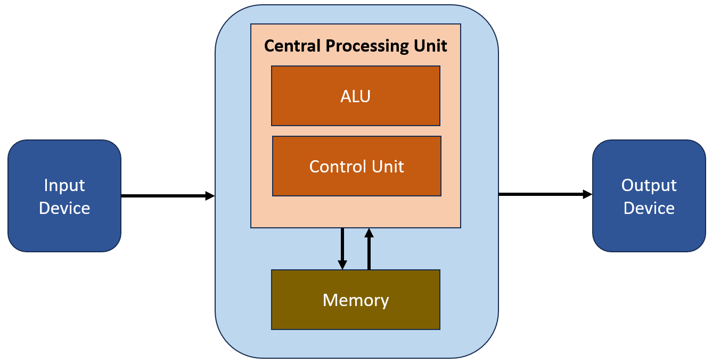
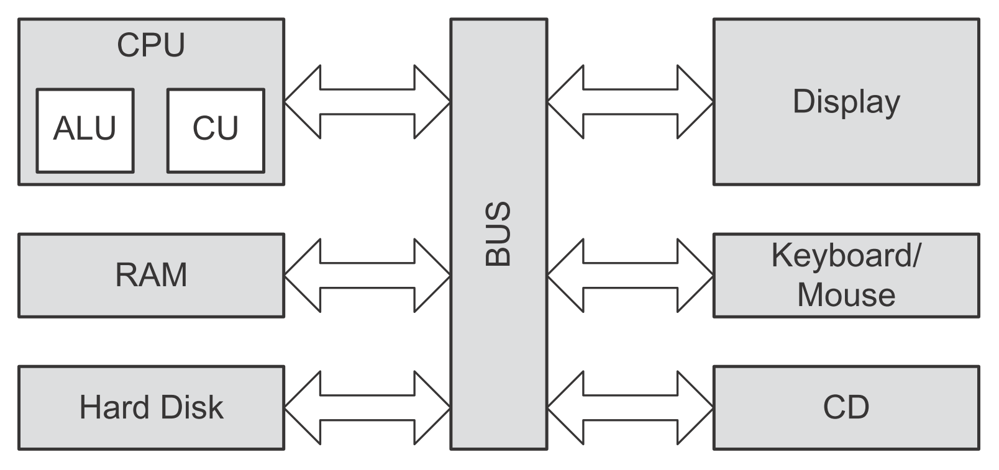
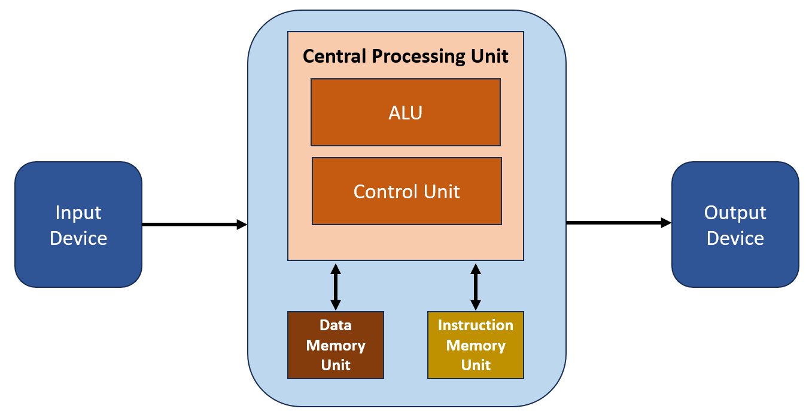
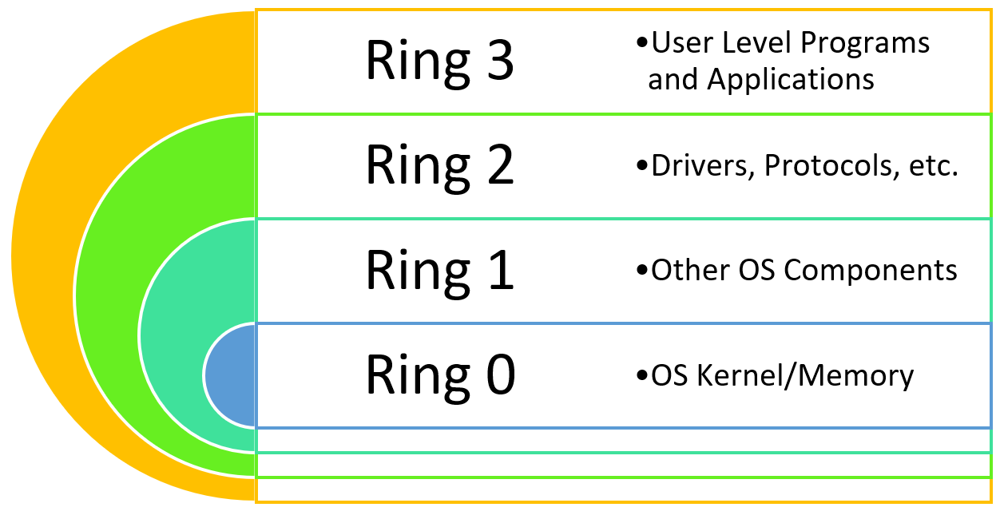
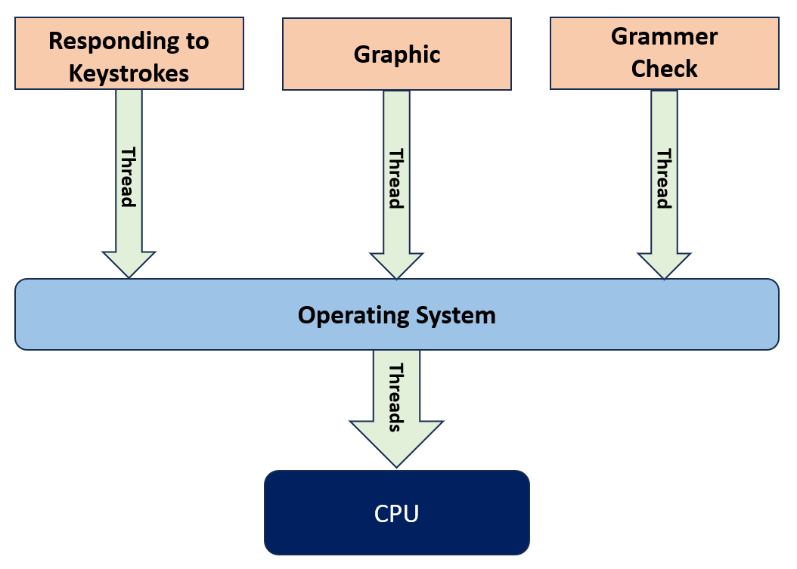
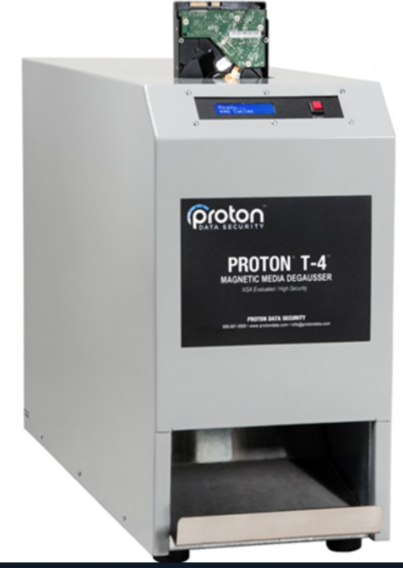
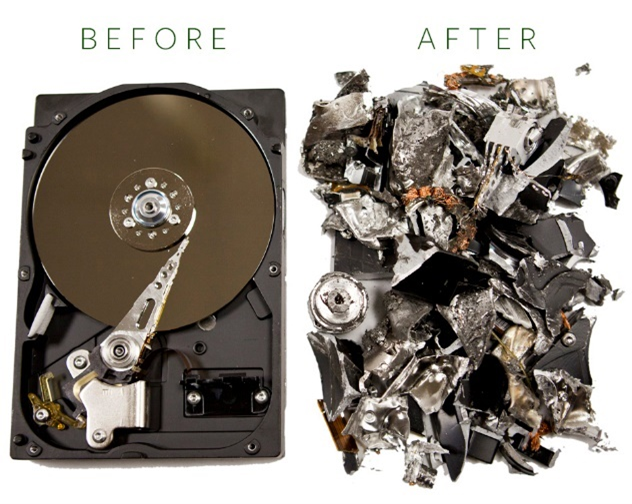
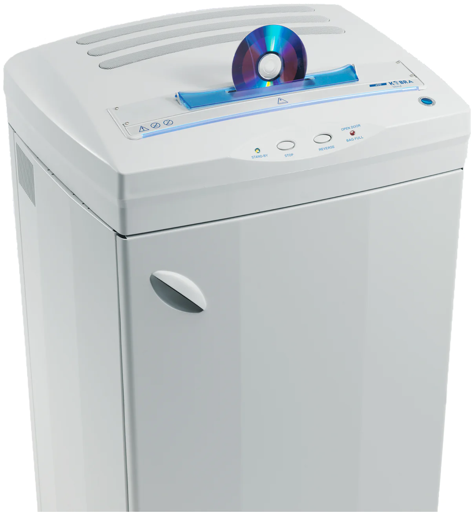
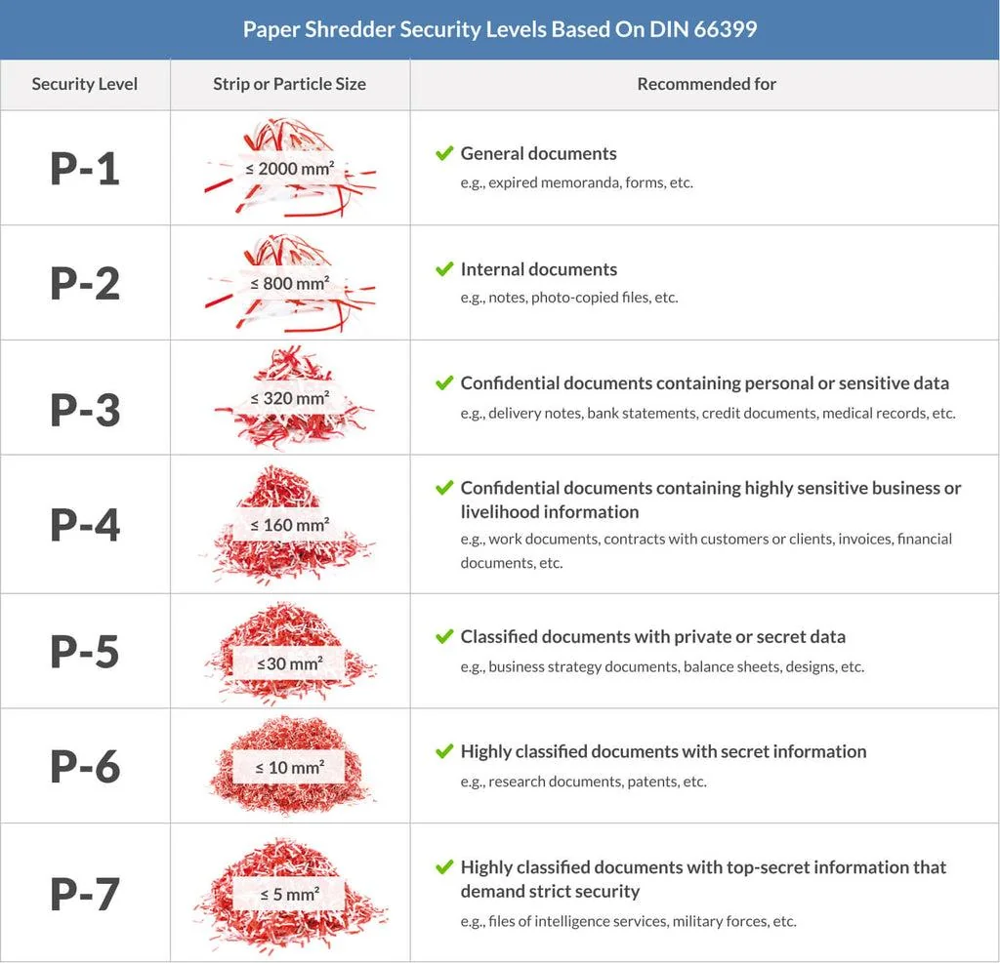

## Modèles d’Architecture Informatique
- Les systèmes informatiques modernes reposent sur plusieurs **modèles architecturaux** qui définissent notamment :
    - organisation CPU / mémoire ;
    - circulation des données et instructions ;
    - jeu d’instructions ;
    - séparation des privilèges.
### Architecture de Von Neumann
- L'architecture de Von Neumann est un modèle d'architecture informatique qui établit les principes de conception de base des ordinateurs modernes.
- Ce modèle de base a jeté les fondations de la conception des ordinateurs modernes et est encore largement utilisé aujourd'hui.
- Modèle fondamental proposé en **1945**.
- Selon ce modèle, une architecture informatique de base se compose : 
	- d'une unité de traitement centrale (**CPU**) ;
	- d'une structure de mémoire qui collecte les données ;
    - périphériques d’entrée/sortie ;
    - bus permettant les communications.
```
Input / Output
      ↕
     CPU
      ↕
    Memory
```
#### CPU — Central Processing Unit
- Le CPU est l'unité de traitement centrale de l'architecture de Von Neumann et des systèmes informatiques.
- Lit les instructions depuis la mémoire.
- Les interprète et traite les données.
- Il comprend deux composants fondamentaux :
```
CPU
├─ ALU → Arithmetic Logic Unit
└─ CU  → Control Unit
```
- **ALU** → opérations arithmétiques et logiques.
- **CU** → contrôle et coordination de l’exécution.

#### Memory
- Dans l’architecture Von Neumann :
	- **instructions et données utilisent la même mémoire** ;
	- La mémoire sert à la fois pour les instructions et les données, permettant le stockage simultané des programmes et des données ;
	- le CPU lit et écrit dans cette mémoire.
```
Memory
├─ Instructions
└─ Data
```
- C’est la caractéristique principale à retenir pour la comparaison avec Harvard.
#### Instruction Set
- Ensemble des instructions que le processeur peut comprendre et exécuter.
- Ces instructions sont lues depuis la mémoire, interprétées et exécutées par le processeur.
Exemples conceptuels :
```
LOAD
STORE
ADD
SUB
JUMP
```
```
Memory → Fetch Instruction → Decode → Execute
```
#### Data Bus & Address Bus
- **Data Bus** → permet de transporter les données à l'intérieur de l'ordinateur.
- **Address Bus** → transporte les adresses, et les instructions, indiquant où lire/écrire en mémoire.
```
Data Bus    → quoi ?
Address Bus → où ?
```


#### Input / Output Devices
- Permettent au système de communiquer avec l’extérieur :
	- keyboard ;
	- mouse ;
	- monitor ;
	- printer ;
	- périphériques externes.
### Architecture Harvard
- L'architecture Harvard, tout comme l'architecture de Von Neumann, est un modèle qui définit l'architecture informatique de base.
- Bien qu'elle soit basée sur l'architecture de Von Neumann en termes de conception, elle propose quelques améliorations.
- L'architecture Harvard a favorisé le développement d'un modèle plus rapide et plus efficace grâce à ses améliorations par rapport à l'architecture de Von Neumann.
- La principale différence avec Von Neumann est la **séparation entre mémoire des instructions et mémoire des données**. Les grandes différences sont : 

#### Memory Management
- L'architecture Harvard propose une structure dans laquelle les données et les instructions sont stockées dans des mémoires physiques séparées.
- Elle facilite un accès rapide à diverses données grâce à deux mémoires distinctes : la mémoire de données et la mémoire d'instructions.
```
Von Neumann
→ Instructions + Data = même mémoire

Harvard
→ Instruction Memory ≠ Data Memory
```
→ chaque type peut avoir son propre chemin d’accès.
#### Speed et Performance
- Les différentes structures de mémoire proposées dans le cadre de l'architecture Harvard permettent de traiter simultanément les instructions et les données, ce qui augmente la vitesse du processeur.
- Cette séparation permet :
	- accès simultané aux instructions et aux données ;
	- réduction de certains conflits d’accès mémoire ;
	- meilleures performances dans certains systèmes.

> Complément : beaucoup de processeurs modernes utilisent une **Modified Harvard Architecture** : espace mémoire globalement unifié, mais caches séparés pour instructions et données (`I-Cache` / `D-Cache`).

#### Parallel Processing
- L'architecture Harvard propose des chemins et des unités de traitement séparés pour les instructions et les données.
- Cela facilite le traitement parallèle et permet au processeur de fonctionner plus rapidement.
#### Von Neumann vs Harvard

|                           | Von Neumann            | Harvard                             |
| ------------------------- | ---------------------- | ----------------------------------- |
| Mémoire instructions/data | Commune                | Séparée                             |
| Bus / chemins             | Souvent partagés       | Séparés                             |
| Accès simultané           | Plus limité            | Plus facile                         |
| Complexité                | Plus simple            | Plus complexe                       |
| Performance potentielle   | Limitée par le partage | Plus élevée dans certains workloads |


```
Von Neumann → shared instructions/data path
Harvard     → separate instructions/data paths
```
### Instruction Set Architecture — ISA
- Une **ISA** définit définit les instructions des systèmes informatiques, leur fonctionnalité et leur mode de fonctionnement
- Elle détermine l'interaction entre le processeur (CPU) et le logiciel :
	- instructions disponibles ;
	- registres ;
	- types de données ;
	- modes d’adressage ;
	- comportement des instructions.

```
Software
   ↓
  ISA
   ↓
CPU Hardware
```
> L’ISA n’est pas une alternative à Von Neumann ou Harvard : elle décrit surtout **ce que le processeur expose au logiciel**. C'est une approche architecturale qui modélise le traitement des jeux d'instructions au sein des architectures basées sur elles.

- Deux grandes familles classiques :
```
ISA
├─ CISC
└─ RISC
```
#### CISC — Complex Instruction Set Computer
- L'architecture CISC (Ordinateur à jeu d'instructions complexe) Offre plus de généralité et de flexibilité dans le traitement d'une grande variété d'instructions.
- Architecture est utilisée dans les processeurs des ordinateurs modernes à usage général :
	- (**Intel x86**, etc.).
- Jeu d’instructions riche et complexe.
- Une instruction peut effectuer plusieurs opérations.
##### Caractéristiques
- Jeu d'instruction complexe : emploie un jeu d'instructions contenant un large éventail d'instructions complexes, qui englobent de multiples opérations et exécutent diverses tâches en une seule instruction.
- Utilisation réduite des registres : utilisent généralement moins de registres de processeur et certaines des instructions opèrent en mémoire. Cela peut entraîner des accès fréquents à la mémoire.
- Modes d'adressage complexes : peuvent avoir des modes d'adressage complexes, rendant l'accès à la mémoire plus flexible et complexe.
- Dépendances de haut niveau : peuvent être interdépendantes, nécessitant un traitement séquentiel des instructions. Cela peut parfois amener les processeurs à prendre plus de temps.
- Exemple conceptuel :
```
Instruction complexe
→ Load
→ Calculate
→ Store
```
#### RISC — Reduced Instruction Set Computer
- L'architecture RISC (Ordinateur à jeu d'instructions réduit) est particulièrement privilégiée pour les ordinateurs à haute performance et les appareils mobiles. Exemples :
    - **ARM** ;
    - **PowerPC**.
- Jeu d’instructions plus simple et généralement plus régulier.
- Les opérations utilisent fortement les **registers**.
##### Caractéristiques
- instructions simples : utilise un jeu d'instructions limité et simple. Chaque instruction est conçue pour effectuer une opération de base.
- davantage de registres : utilisent généralement plus de registres de processeur et opèrent les instructions sur ces registres. Cela réduit l'accès à la mémoire.
- modes d’adressage plus simples : ont des modes d'accès à la mémoire simples et directs, ce qui rend l'accès à la mémoire plus rapide et plus cohérent.
- moins de dépendances : ne dépendent généralement pas les unes des autres, et les processeurs peuvent traiter les instructions de manière plus indépendante.
```
RISC
→ simple instructions
→ register-oriented
→ predictable execution
```
#### CISC vs RISC

|CISC|RISC|
|---|---|
|Instructions plus complexes|Instructions plus simples|
|Nombreux modes d’adressage|Modes plus simples|
|Peut opérer directement en mémoire|Beaucoup d’opérations via registres|
|Exemple : x86-64|Exemple : ARM|

> Aujourd’hui, la frontière est moins stricte : les processeurs modernes combinent de nombreuses optimisations internes. Un CPU x86 peut par exemple traduire certaines instructions complexes en **micro-operations** plus simples.
### Architecture en anneaux - Protection Ring Architecture
- Les **Protection Rings** séparent le code selon son niveau de privilège.
- Plus le numéro est proche de `0`, plus les privilèges sont élevés.

#### Ring 0
- Niveau le plus privilégié.
- Généralement utilisé par :
    - kernel ;
    - composants noyau ;
    - drivers exécutés en kernel mode.
- Peut accéder directement à :
	- mémoire ;
	- CPU ;
	- périphériques ;
	- ressources système critiques.
```
Ring 0
→ Kernel Mode
→ Full privileges
```
- Une compromission en Ring 0 est donc particulièrement critique.
#### Rings 1 & 2
- Ils existent dans l’architecture x86 mais sont **rarement utilisés par les OS modernes généralistes**.
- Windows et Linux utilisent principalement :
```
Ring 0 → Kernel
Ring 3 → User applications
```
> ⚠️ Le cours inverse/confond ici certains rôles : **Ring 3 est bien un niveau de privilège matériel x86 et correspond normalement au user mode**. Les Rings 1 et 2 sont généralement inutilisés dans Windows/Linux modernes. Le passage indiquant que Ring 2 contient les applications et que Ring 3 « n’est pas réellement un anneau matériel » est donc incorrect.
#### Ring 3
- Niveau où s’exécutent généralement les **applications utilisateur**.
- Les programmes n’accèdent pas directement aux ressources privilégiées.
```
Application
   ↓
Ring 3
   ↓ System Call
Kernel
   ↓
Ring 0
```
- Pour effectuer une opération privilégiée, une application doit passer par les mécanismes contrôlés du système d’exploitation.
#### Intérêt sécurité des Rings
- La séparation des privilèges limite ce qu’un programme compromis peut faire.
```
Malware en Ring 3
→ accès limité

Privilege Escalation
→ Ring 0
→ contrôle beaucoup plus important du système
```
- Un processus utilisateur compromis **ne peut pas simplement accéder au kernel** : il doit exploiter une vulnérabilité, obtenir des privilèges supplémentaires ou utiliser une interface autorisée.

## À retenir

```
Von Neumann
→ Instructions + Data dans la même mémoire

Harvard
→ Instructions et Data séparées
```

```
ISA
→ interface CPU ↔ software

CISC → instructions plus complexes
RISC → instructions plus simples
```

```
Protection Rings

Ring 0 → Kernel / highest privilege
Ring 3 → User Mode / lowest privilege
```

Le point sécurité essentiel est la **séparation des privilèges** : une application utilisateur s’exécute normalement dans un contexte limité, tandis que le kernel dispose d’un accès beaucoup plus puissant au système.

## CPU et Types d’Exécution

### Microprocesseur / CPU et structure— Central Processing Unit
- Le **CPU** est l’unité centrale chargée d’exécuter directement les calculs complexes qui permettent aux systèmes informatiques d'accomplir les tâches pour lesquelles ils sont prévus.
- Bien que les CPU soient des structures assez complexes, 3 composants forment leur structure de base :
    - **ALU** ;
    - Unité de contrôle / **Control Unit (CU)** ;
    - Registres / **Registers**.

```
CPU
├─ ALU
├─ Control Unit
└─ Registers
```


> ⚠️ Un **CPU** et un **microprocesseur** sont souvent assimilés dans les PC modernes, mais ce ne sont pas strictement des synonymes : un microprocesseur est une implémentation du CPU sur un circuit intégré.
#### ALU — Arithmetic Logic Unit / Unité Arithmétique et Logique
- Sous-système d'un processeur qui effectue les opérations mathématiques et logiques de base.
- L'élément de base de tous les processeurs, de ceux qui effectuent les opérations les plus simples aux systèmes informatiques les plus complexes.
- L'ALU se compose de deux parties principales :
	- **Arithmetic Unit** - Unité arithmétique : Effectue des opérations arithmétiques telles que l'addition, la soustraction, la multiplication et la division.
	- **Logic Unit** - : Effectue des opérations logiques comme : AND, OR, NOT, XOR
→ l’ALU constitue une partie essentielle de l’exécution des instructions.
#### CU - Control Unit / Unité de Contrôle
- La CU récupère les instructions de la mémoire, les envoie à l'ALU et retransmet les résultats à la mémoire pendant le fonctionnement du processeur.
- En résumé, elle agit comme un pont entre le CPU et la mémoire.
```
Fetch
→ Decode
→ Execute
```
- Responsabilités principales :
	- `Lecture et interprétation des instructions` :  La CU reçoit les instructions de la mémoire et les interprète. Cela implique de déterminer la fonction de l'instruction.
	- `Exécution des instructions :` La CU envoie les instructions à l'ALU. L'ALU les exécute et renvoie les résultats à la CU.
	- `Ordonnancement des instructions :` La CU met les instructions en ordre. Cela garantit qu'elles sont exécutées dans le bon ordre.
	- `Interruption des instructions :` La CU peut interrompre les instructions. Cela permet au CPU d'exécuter une autre tâche.

> La CU ne « renvoie » pas systématiquement elle-même chaque résultat en mémoire : elle **contrôle et coordonne** les unités qui réalisent les opérations.
#### Registers — Registres
- Petites zones de mémoire **très rapides**, directement intégrées au CPU.
- Ils contiennent les données et les adresses que le CPU utilise pour exécuter les instructions.
- Utilisées pour conserver temporairement :
    - données ;
    - adresses ;
    - résultats intermédiaires ;
    - informations nécessaires à l’exécution.
```
Registers
→ très petits
→ très rapides
→ directement accessibles par le CPU
```
- Ils réduisent le nombre d’accès nécessaires à la RAM.
- Exemples courants de registres selon l’architecture :
	- registres généraux ;
	- **Program Counter / Instruction Pointer** ;
	- **Stack Pointer** ;
	- registres de flags/status.
> ⚠️ Dire qu’un CPU 32 bits possède uniquement des registres de 32 bits est une simplification. La taille des registres dépend de l’ISA et du type de registre.
### Types d’Exécution du CPU
Les systèmes peuvent organiser l’exécution des tâches de plusieurs manières :
```
Multiprocessing
Multitasking
Multiprogramming
Multithreading
```
#### Multiprocessing — Multitraitement

- Utilisation de **plusieurs processeurs ou plusieurs unités de traitement** (coeurs) pour exécuter plusieurs travaux.
- Permet une véritable exécution parallèle si plusieurs CPU/cores sont disponibles.
```
CPU/Core 1 → Task A
CPU/Core 2 → Task B
CPU/Core 3 → Task C
```
- Avantages :
	- parallélisme ;
	- meilleures performances ;
	- meilleure capacité à traiter plusieurs workloads simultanément.
- Aujourd’hui, les processeurs multicœurs rendent ce modèle très courant.
- en pratique moderne, le terme _multiprocessing_ peut aussi désigner l'utilisation de **plusieurs unités d'exécution CPU**, donc plusieurs cœurs. Il faut distinguer trois niveaux :

|Terme|Exemple|Physiquement|
|---|---|---|
|**CPU / socket**|2 × AMD EPYC|2 processeurs physiques|
|**Core / cœur**|8 cœurs par CPU|plusieurs cœurs dans un même processeur|
|**Thread logique**|SMT / Hyper-Threading|plusieurs CPU logiques par cœur|
- Cas 1 — plusieurs processeurs physiques : Historiquement, le multiprocessing ressemblait surtout à ça :
	- Deux processeurs physiques travaillent en parallèle. C'est ce qu'on appelle typiquement un système **multiprocesseur**, souvent avec une architecture **SMP** (_Symmetric Multiprocessing_).
```
Carte mère
 ├── CPU 1
 │    └── Core
 └── CPU 2
      └── Core
```
- Cas 2 — un seul CPU avec plusieurs cœurs : Aujourd'hui, beaucoup de machines sont plutôt :
	- Il n'y a qu'**un seul processeur physique**, mais quatre cœurs capables d'exécuter du travail en parallèle.
	- Du point de vue du système d'exploitation, cela permet quand même du **multiprocessing parallèle**.
	- C'est pourquoi l'expression « plusieurs processeurs » est un peu ambiguë.
```
CPU physique
 ├── Core 0
 ├── Core 1
 ├── Core 2
 └── Core 3
```
- Et avec **Hyper-Threading** / **SMT**. Ça peut encore se compliquer :
```
1 CPU physique
│
├── Core 0
│   ├── Thread logique 0
│   └── Thread logique 1
│
├── Core 1
│   ├── Thread logique 2
│   └── Thread logique 3
│
├── Core 2
│   ├── Thread logique 4
│   └── Thread logique 5
│
└── Core 3
    ├── Thread logique 6
    └── Thread logique 7
```
- Donc la machine peut avoir :
	- **1 socket CPU**
	- **4 cœurs physiques**
	- **2 threads par cœur**
	- donc **8 CPU logiques**
#### Multitasking — Multitâche
- Capacité d’un OS à faire progresser **plusieurs tâches/processus** de façon concurrente.
- Chaque processus possède généralement son propre :
	- espace mémoire virtuel ;
	- contexte d’exécution ;
	- ressources.
		- ce qui entraîne une augmentation des besoins en mémoire.
- Exemple :
```
Word
Excel
Browser
Media Player
```
- Sur un seul cœur :
```
Task A
→ Task B
→ Task C
→ Task A
```
- Le scheduler attribue de courts intervalles de CPU à chaque tâche, créant l’impression de simultanéité.
> ⚠️ Le multitasking n’est pas limité à **un seul cœur**. Sur un système multicœur, plusieurs tâches peuvent aussi être exécutées réellement en parallèle.
#### Multiprogramming — Multiprogrammation
- Technique consistant à conserver **plusieurs programmes en mémoire** afin que le CPU puisse en exécuter un autre lorsqu’un programme attend une ressource, notamment une opération I/O.
- Exemple :
```
Program A → attend le disque
              ↓
CPU exécute Program B
```
- Objectif principal :
```
Garder le CPU occupé
→ améliorer l'utilisation des ressources
```
- Historiquement très utilisée dans les systèmes mainframe et batch.
> ⚠️ La différence avec le multitasking n’est pas simplement « mainframe vs PC » ou « application spécifique vs OS courant ». Le **multiprogramming** vise surtout à maximiser l’utilisation du CPU, tandis que le **multitasking** ajoute généralement une logique de partage du temps et de réactivité pour plusieurs tâches.
#### Multithreading

- Le multithreading, au-delà de l'exécution parallèle de multiples processus ou tâches, est le concept d'exécuter en parallèle plusieurs opérations au sein d'une même tâche.
- Un **processus** peut contenir plusieurs **threads**.
- Les threads représentent différents flux d’exécution au sein de la même application.
```
Process
├─ Thread 1
├─ Thread 2
└─ Thread 3
```
- Exemple avec un traitement de texte :
```
Thread 1 → saisie utilisateur
Thread 2 → spell checking
Thread 3 → autosave
```
- Les threads d’un même processus partagent généralement :
	- espace mémoire ;
	- code ;
	- certaines ressources.
- Mais disposent notamment de leur propre :
	- stack ;
	- état d’exécution ;
	- registres CPU lorsqu’ils sont planifiés.

> ⚠️ Le multithreading permet la **concurrence** ; il devient réellement parallèle lorsque plusieurs threads sont exécutés simultanément sur plusieurs cores.
### Process vs Thread

|Process|Thread|
|---|---|
|Instance d’un programme|Flux d’exécution dans un processus|
|Espace mémoire généralement isolé|Partage la mémoire du processus|
|Plus lourd à créer|Plus léger|
|Communication plus contrôlée|Partage de données plus direct|

```
Process
→ container de ressources

Thread
→ unité d'exécution
```
### Multitasking vs Multiprocessing vs Multithreading

| Concept              | Principe                                                         |
| -------------------- | ---------------------------------------------------------------- |
| **Multitasking**     | Plusieurs tâches progressent dans le temps                       |
| **Multiprocessing**  | Plusieurs CPU/cores exécutent plusieurs travaux                  |
| **Multiprogramming** | Plusieurs programmes en mémoire pour maximiser l’utilisation CPU |
| **Multithreading**   | Plusieurs flux d’exécution dans un même processus                |

```
Multitasking
→ plusieurs tâches

Multiprocessing
→ plusieurs unités de calcul

Multithreading
→ plusieurs threads dans un process
```
### À retenir

```
CPU
├─ ALU → calculs / logique
├─ CU  → coordination de l'exécution
└─ Registers → stockage ultra-rapide
```

```
Fetch
→ Decode
→ Execute
```

```
Multiprocessing → parallélisme entre CPU/cores
Multitasking    → plusieurs tâches concurrentes
Multiprogramming → maintenir le CPU occupé
Multithreading  → plusieurs threads dans un processus
```

Le point important est de distinguer **concurrence** et **parallélisme** : plusieurs tâches peuvent progresser de façon concurrente sans forcément être exécutées exactement au même instant.

## Structures de CPU Spécifiques aux Applications
- Les CPU sont le composant exécutif de base de tous les systèmes informatiques, en particulier des PC et des systèmes de serveurs.
- Les CPU sont également développés et utilisés sous diverses formes en fonction d'exigences spécifiques.
- Tous les systèmes n’utilisent pas un CPU généraliste comme ceux des PC/serveurs. Selon les besoins, on utilise aussi des architectures spécialisées :
```
Microcontrôleur
FPGA
ASIC
```
- Le choix dépend notamment de :
	- performance ;
	- consommation ;
	- coût ;
	- flexibilité ;
	- capacité de reprogrammation ;
	- usage prévu.
### Microcontrôleur — MCU
- Un **microcontrôleur** regroupe dans un même circuit intégré :
    - CPU ;
    - mémoire ;
    - ports I/O ;
    - timers / counters ;
    - parfois interfaces de communication.
```
Microcontroller
├─ CPU
├─ RAM / Flash
├─ GPIO
├─ Timers
└─ Communication Interfaces
```
#### Caractéristiques
- faible consommation ;
- faible coût ;
- petite taille ;
- programmable ;
- conçu généralement pour une tâche spécifique.
Le logiciel embarqué est souvent appelé **firmware**.
```
Hardware
+
Firmware
→ Embedded Device
```
#### Domaines d’utilisation
Les microcontrôleurs sont très présents dans les **Systèmes embarqués** :
- IoT ;
- automobile ;
- dispositifs médicaux ;
- équipements industriels ;
- appareils électroniques.
- Exemples de familles :
	- PIC12 / PIC16 / PIC18 / PIC32 ;
	- MSP430 ;
	- STM32 ;
	- NXP LPC / S32K ;
	- Renesas RA / RX.
#### Limites
- Généralement moins puissants qu’un CPU généraliste moderne.
	- Cette structure flexible entraîne une perte de vitesse et de performance par rapport aux CPU.
	- Peuvent pas être utilisés dans des environnements qui nécessitent grande puissance de traitement.
- Optimisés pour :
    - contrôle ;
    - faible consommation ;
    - temps réel ;
    - tâches spécifiques,
plutôt que pour exécuter des workloads lourds de PC ou serveur.
> En sécurité, les microcontrôleurs sont importants car une vulnérabilité dans le **firmware** peut compromettre directement un équipement embarqué ou IoT.
### FPGA — Field-Programmable Gate Array
- Un **FPGA** est un circuit intégré contenant des blocs logiques et interconnexions **reconfigurables**.
- Contrairement à un microcontrôleur, on ne programme pas seulement le logiciel exécuté : on peut modifier la **logique matérielle elle-même**.
```
Microcontroller
→ hardware fixe
→ software programmable

FPGA
→ logique hardware reconfigurable
```
#### Programmation
- Les FPGA sont généralement décrits avec des **Hardware Description Languages (HDL)** :
	- Verilog ;
	- VHDL.
```
VHDL / Verilog
→ Hardware Description
→ Synthesis
→ FPGA Configuration
```
- Ils permettent de créer :
	- circuits logiques spécifiques ;
	- accélérateurs ;
	- interfaces matérielles ;
	- parfois un processeur soft-core.
#### Caractéristiques
- Avantages :
	- forte parallélisation ;
	- haute performance sur certains traitements ;
	- reprogrammable ;
	- architecture personnalisable.
- Inconvénients :
	- coûts plus élevés que les microcontrôleurs, tant en termes d'acquisition que de mise en œuvre ;
	- développement plus complexe ;
	- besoin de compétences hardware/HDL.
#### Domaines d’utilisation
- systèmes militaires ;
- satellites ;
- systèmes de traitement du signal nécessitant une grande vitesse ;
- télécommunications ;
- traitement du signal ;
- accélération matérielle ;
- applications nécessitant une faible latence.
Fournisseurs cités :
- Xilinx ;
- Lattice Semiconductor ;
- Intel / Altera ;
- Microchip ;
- QuickLogic.
> Xilinx appartient aujourd’hui à **AMD**, mais le nom Xilinx reste très présent dans l’écosystème FPGA.
### ASIC — Application-Specific Integrated Circuit
- Un **ASIC** est un circuit intégré conçu pour une **fonction précise**.
- Contrairement au FPGA, sa logique est essentiellement fixée lors de la fabrication.
```
FPGA
→ reconfigurable après fabrication

ASIC
→ architecture fixée à la fabrication
```
#### Caractéristiques
Les ASIC sont optimisés pour une tâche particulière, ce qui permet généralement :
- performances élevées ;
- faible consommation ;
- faible latence ;
- meilleure efficacité pour la fonction ciblée.
Mais :
- conception complexe ;
- coût initial très élevé ;
- fabrication longue ;
- erreurs de design difficiles ou impossibles à corriger après production.
```
ASIC
→ High Development Cost
→ High Efficiency
→ Low Flexibility
```
#### Domaines d’utilisation
Les ASIC peuvent être utilisés dans :
- smart cards ;
- cartes bancaires ;
- passeports électroniques ;
- équipements réseau ;
- accélérateurs cryptographiques ;
- hardware spécialisé.
> Une **smart card** peut contenir un circuit spécialisé avec CPU, mémoire et fonctions cryptographiques ; ce n’est pas forcément un ASIC « simple » au sens strict.
### Comparaison MCU / FPGA / ASIC

|               | Microcontrôleur      | FPGA                     | ASIC                             |
| ------------- | -------------------- | ------------------------ | -------------------------------- |
| Hardware      | Fixe                 | Reconfigurable           | Fixe                             |
| Programmation | Firmware/software    | HDL / logique matérielle | Conception avant fabrication     |
| Flexibilité   | Élevée côté software | Très élevée              | Faible                           |
| Performance   | Modérée              | Élevée selon usage       | Très élevée                      |
| Consommation  | Faible               | Variable                 | Très optimisée                   |
| Coût initial  | Faible               | Moyen / élevé            | Très élevé                       |
| Usage         | Embedded / IoT       | Traitement spécialisé    | Fonction dédiée à grande échelle |


```
MCU
→ flexible par software

FPGA
→ flexible par hardware

ASIC
→ optimisé pour une fonction fixe
```
### Vue sécurité

Ces composants peuvent présenter des surfaces d’attaque différentes :
#### MCU
- firmware vulnérable ;
- debug interfaces ;
- insecure boot ;
- extraction de firmware.
#### FPGA
- bitstream exposé ;
- configuration malveillante ;
- protection insuffisante de la logique.
#### ASIC
- vulnérabilité matérielle difficile à corriger ;
- backdoor hardware ;
- erreurs de conception permanentes.
```
Plus le hardware est fixe
→ plus une erreur de conception peut être difficile à corriger
```

## Rémanence des et assainissement des données
- Lorsqu'une donnée est supprimée, elle peut parfois rester partiellement ou totalement récupérable sur le support.
- Deux concepts sont donc importants :
	- Data Remanence -> persistance de données après suppression ;
	- Data Sanitization -> suppression sécurisée et permanente des données sensibles.

```
Delete ≠ Data Gone

Data Remanence
→ données encore récupérables

Data Sanitization
→ rendre les données irrécupérables
```
### Mémoire volatile 
- Les mémoires volatiles comme : 
	- RAM ;
	- Cache ;
- Perdent normalement leur contenu lorsque l'alimentation est coupée.
	- Cependant, il existe une attaque spécifique : **Cold boot Attack**
#### Cold boot attack
- Exploite le fait que les données présentes en RAM ne disparaissent pas toujours instantanément après coupure d'alimentation.
- Le refroidissement de la mémoire peut ralentir la disparition des données et permettre leur extraction.
- Principe :
```
System running
→ sensitive data in RAM
→ RAM cooled
→ power removed / RAM moved
→ memory contents extracted
```

- Pendant l’exécution d’un système, certaines données sensibles peuvent être présentes temporairement en mémoire, parfois sous une forme directement exploitable :
	- clés cryptographiques ;
	- credentials ;
	- secrets applicatifs ;
	- données déchiffrées.
> ⚠️ Le cours simplifie en parlant de données « gelées » dans la RAM. Le refroidissement **ralentit la dégradation électrique des bits**, il ne fige pas littéralement les données.
##### Protections
- éteindre complètement les systèmes lorsqu’ils se trouvent dans un environnement physiquement non sécurisé ;
- utiliser des protections mémoire adaptées sur les systèmes critiques.
Compléments utiles :
- full shutdown plutôt que sleep ;
- Secure Boot ;
- full-disk encryption ;
- limitation de l’accès physique ;
- memory encryption lorsque le hardware le supporte.
> Le chiffrement de disque ne protège pas forcément les clés déjà chargées dans la RAM lorsque le système fonctionne.
### Mémoire non volatile
- Les HDD, SSD, Flash, EEPROM, EFROM, ROM... peuvent conserver des données sans alimentation.
- Pour les assainir :
	- Clear / Delete ;
	- Overwrite ;
	- Degauss ;
	- Destroy.
#### Suppression / Reformatage
- Une suppression classique ou un formatage peut simplement retirer les références logiques aux données.
- Les données peuvent donc rester récupérables avec des outils spécialisés.
#### Overwriting - Réécriture
- Consiste à écraser les données avec : 
	- 0 ;
	- 1 ;
	- valeurs aléatoires.
- Le cours cite des outils comme :
	- BitRaser ;
	- BitWiper ;
	- CCleaner ;
	- DBAN.
> ⚠️ L’overwriting fonctionne bien sur les **HDD**, mais est moins fiable sur les **SSD/Flash** à cause du wear leveling et des blocs remappés. Pour ces supports, il vaut mieux utiliser les commandes de **secure erase / sanitize** prévues par le constructeur ou le standard du périphérique.
#### Degaussing - Démagnétisation 
- Détruit ou neutralise les données en perturbant le champ magnétique du support.
- Adapté aux supports magnétiques comme :
	- HDD ;
	- Bandes magnétiques.
- Avantages :
	- très efficace ;
	- utile même lorsqu’un disque n’est plus accessible logiciellement.
- Inconvénient :
	- le support peut devenir inutilisable.
> Le degaussing **ne fonctionne pas sur SSD/Flash**, car ces supports ne stockent pas les données magnétiquement.

### Destruction physique
- Pour les données très sensibles ou lorsque le support est inutilisable, la destruction physique peut être nécessaire.
- Cas typiques :
	- disque défectueux ;
	- secure erase impossible ;
	- support destiné à ne jamais être réutilisé ;
	- données de très haute sensibilité.
- Supports concernés :
	- - HDD ;
	- SSD ;
	- Flash ;
	- ROM ;
	- EPROM / EEPROM ;
	- supports optiques.

#### ROM / EPROM / EEPROM
- **ROM** → données souvent fixes ou difficilement modifiables.
- **EPROM** → peut être effacée avec un mécanisme spécifique, historiquement UV.
- **EEPROM** → peut être effacée/reprogrammée électriquement.
Le cours souligne que, pour certains supports où l’effacement fiable est difficile ou impossible, la **destruction physique** reste la méthode la plus sûre.
### Supports optiques 
- Les CD/DVD et autres supports optiques ont des capacités d'effacement limitées selon leur type.
- Pour des données critiques, la destruction physique est souvent privilégiée. 

### NIST & Sanitization
Pour choisir une méthode d’assainissement, il faut tenir compte :
- du type de support ;
- de la sensibilité des données ;
- de la possibilité de réutiliser le support ;
- des exigences réglementaires.
Une classification utile est :
```
Clear
→ suppression logique / overwrite adapté

Purge
→ méthode plus forte : secure erase, degauss, crypto erase...

Destroy
→ destruction physique du support
```
> Cette classification est notamment utilisée dans les bonnes pratiques **NIST SP 800-88**.
### Crypto Erase
Complément particulièrement utile pour SSD et stockage chiffré :
- si toutes les données sont chiffrées avec une clé forte ;
- détruire la clé peut rendre les données restantes inutilisables.
```
Encrypted Data
+
Destroy Encryption Key
→ Crypto Erase
```
→ très rapide, à condition que le chiffrement et la gestion des clés soient correctement implémentés.
### Papier


### Comparaison des méthodes

|Méthode|HDD|SSD / Flash|Réutilisable ?|
|---|---|---|---|
|Delete / Format|⚠️ insuffisant|⚠️ insuffisant|Oui|
|Overwrite|Oui|Pas toujours fiable|Oui|
|Secure Erase / Sanitize|Oui|Oui|Oui|
|Degaussing|Oui|Non|Souvent non|
|Crypto Erase|Si chiffré|Si chiffré|Oui|
|Physical Destruction|Oui|Oui|Non|
