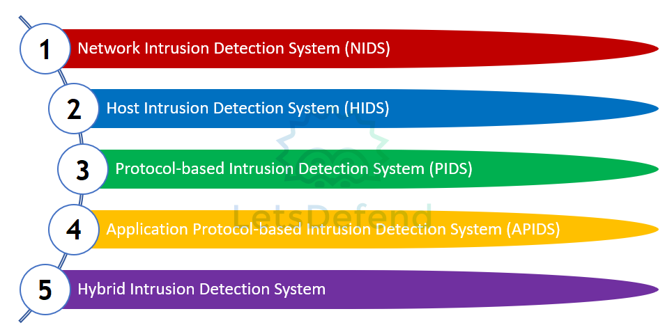
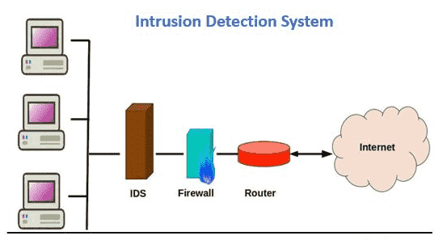
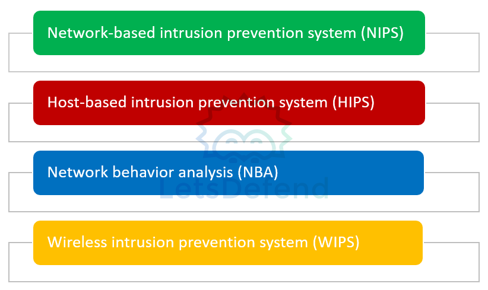
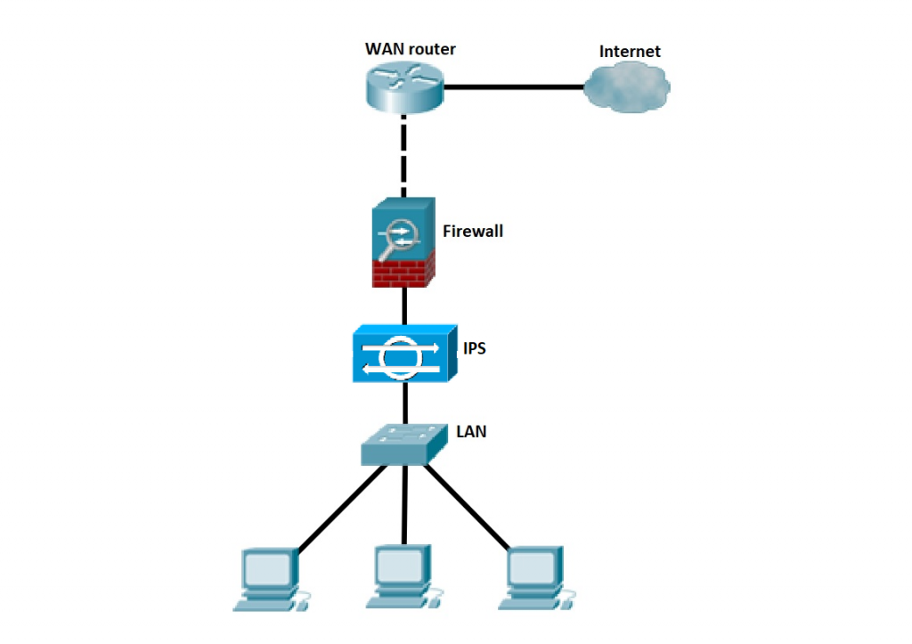
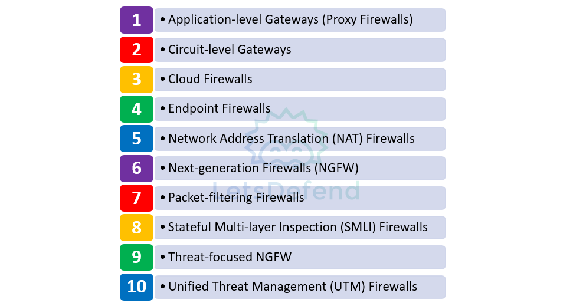
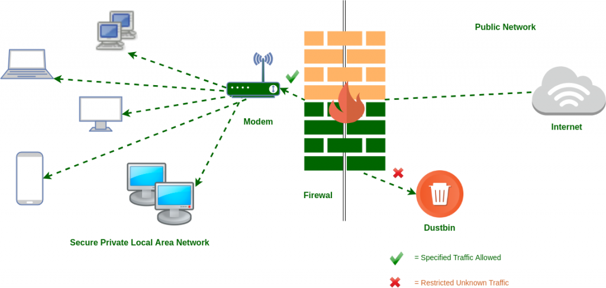
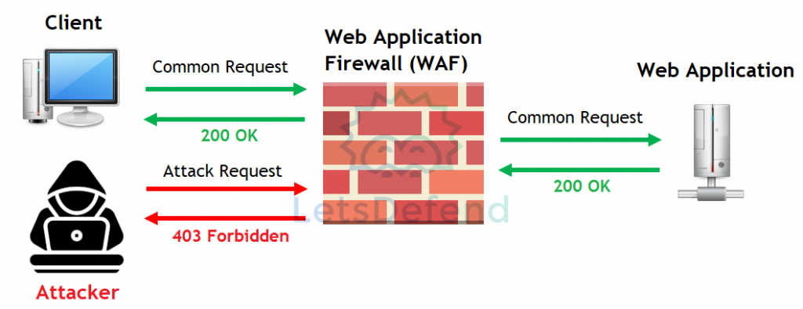
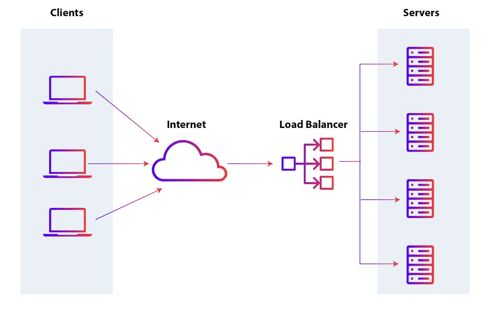
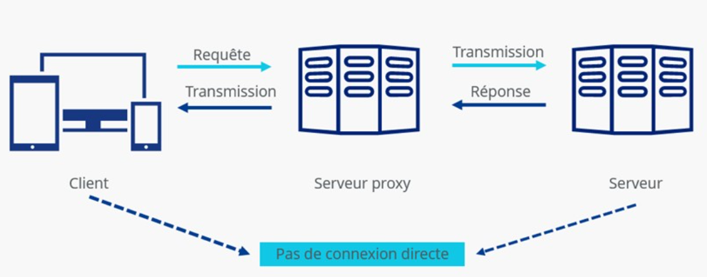

## ## Système de détection d'intrusion — IDS

### IDS — Intrusion Detection System
- Matériel ou logiciel qui **surveille un réseau ou un hôte pour détecter des comportements malveillants / violations de sécurité**.
- Lorsqu'une activité suspecte est détectée :
    - génère une alerte ;
    - informe l'administrateur / analyste ;
    - peut transmettre l'événement au **SIEM**.
- Un IDS est principalement **passif** : il détecte et alerte, mais ne bloque généralement pas directement l'attaque.

```
IDS → Detect + Alert
IPS → Detect + Block/Prevent
```
### Types d'IDS


|Type|Principe|
|---|---|
|**NIDS — Network IDS**|Surveille le **trafic réseau** afin de détecter des comportements/paquets suspects|
|**HIDS — Host IDS**|Surveille l'activité d'un **hôte spécifique**|
|**PIDS — Protocol-based IDS**|Analyse les communications selon le fonctionnement attendu d'un **protocole particulier**|
|**APIDS — Application Protocol-based IDS**|Analyse les protocoles/communications propres à une **application**|
|**Hybrid IDS**|Combine au moins deux approches de détection|

#### NIDS
- Analyse le trafic traversant une partie du réseau.
- Peut détecter :
    - scans ;
    - exploitation ;
    - signatures malveillantes ;
    - comportements réseau anormaux.
- Doit avoir une bonne visibilité sur le trafic à surveiller.
#### HIDS
- Fonctionne directement sur un endpoint/server.
- Peut surveiller :
    - logs ;
    - processus ;
    - fichiers et modifications ;
    - intégrité système ;
    - connexions réseau locales.

> Le cours le présente surtout comme analysant les paquets entrants/sortants, mais un **HIDS surveille plus largement l'activité de l'hôte**, pas uniquement son trafic réseau.

### Méthodes de détection
- La qualité d'un IDS dépend fortement de ses **règles/signatures et méthodes de détection**.
- Deux problèmes classiques :
```
Attaque non détectée
→ False Negative

Activité normale détectée comme attaque
→ False Positive
```
→ Les règles doivent être **tuned / ajustées** selon l'environnement afin de limiter le bruit sans manquer les vraies attaques.
### Fonctionnement
```
Trafic / activité hôte
        ↓
       IDS
        ↓
Règles / signatures / détection
        ↓
      Alerte
        ↓
Analyste / SIEM
```
- L'analyste examine ensuite le contexte pour déterminer si l'événement correspond réellement à une attaque.
### Positionnement d'un IDS
- L'emplacement de l'équipement IDS dans le réseau peut varier en fonction de son type.

#### NIDS
- Le NIDS doit être placé là où il peut **observer le trafic intéressant**.
- Exemples :
```
Internet
   ↓
Firewall
   ↓
[ NIDS ]
   ↓
LAN
```
- ou via un :
	- **SPAN / Mirror Port** sur un switch ;
	- **Network TAP**.
> Un NIDS n'a pas forcément besoin que le trafic « traverse » physiquement l'IDS : il peut recevoir une **copie du trafic** via SPAN/TAP.

- Points fréquents de surveillance :
	- périmètre Internet ;
	- DMZ ;
	- segments critiques ;
	- trafic inter-VLAN.
#### HIDS
- Installé directement sur les machines à protéger :
    - servers ;
    - endpoints ;
    - systèmes critiques.

```
Server
 └─ HIDS Agent
```

### Outils / solutions

|Outil|Utilisation principale|
|---|---|
|**Snort**|NIDS / IPS basé notamment sur des règles/signatures|
|**Suricata**|NIDS / IPS, analyse réseau et protocoles|
|**Zeek (Bro)**|Network Security Monitoring / analyse détaillée du trafic|
|**OSSEC**|HIDS : logs, intégrité fichiers, détection hôte|
|**Fail2Ban**|Analyse certains logs et peut bannir automatiquement des IP après comportements suspects|

> **Zeek** est davantage une plateforme de **Network Security Monitoring** qu'un IDS classique à signatures.  
> **Fail2Ban** est plutôt un mécanisme de détection + réaction basé sur les logs qu'un IDS traditionnel.
## Système de prévention d'intrusion — IPS

### IPS — Intrusion Prevention System

- Matériel ou logiciel qui **surveille un réseau ou un hôte, détecte les violations de sécurité et prend automatiquement une action pour les empêcher**.
- Contrairement à un IDS, l’IPS ne se contente pas d’alerter : il peut **bloquer l’activité malveillante**.
```
IDS → Detect + Alert
IPS → Detect + Prevent/Block
```
### Types d’IPS


|Type|Principe|
|---|---|
|**NIPS — Network IPS**|Surveille le trafic réseau et bloque les activités malveillantes|
|**HIPS — Host IPS**|Surveille et protège un **hôte spécifique**|
|**NBA — Network Behavior Analysis**|Détecte les flux réseau inhabituels, notamment certains DoS|
|**WIPS — Wireless IPS**|Surveille le trafic et les comportements suspects sur les réseaux Wi-Fi|
### Positionnement de l’IPS
- La position dépend de son type et de la zone à protéger.

#### NIPS
- Un NIPS doit pouvoir **agir directement sur le trafic** qu’il surveille.
- **Complément :** il est donc généralement placé **inline** :
```
Internet
   ↓
Firewall
   ↓
[ IPS ]
   ↓
LAN
```
Le trafic traverse l’IPS, ce qui lui permet de le bloquer directement.

#### HIPS
- installé directement sur l’endpoint/server à protéger.
```
Server
 └─ HIPS Agent
```

#### WIPS
- positionné au niveau de l’infrastructure Wi-Fi pour surveiller les activités wireless.

## Pare-feu — Firewall
### Firewall

- Matériel ou logiciel qui **surveille le trafic réseau entrant/sortant** et applique des règles pour :
    - autoriser ;
    - bloquer ;
    - journaliser les communications.
- Il constitue un point de contrôle entre différentes zones réseau.
```
Traffic → Firewall Rules → Allow / Deny
```
### Types de pare-feu



| Type                                           | Principe                                                                                                                                                                                               |
| ---------------------------------------------- | ------------------------------------------------------------------------------------------------------------------------------------------------------------------------------------------------------ |
| **Application-level Gateway / Proxy Firewall** | Analyse le trafic au niveau **applicatif** (du modèle OSI) et agit comme intermédiaire entre client et serveur                                                                                         |
| **Circuit-level Gateway**                      | Vérifie principalement les **connexions/sessions**, notamment TCP, avec peu d’analyse applicative                                                                                                      |
| **Cloud Firewall / FWaaS**                     | Firewall fourni comme **service cloud**, facilement scalable selon la charge                                                                                                                           |
| **Endpoint / Host-based Firewall**             | Installé directement sur l’hôte, filtre son trafic entrant/sortant. Par exemple, le « Windows Defender Firewall ».                                                                                     |
| **NAT Firewall**                               | Utilise la NAT pour masquer les IP internes et contrôler certains flux                                                                                                                                 |
| **NGFW — Next-Generation Firewall**            | Combine filtrage classique + **DPI** et fonctions avancées de détection, conçu pour bloquer les menaces externes, les attaques de logiciels malveillants (malware) et les méthodes d'attaque avancées. |
| **Packet Filtering Firewall**                  | Filtre selon IP, ports, protocole et règles simples                                                                                                                                                    |
| **SMLI / Stateful Inspection**                 | Suit l’**état des connexions** et vérifie notamment les sessions TCP                                                                                                                                   |
| **Threat-focused NGFW**                        | NGFW enrichi de fonctions avancées de détection/réponse aux menaces                                                                                                                                    |
| **UTM — Unified Threat Management**            | Regroupe firewall stateful + antivirus + IPS et autres fonctions de sécurité                                                                                                                           |
### Fonctionnement d’un Firewall
- Le firewall applique une suite de **règles** au trafic.
- Une règle peut se baser sur :
	- IP source ;
	- IP destination ;
	- port source ;
	- port destination ;
	- protocole ;
	- interface / zone ;
	- parfois utilisateur, application ou contenu.
- Exemple :
```
Source: VLAN Users
Destination: VLAN Finance
Port: ANY
Action: DENY
```
→ permet notamment de faire de la **segmentation réseau**.
```
Département A ─X→ Département B
```
#### Ordre des règles
- **Complément important :**
- Les règles sont généralement évaluées selon un ordre défini.
```
Rule 1 → Match ? appliquer
Rule 2 → Match ? appliquer
...
Default deny / implicit deny
```
→ une règle mal placée peut rendre une autre règle inutile ou autoriser trop de trafic.
### Firewall & Segmentation
- Le firewall peut séparer plusieurs zones :
```
Internet
   ↓
Firewall
 ├─ LAN
 ├─ DMZ
 └─ Servers
```
- Objectif :
	- limiter les communications inutiles ;
	- réduire le lateral movement ;
	- limiter l’impact d’une compromission.
### Logs Firewall
- Informations typiques :

|Champ|Utilité|
|---|---|
|**Date / Time**|Quand le flux a été observé|
|**Source IP**|Origine|
|**Destination IP**|Cible|
|**Source Port**|Port source|
|**Destination Port**|Service ciblé|
|**Action**|Allow / Deny / Drop|
|**Packets Sent**|Paquets envoyés|
|**Packets Received**|Paquets reçus|

- Exemple :
```
SRC=10.0.0.25
DST=8.8.8.8
DPT=53
PROTO=UDP
ACTION=ALLOW
```
### Positionnement

#### Firewall périmétrique
- Typiquement placé entre le réseau interne et Internet :
```
Internet
   ↓
Firewall
   ↓
IDS / IPS
   ↓
Internal Network
```
→ filtre le trafic avant son entrée dans le réseau interne.
#### Host Firewall
```
Network
   ↓
Host Firewall
   ↓
Endpoint
```
→ protège directement une machine particulière.
> Le positionnement réel peut varier : firewall, IDS/IPS, DMZ et autres équipements sont organisés selon l’architecture et les besoins de visibilité/filtrage.

## Endpoint Detection & Response — EDR
### EDR — Endpoint Detection and Response
- Produit de sécurité installé sur les **endpoints** pour :
    - surveiller en continu leur activité ;
    - détecter des menaces comme malware/ransomware ;
    - prendre des mesures de réponse ;
    - fournir des données pour l’investigation.
```
Endpoint activity
→ EDR collecte
→ analyse
→ détecte
→ répond / alerte
```
### Composants principaux

|Composant|Rôle|
|---|---|
|**Endpoint Data Collection Agent**|Collecte la télémétrie sur l’hôte|
|**Automated Response**|Exécute certaines actions automatiquement|
|**Analysis & Digital Investigation**|Permet l’analyse et l’investigation d’un incident|

### Fonctions de l’EDR
#### Monitoring / Collection
- L’EDR collecte les événements utiles à la détection :
	- processus lancés ;
	- fichiers accédés/modifiés ;
	- chemins de fichiers ;
	- hashes ;
	- relations entre processus ;
	- autres événements jugés pertinents pour la sécurité.
- Exemple :
```
winword.exe
    ↓
powershell.exe
    ↓
download malware.exe
```
→ une chaîne de processus anormale peut déclencher une alerte.
#### Behavioral Analysis
- Analyse le **comportement** observé sur l’endpoint.
- Cherche à identifier :
    - malware ;
    - ransomware ;
    - activités suspectes ;
    - comportements correspondant à un attaquant.
```
Signature connue → détection possible
Comportement anormal → détection possible même sans signature exacte
```
### Response
- Lorsqu’une menace est détectée, l’EDR peut :
	- générer une alerte ;
	- notifier l’analyste ;
	- prendre certaines mesures automatiquement.
- **Complément utile :** selon le produit, la réponse peut inclure :
	- isoler l’endpoint du réseau ;
	- tuer un processus ;
	- mettre un fichier en quarantaine ;
	- supprimer/bloquer un artefact ;
	- lancer une investigation ou collecte supplémentaire.
#### Digital Investigation
- L’EDR permet de mener une investigation approfondie directement à partir de la télémétrie de l’hôte.
- L’analyste peut notamment reconstruire :
```
Processus parent
   ↓
Processus enfant
   ↓
Fichier créé
   ↓
Connexion réseau
   ↓
Persistence
```
→ utile pour comprendre **ce qui s’est passé, comment et jusqu’où l’attaquant est allé**.
### Logs / Télémétrie EDR
- Les informations varient selon le produit, mais on retrouve souvent :

|Donnée|Exemple|
|---|---|
|**Process Name**|`powershell.exe`|
|**Process Path**|`C:\Windows\System32\...`|
|**Hash**|SHA256 du fichier|
|**File Access**|fichier lu/modifié|
|**File Size**|taille du fichier|
|**Process Execution**|programme exécuté|
|**Parent/Child Process**|relation entre processus|

- Le point fort de l’EDR est donc la **visibilité détaillée sur l’activité de l’endpoint**.
### EDR vs Antivirus
```
Antivirus
→ surtout prévention/détection malware

EDR
→ détection + télémétrie + investigation + réponse
```
- Un EDR apporte donc davantage de contexte sur :
	- comment le processus a démarré ;
	- quels fichiers ont été touchés ;
	- quels processus sont liés ;
	- quelles actions de réponse ont été prises.
> Un EDR ne remplace pas forcément l’antivirus : les solutions modernes combinent souvent plusieurs fonctions dans une même plateforme.

## Logiciel antivirus — AV
### Antivirus — AV
- Logiciel de sécurité chargé de **détecter, bloquer et supprimer les malwares** présents sur un système.
- Il analyse régulièrement les fichiers et activités afin d’identifier les menaces avant qu’elles n’endommagent l’appareil.
```
Malware détecté
→ Block / Quarantine / Delete
```
### Types d’analyse
#### Signature-Based Scanning
- Compare les fichiers analysés avec une **base de signatures de malwares connus**.
- Si une signature correspond :
    - le fichier est identifié comme malveillant ;
    - il peut être bloqué, mis en quarantaine ou supprimé.
- Très efficace contre les **malwares connus**.
- Nécessite une **mise à jour régulière de la base de signatures**.
```
File Hash / Signature
        ↓
AV Database
        ↓
Match → Malware connu
```
- Limite principale :
	- peut rater :
	    - nouveaux malwares ;
	    - variantes modifiées ;
	    - malware polymorphe ;
	    - menaces sans signature connue.
#### Heuristic Scanning
- Analyse le **comportement** du fichier plutôt que seulement sa signature.
- Cherche des actions anormales ou potentiellement malveillantes.
- Exemple :
```
Executable
→ tente de modifier un fichier système sensible
→ comportement suspect
→ alerte
```
- Intérêt :
	- peut détecter des menaces **inconnues ou modifiées** ;
	- ne dépend pas uniquement d’une signature présente dans la base.
- Limite :
```
Détection comportementale plus large
→ risque de False Positive
```
### Fonctions de l’antivirus
- analyser régulièrement le système ;
- détecter les logiciels malveillants ;
- protéger contre les menaces externes ;
- bloquer ou isoler les fichiers suspects ;
- nettoyer/supprimer les malwares détectés.
```
Scan
→ Detect
→ Block / Quarantine
→ Remove
```
### AV vs EDR

|Antivirus|EDR|
|---|---|
|Détection malware|Détection comportementale étendue|
|Signature + heuristique|Télémétrie détaillée endpoint|
|Quarantaine / suppression|Investigation + réponse|
|Centré surtout sur le malware|Centré sur l’activité complète de l’endpoint|

```
AV  → Detect / Block Malware
EDR → Monitor / Detect / Investigate / Respond
```
> Les solutions modernes peuvent intégrer les deux fonctions dans un même produit.

## Solutions de bac à sable — Sandbox
### Sandbox
- Environnement **isolé** utilisé pour exécuter/ouvrir des fichiers suspects sans exposer directement un système de production.
- Peut analyser différents types de fichiers :
    - `.exe`
    - `.pdf`
    - `.docx`
    - `.xlsx`
    - etc.
```
Fichier suspect
→ Sandbox isolée
→ exécution / ouverture
→ observation du comportement
```
### Avantages du Sandboxing
- Protège les hôtes et OS de production.
- Permet de détecter des fichiers potentiellement dangereux.
- Permet de tester des logiciels / mises à jour avant déploiement.
- Peut aider à détecter des menaces **zero-day** ou inconnues via leur comportement.
> Le sandboxing ne “corrige” pas une zero-day : il permet surtout d’**observer un comportement malveillant même sans signature connue**.
### Analyse comportementale
- La sandbox exécute le fichier et observe ses actions.
- Exemples :
```
sample.exe
→ crée un fichier
→ modifie le registre
→ lance un processus
→ contacte une IP
→ télécharge un payload
```
- Cela permet d’identifier des comportements suspects même lorsque l’antivirus ne possède pas encore de signature correspondante.
### Données / résultats fournis
- Une sandbox peut enregistrer notamment :

|Information|Exemple|
|---|---|
|**Execution Time**|durée / heure d’exécution|
|**File Access**|fichiers lus, créés ou modifiés|
|**Behavior**|actions effectuées|
|**Date / Time**|timestamp des événements|
|**Hash**|MD5 / SHA1 / SHA256 du fichier|
|**Process Activity**|processus lancés|
|**Network Activity**|connexions réseau effectuées|

- **Complément utile :** selon le produit, on peut également retrouver :
	- domaines contactés ;
	- IP ;
	- URLs ;
	- clés registre modifiées ;
	- processus parent/enfant ;
	- fichiers dropped.
### Importance en sécurité
- Les malwares modernes utilisent souvent des techniques plus complexes pour éviter les détections classiques.
```
Signature AV inconnue
        ↓
Sandbox
        ↓
Comportement observé
        ↓
Détection possible
```
- Le sandboxing complète donc bien :
```
AV
+ EDR
+ Sandbox
+ SIEM
```
### Limites
- Certains malwares tentent de détecter qu’ils s’exécutent dans une sandbox.
- Techniques possibles :
	- attendre plusieurs minutes avant d’agir ;
	- vérifier la présence de processus/artefacts de VM ;
	- détecter peu d’activité utilisateur ;
	- ne s’activer que sous certaines conditions.
```
Malware détecte Sandbox
→ reste dormant
→ analyse potentiellement faussée
```

## Prévention de la perte de données — DLP
### DLP — Data Loss Prevention
- Technologie destinée à **empêcher les données sensibles ou critiques de quitter l’organisation** de manière non autorisée.
- Peut :
    - détecter des données sensibles ;
    - bloquer leur transfert ;
    - chiffrer la transmission ;
    - générer une alerte/log pour investigation.
```
Sensitive Data
→ DLP Rule
→ Allow / Block / Encrypt / Alert
```
### Types de DLP

|Type|Principe|
|---|---|
|**Network DLP**|Surveille les données quittant l’organisation via le réseau|
|**Endpoint DLP**|Surveille les activités et données sur un endpoint spécifique|
|**Cloud DLP**|Protège les données utilisées/transférées dans les services cloud|

### Network DLP
- Surveille les flux réseau afin d’empêcher la sortie de données sensibles.
- Peut par exemple :
    - bloquer l’upload d’un fichier vers un serveur FTP ;
    - demander une validation/audit ;
    - générer un log ;
    - alerter l’administrateur.
```
Endpoint
   ↓
Network DLP
   ↓
Internet / FTP / Email
```
L’action dépend des règles configurées.
### Endpoint DLP
- Agent installé directement sur un appareil.
- Surveille les activités locales plutôt que seulement les flux réseau.
- Particulièrement utile pour les **utilisateurs distants**.
- Peut notamment contrôler :
	- copie de fichiers ;
	- stockage local ;
	- chiffrement des données ;
	- utilisation de périphériques amovibles ;
	- autres actions sur des données sensibles.
```
Sensitive File
→ Copy to USB
→ Endpoint DLP
→ Block / Alert
```
### Cloud DLP
- Protège les données utilisées dans les **services et applications cloud**.
- Cherche à empêcher :
    - fuite de données ;
    - partage non autorisé ;
    - transfert vers des services cloud non approuvés.
```
User
→ Cloud App
→ DLP Policy
→ Data protected
```
### Fonctionnement d’un DLP
- Le DLP compare le contenu aux **règles/patterns définis**.
- Exemple :
```
Email contient un numéro de carte bancaire
        ↓
DLP reconnaît le format
        ↓
Block / Encrypt / Alert
```
- Les règles peuvent donc s’appuyer sur des formats de données connus.
- Exemples :
	- numéros de carte bancaire ;
	- données personnelles ;
	- informations financières ;
	- documents confidentiels.
- Les DLP modernes peuvent aussi utiliser des classifications, labels, mots-clés ou fingerprinting de documents, pas uniquement des patterns simples.
### Actions possibles
- Selon la politique :
	- **Block** → empêcher le transfert ;
	- **Encrypt** → sécuriser la transmission ;
	- **Alert** → prévenir l’administrateur/SOC ;
	- **Log** → conserver l’événement ;
	- **Audit** → permettre l’action mais la tracer.
### Importance du DLP
- Une fuite de données peut entraîner :
	- exposition d’informations confidentielles ;
	- violation réglementaire ;
	- pertes financières ;
	- atteinte à la réputation.
- Le DLP est donc particulièrement important pour les organisations manipulant des **données sensibles ou critiques**.

## Solutions de gestion des actifs — Asset Management
### Asset Management
- Une solution de gestion des actifs permet de **suivre, maintenir et gérer le cycle de vie des actifs IT** présents dans l’organisation.
- Elle aide notamment à connaître :
    - quels équipements existent ;
    - où ils se trouvent ;
    - leur état ;
    - leur version ;
    - s’ils doivent être maintenus, remplacés ou retirés.
```
Asset
→ Inventory
→ Monitor
→ Maintain
→ Retire
```
### Types d’actifs gérés
- Les principaux types d’actifs IT sont :
	1. **Software**
	2. **Hardware**
	3. **Mobile Devices**
	4. **Cloud Assets**
```
ITAM
├─ Software
├─ Hardware
├─ Mobile
└─ Cloud
```
### Importance pour la sécurité
- Plus le nombre d’équipements augmente, plus il devient difficile de savoir :
	- quels systèmes sont présents ;
	- quelles versions ils utilisent ;
	- lesquels sont obsolètes ;
	- lesquels nécessitent une mise à jour ;
	- lesquels ne devraient plus être connectés au réseau.
- Un outil d’Asset Management permet donc d’identifier rapidement :
```
Asset inconnu
Asset obsolète
Software vulnérable
Firmware ancien
Équipement non maintenu
```
→ améliore la visibilité et réduit les oublis.
### Asset Management & Vulnerability / Patch Management
- Exemple :
```
Firewall vulnérable
→ Asset Management identifie le modèle/version
→ mise à jour de sécurité disponible
→ équipe sécurité peut agir rapidement
```
- L’outil d’Asset Management ne réalise pas forcément lui-même le patching ; il fournit surtout **l’inventaire, la visibilité et l’état des actifs**, puis peut s’intégrer avec des outils de patch/vulnerability management.
```
Asset Management → "Qu'est-ce que j'ai ?"
Vulnerability Management → "Qu'est-ce qui est vulnérable ?"
Patch Management → "Qu'est-ce que je dois mettre à jour ?"
```
### Cycle de vie d’un actif
- Complément important pour bien comprendre l’ITAM :
```
Acquire
→ Deploy
→ Maintain
→ Monitor
→ Retire / Dispose
```
- Le retrait d’un actif doit aussi être contrôlé pour éviter de laisser :
	- données sensibles ;
	- credentials ;
	- configurations ;
	- équipements encore accessibles.

## Pare-feu d'application web — WAF
### WAF — Web Application Firewall
- Solution de sécurité placée devant une **application Web** pour surveiller, filtrer et bloquer le trafic HTTP/HTTPS entrant et sortant.
- Fonctionne au **niveau applicatif** et applique des règles spécifiques au trafic Web.
```
Client
  ↓
 WAF
  ↓
Web Application
```
### Types de WAF

|Type|Principe|
|---|---|
|**Network-based WAF**|Appliance matérielle déployée sur le réseau ; performante mais plus coûteuse et nécessitant maintenance/règles|
|**Host-based WAF**|Logiciel installé directement sur le serveur ; très personnalisable mais consomme ses ressources|
|**Cloud-based WAF**|WAF fourni comme service cloud ; déploiement et maintenance simplifiés|
### Fonctionnement

- Le WAF intercepte les requêtes HTTP/HTTPS avant qu'elles n'atteignent l'application.
- Ces requêtes, qui appartiennent au protocole HTTP, sont soit autorisées, soit bloquées conformément aux règles.
```
HTTP Request
    ↓
WAF Rules
    ↓
Allow / Block
    ↓
Web Application
```
- Les règles peuvent chercher à identifier des requêtes malveillantes et les bloquer.
- Exemples de menaces Web qu'un WAF peut aider à détecter/bloquer :
	- SQL Injection ;
	- Cross-Site Scripting (XSS) ;
	- path traversal ;
	- requêtes HTTP anormales ;
	- patterns malveillants connus.
### Importance du tuning
- La qualité du WAF dépend fortement de ses règles.
```
Requête légitime bloquée
→ False Positive

Attaque autorisée
→ False Negative
```
→ Les règles doivent être régulièrement **ajustées / tuned** selon l'application.
- Un WAF mal configuré peut :
	- bloquer des utilisateurs légitimes ;
	- laisser passer certaines attaques ;
	- générer trop d'alertes inutiles.
### WAF vs Firewall classique

|Firewall|WAF|
|---|---|
|Filtre principalement IP, ports, protocoles, connexions|Analyse le trafic **HTTP/HTTPS applicatif**|
|Protège le réseau / segments|Protège une application Web|
|Peut bloquer `TCP/443` ou autoriser le service|Peut inspecter ce qui circule à l'intérieur de `HTTPS/HTTP` après terminaison/déchiffrement approprié|

```
Firewall → "Le trafic vers 443 est-il autorisé ?"
WAF      → "La requête HTTP envoyée sur 443 est-elle malveillante ?"
```

## Répartiteur de charge — Load Balancer
### Load Balancer
- Matériel ou logiciel placé **devant plusieurs serveurs** pour répartir le trafic de manière équilibrée.
- Objectif :
    - éviter la surcharge d’un serveur ;
    - améliorer les performances ;
    - maintenir la disponibilité du service.
```
Clients
   ↓
Load Balancer
 ├─ Server 1
 ├─ Server 2
 └─ Server 3
```
### Avantages
- répartit la charge entre plusieurs serveurs ;
- évite qu’un serveur unique soit surchargé ;
- améliore les performances et les temps de réponse ;
- augmente la **disponibilité** ;
- permet de continuer à servir les utilisateurs si un serveur devient indisponible ;
- facilite la montée en charge.
```
Sans Load Balancer
→ Server 1 saturé
→ délai / perte d'accès

Avec Load Balancer
→ trafic réparti
→ ressources mieux utilisées
```
### Fonctionnement
- Le Load Balancer reçoit les connexions puis sélectionne le serveur le plus approprié selon un **algorithme de répartition**.
- Algorithmes courants :

|Algorithme|Principe|
|---|---|
|**Round Robin**|Distribue les requêtes successivement entre les serveurs|
|**Weighted Round Robin**|Même principe mais certains serveurs reçoivent plus de trafic selon leur capacité|
|**Least Connections**|Choisit le serveur ayant le moins de connexions actives|
|**IP Hash**|Utilise notamment l’IP client pour déterminer le serveur cible|


### Health Checks
- Complément important :
	- Le Load Balancer vérifie généralement que les serveurs sont **disponibles et fonctionnels**.
- Si un serveur ne répond plus :
```
Server 2 DOWN
→ retiré temporairement du pool
→ trafic envoyé vers Server 1 / Server 3
```
→ permet d’assurer la continuité de service.
### Haute disponibilité / Scalabilité
- Le Load Balancer facilite :
#### Horizontal Scaling
```
2 serveurs
→ trafic augmente
→ ajout d'un 3e / 4e serveur
```
→ on augmente la capacité en ajoutant des instances.
#### Availability
```
Server 1 tombe
→ autres serveurs continuent à répondre
```
Le Load Balancer contribue donc surtout à la **résilience et disponibilité**.
### Importance pour la sécurité
- Dans la sécurité, son apport principal concerne la **Availability** de la triade CIA :
```
CIA
├─ Confidentiality
├─ Integrity
└─ Availability ← Load Balancer
```
- réduit le risque qu’une surcharge d’un serveur unique rende le service indisponible ;
- permet de répartir un trafic important ;
- évite certains Single Points of Failure si l’architecture elle-même est redondante.
#### DoS / DDoS
- Un Load Balancer peut aider à absorber/répartir une partie d’un trafic important :
```
DDoS Traffic
     ↓
Load Balancer
 ├→ Server 1
 ├→ Server 2
 └→ Server 3
```

> ⚠️ Il **ne constitue pas à lui seul une protection DDoS**. Une attaque suffisamment importante peut saturer le Load Balancer, la connexion Internet ou l’ensemble du backend.

- Pour le DDoS, on utilise aussi :
	- rate limiting ;
	- CDN / Anycast ;
	- anti-DDoS / scrubbing service ;
	- firewall / WAF ;
	- capacité réseau distribuée.
### Session Persistence / Sticky Sessions
- Complément utile pour les applications Web :
- Certaines applications nécessitent qu’un utilisateur retourne vers le **même serveur** pendant sa session.
```
User A → Server 2
User A → Server 2
User A → Server 2
```
→ appelé **Session Persistence / Sticky Session**.
- Sinon, une requête suivante pourrait arriver sur un serveur ne possédant pas l’état de session attendu.

## Serveur mandataire — Proxy Server
### Proxy Server
- Matériel ou logiciel placé **entre un client et un serveur** pour relayer les communications.
- Selon son rôle, il peut :
    - filtrer le trafic ;
    - masquer l’IP du client ;
    - appliquer des politiques d’accès ;
    - journaliser les communications ;
    - mettre du contenu en cache.
```
Client
  ↓
Proxy
  ↓
Server
```
### Types de Proxy

| Type                      | Principe                                                                                                                                                                                             |
| ------------------------- | ---------------------------------------------------------------------------------------------------------------------------------------------------------------------------------------------------- |
| **Forward Proxy**         | Type de serveur proxy le plus utilisé. Il est utilisé pour diriger les requêtes d'un réseau privé vers Internet via un pare-feu (firewall).                                                          |
| **Transparent Proxy**     | Intercepte le trafic sans configuration explicite côté client                                                                                                                                        |
| **Anonymous Proxy**       | Masque l’adresse IP du client, permet une navigation anonyme sur Internet.                                                                                                                           |
| **High Anonymity Proxy**  | Masque davantage l’identité du client et évite généralement d’indiquer qu’un proxy est utilisé                                                                                                       |
| **Distorting Proxy**      | Tente de cacher son identité en se définissant comme proxy d'un site web. Modifie véritable adresse IP, on tente d'assurer la confidentialité du client.                                             |
| **Data Center Proxy**     | Proxy hébergé en datacenter, non lié à une connexion résidentielle/FAI classique ; rapide mais facilement identifiable                                                                               |
| **Residential Proxy**     | Transmet toutes les requêtes effectuées par le client. Grâce à ce serveur proxy, les publicités indésirables et suspectes peuvent être bloquées. Il est plus sécurisé que les autres serveurs proxy. |
| **Public Proxy**          | Proxy accessible publiquement, souvent gratuit mais généralement moins fiable/sécurisé                                                                                                               |
| **Shared Proxy**          | Même proxy/IP partagé entre plusieurs utilisateurs                                                                                                                                                   |
| **SSL/TLS Proxy**         | Proxy capable de gérer des communications chiffrées                                                                                                                                                  |
| **Rotating Proxy**        | Change régulièrement l’adresse IP de sortie utilisée                                                                                                                                                 |
| **Reverse Proxy**         | Placé **devant des serveurs** pour recevoir les requêtes des clients à leur place                                                                                                                    |
| **Split Proxy**           | Fonction proxy répartie entre plusieurs composants/systèmes                                                                                                                                          |
| **Non-Transparent Proxy** | Envoie toutes les requêtes au pare-feu. Proxy dont l’utilisation est connue/configurée côté client                                                                                                   |
| **Hostile Proxy**         | Proxy malveillant utilisé pour espionner/manipuler le trafic                                                                                                                                         |
| **Intercepting Proxy**    | Intercepte automatiquement le trafic et agit comme proxy/passerelle                                                                                                                                  |
| **Forced Proxy**          | Oblige le trafic concerné à passer par le proxy et ses politiques                                                                                                                                    |
| **Caching Proxy**         | Met en cache les réponses pour éviter de récupérer plusieurs fois le même contenu                                                                                                                    |
| **Web Proxy**             | Proxy spécialisé dans le trafic Web                                                                                                                                                                  |
| **SOCKS Proxy**           | Proxy générique pour différents types de trafic TCP, et selon version UDP. Empêche les composants réseau externes d'obtenir des informations sur le client.                                          |
| **HTTP Proxy**            | Proxy spécialisé dans HTTP/HTTPS                                                                                                                                                                     |
### Fonctionnement


```
Client Request
      ↓
Proxy
      ↓
Policy / Filtering / Logging / Cache
      ↓
Destination Server
```
- La destination voit souvent l’**adresse IP du proxy** comme source de la connexion.
### Importance pour un analyste SOC
- Lorsqu’un serveur reçoit du trafic provenant d’un proxy :
```
Client réel → Proxy → Server
```
- Le serveur peut enregistrer :
```
Source IP = Proxy
```
- et non directement l’IP du client. Il faut donc corréler avec les **logs du proxy** pour retrouver l’utilisateur/source d’origine.
- Informations utiles :
	- timestamp ;
	- IP client ;
	- utilisateur authentifié ;
	- destination ;
	- URL ;
	- méthode HTTP ;
	- action `ALLOW/DENY` ;
	- volume de données.
#### Headers Proxy
- Dans certains environnements Web, l’IP originale peut être transmise dans des headers comme :
```
X-Forwarded-For: 192.168.1.50
```
ou :
```
Forwarded: for=192.168.1.50
```
> Ces headers ne doivent être considérés comme fiables que lorsqu’ils proviennent d’un **proxy de confiance**, car un client peut parfois les falsifier.
### Proxy et trafic chiffré
- Certains proxies peuvent simplement **relayer** TLS.
- D’autres peuvent effectuer de l’**SSL/TLS inspection** :
    - déchiffrer le trafic ;
    - l’inspecter ;
    - le rechiffrer vers la destination.
```
Client
 ↓ TLS
Proxy
 ↓ inspection
 ↓ TLS
Server
```
→ utile pour la sécurité, mais nécessite une gestion correcte des certificats et soulève des enjeux de confidentialité.

## Solutions de sécurité de la messagerie — Email Security
### Email Security Solution
- Solution matérielle ou logicielle destinée à **protéger contre les menaces véhiculées par email**.
- Son objectif principal est d’analyser les emails avant qu’ils n’atteignent l’utilisateur final.
```
Email entrant
→ Analyse
→ Allow / Quarantine / Block / Alert
```
### Fonctions principales
- analyser les **pièces jointes** ;
- analyser les **URLs** présentes dans les emails ;
- détecter et bloquer les emails usurpés (**spoofing**) ;
- bloquer les emails malveillants connus ;
- bloquer les expéditeurs identifiés comme malveillants ;
- générer des alertes / transmettre les informations aux outils ou équipes concernés.
Exemples de menaces ciblées :
```
Phishing
Malicious Attachment
Malicious URL
Email Spoofing
Spam
Malware Delivery
```
#### Analyse des pièces jointes
- Les fichiers joints peuvent être analysés pour détecter :
	- signatures malveillantes ;
	- macros suspectes ;
	- malware connu ;
	- comportement anormal.
- Certaines solutions envoient aussi les pièces jointes dans une **sandbox** pour observer leur comportement avant livraison.
```
Attachment
→ AV / Sandbox
→ Malicious ?
→ Block / Quarantine
```
#### Analyse des URLs
- Vérifie si les liens contenus dans l’email pointent vers :
    - domaine de phishing ;
    - site malveillant ;
    - malware ;
    - infrastructure connue comme dangereuse.
- Selon la solution, le lien peut être :
	- bloqué ;
	- réécrit ;
	- analysé au moment du clic.
#### Email Spoofing
- Un attaquant peut falsifier l’identité apparente de l’expéditeur afin de rendre l’email crédible.
- Exemple :
```
From: ceo@company.com
→ semble légitime
→ réellement envoyé par attaquant
```
- Les solutions de sécurité peuvent utiliser des mécanismes d’authentification email comme :
	- **SPF** → quels serveurs sont autorisés à envoyer pour le domaine ;
	- **DKIM** → signature cryptographique du message ;
	- **DMARC** → politique basée sur SPF/DKIM + reporting.

```
SPF + DKIM + DMARC
→ réduisent l'usurpation de domaine
```
### Limites
- Une solution Email Security seule ne suffit pas.
- À combiner avec :
```
Email Security
+ User Awareness
+ MFA
+ EDR
+ Sandbox
+ SIEM
```
→ un email peut être techniquement propre mais socialement trompeur, d’où l’importance de la sensibilisation utilisateur.
### Logs / informations utiles
- Complément pertinent côté SOC :
	- sender / recipient ;
	- subject ;
	- timestamp ;
	- source IP ;
	- verdict ;
	- URL détectée ;
	- fichier joint ;
	- hash ;
	- action : `Delivered / Blocked / Quarantined` ;
	- résultats SPF / DKIM / DMARC.
```
Email Alert
→ sender
→ URL / attachment
→ verdict
→ action
→ analyste / SIEM
```