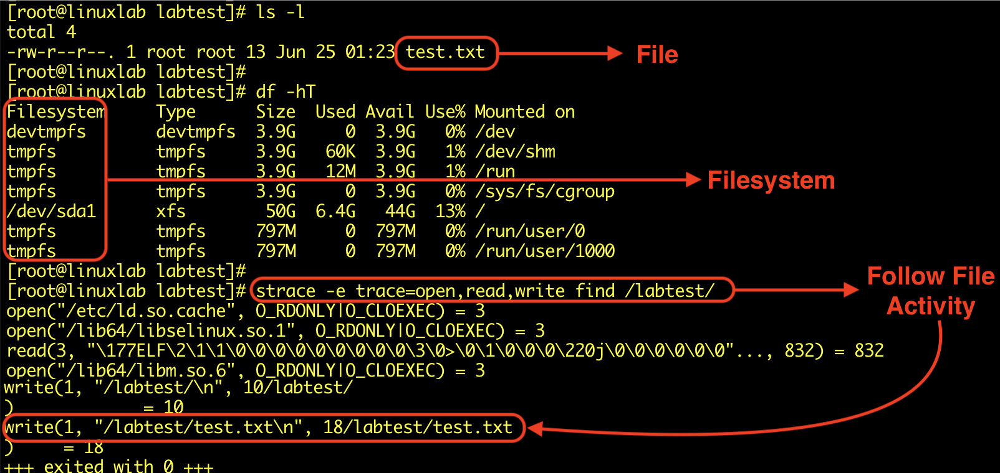
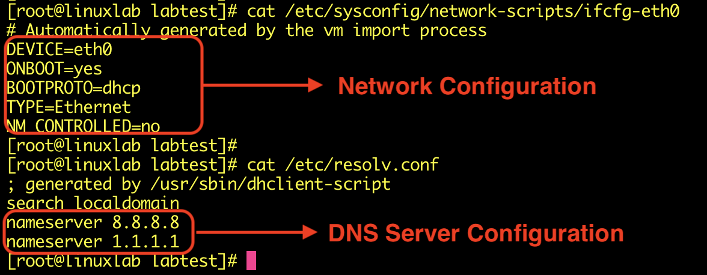
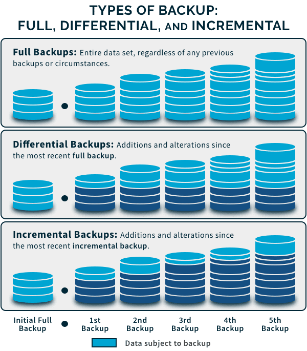

## Systèmes d’exploitation — Operating Systems
- Un **Operating System (OS)** est un ensemble de logiciels qui gère le matériel et les applications d’un ordinateur en attribuant des ressources (mémoire, processeur, périphériques d’entrée/sortie, stockage des fichiers, etc.).
- C'est le composant central qui gère l’interaction entre :
    - utilisateurs ;
    - applications ;
    - matériel ;
    - ressources système.

- La compréhension de l’OS est essentielle en sécurité car une grande partie des mécanismes de protection sont directement gérés par celui-ci.
### Catégories de systèmes d’exploitation
#### Desktop OS
- Systèmes destinés aux postes personnels et professionnels :
	- Windows ;
	- macOS ;
	- distributions Linux :
	    - Ubuntu ;
	    - Fedora ;
	    - Debian ;
	    - etc.
- Principaux usages :
```
User Workstation
→ applications
→ navigation
→ bureautique
→ accès aux ressources de l'entreprise
```
#### Mobile OS
- Conçus pour smartphones, tablettes et autres appareils mobiles.
- Exemples :
	- Android ;
	- iOS ;
	- Windows Phone.
> ⚠️ **Windows Phone est aujourd’hui abandonné** et n’est plus un OS mobile actuel.

- Les problématiques de sécurité concernent notamment :
	- applications mobiles ;
	- permissions ;
	- chiffrement ;
	- authentification ;
	- gestion centralisée des devices.
#### Server OS
- Conçus pour fournir des services à d’autres systèmes sur un réseau.
- Exemples :
	- Windows Server ;
	- Linux ;
	- UNIX :
	    - Solaris ;
	    - IBM AIX.
- Fonctions possibles :
	- services réseau ;
	- stockage ;
	- bases de données ;
	- serveurs Web ;
	- authentification ;
	- applications métier.
```
Clients
  ↓
Server OS
  ↓
Web / DB / File / Authentication Services
```
### Desktop vs Server Security
- Les exigences de sécurité dépendent du rôle du système.
#### Desktop
- Davantage exposé à :
	- phishing ;
	- navigation Web ;
	- pièces jointes ;
	- logiciels téléchargés ;
	- périphériques USB ;
	- erreurs utilisateur.
#### Server
- Davantage orienté vers :
	- services réseau exposés ;
	- contrôle des accès ;
	- configuration des services ;
	- patch management ;
	- disponibilité ;
	- limitation des privilèges.

```
Même OS
≠ même modèle de sécurité

Sécurité
→ dépend du rôle et de l'exposition du système
```
### Types courants de systèmes d’exploitation

|OS|Description|
|---|---|
|**Windows**|OS Microsoft largement utilisé sur les postes de travail|
|**macOS**|OS Apple destiné aux ordinateurs Mac|
|**Linux**|Famille open source avec de nombreuses distributions|
|**UNIX**|Famille historique multi-utilisateur et multitâche|
|**iOS**|OS mobile Apple|
|**Android**|OS mobile largement utilisé, basé sur un projet open source|
|**Windows Server**|Famille Windows destinée aux environnements serveur|
|**ChromeOS**|OS Google principalement utilisé sur les Chromebooks|
|**FreeBSD**|OS libre de la famille BSD, orienté fiabilité, sécurité et performances|
|**IBM z/OS**|OS IBM pour environnements mainframe|
## Gestion des Processus et de la Mémoire
- Le système d’exploitation sert d’interface entre **hardware et software** et gère notamment :
    - processus ;
    - mémoire ;
    - fichiers ;
    - réseau.
- Comprendre ces mécanismes est important en **Incident Response** et **Threat Hunting**, car beaucoup d’activités malveillantes apparaissent sous forme de processus, threads ou modifications mémoire.
### Gestion des Processus — Process Management
- Le système d’exploitation gère les processus en cours d’exécution et leur attribue les ressources nécessaires :
    - CPU ;
    - mémoire ;
    - périphériques d’I/O.
- Il gère notamment leur création, leur état, leur priorité et leur temps CPU.
#### Processus
- Un **processus** est une instance d’un programme en cours d’exécution.
- Il possède notamment :
    - un espace mémoire ;
    - des ressources ;
    - un identifiant (**PID**) ;
    - un ou plusieurs threads.
```
Program → fichier/code sur disque
Process → instance de ce programme en exécution
Thread  → unité d'exécution au sein du processus
```
- En sécurité, le couple **processus parent / enfant** est particulièrement utile pour détecter des comportements suspects.
```
winword.exe
   ↓
powershell.exe
```
→ peut mériter une investigation selon le contexte.
#### État d’un processus
- Un processus peut passer par plusieurs états selon l’OS, par exemple :
```
Ready → Running → Waiting
          ↓
      Terminated
```
- **Running** → actuellement exécuté par le CPU.
- **Ready** → prêt à être exécuté, en attente de CPU.
- **Waiting / Blocked** → attend un événement ou une ressource.
- **Terminated** → exécution terminée.

> Les noms exacts et le nombre d’états varient selon le système d’exploitation.
#### Process Scheduling
- Le **scheduler** décide quel processus/thread obtient du temps CPU et à quel moment.
- Il cherche à répartir efficacement les ressources entre les différentes tâches.
- Critères possibles :
	- priorité ;
	- temps CPU déjà utilisé ;
	- état du processus ;
	- type de charge ;
	- politique de scheduling de l’OS.
#### Time Sharing
- Le CPU peut être partagé entre plusieurs processus en leur attribuant de petites périodes d’exécution appelées **time slices / quanta**.
- Offrant aux utilisateurs un temps de réponse rapide.
```
CPU
→ Process A
→ Process B
→ Process C
→ Process A
```
→ donne l’impression que plusieurs programmes s’exécutent simultanément.
> Sur plusieurs cœurs CPU, plusieurs threads peuvent réellement s’exécuter **en parallèle**.
#### Priorisation
- Le système d’exploitation attribue des niveaux de priorité aux processus/threads.
- Une priorité plus élevée peut permettre à une tâche d’obtenir plus rapidement du temps CPU.
```
High Priority
→ planifié avant une tâche moins prioritaire
```
→ cela ne signifie pas forcément qu’elle reçoit systématiquement toutes les ressources disponibles.
#### Ordre d’exécution
- L’ordre dépend de plusieurs facteurs :
	- priorité ;
	- état `Ready/Waiting` ;
	- algorithme de scheduling ;
	- temps CPU disponible ;
	- événements système.
#### Concurrence / Parallélisme / Synchronisme
- À distinguer :
```
Concurrency
→ plusieurs tâches progressent dans le temps

Parallelism
→ plusieurs tâches s'exécutent réellement en même temps
```
Le parallélisme nécessite généralement plusieurs cœurs/processeurs.
#### Intérêt sécurité des processus
- En Incident Response / Threat Hunting, on examine souvent :
	- PID / PPID ;
	- nom et chemin de l’exécutable ;
	- utilisateur ayant lancé le processus ;
	- ligne de commande ;
	- parent / enfant ;
	- connexions réseau ;
	- processus inhabituels ou non signés.
```
Process Tree
+ Command Line
+ User
+ Network Connections
→ contexte d'investigation
```
### Gestion de la Mémoire — Memory Management
- Le système d’exploitation gère :
    - allocation ;
    - suivi ;
    - partage ;
    - libération des zones mémoire.
- Objectifs :
    - utiliser efficacement la RAM ;
    - isoler les processus ;
    - garantir stabilité et performances.
#### Hiérarchie mémoire
Une hiérarchie simplifiée :
```
Registers
↓
CPU Cache
↓
RAM
↓
SSD / HDD
```
- Plus on monte :
	- plus rapide ;
	- plus petit ;
	- plus coûteux.
- Plus on descend :
	- plus lent ;
	- plus grande capacité.
#### Mémoire principale — RAM
- La **RAM** contient notamment :
    - code actuellement exécuté ;
    - données des programmes ;
    - structures utilisées par l’OS.
- Elle est volatile :
```
Power Off
→ contenu RAM perdu
```
#### Mémoire virtuelle — Virtual Memory
- La mémoire virtuelle fournit à chaque processus un **espace d’adressage virtuel** indépendant.
- Le système d’exploitation traduit les adresses virtuelles vers la mémoire physique.
- Un mécanisme d'extension de la mémoire créé sur un disque dur ou un autre périphérique de stockage, utilisé pour soutenir la mémoire principale.

```
Process
→ Virtual Address
→ OS / MMU
→ Physical RAM
```
- Lorsqu’il manque de RAM, certaines pages peuvent être déplacées vers un stockage secondaire :
	- Windows → **pagefile**
	- Linux → **swap**

> ⚠️ La mémoire virtuelle n’est pas simplement « de la RAM supplémentaire sur disque ». C’est avant tout un **mécanisme d’abstraction et de gestion de l’espace mémoire** ; le disque peut servir de backing storage.
#### Opérations de gestion de la mémoire
- Cela inclut des processus tels que l'allocation, le suivi, la libération et le partage des espaces mémoire effectués par le système d'exploitation. Voici quelques-unes des principales opérations de gestion de la mémoire :
##### Allocation
- L’OS réserve de la mémoire aux processus selon leurs besoins.
```
Process requests memory
→ OS allocates memory
```
##### Suivi
- Le système maintient l’état des zones mémoire :
	- utilisées ;
	- libres ;
	- associées à certains processus ;
	- partagées.
##### Désallocation / Deallocation
- Lorsqu’une zone n’est plus nécessaire, elle peut être libérée et réutilisée.
```
Process ends
→ memory released
→ available again
```
##### Shared Memory
- Plusieurs processus peuvent partager certaines zones mémoire.
- Permet notamment :
    - communication inter-processus (**IPC**) ;
    - réduction des duplications ;
    - meilleure utilisation des ressources.
```
Process A ─┐
           ├→ Shared Memory
Process B ─┘
```
#### Stratégies de gestion mémoire
-  Les stratégies de gestion de la mémoire du système d'exploitation concernent l'allocation de mémoire, la libération de mémoire, le partage de mémoire et la fragmentation de la mémoire. Voici quelques stratégies courantes de gestion de la mémoire :
##### Mémoire physique
- Le système d'exploitation alloue des blocs de mémoire physique aux programmes et effectue un suivi.

|Stratégie|Principe|
|---|---|
|**First-fit**|Utilise le premier bloc suffisamment grand|
|**Best-fit**|Cherche le bloc qui correspond le mieux à la taille nécessaire|
|**Worst-fit**|Utilise le plus grand bloc disponible|

→ elles illustrent les problématiques d’allocation et de **fragmentation**.

> Ces stratégies sont surtout associées aux modèles classiques d’allocation contiguë ; les OS modernes utilisent largement des mécanismes de **paging** et d’allocation plus complexes.
##### Gestion de la mémoire virtuelle
- L"'OS gère la mémoire dans une structure qui peut basculer entre la mémoire principale et la mémoire virtuelle
- Cela permet :
    - d’exécuter davantage de programmes ;
    - d’isoler leurs espaces mémoire ;
    - d’utiliser plus efficacement la RAM.
```
RAM pleine
→ certaines pages déplacées vers swap/pagefile
→ RAM libérée
```
- Un usage excessif du swap/pagefile peut cependant fortement dégrader les performances.
#### Mémoire et sécurité
La mémoire est également importante lors d’une investigation car elle peut contenir :
- processus actifs ;
- connexions ;
- commandes ;
- clés/credentials présents temporairement ;
- malware exécuté uniquement en mémoire.
```
Fileless Malware
→ peu ou pas de fichier sur disque
→ activité principalement en mémoire
```
→ l’**analyse mémoire** peut donc révéler des éléments absents du disque.
## Gestion des fichiers et du réseau
### Gestion des fichiers — File Management
- Le système d’exploitation gère le **stockage, l’organisation, l’accès, la protection et la suppression des données**.
- Il fournit les mécanismes permettant aux utilisateurs et applications de manipuler les fichiers de façon structurée.
#### File
- Un **fichier** est une unité où les informations sont stockées et nommées de manière structurée.
- Exemples :
    - documents ;
    - exécutables ;
    - bases de données ;
    - fichiers multimédias ;
    - fichiers de configuration ;
    - logs.
- Un fichier possède généralement des **métadonnées** :
```
Filename
Size
Owner
Permissions
Timestamps
Location
```
#### Système de fichiers - Filesystem
- C'est le système qui assure l'organisation et le stockage des fichiers.
- Les systèmes de fichiers incluent le partitionnement des fichiers en volumes, la création de répertoires, le contrôle des droits d'accès et le placement des données sur des supports de stockage physiques.
- Le **filesystem** définit comment les fichiers et répertoires sont :
    - organisés ;
    - stockés ;
    - retrouvés ;
    - protégés sur un support.
- Exemples :

|OS / environnement|Filesystem|
|---|---|
|Windows|NTFS, ReFS|
|Linux|ext4, XFS, Btrfs|
|macOS|APFS|

#### File Naming
- Le nom et le chemin permettent d’identifier un fichier.
Exemple Windows :

```
C:\Users\Alice\Documents\report.txt
```
Exemple Linux :
```
/home/alice/documents/report.txt
```
- Les conventions et restrictions de nommage varient selon l’OS et le filesystem.
#### File Access
- Les opérations courantes sont :
```
Read
Write
Modify
Delete
Execute
```
- L’OS contrôle si un utilisateur ou un processus est autorisé à réaliser ces opérations.
→ important en sécurité : un malware possède les **droits du contexte dans lequel il s’exécute**, sauf s’il obtient des privilèges supplémentaires.
#### Directories
- Les **directories / folders** regroupent les fichiers dans une structure hiérarchique.
- Les systèmes de fichiers utilisent des répertoires pour organiser et gérer les fichiers.
```
/
├── home
├── etc
└── var
    └── log
```
ou :
```
C:\
├── Windows
├── Program Files
└── Users
```
→ facilite l’organisation et permet aussi d’appliquer certains contrôles d’accès à des ensembles de fichiers.
#### File Security
- L’OS protège les fichiers grâce aux **permissions et mécanismes de contrôle d’accès**.
- Exemples :
```
Windows → ACL / NTFS Permissions
Linux   → Owner / Group / rwx / ACL
```
- Principes importants :
	- **Least Privilege** ;
	- limiter les droits d’écriture ;
	- protéger les fichiers sensibles ;
	- éviter les permissions excessives ;
	- journaliser les accès critiques lorsque nécessaire.
```
User autorisé
→ Read

User non autorisé
→ Access Denied
```
#### File Backup
- Les sauvegardes permettent :
    - de limiter les pertes de données ;
    - de récupérer après corruption/suppression ;
    - de soutenir le **disaster recovery**.
> Le système d’exploitation peut fournir des mécanismes ou outils de sauvegarde, mais dans une entreprise, le backup est généralement géré par une **solution dédiée** et une politique globale de sauvegarde.
#### Disk Management
- Cela inclut les processus par lesquels les fichiers sont gérés sur des supports de stockage physiques.
- La gestion des disques comprend notamment :
	- partitions ;
	- volumes ;
	- allocation d’espace ;
	- formatage ;
	- montage des filesystems ;
	- gestion du stockage ;
	- récupération selon les outils disponibles.

```
Physical Disk
→ Partition / Volume
→ Filesystem
→ Files
```



### Gestion du réseau — Network Management
- L’OS fournit les mécanismes permettant au système de **communiquer sur le réseau**.
- Il permet notamment de configurer, surveiller et sécuriser les interfaces et services réseau.

####  Gestion du réseau - Network Configuration
- Configuration possible au niveau d’un hôte :
	- adresse IP ;
	- subnet mask / prefix ;
	- default gateway ;
	- DNS ;
	- interfaces réseau ;
	- routes ;
	- parfois VLANs selon l’environnement.
```
Host
→ IP Address
→ Subnet
→ Gateway
→ DNS
→ Network
```

> ⚠️ La **topologie globale du réseau** et la configuration des switches/routers relèvent surtout de l’administration réseau. L’OS gère principalement la configuration réseau de l’hôte sur lequel il fonctionne.
#### Network Security
- Le système peut participer à la sécurité réseau via :
	- host firewall ;
	- authentification ;
	- autorisation ;
	- chiffrement ;
	- contrôle des services exposés.
- Exemples :
```
Windows Defender Firewall
Linux nftables / iptables
SSH
TLS
```
- Objectif :
```
Allow required traffic
+
Block unnecessary traffic
```
→ réduire la surface d’attaque réseau du système.
#### Network Monitoring & Performance
- Surveiller :
    - connexions actives ;
    - interfaces ;
    - utilisation de bande passante ;
    - erreurs réseau ;
    - latence ;
    - services en écoute.
- Exemples d’outils :
```
Windows → ipconfig, netstat, Get-NetTCPConnection
Linux   → ip, ss, ping, traceroute
```
- En sécurité, ces informations permettent notamment d’identifier :
	- port inhabituel en écoute ;
	- connexion vers une IP suspecte ;
	- communication C2 ;
	- trafic anormal.
#### Network Services Management
- L’environnement réseau peut fournir différents services :

|Service|Fonction|
|---|---|
|**DNS**|Résolution nom ↔ IP|
|**DHCP**|Attribution automatique de configuration IP|
|**File Sharing**|Partage de fichiers sur le réseau|
|**Web Server**|Hébergement de services HTTP/HTTPS|
|**SSH / RDP**|Administration distante|

- Leur sécurité nécessite :
```
Configure
→ Patch
→ Restrict Access
→ Monitor
```
#### Network Troubleshooting
- L’OS fournit des outils permettant de diagnostiquer :
	- perte de connectivité ;
	- mauvaise configuration IP ;
	- problèmes DNS ;
	- routes incorrectes ;
	- ports bloqués ;
	- services indisponibles.
- Workflow simple :
```
Interface UP ?
→ IP correcte ?
→ Gateway joignable ?
→ DNS fonctionne ?
→ Port/service accessible ?
```
#### Network Backup & Recovery
- Le cours inclut également la sauvegarde et la récupération dans la gestion réseau.
- Cela peut concerner :
	- données accessibles sur le réseau ;
	- configurations ;
	- serveurs ;
	- services critiques.

> En pratique, la sauvegarde de la **configuration des équipements réseau** et le disaster recovery sont souvent gérés via des outils spécialisés plutôt que directement par l’OS.
### Intérêt en sécurité
- La gestion des fichiers et du réseau fournit deux sources majeures d’artefacts lors d’une investigation :
```
Filesystem
→ fichiers créés/modifiés
→ malware
→ persistence
→ logs

Network
→ connexions
→ ports
→ destinations
→ C2 / exfiltration
```
- Un analyste IR / Threat Hunter doit donc pouvoir répondre à deux questions simples :
```
Qu'est-ce qui a changé sur le système ?
Avec quoi le système a-t-il communiqué ?
```

## Backup — Sauvegarde
- Un **backup** est une copie des données conservée afin de pouvoir les restaurer si les données originales deviennent indisponibles, corrompues ou détruites.
- Les sauvegardes protègent notamment contre :
    - erreur humaine ;
    - panne matérielle / système ;
    - corruption de données ;
    - cyberattaque ;
    - catastrophe naturelle.
```
Original Data
    ↓
  Backup
    ↓
Restore si perte / corruption
```

> Un backup ne supprime pas le risque d’incident : il fournit surtout une **capacité de récupération** lorsque l’incident a déjà eu un impact sur les données.
### Importance des sauvegardes
#### Protection contre la perte de données
- Une perte de données peut résulter de :
	- suppression accidentelle ;
	- panne système ;
	- attaque informatique ;
	- ransomware ;
	- corruption ;
	- destruction physique de l’infrastructure.
```
Data Loss
→ Backup disponible
→ Restore
→ réduction de l'impact
```
#### Continuité des activités - Business Continuity
- Les organisations dépendent fortement de la disponibilité de leurs données et services.
- Une perte importante peut interrompre :
    - applications métier ;
    - production ;
    - services clients ;
    - opérations internes.
- Les backups contribuent donc à la **Business Continuity** en permettant de reprendre les opérations après un incident.
#### Conformité réglementaire - Regulatory Compliance
- Certains secteurs imposent des exigences concernant :
    - sauvegarde des données ;
    - conservation ;
    - protection ;
    - capacité de restauration.
- Une stratégie correctement documentée facilite également les **audits**.
> Les exigences exactes de conservation et de sauvegarde dépendent de la réglementation et du contexte de l’organisation.
#### Customer Trust
- Une perte de données peut entraîner :
	- perte de confiance des clients ;
	- atteinte à la réputation ;
	- interruption de service ;
	- impacts financiers.
- Les sauvegardes permettent de réduire l’impact opérationnel d’un incident, même si elles ne peuvent pas empêcher à elles seules une fuite de données.
```
Backup → protège contre la perte
Backup ≠ empêche l'exfiltration
```
#### Reprise des données (Reprise après sinistre) - Disaster Recovery
- Les sauvegardes constituent un élément essentiel du **Disaster Recovery (DR)**.
- Exemples de scénarios :
```
Datacenter détruit
Cyberattaque majeure
Ransomware
Panne critique
    ↓
Backup
    ↓
Recovery
```

> **Backup ≠ Disaster Recovery** : le backup correspond principalement aux copies des données, alors que le DR englobe l’ensemble des procédures, infrastructures et priorités permettant de remettre les systèmes en fonctionnement.
### Stratégie de sauvegarde
- Une sauvegarde efficace doit être :
	- réalisée régulièrement ;
	- protégée contre les accès non autorisés ;
	- suffisamment indépendante de la production ;
	- conservée pendant une durée adaptée ;
	- **testée en restauration**.
```
Backup créé
≠ données réellement récupérables

Restore Test
→ vérifie que le backup fonctionne
```
- Une stratégie de récupération prend généralement en compte :
```
RPO → quantité maximale de données acceptable à perdre
RTO → durée maximale acceptable avant restauration
```
- Ces objectifs déterminent notamment la fréquence des backups et la rapidité attendue du processus de recovery.
## Types et Supports de Sauvegarde
### Types de sauvegarde
- Le type de sauvegarde détermine **quelles données sont copiées** et donc :
	- temps de sauvegarde ;
	- espace nécessaire ;
	- vitesse de restauration ;
	- dépendances entre backups.

#### Full Backup — Sauvegarde complète
- Copie **toutes les données sélectionnées**.
- Type le plus simple à restaurer.
- Inconvénients :
    - plus long à créer ;
    - consomme davantage d’espace.
```
Full Backup
→ A + B + C + D + E
```
- Avantages :
	- restauration simple ;
	- peu de dépendances.
#### Incremental Backup — Sauvegarde incrémentielle
- Copie uniquement les données modifiées **depuis la dernière sauvegarde**, qu’elle soit complète ou incrémentielle.
- Exemple :
```
Lundi    → Full
Mardi    → changements depuis lundi
Mercredi → changements depuis mardi
Jeudi    → changements depuis mercredi
```
- Avantages :
	- sauvegarde rapide ;
	- faible consommation de stockage.
- Inconvénient :
	- restauration plus complexe.
- Pour restaurer jeudi :
```
Full
+ Incremental mardi
+ Incremental mercredi
+ Incremental jeudi
```
→ si un élément de la chaîne est perdu/corrompu, la restauration peut être compromise.
#### Differential Backup — Sauvegarde différentielle
- Copie toutes les modifications effectuées **depuis la dernière Full Backup**.
- Exemple :
```
Lundi    → Full
Mardi    → changements depuis lundi
Mercredi → changements depuis lundi
Jeudi    → changements depuis lundi
```
- Pour restaurer jeudi :
```
Full lundi
+ Differential jeudi
```
- Avantage :
	- restauration plus rapide/simple qu’avec une longue chaîne incrémentielle.
- Inconvénient :
	- les sauvegardes différentielles grossissent au fil du temps jusqu’à la prochaine Full.
#### Full vs Incremental vs Differential

|Type|Données copiées|Stockage|Restore|
|---|---|---|---|
|**Full**|Toutes les données|Élevé|Simple|
|**Incremental**|Depuis le dernier backup|Faible|Plus complexe|
|**Differential**|Depuis la dernière Full|Moyen → élevé|Plus simple que l’incrémental|

```
Incremental
→ optimise surtout le backup

Differential
→ compromis entre backup et restore
```

#### Mirror Backup — Sauvegarde miroir
- Maintient une copie presque identique de la source.
- Les changements peuvent être répliqués rapidement, voire en temps réel.

```
Source   ↔   Mirror
```
- Avantage :
	- accès/reprise rapide.
- Problème :
```
Delete source
→ Delete mirror

Corruption source
→ Corruption mirror
```

> ⚠️ Une réplication/mirror **ne remplace pas une véritable sauvegarde historique**. Un ransomware, une suppression accidentelle ou une corruption peuvent être répliqués sur la copie.
#### Snapshot
- Un **snapshot** représente l’état d’un système, volume ou VM à un instant donné.
```
System
   ↓
Snapshot @ 14:00
```
- Utilisé notamment pour :
	- virtualisation ;
	- stockage ;
	- bases de données ;
	- rollback rapide.
- Avantages :
	- création rapide ;
	- restauration rapide selon la technologie.

> ⚠️ Un snapshot n’est pas nécessairement une sauvegarde indépendante. Il peut dépendre du même stockage que les données originales : si ce stockage est détruit, les snapshots peuvent disparaître avec lui.

```
Snapshot → point de restauration rapide
Backup   → copie indépendante à privilégier pour la résilience
```
### Supports de sauvegarde — Backup Media
- Le **support** correspond à l’endroit ou au média sur lequel les backups sont stockés.
- Le choix dépend notamment de :
	- capacité ;
	- coût ;
	- vitesse ;
	- disponibilité ;
	- sécurité ;
	- durée de conservation.
#### Bandes magnétiques — Tape / LTO
- Toujours utilisées dans de grandes infrastructures.
- Très adaptées aux gros volumes et à l’archivage.
- Avantages :
	- coût par To relativement faible ;
	- longue conservation ;
	- peut être physiquement **offline / air-gapped**.
- Inconvénients :
	- accès séquentiel ;
	- restauration plus lente qu’avec du stockage disque.
```
Tape
→ grande capacité
→ archivage
→ offline possible
```
#### Disques durs externes
- Solution simple pour petites structures ou utilisateurs individuels.
- Accès relativement rapide.
- Risques :
	- panne matérielle ;
	- vol ;
	- dommage physique ;
	- corruption ;
	- ransomware si le disque reste connecté.
```
External HDD
→ utile
→ mais à déconnecter/protéger lorsqu'il n'est pas utilisé
```
#### NAS — Network Attached Storage
- Stockage accessible via le réseau.
- Utilisé comme espace centralisé de fichiers ou comme cible de backup.
```
Servers / Clients
      ↓
     NAS
```
- Avantages :
	- centralisation ;
	- facilité d’administration ;
	- capacité évolutive.

> Un NAS accessible avec les mêmes credentials/réseaux que la production peut également être compromis par un attaquant.
#### SAN — Storage Area Network
- Infrastructure de stockage dédiée, généralement utilisée dans les datacenters.
- Fournit du stockage en mode **bloc** avec de hautes performances.
- Utilisé notamment pour :
	- serveurs ;
	- virtualisation ;
	- bases de données ;
	- grandes infrastructures.
```
Servers
   ↓
SAN Fabric
   ↓
Storage Arrays
```
- haute performance ;
- grande capacité ;
- infrastructure plus complexe et coûteuse.

> NAS et SAN sont des **technologies de stockage**, pas automatiquement des solutions de backup. Leur sécurité dépend de la manière dont les sauvegardes y sont organisées et protégées.
#### Cloud Storage
- Sauvegardes stockées chez un fournisseur cloud.
- Permet d’éviter de maintenir toute l’infrastructure de stockage localement.
- Avantages :
	- scalable ;
	- accessible hors site ;
	- facilité d’augmentation de capacité ;
	- services d’immutabilité disponibles selon le fournisseur.
- Points à surveiller :
	- IAM / permissions ;
	- MFA ;
	- chiffrement ;
	- coûts de stockage/restauration ;
	- localisation des données ;
	- confidentialité ;
	- politique de rétention.
```
Cloud Backup
→ Offsite
→ Scalable
→ nécessite IAM + chiffrement + contrôle des accès
```
### Stratégie hybride
- Combiner plusieurs supports réduit le risque de **Single Point of Failure**.
- Exemple :
```
Production
   ↓
Local Backup / NAS
   ↓
Cloud / Offsite
   ↓
Offline / Immutable Copy
```
- Cela permet d’obtenir :
	- restauration locale rapide ;
	- protection hors site ;
	- meilleure résistance au ransomware/destruction physique.
## Processus de Sauvegarde et de Restauration
- Les processus de **Backup** et **Restore** servent à limiter l’impact d’une perte de données et à assurer la continuité d’activité.
```
Backup  → créer une copie exploitable
Restore → récupérer les données à partir de cette copie
```
### Processus de sauvegarde — Backup Process
#### 1. Spécifier les données
- Identifier les données à protéger.
- Prioriser notamment :
    - données métier critiques ;
    - bases de données ;
    - configurations ;
    - fichiers utilisateurs importants ;
    - systèmes nécessaires au fonctionnement de l’entreprise.
```
Inventory / Criticality
→ What must be backed up?
```
#### 2. Choisir le type de sauvegarde
- Selon les besoins :
	- **Full** ;
	- **Incremental** ;
	- **Differential** ;
	- **Mirror**.
- Le choix dépend notamment de :
	- volume de données ;
	- fréquence des changements ;
	- capacité de stockage ;
	- temps disponible pour le backup ;
	- temps attendu pour la restauration.
```
Backup Type
→ impacte Storage + Backup Time + Restore Time
```
#### 3. Planifier les sauvegardes
- Les sauvegardes sont généralement automatisées selon un **schedule**.
- Elles peuvent être exécutées pendant des périodes de faible activité afin de limiter leur impact sur :
    - CPU ;
    - stockage ;
    - bande passante ;
    - applications métier.

> Pour les systèmes critiques, la fréquence doit surtout être définie selon le **RPO**, pas uniquement selon les périodes de faible activité.

```
RPO faible
→ sauvegardes plus fréquentes
```
#### 4. Effectuer la sauvegarde
- Le processus est généralement réalisé automatiquement par :
    - logiciel de backup ;
    - appliance ;
    - service cloud ;
    - plateforme centralisée.
- À contrôler après exécution :
	- statut du job ;
	- erreurs ;
	- quantité de données sauvegardées ;
	- durée ;
	- destination ;
	- intégrité du backup.
```
Backup Job
→ Success / Failed
→ Logs + Monitoring
```

> Un job marqué `Successful` ne garantit pas que les données pourront réellement être restaurées.
### Processus de restauration — Restore Process
- Lorsqu’une donnée est supprimée, corrompue ou indisponible, une sauvegarde peut être utilisée pour la récupérer.
```
Data Loss
→ Select Backup
→ Restore
→ Validate
```
#### 1. Choisir le point de restauration
- Déterminer **quel backup utiliser**.
- Le plus récent n’est pas automatiquement le meilleur.
- Exemple :
```
Ransomware détecté vendredi
Compromission commencée mercredi

Backup jeudi → potentiellement compromis
Backup mardi → peut être préférable
```
- Il faut donc choisir un **known-good restore point** : un point connu comme sain.
#### 2. Choisir l’emplacement de restauration
- Deux possibilités principales :
	- Original Location :Utilisé lorsque l’environnement original est toujours considéré comme fiable.
	- Alternate Location : backup → nouvelle machine / environnement isolé. Utile notamment :
		- après compromission ;
		- pour tester une restauration ;
		- pour analyser des données ;
		- lorsque le système original est détruit.
#### 3. Effectuer la restauration
- La solution de backup récupère les données depuis le support choisi puis les replace à l’emplacement défini.
- Selon le type de backup :
```
Full Restore
→ Full

Incremental Restore
→ Full + tous les Incrementals nécessaires

Differential Restore
→ Full + dernier Differential
```
#### Validation après restauration
- Une restauration ne doit pas s’arrêter au message `Restore completed`.
- Il faut vérifier :
	- intégrité des fichiers ;
	- fonctionnement des applications ;
	- cohérence des bases de données ;
	- permissions ;
	- services ;
	- données attendues ;
	- absence de corruption.
```
Restore
→ Validate
→ Functional Test
→ Return to Production
```
#### Tests de restauration
- Les processus doivent être **régulièrement testés**.
- Objectifs :
	- vérifier que les backups sont utilisables ;
	- entraîner les équipes ;
	- mesurer la durée réelle de restauration ;
	- identifier les dépendances oubliées ;
	- vérifier que le RTO peut être respecté.
```
Backup Test
→ Can we restore?

Recovery Test
→ Can we restore correctly and fast enough?
```
#### RPO / RTO
- Deux métriques directement liées au processus :

|Concept|Question|
|---|---|
|**RPO — Recovery Point Objective**|Jusqu’à combien de données peut-on perdre ?|
|**RTO — Recovery Time Objective**|Combien de temps peut-on rester indisponible ?|

- Exemple :
```
RPO = 1h
→ au maximum 1h de données perdues

RTO = 4h
→ service restauré en moins de 4h
```
## Sécurité des sauvegardes & Disaster Recovery

### Sécurité des sauvegardes — Backup Security
- Les sauvegardes doivent être protégées au même titre que les données de production.
- Un attaquant qui compromet les backups peut :
    - voler les données ;
    - supprimer les copies ;
    - les chiffrer ;
    - empêcher toute restauration.
```
Production compromise
→ Backup compromise
→ Recovery impossible
```
#### Access Control
- Limiter l’accès aux sauvegardes aux seuls utilisateurs/services autorisés.
- Utiliser :
    - comptes dédiés ;
    - Least Privilege ;
    - MFA / 2FA ;
    - séparation des rôles.
```
User/Admin standard
        X
Backup Administration

Backup Admin
→ accès dédié + MFA
```
→ idéalement, la compromission d’un compte administrateur de production ne doit pas automatiquement donner accès aux backups.
#### Encryption
- Les sauvegardes doivent être chiffrées :
```
In Transit
→ lors du transfert

At Rest
→ lorsqu'elles sont stockées
```
- Objectif :
	- protéger la confidentialité des données ;
	- empêcher leur lecture en cas de vol du support ou d’accès non autorisé.

> Il faut également protéger les **clés de chiffrement** : perdre la clé peut rendre une sauvegarde parfaitement intacte mais inutilisable.
#### Integrity Checks
- Vérifier régulièrement que les backups :
    - ne sont pas corrompus ;
    - n’ont pas été modifiés ;
    - peuvent être restaurés correctement.
```
Backup
→ Integrity Check
→ Restore Test
```
- Un hash/checksum peut aider à détecter certaines altérations, mais le **test de restauration** reste essentiel.
#### Physical Security
- Les supports physiques doivent être protégés contre :
	- vol ;
	- incendie ;
	- dégâts matériels ;
	- accès non autorisé.
- Exemples :
```
External HDD
Tape / LTO
Offline Media
```
→ stockage dans des zones contrôlées, coffres ou sites sécurisés selon la criticité.
#### Copies multiples — règle 3-2-1
- Principe classique :
```
3 → copies des données au total
2 → types de supports différents
1 → copie offsite
```

> ⚠️ Le cours mélange ici **offsite** et **offline**. La règle 3-2-1 classique demande une copie **hors site** ; une copie offline/immutable correspond à une protection supplémentaire, souvent exprimée avec la règle **3-2-1-1-0**.

Pour renforcer la résistance au ransomware :

```
Offline / Air-Gapped / Immutable Backup
→ difficile à modifier ou supprimer
```
#### Secure Erase
- Lorsqu’un support arrive en fin de vie :
	- supprimer les données de manière irréversible ;
	- éviter qu’elles puissent être récupérées par un tiers.
- Selon le support :
	- secure erase ;
	- cryptographic erase ;
	- destruction physique.
```
Backup Media EOL
→ Secure Erase / Destroy
→ Dispose
```
### Disaster Recovery — Reprise après sinistre
- Le **Disaster Recovery (DR)** désigne l’ensemble des moyens permettant de **restaurer les systèmes et reprendre les services** après un incident majeur.
- Scénarios :
	- cyberattaque ;
	- ransomware ;
	- panne matérielle majeure ;
	- destruction d’un datacenter ;
	- catastrophe naturelle ;
	- corruption massive.
```
Disaster
→ Recover Data
→ Restore Systems
→ Restore Services
→ Resume Business
```

> Le **Data Recovery** concerne principalement la récupération des données, tandis que le **Disaster Recovery** est plus large : données + systèmes + infrastructure + procédures + ordre de reprise.
#### 1. Planification d'urgence - Emergency Planning
- Préparer à l’avance un **Disaster Recovery Plan / DRP**.
- Définir :
    - responsabilités ;
    - procédures ;
    - ordre de restauration ;
    - contacts ;
    - ressources nécessaires.
```
Incident majeur
→ Who does what?
→ What gets restored first?
→ How?
```
- L’objectif est d’éviter d’improviser pendant la crise.
#### 2. Data Backup
- Effectuer des sauvegardes régulières.
- Les stocker de manière sécurisée et indépendante.
- Vérifier régulièrement leur fonctionnement.

```
Backup
→ Protect
→ Monitor
→ Test
```
- La fréquence des backups doit être cohérente avec le **RPO** attendu.
#### 3. Data Restoration
- En cas de perte :
	1. identifier le bon restore point ;
	2. vérifier que le backup est sain ;
	3. restaurer les données ;
	4. valider leur intégrité.
```
Known-Good Backup
→ Restore
→ Validate
```
- Après une cyberattaque, restaurer simplement le backup le plus récent peut être dangereux s’il contient déjà des éléments compromis.
#### 4. System Reinstallation / Recovery
- Un sinistre peut nécessiter plus qu’une restauration de fichiers :
	- réinstaller OS et applications ;
	- reconstruire des serveurs ;
	- reconfigurer le réseau ;
	- restaurer les services ;
	- appliquer patches/hardening ;
	- effectuer des tests avant remise en production.
```
Clean System
→ Restore Configuration
→ Restore Data
→ Test
→ Production
```
- Dans certains incidents, reconstruire un système sain est préférable à réutiliser directement un système compromis.
#### 5. Test et amélioration
- Le DR Plan doit être régulièrement testé.
- Objectifs :
	- vérifier que les procédures fonctionnent ;
	- mesurer les temps de récupération ;
	- identifier les dépendances oubliées ;
	- former les équipes ;
	- corriger les faiblesses.
## Sécurité Physique — Physical Security
- La **sécurité physique** protège les actifs, installations, équipements et employés contre les menaces physiques.
- Elle participe directement à :
    - la protection des données ;
    - la continuité d’activité ;
    - la sécurité des infrastructures.
- Principales menaces :
```
Menaces internes
→ accès non autorisé
→ violations par le personnel

Menaces externes
→ vol
→ sabotage
→ espionnage
→ attaques
→ catastrophes naturelles
```
## Risk Assessment
- La sécurité physique commence par une **évaluation des risques**.
- Il faut identifier :
    - les actifs ;
    - les activités critiques ;
    - les menaces ;
    - les vulnérabilités ;
    - les mesures prioritaires à mettre en place.
```
Assets
+ Threats
+ Vulnerabilities
→ Risk Assessment
→ Priorisation des protections
```
### Sécurité des installations
- Concerne notamment :
	- bâtiments ;
	- bureaux ;
	- entrepôts ;
	- usines.
- L’objectif est de protéger les **personnes, actifs et informations** présents sur le site.
#### Sécurité environnementale
- Utiliser des barrières physiques pour limiter les accès non autorisés :
	- clôtures ;
	- barrières ;
	- checkpoints ;
	- points d’entrée/sortie contrôlés ;
	- éclairage ;
	- agents de sécurité ;
	- caméras.
```
Perimeter
→ Detect
→ Deter
→ Restrict Access
```
#### Gestion des visiteurs
- Les visiteurs doivent être contrôlés via :
	- vérification d’identité ;
	- enregistrement ;
	- badges/cartes temporaires ;
	- accompagnement par un employé.
```
Visitor
→ Identify
→ Register
→ Temporary Access
→ Escort si nécessaire
```
#### Éclairage & Security Lighting
- Un bon éclairage permet :
    - d’identifier plus facilement les menaces ;
    - d’améliorer les images des caméras ;
    - de faciliter la surveillance ;
    - de dissuader les intrusions.
#### Personnel de sécurité
- Le personnel de sécurité doit :
    - surveiller les installations ;
    - appliquer les procédures ;
    - réagir rapidement aux incidents ;
    - recevoir une formation régulière.
#### Visiteurs & médias portables
- Contrôler également les équipements amenés dans les locaux :
    - clés USB ;
    - disques externes ;
    - autres supports portables.
- Ils peuvent être vérifiés afin de détecter des menaces potentielles.
### Préparation aux urgences
- Prévoir :
	- plans d’évacuation ;
	- procédures de gestion de crise ;
	- systèmes de communication ;
	- procédures adaptées aux incendies, catastrophes ou attaques.
- Ces plans doivent être :
```
Create
→ Review regularly
→ Train personnel
→ Update
```
### Sécurité des Data Centers
- Les centres de données hébergent des ressources critiques :
	- données ;
	- serveurs ;
	- systèmes ;
	- infrastructure réseau.
#### Contrôle d’accès
- L’accès doit être limité au personnel autorisé.
- Mécanismes possibles :
    - systèmes de contrôle d’accès ;
    - protections physiques ;
    - biométrie.
#### Firewall & Network Security
- Le trafic du datacenter doit être surveillé et protégé par :
    - firewalls ;
    - équipements de sécurité réseau.
- Objectifs :
```
Unauthorized Access → Prevent
Malicious Traffic   → Detect / Block
```
#### Physical Security
- Mesures possibles :
	- CCTV ;
	- détecteurs de mouvement ;
	- alarmes ;
	- systèmes de surveillance ;
	- personnel de sécurité.
→ permettent de détecter ou empêcher :
- accès non autorisé ;
- vol ;
- dommages matériels.
#### Incendie & contrôle climatique
- Un datacenter doit disposer de :
	- détection de fumée ;
	- systèmes anti-incendie ;
	- extinction incendie ;
	- contrôle de la température ;
	- contrôle de l’humidité.
→ protège le matériel et les données contre les risques environnementaux.
#### UPS / ASI & sauvegardes
- Les **UPS / ASI** maintiennent temporairement l’alimentation lors :
    - d’une panne ;
    - d’une perturbation électrique.
- Les systèmes de sauvegarde contribuent à assurer la continuité des données et services.
```
Power Failure
→ UPS
→ service maintenu temporairement
```
#### Monitoring & Logging
- Surveiller :
    - systèmes ;
    - trafic réseau ;
    - événements de sécurité.
- Journaliser les événements permet :
    - détection rapide ;
    - investigation ;
    - traçabilité ;
    - troubleshooting.
#### Redondance
- Utiliser :
    - datacenters redondants ;
    - systèmes de secours ;
    - infrastructures alternatives.
- Objectif :

```
Primary Data Center DOWN
→ Secondary / Backup Infrastructure
→ Services continue
```
#### Audits & Compliance
- Réaliser régulièrement :
    - audits de sécurité ;
    - révision des policies ;
    - identification des vulnérabilités ;
    - vérification de conformité aux standards.
#### Personnel & Least Privilege
- Former régulièrement le personnel.
- Adapter les autorisations pour que chacun possède uniquement les accès nécessaires.
```
Personnel
→ Awareness
→ Authorized Access Only
→ Least Privilege
```
### Sécurité des postes de travail et du matériel
- Les postes de travail et équipements doivent être protégés contre l’accès physique non autorisé.
- Les zones sensibles peuvent utiliser :
    - portes sécurisées ;
    - casiers ;
    - barrières ;
    - contrôles d’accès.
- Objectifs :
	- protéger les données sensibles ;
	- réduire les risques de fuite/perte ;
	- assurer la continuité d’activité ;
	- protéger les équipements volés/perdus ;
	- répondre aux exigences de conformité.