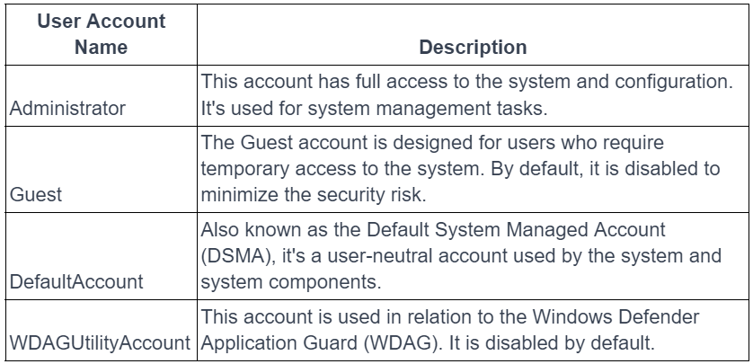
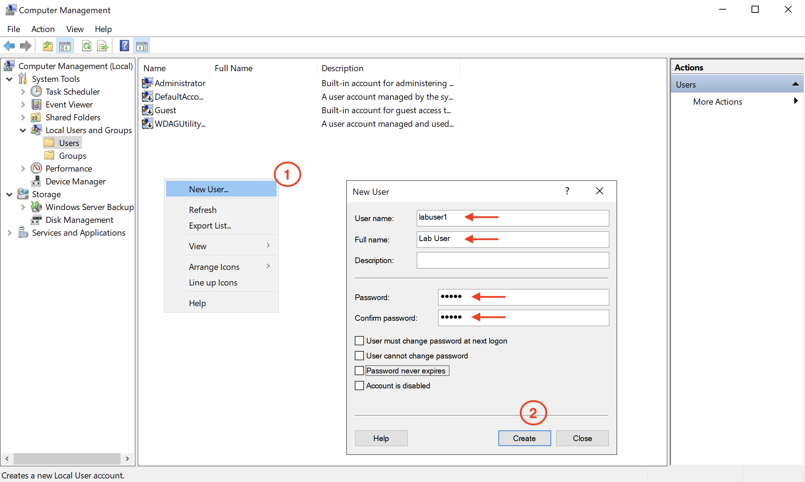
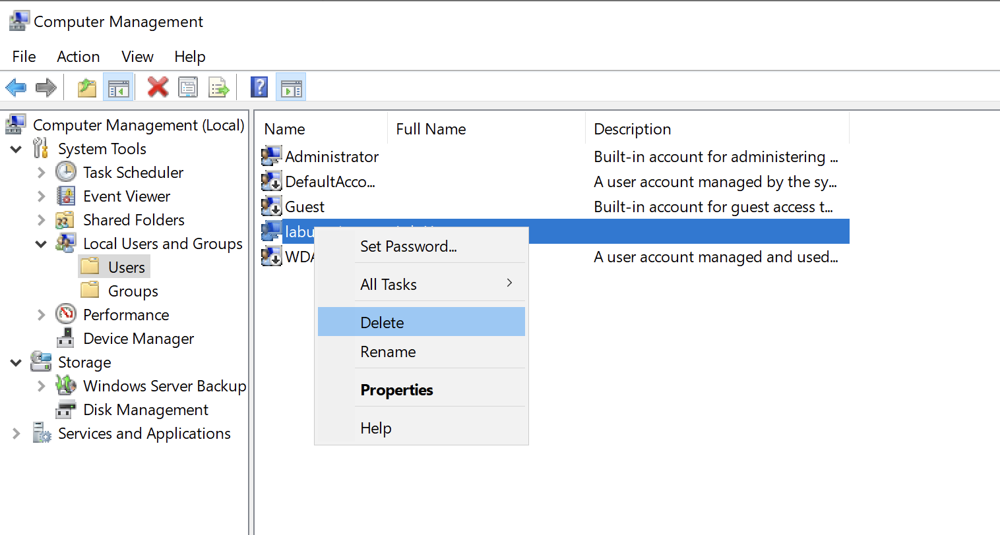
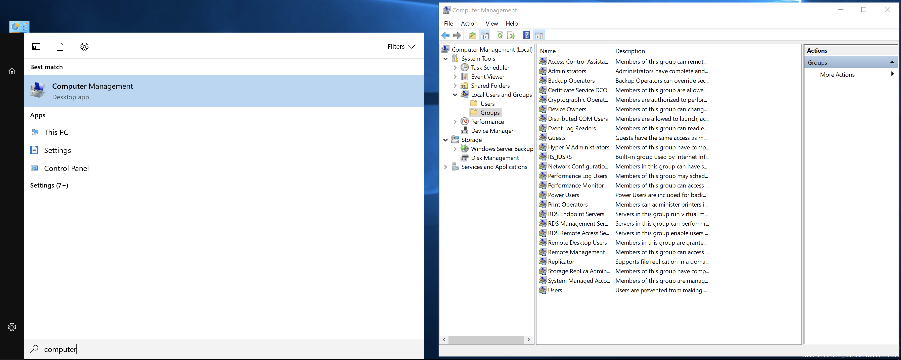
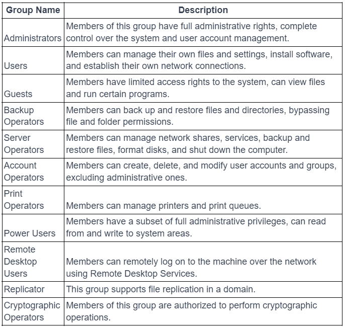
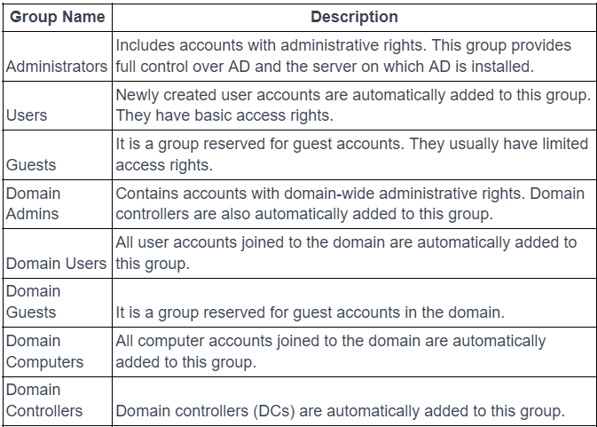
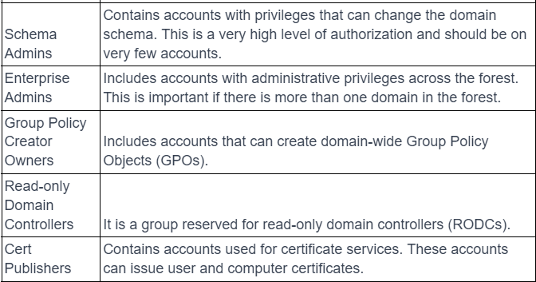

# Gestion des utilisateurs et des groupes
## Comptes utilisateur et gestion
- Un **compte utilisateur** représente une identité dans Windows pour une personne ou un service.
- Il est généralement associé à :
    - un username ;
    - un password ;
    - des permissions ;
    - des appartenances à des groupes.
```
Identity
→ User Account
→ Groups
→ Permissions / Privileges
```
### Comptes Administrateur
- Les comptes administrateur disposent de privilèges élevés sur le système.
- Ils peuvent notamment :
    - modifier des paramètres système ;
    - installer/configurer des logiciels ;
    - gérer d’autres comptes ;
    - accéder à davantage de ressources.
> Un compte administrateur ne devrait pas être utilisé pour les tâches quotidiennes lorsqu’un compte standard suffit.
### Comptes utilisateur standard
- Permettent notamment :
    - d’exécuter des applications ;
    - de gérer les fichiers personnels ;
    - de modifier certains paramètres utilisateur.
- Les modifications globales du système sont limitées.
```
Standard User
→ usage quotidien

Administrator
→ opérations privilégiées
```
#### Gestion des utilisateurs locaux
- Sous Windows Server :
	- L'écran Démarrer -> Gestion de l'ordinateur -> Utilisateurs et groupes locaux -> Utilisateurs s'ouvre :

- Les principaux users par défaut fournis avec Windows Server sont : 

- Pour créer un nouvel user local puis de le supprimer.


> Les **Local Users and Groups** concernent les comptes stockés localement sur une machine, pas les comptes Active Directory du domaine.
### Permissions et autorisations des utilisateurs
#### Principe du moindre privilège - Principle of Least Privilege
- Accorder uniquement les permissions réellement nécessaires en appliquant le niveau de privilèges le plus bas possible.
- Éviter :
    - droits administrateur inutiles ;
    - permissions excessives ;
    - accès permanent à des ressources sensibles.
#### Limiter les comptes administrateur
- Réduire le nombre de comptes à privilèges.
- Réserver leur usage aux tâches qui nécessitent réellement une élévation.
- Bonnes pratiques :
	- compte standard pour le quotidien ;
	- compte admin dédié ;
	- MFA pour les comptes privilégiés ;
	- monitoring renforcé.
### Politiques de sécurité
#### Politiques de mot de passe
##### Strong Passwords
Le cours recommande :
- au moins 12 caractères ;
- lettres ;
- chiffres ;
- caractères spéciaux.
Complément utile :
> La **longueur** et l’absence de mot de passe compromis sont généralement plus importantes qu’une complexité artificielle excessive.
##### Changement périodique
Le cours recommande un changement périodique des mots de passe.
> ⚠️ Les recommandations modernes déconseillent souvent la rotation forcée fréquente **sans signe de compromission**, car elle pousse les utilisateurs à choisir des mots de passe prévisibles. 

Un changement doit surtout être imposé en cas de :
- fuite ;
- compromission ;
- suspicion ;
- exigence réglementaire spécifique.
#### 2FA / MFA 
- Ajouter un second facteur réduit fortement le risque lié au vol de mot de passe.
- Exemples :
	- authenticator app ;
	- security key ;
	- OTP ;
	- biométrie.
#### UAC — User Account Control - Contrôle de compte user
- **UAC** limite l’élévation de privilèges automatique.
- Lorsqu’une application demande des droits administrateur, Windows affiche une demande de consentement ou de credentials.
```
Application
→ demande élévation
→ UAC prompt
→ Approve / Deny
```
> UAC n’est pas une barrière de sécurité absolue, mais une couche importante pour limiter les élévations involontaires.
#### Session Timeout / Screen Lock
- Configurer :
    - verrouillage automatique ;
    - expiration de session ;
    - demande d’authentification au retour.
#### Audit et surveillance des comptes
- Activer la journalisation des événements liés aux comptes et authentifications.
- Surveiller notamment :
    - connexions réussies/échouées ;
    - création/suppression de comptes ;
    - changements de mot de passe ;
    - modifications de groupes ;
    - élévations de privilèges.
### Groupes et gestion
- Un **groupe** contient un ou plusieurs utilisateurs.
- Il permet d’attribuer des droits collectivement plutôt qu’utilisateur par utilisateur.
```
Users
  ↓
Group
  ↓
Permissions
```
- Avantage principal :
```
Add user to group
→ inherits group permissions

Remove user
→ permissions removed
```
#### Groupes locaux
- Définis sur **une seule machine**.
- Utilisés pour contrôler l’accès aux ressources locales.
Exemple :
```
Local Administrators
Remote Desktop Users
Backup Operators
```
##### Créer groupe local 

##### Groupes locaux par défaut fournis avec Windows Server

#### Groupes de domaine Active Directory
- Gérés dans **Active Directory**.
- Utilisés pour contrôler l’accès aux ressources de plusieurs systèmes du domaine.
- Les membres d'un groupe peuvent disposer de certains privilèges par le biais de stratégies de groupe.
- L'ajout ou la suppression d'un utilisateur d'un groupe est un moyen simple de modifier rapidement les privilèges d'un utilisateur.
```
AD User
→ Domain Group
→ Access to shared resources
```
##### Groupes fournis avec le rôle AD de Windows Server


##### Types de groupes Active Directory
- Domain Local
	- Utilisé principalement pour attribuer des permissions sur des ressources du domaine concerné.
- Global
	- Regroupe surtout des utilisateurs/comptes ayant un rôle commun dans le même domaine.
- Universal
	- Peut contenir des membres provenant de plusieurs domaines d’une forêt.
```
Global Group
→ regroupe les utilisateurs

Domain Local Group
→ reçoit les permissions

Universal Group
→ utile entre plusieurs domaines
```
Complément utile : modèle classique **AGDLP** :
```
Accounts
→ Global Groups
→ Domain Local Groups
→ Permissions
```
#### Relation utilisateur-groupe
##### Ajout / suppression
- L’appartenance aux groupes doit suivre un processus contrôlé :
    - demande ;
    - validation ;
    - ajout ;
    - suppression lorsque le besoin disparaît.
##### Revue des appartenances
- Vérifier régulièrement :
    - qui appartient à quel groupe ;
    - pourquoi ;
    - si cet accès est encore nécessaire.
- Particulièrement important pour les groupes sensibles :
	- Administrators
	- Domain Admins
	- Enterprise Admins
	- Remote Desktop Users
	- Backup Operators

## Sécurité Active Directory 
- Active Directory est un service d'annuaire Microsoft utilisé pour centraliser la gestion des identités, groupes, ordinateurs et ressources dans un environnement Windows.