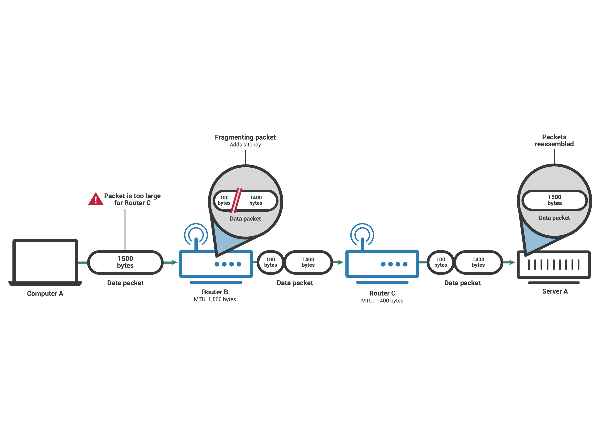
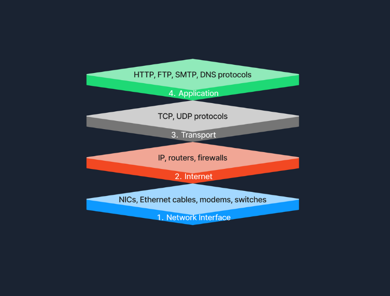
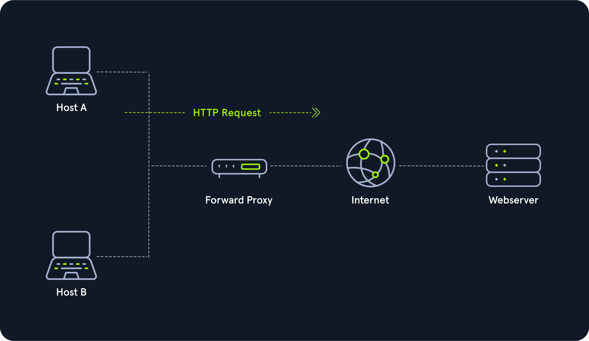
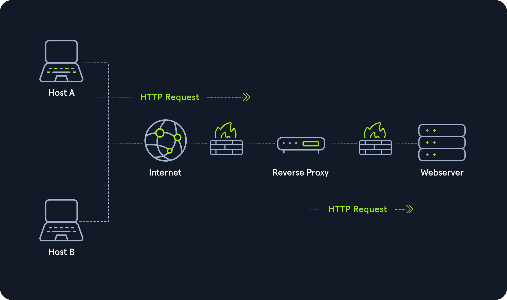

# Networking

<details>
<summary>🔹 Concepts [OSI, TCP/IP, UDP, Encapsulation]</summary>


<details>
<summary>📖 Concepts généraux [TTL, Checksum, Loopback, Table routage, Adressage…]</summary>

<details>
<summary>🔸 Réseau</summary>

    - Ensemble d'appareils interconnectés qui peuvent communiquer entre-eux.
<details>
<summary>▫️ Types de réseaux</summary>

<details>
<summary>• LAN (Local Area Network)</summary>

            - Connecte des appareils sur une courte distance, comme home, école, entreprise.
</details>

<details>
<summary>• WAN (Wide Area Network)</summary>

            - Couvre large zone géographique et peu couvrir plusieurs LAN.
</details>

<details>
<summary>• Fonctionnement entre LAN & WAN</summary>

            - LAN peuvent se connecter aux WAN pour accroître la portée. Il se connecte au WAN du FAI.
</details>

</details>

</details>

<details>
<summary>🔸 Table de routage</summary>

    - Une table qui indique à une machine **par où envoyer les paquets IP** en fonction de leur destination.
        - **Contenu typique :** adresses de destination, masque, passerelle (gateway), interface de sortie, métrique (priorité).
        - **Exemple (Linux `ip route show`):**
            
            ```
            default via 192.168.1.1 dev eth0
            192.168.1.0/24 dev eth0 proto kernel scope link src 192.168.1.10
            
            ```
            
            → Tout le trafic inconnu (`default`) part vers la gateway 192.168.1.1.
            
    - **Table ARP** = Relation entre une adresse IP et une adresse MAC
    - **Table CAM** = Relation entre une adresse MAC et un numéro de port
    - ARP : Protocole qui permet de traduire une **adresse IP → adresse MAC** (nécessaire pour l’envoi sur un réseau Ethernet).
        - **Fonctionnement :**
            1. La machine veut joindre `192.168.1.20`.
            2. Elle envoie une requête ARP : “Qui a 192.168.1.20 ?”
            3. La machine qui possède cette IP répond avec sa MAC.
        - Table ARP
            - **Qu’est-ce que c’est ?**
                
                Cache local qui associe les adresses IP connues aux adresses MAC correspondantes.
                
            - **Commande pour voir la table :**
                - Linux : `arp -n` ou `ip neigh`
                - Windows : `arp -a`
            - **Exemple :**
                
                ```
                192.168.1.1   00:14:22:01:23:45   eth0
                192.168.1.20  00:16:3e:11:22:33   eth0
                
                ```
                
</details>

<details>
<summary>🔸 Loopback</summary>

    - Interface virtuelle qui renvoie directement vers la machine elle-même.
        - **Adresse la plus connue :** `127.0.0.1` (ou `::1` en IPv6).
        - **Utilité :** tester des services locaux, communication interne sans passer par le réseau physique.
</details>

<details>
<summary>🔸 Gateway (Passerelle par défaut)</summary>

    - Equipement réseau par lequel une machine envoie le trafic destiné à **réseau externe**.
        - **Exemple :**
            - PC : IP `192.168.1.10`
<details>
<summary>• Gateway (routeur Internet)</summary>

            - `192.168.1.1`
                
                → Tout ce qui n’est pas dans le LAN est envoyé à `192.168.1.1`.
                
        
</details>

</details>

<details>
<summary>🔸 Adressage (L2</summary>

    - MAC,L3:IP,L4:Port, multiplexage)
<details>
<summary>▫️ Adressage à chaque couche</summary>

            - L2 : MAC (48 bits, unique par interface, gravée en usine) - Portée locale (un seul segment du réseau, pas de routage)
            - L3 : IP (32 bits en IPv4, 128 bits en IPv6) - portée globale (routage entre réseau)
            - L4 : Port 16 bits, 0-65535) - Identifie application sur la machine
</details>

<details>
<summary>▫️ Plusieurs niveaux d’adressage</summary>

            - MAC : communication sur lien physique direct (switch, même VLAN). Switch utilise table CAM pour aiguiller trames.
            - IP : routage entre réseaux différents. Routeurs lisent IP dest et consultent table de routage.
<details>
<summary>• Port</summary>

            - multiplexage applicatif. Une même IP peut héberger web (80), SSH (22), DNS (53), simultanément
    - TTL : Indique nombre maximal de routeurs pas lesquels paquet peut transiter avant abandon.
        - Permet de limiter la durée de vie d’un paquet sur le réseau en empêchant qu’il tourne indéfiniment. A chaque passage sur routeur TTL décrémenté de 1.
</details>

</details>

<details>
<summary>▫️ Quand TTL atteint 0</summary>

<details>
<summary>• Routeur jette le paquet et renvoie un ICMP Time Exceeded à l’émetteur.</summary>

</details>

</details>

<details>
<summary>▫️ TTL initial dépend de l’OS</summary>

        - 64 Linux/macOS, 128 Windows, 255 (équipements réseau Cisco)
        - traceroute : exploite ça : envoie paquets avec TTL croissant pour découvrir chemin
        
</details>

<details>
<summary>▫️ Estimer le nombre de hops “retour”</summary>

        
</details>

<details>
<summary>▫️ Si ping affiche ttl=117. Ce TTL correspond au chemin retour.</summary>

        
        Les systèmes initient souvent TTL à une valeur “standard” :
        
        - **64** (Linux/Unix/Mac très souvent)
        - **128** (Windows souvent, certains serveurs / stacks)
        - **255** (routeurs/équipements réseau)
        
        Ici, tu reçois `ttl=117` :
        
        - si l’initial TTL était **128**, alors hops ≈ **128 − 117 = 11**
        - si l’initial TTL était **64**, impossible (tu ne peux pas recevoir 117 > 64)
        
        Donc, suggère que **rép part avec TTL initial de 128**, donc **environ 11 routeurs sur chemin retour**.
        
    - MTU : Taille maximale d’un paquet en une seule trame sans fragmentation (1500 Ethernet)
</details>

<details>
<summary>▫️ Mesure représentant le paquet de données le plus volumineux que peut accepter un appareil connecté au réseau.</summary>

</details>

<details>
<summary>▫️ Les paquets de données qui dépassent MTU sont fragmentés en plus petites partiespour pouvoir passer, réassemblés une fois arrivés à destination.</summary>

        
        
        
</details>

<details>
<summary>▫️ Flag Don’t Fragment</summary>

        - Option indicant que le paquet ne peut pas être fragmenté et donc peut potentiellement être rejetté. Reçoit msg icmp pour dire que trop gros.
</details>

<details>
<summary>▫️ PMTUd</summary>

        - Path MTU Discovery : Technique permettant de déterminer MTU de tous appareils, routeurs et commutateurs sur un chemin réseau.
<details>
<summary>• IPv4</summary>

            - Autorise fragmentation et inclut flag DF dans en-tête. PMTUd envoie paqeuts de test le long du chemin avec flag DF activé, si dispositif rejette, renvoie msg ICMP avec son MTU. Dispositif de source abaisse sont MTU et envoie d’autre paquets de tests jusqu’à que ce soit OK.
</details>

<details>
<summary>• IPv6</summary>

            - N’autorise pas fragmentation et donc n’a pas de flag DF. PMTUd en IPv6 envoie paquets de tests de plus en plus petits jusqu’à ce qu’ils puissent parcourir tout le chemin réseau.
        - MSS : Taille maximum de segment, utilisé par TCP au niveau de la couche 4? S’intéresse qu’à la taille du payload dans paquet. Calculé en soustrayant longueur des en-têtes TCP et des en-têtes IP du MTU. Paquets MSS sont tjrs rejetés si dépassent.
</details>

</details>

</details>

<details>
<summary>🔸 Fragmentation IP (Lien avec MTU)</summary>

<details>
<summary>▫️ Si paquet IP trop gros pour le lien (MTU = 1500 Ethernet), il est fragmenté en plusieurs paquets plus petits</summary>

</details>

<details>
<summary>▫️ Chaque fragment a même ID, mais offset différent</summary>

</details>

<details>
<summary>▫️ Réassemblage se fait uniquement à destination (pas sur routeurs intermédiaires)</summary>

</details>

<details>
<summary>▫️ Flag "Don't Fragment" (DF)</summary>

        - si activé et paquet trop gros, le routeur envoie ICMP "Fragmentation Needed" et détruit le paquet (utilisé par PMTUD - Path MTU Discovery).
</details>

</details>

<details>
<summary>🔸 Checksum</summary>

    - Somme de contrôle
<details>
<summary>▫️ IP checksum</summary>

        - Vérifie uniquement intégrité du header IP (pas les données)
</details>

<details>
<summary>▫️ TCP/UDP checksum</summary>

        - vérifie header + données
</details>

<details>
<summary>▫️ FCS Ethernet vérifie toute la trame</summary>

</details>

<details>
<summary>▫️ Si checksum invalide, paquet est silencieusement détruit (aucune notif)</summary>

</details>

</details>

<details>
<summary>🔸 VLSM</summary>

    - Permettre d’utiliser des masques de taille variable pour optimiser l’usage des adresses lorsque besoin différents par sous-réseau (un avec 100 hôtes, un avec 50…)
</details>

</details>

<details>
<summary>📖 Modèle OSI</summary>

- Modèle conceptuel décrit théoriquement la communication des réseaux.
<details>
<summary>🔸 1. Physique</summary>

    - Connexion physique entre appareils transmet signal
        - Responsable de la transmission des courants de bits bruts sur un medium physique. Traite de la connexion physique entre les appareils.
            - Ex : Câble Ethernet, fibre optique
</details>

<details>
<summary>🔸 2. Liaison</summary>

    - Envoi donnée entre deux nœuds même segment réseau
<details>
<summary>▫️ Décrit un accord entre différents systèmes d’un même segment de réseau pour communiquer. Garantir que les trames de données sont transmises.</summary>

<details>
<summary>• Segment de réseau</summary>

            - groupe d’appareils utilisant un support/canal partagé pour transfert d’info
            - Ex : Switches, MAC pour identifier appareils…
</details>

</details>

<details>
<summary>▫️ Deux adresses MAC dans chaque trame</summary>

        
        
        
        L'adresse de liaison de données de destination (adresse MAC) surlignée en jaune
        L'adresse de liaison de données source (adresse MAC) est surlignée en bleu
        Les bits restants montrent les données envoyées
        
</details>

</details>

<details>
<summary>🔸 3. Réseau</summary>

    - Envoie de données entre différents réseaux
        - Gère le transfert de paquets, y compris le routage des paquets via routeurs pour atteindre destination. Responsable de l'adresse logique et de la détermination du chemin.
            - Ex : Routeurs, Protocole IP, ICMP, VPN, IPSec. Entreprise, bureaux repartis dans plusieurs villes, 3 : chargée de co différents bureaux entre eux
</details>

<details>
<summary>🔸 4. Transport</summary>

    - Communication entre applis en cours sur différents hôtes
        - Services de communication pour apps. Responsable de la livraison de données, contrôle de flux et vérif des erreurs. Navigateur Web est connecté au serveur Web TryHackMe via la couche Transport.
            - Ex : TCP/UDP
                - TCP offre une transmission fiable et orientée connexion avec une récupération d'erreur, tandis que UDP fournit une communication plus rapide et sans connexion sans livraison garantie.
</details>

<details>
<summary>🔸 5. Session</summary>

    - Etabli, maintien, synchro des communications entre appli exécutées sur différents hôtes
        - Gère sessions entre applications. Établit, maintient et met fin aux connexions, permettant aux appareils de contenir des communications continues appelées sessions.
<details>
<summary>• Etablir une session = Initier communication entre appli & négocier paramètres pour session.</summary>

            - Ex : NFS, RPC
</details>

</details>

<details>
<summary>🔸 6. Présentation</summary>

    - Garantit données transmises sous forme compréhensible par couche Application
<details>
<summary>▫️ Agit comme traducteur entre la couche d'application et le format réseau. Comprend le chiffrement et le déchiffrement des données, compression des données et la conversion des formats de données</summary>

            - Ex : Codage (ASCII ou Unicode), compression et chiffrement données.
</details>

</details>

<details>
<summary>🔸 7. Application</summary>

    - Services réseau appli des users finaux
<details>
<summary>▫️ Fournit des services réseau directement aux applications d'utilisateur final. Partage des ressources, accès à des fichiers à distance et d'autres services réseau, sert d'interface entre le réseau et le logiciel d'application.</summary>

</details>

<details>
<summary>▫️ Navigateur utilise HTTP pour demander fichier, soumettre formulaire, ou DL fichier</summary>

            - Ex : HTTP pour la navigation Web, FTP, SMTP pour la transmission de messagerie., DNS, POP3…
    
    | Numéro de couche | Fonction principale | Proto/Equips | PDU | Exemple concret |
    | --- | --- | --- | --- | --- |
    | 7 - Application | Fournir des services et des interfaces aux applications | HTTP, FTP, DNS, POP3, SMTP , IMAP | Data | Navigateur génère requête `GET / HTTP/1.1` |
    | 6 - Présentation | Codage, cryptage et compression des données | Formats de fichiers Unicode, MIME , JPEG, MPEG, SSL/TLS, ASCII | Data | Conversion requête format transmissible, chiffrement TLS si HTTPS |
    | 5 - Session | Établir, maintenir et synchroniser des sessions | NFS, RPC, Netbios, SOCKS | Data | Etablissement session SSL/TLS, gestion tokens d’authent |
    | 4 - Transport | Communication de bout en bout et segmentation des données | Protocole UDP, TCP | Segment (TCP) / Datagram (UDP) | Ajout `header TCP` : ports source (ex:54321), port dest (ex:443), numéros de séquences, flags SYN, window size |
    | 3 - Réseau | Adressage logique et routage entre réseaux | IP, ICMP, IPSec. Routeur, L3 Switch | Paquet (Packet) | Ajout `header IP` : IP source, IP dest, TTL, protocole=6 (TCP) |
    | 2 - Liaison de données (Data Link) | Transfert de données fiable entre nœuds adjacents | Ethernet (802.3), Wi-Fi (802.11). Switch, Bridget, NIC | Trame (Frame) | Ajout `header Ethernet` : MAC Source, MAC dest, EtherType 0x0800 (IPv4), trailer FCS (checksum) |
    | 1 - Physique | Supports de transmission de données physiques | Signaux électriques, optiques et sans fil. Câbles, hub… | Bit | Conversion trame en signaux élect transmis sur le câble ou ondes WIFi |
</details>

</details>

<details>
<summary>🔸 Vocabulaire</summary>

<details>
<summary>▫️ Header</summary>

        - en-tête ajouté par une couche (contient metadata de contrôle)
</details>

<details>
<summary>▫️ Trailer</summary>

        - remoque ajoutée à la fin (ex : FCS en couche 2)
</details>

<details>
<summary>▫️ Payload</summary>

        - données utilses transportées
    - Exemple : Envoyer un fichier
        - Couche d'application initie la demande de transfert de fichiers > couche de présentation chiffre fichier pour assurer sa sécurité pendant la transmission. La couche session établit une session de communication avec dispositif de réception > couche de transport, le fichier est décomposé en segments pour assurer transmission sans erreur. La couche de réseau prend le relais pour déterminer la meilleure voie pour transférer les données sur le réseau > la couche de liaison de données encapsule les données dans les frames, en les préparant pour la livraison de nœud à nœud. Enfin, la couche physique gère la transmission réelle des bits sur le milieu physique, terminant le processus.
            
            
            
</details>

</details>

</details>

<details>
<summary>📖 Modèle TCP/IP</summary>

- Modèle de représentation adapté à une implémentation pratique.
<details>
<summary>🔸 Couche Liaison</summary>

    - Responsable de la gestion des aspects physiques du hardware réseau et des médias. Couche 2.
        - Ex : Ethernet, Wi-Fi.
</details>

<details>
<summary>🔸 Couche Internet</summary>

    - Gère l'adresse logique des appareils et le routage des paquets sur les réseaux.  Couche 3 Réseau ici appelé Couche Internet.
        - Ex : IP, ICMP, garantissant que les données atteignent destination prévue en déterminant des chemins logiques.
</details>

<details>
<summary>🔸 Couche Transport</summary>

    - Services de communication. Couche 4.
        - Ex : TCP, UDP. Garantit que les paquets de données sont livrés de manière séquentielle et sans erreur.
</details>

<details>
<summary>🔸 Couche d'Application</summary>

    - Contient protocoles qui offrent services de communication de données spécifiques aux applications. Regroupe couche Application, Présentation, Session.
        - Ex : HTTP, FTP, SMTP.
</details>

<details>
<summary>🔸 Exemple de fonctionnement</summary>

        - La couche d'application, navigateur utilise HTTP pour demander page Web. Cette demande se déplace ensuite vers la couche de transport, où TCP garantit que données sont transférées de manière fiable. Couche Internet entre en jeu ensuite, IP prenant en charge le acheminant les paquets de données de notre appareil vers le serveur Web. Enfin, sur la couche d'interface réseau, les données sont transmises physiquement sur le réseau, terminant la connexion qui nous permet de visualiser le site Web.
            
            
            
            | Couche TCP/IP | Équivalent OSI | Rôle | Protocoles |
            | --- | --- | --- | --- |
            | **1. Accès réseau (Link)** | Physique + Liaison | Accès au medium physique et encapsulation locale | Ethernet, Wi-Fi, ARP |
            | **2. Internet** | Réseau | Routage inter-réseaux, adressage IP | IP, ICMP, ARP (parfois classé ici) |
            | **3. Transport** | Transport | Livraison end-to-end, ports | TCP, UDP |
            | **4. Application** | Session + Présentation + Application | Services utilisateur | HTTP, DNS, SMTP, FTP, SSH |
        
<details>
<summary>▫️ Notion Protocole IP</summary>

        
        - **TCP** est le protocole IP numéro **6**.
        - **UDP** est le protocole IP numéro **17**.
        - **ICMP** (le Ping) est le protocole IP numéro **1**.
        - **ESP** est le protocole IP numéro **50**.
</details>

</details>

</details>

<details>
<summary>📖 UDP & TCP</summary>

- Protocole de communication
    - UDP : Protocole sans connexion, aucune garantie de réception.
<details>
<summary>▫️ Fonctionne au niveau de la couche 4 Transport</summary>

        - Sans garantit de livraison
        - Meilleure vitesse
    - TCP : Protocole orienté connexion, assure livraison.
</details>

<details>
<summary>▫️ Fonctionne au niveau de la couche 4 Transport</summary>

</details>

<details>
<summary>▫️ Chaque octet de données possède numéro de séquence</summary>

            - Permet identifier paquet perdus ou dupliqués
<details>
<summary>• Récepteur, accuse réception grâce numéro d’accusé réception spécifiant dernier octet reçu</summary>

</details>

</details>

<details>
<summary>▫️ Three way handshake</summary>

            1. SYN : Client initie co en envoyant paquet SYN au serveur. Paquet contient numéro de séquence initial choisi au hasard par client.
            2. SYN-ACK : Serveur rép avec paquet SYN-ACK, ajoute le numéro de séquence initial choisi aléatoirement par le serveur.
            3. ACK : Négociation terminée qd client envoie paquet ACK pour accuser réception du SYN-ACK.
        
        
        
        
        
</details>

<details>
<summary>▫️ Fin propre d’une session</summary>

        - FIN,ACK → FIN,ACK → ACK
            
            
            
        
        **Flags TCP :** L'état de la connexion.
        
        - `[S]` = SYN (Début)
        - `[.]` = ACK (Acquittement)
        - `[P]` = PUSH (Envoi de données)
        - `[F]` = FIN (Fin)
        - `[R]` = RST (Reset/Coupure brutale - **Souvent suspect !**)
</details>

<details>
<summary>🔸 Port</summary>

    - Permet d’identifier le processus d’initiation.
</details>

</details>

<details>
<summary>📖 PDU & Header/Payload</summary>

<details>
<summary>🔸 Pour Ethernet, le payload = ce que transporte Ethernet (souvent paquet IP)</summary>

</details>

<details>
<summary>🔸 Pour IP, le payload = ce que transporte IP (TCP,UDP, ICMP…)</summary>

</details>

<details>
<summary>🔸 Pour TCP, le payload = données applicatives (HTTP, SMB, DNS…)</summary>

</details>

</details>

<details>
<summary>📖 Encapsulation</summary>

- Processus chaque couche ajoute en-tête (header) autour des données de la précédentes, à unité de données reçue et envoie unité “encapsulée” à couche inférieure
    
    Permet à chaque couche de se concentrer sur fonction prévue
    
<details>
<summary>🔸 PDU (Protocol Data Unit)</summary>

    - Nom du paquet à une couche donnée
</details>

<details>
<summary>🔸 Données d’application > Couche Transport ajoute en-tête TCP ou UDP pour créer segment TCP ou datagram UDP > Couche Réseau ajoute header IP pour paquet IP pouvant acheminer sur internet > Ajoute header & trailer pour trame Wifi ou Ethernet à la couche Liaison</summary>

        
        
        
        
        
    
</details>

<details>
<summary>🔸 Encapsulation (envoi)</summary>

    
    1. Couche 5-6-7 : L’app produit données (ex : requête HTTP), possible formatage/chiffrement applicatif, remise couche transport
    2. Couche 4 (TCP/UDP) : Création segment/datagramme (ports sources/dest, num séquence/ACK si TCP), ajout header TCP/UDP, calcul checksum
    3. Couche 3 (IP) : Création paquet IP (IP source/dest, TTL, protocole = TCP/UDP, choix next-hop via table routage, ajout header IP
    4. Couche 2 (Ethernet/Wi-Fi) : Création trame (MAC source/dest = hôte/routeur next-hop, EtherType) ajouter header L2, calcul FCS, ajout trailer
    5. Couche 1 (Physique) : Conversion en signaux bits et émission sur média (câble/ondes)
    
    
    
</details>

<details>
<summary>🔸 Contenu de chaque couches détaillés</summary>

        - **Couche 7-6-5 Application :** Données d’application : `Data`
<details>
<summary>• Commence qd user saisit données qu’il souhaite envoyer (par exemple mail)</summary>

</details>

<details>
<summary>• Application formate données et commence envoie selon protocole utilisé > couche en dessous, couche Transport</summary>

</details>

<details>
<summary>• Données</summary>

            - `GET / HTTP/1.1\r\nHost: [example.com](http://example.com/)\r\n\r\n`
            - PDU : Donnée (data)
        - **Couche 4 Transport** : On ajoute le **Port** (ex: 80) ➔ On obtient un `Segments` (TCP) / `Datagram` (UDP) (gère la fiabilité et flux).
            - PDU : Segments TCP / Datagram UDP
</details>

<details>
<summary>• Header TCP ajouté (20-60 octets)</summary>

                - **Port source** : 54321 (port éphémère client)
                - **Port destination** : 443 (HTTPS)
                - **Numéro de séquence** (Sequence Number) : identifie l'ordre des segments
                - **Numéro d'accusé** (Acknowledgment Number) : confirme les données reçues
                - **Flags** : SYN, ACK, FIN, PSH, RST, URG (contrôle de connexion)
                - **Window Size** : taille de la fenêtre de réception (contrôle de flux)
                - **Checksum** : détection d'erreurs
                - **Options** : MSS (Maximum Segment Size), Window Scaling, Timestamps...
            
            **Résultat** : [Header TCP | Données HTTP]
            
        - **Couche 3 (Réseau/Internet)** : On ajoute l'**IP** ➔ On obtient un **`Paquet`**. (IP, gère le chemin à travers Internet).
            - PDU : Paquet IP)
</details>

<details>
<summary>• Header IP ajouté</summary>

                - **Version** : 4 (IPv4) ou 6 (IPv6)
                - **IHL (Internet Header Length)** : taille du header IP
                - **DSCP/ToS** : qualité de service, priorité
                - **Longueur totale** : taille totale du paquet
                - **Identification, Flags, Fragment Offset** : gestion de la fragmentation
                - **TTL (Time To Live)** : nombre de sauts max (décrementé à chaque routeur, paquet détruit si 0)
                - **Protocole** : 6 = TCP, 17 = UDP, 1 = ICMP
                - **Checksum** : vérification d'intégrité du header IP
                - **IP source** : `192.168.1.10`
                - **IP destination** : `93.184.216.34`
            - **Résultat** : [Header IP | Header TCP | Données HTTP]
</details>

<details>
<summary>• Ajoute en-tête IP au segment TCP ou datagram UDP reçu.</summary>

</details>

<details>
<summary>• Paquet IP envoyé à la couche Liaison de données</summary>

        - **Couche 2 (Liaison)** :  On ajoute l'**adresse MAC** (via ARP) ➔ On obtient une `Trames` (Ethernet, gère saut physique d'une machine à l'autre).
            - PDU : Trame (Frame)
            - **Header Ethernet ajouté** (14 octets) + **Trailer** (4 octets) :
                - **Préambule** (7 octets) : synchronisation (non compté dans la trame)
                - **SFD (Start Frame Delimiter)** (1 octet) : début de trame
                - **MAC destination** : `AA:BB:CC:DD:EE:FF` (adresse MAC du routeur/passerelle si destination distante)
                - **MAC source** : `11:22:33:44:55:66` (adresse MAC de la NIC émettrice)
                - **EtherType** : `0x0800` (IPv4), `0x0806` (ARP), `0x86DD` (IPv6)
                - **Payload** : paquet IP complet
                - **FCS (Frame Check Sequence)** : checksum CRC-32 pour détection d'erreurs (4 octets, trailer)
            
            **Taille trame Ethernet** : 64 à 1518 octets (sans VLAN tagging)
            
            **Résultat** : [Header Ethernet | Header IP | Header TCP | Données HTTP | FCS]
            
</details>

<details>
<summary>• Ethernet ou Wifi reçoit paquet IP > Ajoute header + trailer créant Trame (ou frame)</summary>

        - **Couche 1 (Physique) :** `Bits` ****(Conversion trame en signaux)
            - **PDU** : **Bits**
            - **Action** : conversion de la trame en signaux :
                - **Électrique** : tension sur câble cuivre (RJ45, Cat5e/Cat6)
                - **Optique** : impulsions lumineuses sur fibre optique
                - **Radio** : ondes électromagnétiques (Wi-Fi, 2.4GHz/5GHz)
            - **Encodage** : Manchester, NRZ, 4B/5B, etc.
            - **Vitesse** : 10 Mbps (Ethernet), 100 Mbps (Fast Ethernet), 1 Gbps (Gigabit Ethernet), 10 Gbps...
            
            **Résultat** : Suite de 0 et 1 transmis physiquement
            
</details>

</details>

<details>
<summary>🔸 Le processus doit être inversé à la réception jusqu'à ce que les données d'application soient extraites.</summary>

    
</details>

<details>
<summary>🔸 Décapsulation (réception)</summary>

    
    Processus inverse côté destinataire : 
    
    1. Couche 1 : Réception des bits, reconstruction de la trame
    2. Couche 2 : Vérification FCS (si erreur → trame rejetée). Lecure MAC destination (si correspond → traiter, sinon → ignorer), retrait header IP.
    3. Couche 3 : vérification checksup IP, lecture IP desi (si correspond → traiter, sinon → router), décrementation TTL, retrait header IP.
    4. Couche 4 : Vérification checksum TCP, lecture port dest (identifie l’app), gestion des ACK/retransmissions, retrait header TCP
    5. Couche 5-6-7 : remise des données à l’app (ex : navigateur affiche la page)
    
</details>

<details>
<summary>🔸 Concepts importants</summary>

    
    - MTU : Taille maximale du paquet IP (couche 3) qu’un lien peut transporter
    - MSS : Taille maximale du segmtent TCP (couche 4) sans les headers
</details>

<details>
<summary>🔸 Overhead</summary>

    - Headers ajoutent du poids: Pour 1460 octets de données HTTP, on envoie réellement 1518 octets sur Ethernet (58 octets de headers)
<details>
<summary>▫️ Calcul</summary>

        - Ethernet (14) + IP (20) + TCP (20) + FCS (4) = 58 octets
</details>

</details>

<details>
<summary>🔸 Jumbo Frames</summary>

    - Trames Ethernet > 1518 octets (jusqu'à 9000 octets), réduit l’overhead, améliore perf, nécessite support matériel sur tout le chemin
    - La vie d’un paquet
        
        Based on what we have studied so far, we can explain a *simplified version* of the packet’s life. Let’s consider the scenario where you search for a room on TryHackMe.
        
        1. On the TryHackMe search page, you enter your search query and hit enter.
        2. Your web browser, using HTTPS, prepares an HTTP request and pushes it to the layer below it, the transport layer.
        3. The TCP layer needs to establish a connection via a three-way handshake between your browser and the TryHackMe web server. After establishing the TCP connection, it can send the HTTP request containing the search query. Each TCP segment created is sent to the layer below it, the Internet layer.
        4. The IP layer adds the source IP address, i.e., your computer, and the destination IP address, i.e., the IP address of the TryHackMe web server. For this packet to reach the router, your laptop delivers it to the layer below it, the link layer.
        5. Depending on the protocol, The link layer adds the proper link layer header and trailer, and the packet is sent to the router.
        6. The router removes the link layer header and trailer, inspects the IP destination, among other fields, and routes the packet to the proper link. Each router repeats this process until it reaches the router of the target server.
        
        The steps will then be reversed as the packet reaches the router of the destination network. As we cover additional protocols, we will revisit this exercise and create a more in-depth version.
        
</details>

</details>

<details>
<summary>📖 Donnée et protocole</summary>

- Règles standardisées
<details>
<summary>🔸 Protocoles</summary>

    - Règles standardisées qui déterminent le formatage et le traitement des données pour faciliter la communication entre les appareils d'un réseau.
</details>

<details>
<summary>🔸 Transmission</summary>

    - Process d'envoi de donnée d'un appareil à un autre.
<details>
<summary>▫️ Types</summary>

<details>
<summary>• Analogique</summary>

            - Utilise des signaux continus pour représenter des informations, comme émissions radio.
</details>

<details>
<summary>• Numérique</summary>

            - Utilise des signaux discrets (bits) pour encoder des données.
</details>

</details>

<details>
<summary>▫️ Modes</summary>

<details>
<summary>• Simplex</summary>

            - Communication unidirectionnelle uniquement, comme clavier à un ordinateur.
</details>

<details>
<summary>• Half-duplex</summary>

            - Communication bidirectionnelle mais pas simultanément. Talkies-walkies.
</details>

<details>
<summary>• Full-duplex</summary>

            - Prend en charge communication bidirectionnelle simultanément, comme appels téléphoniques.
</details>

</details>

<details>
<summary>▫️ Médias</summary>

<details>
<summary>• Supports câblés</summary>

                - Paire torsadés : Couramment utilisés dans réseaux Ethernet et les connexions de LAN.
                - Câbles coaxiaux : Pour télévision par câble et "early" ethernet et les câbles à fibre optique.
</details>

<details>
<summary>• Sans-fil</summary>

                - Ondes radio : Réseaux Wi-Fi et cellulaires.
                - Micro-ondes : Communications par satellite.
                - Infrarouge : Communication à courte portée comme les télécommandes.
</details>

</details>

</details>

</details>

<details>
<summary>📖 Composants d'un réseau</summary>

- Switches, Routeurs, NIC…
<details>
<summary>🔸 End devices</summary>

    - Hôte, tout appareil qui finit par envoyer ou recevoir des données dans un réseau.
</details>

<details>
<summary>🔸 Intermediary devices</summary>

    - Rôle unique de faciliter le flux de données entre les appareils finaux. Comprennent le routeur, commutateurs, modems et point d'accès qui jouent des rôles pour assurer transmission de données.
</details>

<details>
<summary>🔸 NIC ou Carte réseaux</summary>

    - Composant matériel installé dans appareil qui permet la connexion, fournit l'interface physique entre l'appareil et les supports de réseau. Chaque NIC a une MAC unique.
</details>

<details>
<summary>🔸 Routeurs</summary>

    - Dispositif intermédiaire qui joue un rôle dans le transfert des paquets de données entre les réseaux et diriger le trafic internet. Couche 3. Lisent informations d'adressages réseaux dans les paquets de données pour déterminer leurs destination. Utilise table de routage et protocoles de routages comme OSPF ou BGP pour trouver le chemin le plus efficace pour le parcours des données.
</details>

<details>
<summary>🔸 Switches (Ou commutateurs)</summary>

    - Travail principal étant de connecter plusieurs appareils dans le même réseau, généralement un LAN. Couche 2. Utilisent adresses MAC pour transférer données uniquement au destinataire prévu.
- MAC : Identifiant unique attribué à la carte réseau d'un appareil
    
    Identifiant unique attribué à la carte réseau d'un appareil, ce qui lui permet d'être reconnu sur un réseau local. Couche 2. Mesure 48 bits de long et représentée en hexadécimal, apparaissant comme six paires (par exemple, 00: 1A: 2B: 3C: 4D: 5E).
    
</details>

<details>
<summary>🔸 Structure</summary>

    - 24 premiers bits représentent le Organizationally Unique Identifier (OUI) assigné au fabricant, tandis que les 24 restants sont spécifiques à l'appareil individuel.
</details>

<details>
<summary>🔸 Les routeurs utilisent les adresses IP pour déterminer le chemin optimal pour les données pour atteindre sa destination prévue sur les réseaux interconnectés. Contrairement aux MAC qui sont liées en permanences à la NIC, IP sont plus flexibles. Et peuvent changer et sont affectés en fonction de la topologie et des politiques du réseau.</summary>

        
        
        
</details>

</details>

<details>
<summary>📖 Architecture [VLAN, DMZ, P2P, C-S]</summary>

<details>
<summary>🔸 VLAN</summary>

    - Segmenter des portions du réseau
</details>

<details>
<summary>🔸 Trafic filtering</summary>

        - ACL : Liste composé d’un ensemble de règle, conçues pour fournir niveau de contrôle sur l’accès à un réseau ou à un système. Détermine qui peut accèder à quelles ressources et quelles opérations peuvent être effectuées sur ces ressources
</details>

<details>
<summary>🔸 Zone-Pair</summary>

    - Paires de zones politique directionnelle et dynamique qui applique le trafic dans une seule direction pour chaque VLAN. DMZ → LAN ou LAN → DMZ
    
    | Architecture | Centralisé | Scalabilité | Management | Cas d'usage |
    | --- | --- | --- | --- | --- |
    | P2P | Décentralisé (ou partiellement) | Haute | Complex (pas de contrôlé centralisé) | Partage de fichier, blockchain |
    | Client-server | Centralisé | Moderate | Easier | Website, email |
    | Hybrid | Partially central | Highted than C.S | More complex management | Messaging apps, video conferencing |
    | Cloud | Centralisé par un fournisseur | High | Easier | Cloud storage, SaaS, PaaS |
    | SDN | Centralized control plane | High | Moderate (needs specialized tools) | Datacenters, large enterprise |
    
</details>

<details>
<summary>🔸 P2P</summary>

    
    Dans réseau P2P chaque nœud, qu'il s'agisse d'un ordinateur ou de tout autre appareil, agit à la fois comme un client et un serveur. Permet aux noeuds de communiquer directement entre eux, partageant des ressources telles que les fichiers, le traitement de l'alimentation ou la bande passante, sans avoir besoin d'un serveur central.
    
</details>

<details>
<summary>🔸 Client-server architecture</summary>

    
    Clients qui sont des appareils utilisateur envoient des demandes, telles qu'un navigateur Web demandant une page web, les serveurs répondent à ces demandes, comme serveur web hébergeant la page web. Ce modèle implique généralement des serveurs centralisés où résident les données et les applications, avec plusieurs clients se connectant à ces serveur.
    
</details>

</details>

<details>
<summary>📖 Réseau sans-fil / Wireless Network [WEP, WPA, EAP-TLS, PEAP…]</summary>

<details>
<summary>🔸 Le sans-fil repose sur la radiofréquence (RF) pour transmettre des données</summary>

</details>

<details>
<summary>🔸 Protocole de chiffrement</summary>

        - WEP : Non secure, obsolète
<details>
<summary>▫️ WPA2/3</summary>

        - Recommandé
</details>

</details>

<details>
<summary>🔸 Chaque appareil possède un adaptateur sans fil qui</summary>

<details>
<summary>▫️ Convertit données en signaux RF et les envoies “dans l”air”</summary>

</details>

<details>
<summary>▫️ Reçoit des signaux RF et reconvertit données en format exploitable</summary>

</details>

</details>

<details>
<summary>🔸 Portée selon la techno</summary>

    - WiFi (LAN) : Petite & WWAN : Télécom mobile
    
</details>

<details>
<summary>🔸 Communication WiFi et rôle du WAP</summary>

    
</details>

<details>
<summary>🔸 Bandes de fréquences</summary>

    - En WiFi : 2,4 GHz, 5 GHz
</details>

<details>
<summary>🔸 Proccessus d’émission</summary>

<details>
<summary>▫️ Device contacte le WAP (Wireless Access Point type Routeur) pour demander permission > Accord du WAP > Device transmet data forme de signaux RF > Les autres adaptateurs WiFi reçoivent signaux</summary>

</details>

<details>
<summary>▫️ WAP = Passerelle vers réseau filaire</summary>

    
</details>

</details>

<details>
<summary>🔸 WiFi Connection : IEEE 802.11, SSID…</summary>

    - IEEE 802.11, SSID…
    
</details>

<details>
<summary>🔸 Pour se connecter</summary>

<details>
<summary>▫️ Paramêtres requis</summary>

        - SSID (Service Set Identifier / nom du réseau) + MDP
</details>

<details>
<summary>▫️ Protocole utilisé</summary>

        - IEEE 802.11 (définit détails tech de communication WiFi)
</details>

</details>

<details>
<summary>🔸 Association request</summary>

<details>
<summary>▫️ Lorsque device veut rejoindre WiFi, envoie association request au WAP via 802.11</summary>

</details>

<details>
<summary>▫️ Cette frame contient</summary>

            
            
            | Champ | Description |
            | --- | --- |
            | MAC address | Identifiant unique de l’adaptateur WiFi |
            | SSID | Nom du réseau (Service Set Identifier) |
            | Supported data rates | Liste des débits supportés |
            | Supported channels | Liste des canaux / fréquences supportés |
            | Supported security protocols | Liste des protocoles supportés (ex : WPA2/WPA3) |
</details>

</details>

<details>
<summary>🔸 Ensuite</summary>

<details>
<summary>▫️ Device utilise ces infos pour conf son adaptateur et se co au WAP</summary>

</details>

<details>
<summary>▫️ Une fois co</summary>

        - Communication avec WAP et autres équipements
    
</details>

</details>

<details>
<summary>🔸 WEP : Challenge-Response Handshake & CRC</summary>

    - Challenge-Response Handshake & CRC
    
</details>

<details>
<summary>🔸 Objectif</summary>

    - Etablir connexion “sécurisée” entre WAP et client avec le protocole WEP, via échange de paquets d’authent.
    
    | Step | Who | Description |
    | --- | --- | --- |
    | 1 | Client | Envoie **association request** au WAP (demande d’accès) |
    | 2 | WAP | Répond **association response** incluant une **challenge string** |
    | 3 | Client | Calcule réponse (challenge + **shared secret key**) et la renvoie |
    | 4 | WAP | Calcule réponse attendue (même shared secret key) + renvoie **authentication response** |
    
</details>

<details>
<summary>🔸 CRC dans WEP (intégrité / retransmission)</summary>

    
</details>

<details>
<summary>🔸 Certains paquets peuvent être perdus → WEP intègre un CRC Checksum</summary>

</details>

<details>
<summary>🔸 CRC (Cyclic Redundancy Check)</summary>

<details>
<summary>▫️ Mécanisme de détection d’erreur contre la corruption de données</summary>

</details>

<details>
<summary>▫️ Un CRC est calculé pour chaque paquet à partir des données du paquet</summary>

</details>

<details>
<summary>▫️ A la réception</summary>

        - CRC est recalculé et comparé à l’original :
<details>
<summary>• Si identitique</summary>

            - transmission OK,
</details>

<details>
<summary>• Sinon</summary>

            - données corrompues → Retransmission.
</details>

</details>

</details>

<details>
<summary>🔸 Présente une faille majeure</summary>

    - Permet de déchiffrer paquet sans connaître clé de chiffrement
<details>
<summary>▫️ Valeur CRC calculée à l’aide des données en clair du paquet plutôt que des données chiffrées.</summary>

</details>

<details>
<summary>▫️ Dans WEP, valeur CRC incluse dans en-tête du paquet avec données chiffrées.</summary>

        - Cela peut permettre de déterminer les données en clair d’un paquet même si les données sont chiffrées.
    
</details>

</details>

<details>
<summary>🔸 Security Feature</summary>

    
</details>

<details>
<summary>🔸 Chiffrement</summary>

    - Possibilité d’utiliser viers algo de chiffrement pour protéger la confidentialité des données :
        - WEP : WIred Equivalent Privacy
<details>
<summary>▫️ WPA2</summary>

        - WiFi Protected Access 2
</details>

<details>
<summary>▫️ WPA3</summary>

        - WiFi Protected Access 3
</details>

</details>

<details>
<summary>🔸 Access Control</summary>

    - Réseaux peuvent être configurés de sorte d’éxiger mdp ou identifiant unique (comme MAC) pour identifier appareils autorisés
</details>

<details>
<summary>🔸 Firewall</summary>

    - Routeurs WiFi disposent souvent d’un FW intégré qui peut bloquer trafic entrant/sortant.
    
</details>

<details>
<summary>🔸 Protocoles de chiffrement : WEP & WPA</summary>

    - WEP & WPA
    
</details>

<details>
<summary>🔸 WEP (Obsolète) et WPA sécurisent les données transmises</summary>

</details>

<details>
<summary>🔸 WPA peut utiliser différents algo, dont AES</summary>

</details>

<details>
<summary>🔸 Ciffrement par clé 40-bit ou 104-bit tandis que WPA avec AES 128-bit</summary>

    
</details>

<details>
<summary>🔸 WEP</summary>

    
</details>

<details>
<summary>🔸 Ciffrement par clé 40-bit ou 104-bit tandis que WPA avec AES 128-bit</summary>

    - Considéré comme non secure, vulnérable à diverses attaques permettant de déchiffrer data. Moins compatible avec appareils/OS récents. Utilise RC4 (vuln).
</details>

<details>
<summary>🔸 Utilise shared key (même clé pour chiffrement + auth)</summary>

</details>

<details>
<summary>🔸 Versions</summary>

    - WEP-40, WEP-64, WEP-104
</details>

<details>
<summary>🔸 Découpage de la clé</summary>

    - IV (Initialization Vector) + Secret Key
        - IV : Valeur incluse dans en-tête pour contribbuer à l’unicité de la clé
<details>
<summary>▫️ Secret key</summary>

        - Bits “random” utilisés pour chiffrer
</details>

<details>
<summary>▫️ IV étant plus petit, peut être brute force puis utrilisé pour déchiffrer data du paquet</summary>

    
</details>

</details>

<details>
<summary>🔸 WPA</summary>

    
</details>

<details>
<summary>🔸 WPA offre un haut niveau de sécurité et n’est pas sensible aux mêmes attaques que WEP</summary>

</details>

<details>
<summary>🔸 Chiffrement par clé de 128 avec AES.</summary>

</details>

<details>
<summary>🔸 Authentification plus secure</summary>

<details>
<summary>▫️ PSK (Pre-Shared Key) ou serveur d’auth 802.1X</summary>

</details>

</details>

<details>
<summary>🔸 Implémenter au minimum WPA2 voire WPA3</summary>

    
</details>

<details>
<summary>🔸 Protocoles d’authentification : LEAP & PEAP</summary>

    - LEAP & PEAP
    
</details>

<details>
<summary>🔸 LEAP et PEAP</summary>

    - protocoles d’authent pour sécuriser WiFI
</details>

<details>
<summary>🔸 Souvent utilisés avec WEP/WPA pour ajouter couche de sécu</summary>

</details>

<details>
<summary>🔸 Basés sur EAP (Extensible Authentication Protocol)</summary>

</details>

<details>
<summary>🔸 Différence clé</summary>

<details>
<summary>▫️ LEAP</summary>

        - shared key (même clé pour chiffrement + auth) → Si compro, accès facilité
</details>

<details>
<summary>▫️ PEAP</summary>

        - Utilise tunneled TLS:
<details>
<summary>• Co sécurisée via certificat, tunnel chiffré protégeant authn plus robuste contre attaques.</summary>

    
</details>

</details>

</details>

<details>
<summary>🔸 TACACS+ (Radius amélioré ?)</summary>

    
</details>

<details>
<summary>🔸 Protocole pour authetifier / autoriser accès aux équipements réseau</summary>

</details>

<details>
<summary>🔸 Quand WAP envoie requête d’auth à un serveur TACACS+, probable que requête soit entièrement chiffrée.</summary>

</details>

<details>
<summary>🔸 Requête contient généralement</summary>

    - Identifiants users, infos de session.
</details>

<details>
<summary>🔸 Méthodes possibles</summary>

    - SSL/TLS ou IPSec (selon config et capacités WAP/serveur)
    
</details>

<details>
<summary>🔸 Disassociation Attack</summary>

    
</details>

<details>
<summary>🔸 Attaque visant à intérrompre communication WAP ↔ clients en envoyant des disassociation frames à clients</summary>

</details>

<details>
<summary>🔸 Effet</summary>

    - Client est déco et doit se reco
    
</details>

<details>
<summary>🔸 Wireless Hardening</summary>

    
</details>

<details>
<summary>🔸 Mesures proposées</summary>

<details>
<summary>▫️ Disabling broadcasting (SSID caché)</summary>

<details>
<summary>• Rend réseau plus difficile à découvrir et rejoindre</summary>

</details>

<details>
<summary>• SSID broadcast → Inclus dans les beacons frames régulières</summary>

</details>

<details>
<summary>• Broadcast désactivé → plus de bacon frams → réseau non visible pour devices non déjà co</summary>

        - WPA : WiFi Protected Acces (chiffrement + auth solides)
</details>

<details>
<summary>• WPA fournit chiffrement + auth, protège contre accès non autorisé et interception</summary>

</details>

<details>
<summary>• Deux versions</summary>

                - WPA-Personal
                - WPA-Enterprise : avec serveur d’auth centralisé (RADIUS, TACACS+)
        - MAC Filtering
</details>

</details>

<details>
<summary>▫️ Déployer EAP-TLS (protocole pour auth et chiffrer communication + utilise certificats et PKI)</summary>

<details>
<summary>• Utilise **certificats numériques** et **PKI** pour vérifier l’identité des clients et établir des connexions sécurisées.</summary>

</details>

<details>
<summary>• Objectif</summary>

            - renforcer authentification + chiffrement contre accès non autorisé et interception de données sensibles.
    
</details>

</details>

</details>

</details>

<details>
<summary>📖 Binaire et adressage IP</summary>

<details>
<summary>🔸 Subnetting & CIDR</summary>

    - /24 : 24 premiers bits sont adresse réseau, le reste pour les machines
<details>
<summary>▫️ Tout ce qui est à 1 dans masque = Partie réseau</summary>

</details>

<details>
<summary>▫️ Tout ce qui est à 0 = Partie hôte</summary>

        
</details>

<details>
<summary>▫️ Calcul rapide</summary>

        
</details>

<details>
<summary>▫️ On raisonne en puissance de 2. Rappel</summary>

        - $2⁰=1, 2¹=2, ..., 2⁵=32, ..., 2⁸=256$.
<details>
<summary>• Classique</summary>

            - Réseau /24 laisse 8 bits pour hôtes (32 - 24 = 8). 2⁸ = 256 adresse en théorie. Pratique 254.
</details>

<details>
<summary>• Découpe</summary>

            - Si je passe d’un masque /24 à /25, j’ajoute 1 bit à la partie réseau. Donc on elève un bit de dispo pour la partie hôte, on passe à 7 bits, 2⁷ = 128.
</details>

<details>
<summary>• Lien point à point</summary>

            - En entreprise, pour relier deux routeurs directement entre eux, souvent masque /30.
        
</details>

</details>

<details>
<summary>▫️ Adresses obligatoire</summary>

        
</details>

<details>
<summary>▫️ L’adresse réseau</summary>

        - Tous les bits hôtes à 0 (ex : 192.168.1.0), elle identifie le réseau lui-même.
</details>

<details>
<summary>▫️ L’adresse de broadcast</summary>

        - Tous les bits hôtes à 1 (ex : 192.168.1.255) Pour crier à tout le monde.
</details>

<details>
<summary>▫️ ATTENTION</summary>

        - La Gateway n’est pas une adresse réservée.
        
</details>

<details>
<summary>▫️ Problèmes fréquents</summary>

        
</details>

<details>
<summary>▫️ Problème</summary>

        - PDG (192.168.1.200 /25) n’arrive pas à accèder au serveur de fichiers (192.168.1.10 /24), pourtant branché sur le même switch.
<details>
<summary>• Serveur /24</summary>

            - Pour lui, réseau va de .1 à .254, il voit IP du PDG (.200) et tente de parler en direct via ARP
</details>

<details>
<summary>• PDG /25</summary>

            - Masque coupe en deux 0-127 et 128-255, comme est en .200, dans partie haute, veut parler au serveur .10, regarde sa table et voit qu’il n’est pas dans son sous-réseau 128-255.
</details>

<details>
<summary>• Résultat</summary>

            - PDG n’essaie pas de faire ARP vers le serveur.
    
</details>

</details>

</details>

<details>
<summary>🔸 Base bianaire & Conversion décimal ↔ binaire</summary>

    
</details>

<details>
<summary>🔸 Adresse IPv4 = 32 bits = 4 octets</summary>

        - 1 octet = 8 bits = valeurs possibles de 0 à 255
</details>

<details>
<summary>🔸 Conversion décimal → binaire (pour un octet)</summary>

<details>
<summary>▫️ Chaque position binaire représente une puissance de 2</summary>

        
        ```powershell
        Position :  7    6    5    4    3    2    1    0
        Valeur   : 128  64   32   16    8    4    2    1
        ```
        
</details>

<details>
<summary>▫️ Convertir 192 en binaire = 192 = 11000000</summary>

            - 192 ≥ 128 ? Oui → bit 7 = **1**, reste = 192 - 128 = 64
            - 64 ≥ 64 ? Oui → bit 6 = **1**, reste = 64 - 64 = 0
            - 0 ≥ 32 ? Non → bit 5 = **0**
            - 0 ≥ 16 ? Non → bit 4 = **0**
            - 0 ≥ 8 ? Non → bit 3 = **0**
            - 0 ≥ 4 ? Non → bit 2 = **0**
            - 0 ≥ 2 ? Non → bit 1 = **0**
            - 0 ≥ 1 ? Non → bit 0 = **0**
</details>

<details>
<summary>▫️ Convertir 168 en binaire = 10101000</summary>

</details>

</details>

<details>
<summary>🔸 Conversion binaire → décimal</summary>

<details>
<summary>▫️ Additionne les puissances de 2 pour chaque bit à 1</summary>

        - 11000000 = 128 + 64 = 192
            
            ```powershell
            Position :  7    6    5    4    3    2    1    0
            Valeur   : 128  64   32   16    8    4    2    1
            
            Les deux bits a 1 étant ceux les plus à gauche, on calcule que le résultat sera 192 en additionnant
            ```
            
        - 10101000 = 128 + 32 + 8 = 168
<details>
<summary>• Bit 7 (128)</summary>

            - 1 → 128
</details>

<details>
<summary>• Bit 6 (64)</summary>

            - 0 → 0
</details>

<details>
<summary>• Bit 5 (32)</summary>

            - 1 → 32
</details>

<details>
<summary>• Bit 4 (16)</summary>

            - 0 → 0
</details>

<details>
<summary>• Bit 3 (8)</summary>

            - 1 → 8
</details>

<details>
<summary>• Bit 2-0</summary>

            - 0 → 0
    
</details>

</details>

</details>

<details>
<summary>🔸 Opérateur ET logique (AND)</summary>

    
</details>

<details>
<summary>🔸 L’opération ET compare bit à bit</summary>

        - 1 ET 1 = 1
        - 1 ET 0 = 0
        - 0 ET 1 = 0
        - 0 ET 0 = 0
<details>
<summary>▫️ Résultat = 1 seulement si les deux bits sont à 1</summary>

</details>

</details>

<details>
<summary>🔸 Calcul adresse réseau</summary>

    - 192.168.1.10/24 = 192.168.1.0
        
        ```powershell
        IP      : 192.168.1.10     = 11000000.10101000.00000001.00001010
        Masque  : 255.255.255.0    = 11111111.11111111.11111111.00000000
                                      ---------------------------------------- (ET)
        Réseau  : 192.168.1.0      = 11000000.10101000.00000001.00000000
        ```
        
        ```powershell
        IP      : 172.16.50.75/20     = 10101100.00010000.00110010.01001011
        Masque  : 255.255.240.0    = 11111111.11111111.11110000.00000000
                                      ---------------------------------------- (ET)
        Réseau  : 172.16.49.0      = 10101100.00010000.00110000.00000000
        ```
        
<details>
<summary>▫️ Détail octer par octet</summary>

<details>
<summary>• Octet 1</summary>

            - 192
                
                ```powershell
                11000000 (192)
                11111111 (255)
                -------- (ET)
                11000000 (192)
                ```
                
</details>

<details>
<summary>• Octet 2</summary>

            - 168
                
                ```powershell
                10101000 (168)
                11111111 (255)
                -------- (ET)
                10101000 (168)
                ```
                
</details>

<details>
<summary>• Octet 3</summary>

            - 1
                
                ```powershell
                00000001 (1)
                11111111 (255)
                -------- (ET)
                00000001 (1)
                ```
                
</details>

<details>
<summary>• Octet 4</summary>

            - 0
                
                ```powershell
                00001010 (10)
                00000000 (0)
                -------- (ET)
                00000000 (0)
                ```
                
    
</details>

</details>

</details>

<details>
<summary>🔸 Structure adresse IP & masque sous-réseau</summary>

    
</details>

<details>
<summary>🔸 Masque définit la frontière entre partie réseau et partie hôte</summary>

        - Exemple : 192.168.1.10/24
        
        ```powershell
        IP    : 11000000.10101000.00000001.00001010
        Masque: 11111111.11111111.11111111.00000000
                |<-- Réseau (24 bits) --> |< Hôte (8 bits) >|
                
<details>
<summary>▫️ Partie réseau 192.168.1 (premier 24 bits)</summary>

</details>

<details>
<summary>▫️ Partie hôte</summary>

        - 10 (dernier 8 bits)
        ```
        
    - **169.254.0.0/16** : APIPA (Automatic Private IP Addressing) - attribuée automatiquement si pas de DHCP
    
</details>

</details>

<details>
<summary>🔸 Calcul du nombre d’hôte dans un réseau</summary>

    
</details>

<details>
<summary>🔸 Formule</summary>

    - 2^n - 2 où n = nombre de bits hôte
<details>
<summary>▫️ On soustrait 2 car</summary>

<details>
<summary>• Adresse réseau (tous bits hôte à 0)</summary>

            - non assignable à un hôte
</details>

<details>
<summary>• Adresse broadcast (ous les bits hôte à 1)</summary>

            - npn assignable à un hôte
    - Exemple :
        - 192.168.1.0/24
            
            ```powershell
</details>

<details>
<summary>• Masque</summary>

            - 255.255.255.0 = 24 bits réseau, 8 bits hôtes
</details>

<details>
<summary>• Nombre hôtes</summary>

            - 2⁸ - 2 = 256 - 2 = 254 hôtes
</details>

<details>
<summary>• Plage utilisatble 192.168.1.1 à 192.168.1.254</summary>

            ```
            
        - 172.16.48.0/20
            
            ```powershell
</details>

<details>
<summary>• Masque</summary>

            - 255.255.240.0 = 12 bits hôtes
</details>

<details>
<summary>• Nombre hôtes</summary>

            - 2¹² - 2 = 4096 - 2 = 4094 hôtes
            Dernière IP utilisable = 172.16.63.254
            ```
            
        - 10.0.0.0/16
            
            ```powershell
</details>

<details>
<summary>• Masque 255.255.0.0 = 16 bits résea, 16 bits hôtes</summary>

</details>

<details>
<summary>• Nombre hôtes</summary>

            - 2¹⁶ - 2 = 65536 - 2 = 65 534 hôtes
</details>

<details>
<summary>• Plage utilisable = 10.0.0.1 à 10.0.255.254</summary>

            ```
            
        - 172.16.0.0/12
            
            ```powershell
</details>

<details>
<summary>• Masque</summary>

            - 255.240.0.0 = 12 bits réseau, 20 bits hôte
</details>

<details>
<summary>• Nombre hôtes</summary>

            - 2^20 - 2 = 1 048 576 - 2 = 1 048 574 hôtes
            ```
            
        - 192.168.1.0/30 (souvent pour liaison point à point
            
            ```powershell
            Masque : 255.255.255.252 = 30 bits réseau, 2 bits hôte
            Nombre d'hôtes : 2^2 - 2 = 4 - 2 = 2 hôtes
            Exemple : réseau 192.168.1.0, broadcast 192.168.1.3, hôtes utilisables : 192.168.1.1 et 192.168.1.2
            ```
            
    
</details>

</details>

</details>

<details>
<summary>🔸 Calculer plage IP (172.16.50.75/20)</summary>

    
    1. **Trouve le masque**
        
        /20 = **255.255.240.0**
        
         L’**octet intéressant** est le **3e** (car 240 est dans le 3e octet).
        
    2. **Calcule l’incrément (block size)**
        
        Incrément = **256 − 240 = 16**
        
        👉Les sous-réseaux du 3e octet commencent à : 0, 16, 32, 48, 64, 80, …
        
    3. **Trouve le bloc qui contient ton IP**
        
        IP = **172.16.50.75** → 3e octet = **50**
        
        50 est dans le bloc **48–63** (car 48 + 16 = 64)
        
    
    ➡️ **Adresse réseau** = **172.16.48.0** 
    
    ➡️ **Broadcast** = fin du bloc = **172.16.63.255**
    
    ➡️ **Dernière IP utilisable** = **172.16.63.254**
    
    ➡️ **Première IP utilisable** = **172.16.48.1** 
    
    1. **Nombre d’hôtes utilisables**
        
        Bits hôte = 32 − 20 = **12**
        
        Hôtes utilisables = 2¹² − 2 = **4094** 
        
    
    ---
    
    ## Application à ton cas : 172.16.50.75/20
    
    - **Réseau** : `172.16.48.0` ✅
    - **Broadcast** : `172.16.63.255`
    - **Hôtes utilisables** : `4094` ✅
    - **Première IP** : `172.16.48.1` ✅
    - **Dernière IP** : `172.16.63.254`
    
    ---
    
    ## Mini mémo (quand ça tombe dans le 3e octet)
    
    Pour des CIDR entre /17 et /24, l’incrément du 3e octet est :
    
    - /17 → 128
    - /18 → 64
    - /19 → 32
    - **/20 → 16**
    - /21 → 8
    - /22 → 4
    - /23 → 2
    - /24 → 1
    
</details>

<details>
<summary>🔸 Conversion masque décimal ↔ CIDR</summary>

    
    | CIDR | Masque décimal | Bits hôte | Nombre d’hôtes utilisables |
    | --- | --- | --- | --- |
    | /8 | 255.0.0.0 | 24 | 16 777 214 |
    | /16 | 255.255.0.0 | 16 | 65 534 |
    | /24 | 255.255.255.0 | 8 | 254 |
    | /25 | 255.255.255.128 | 7 | 126 |
    | /26 | 255.255.255.192 | 6 | 62 |
    | /27 | 255.255.255.224 | 5 | 30 |
    | /28 | 255.255.255.240 | 4 | 14 |
    | /29 | 255.255.255.248 | 3 | 6 |
    | /30 | 255.255.255.252 | 2 | 2 |
    | /31 | 255.255.255.254 | 1 | 2 (RFC 3021) |
    | /32 | 255.255.255.255 | 0 | 1 (hôte seul) |
    
</details>

<details>
<summary>🔸 Subnetting - Découper réseau en sous-réseau / Incrément</summary>

    
    Scénario : Réseau `192.168.1.0/24` et veut créer 4 sous-réseau
    
    1. **Combien de bits emprunter ?**
        - 4 sous-réseaux → 2^n ≥ 4 → n = 2 bits
<details>
<summary>▫️ Nouveau masque</summary>

        - /24 + 2 = **/26**
</details>

</details>

<details>
<summary>🔸 Créer 4 sous-réseau = Il faut 4 valeurs possibles pour l’identifiant de sous-réseau. En binaire, si empruntes n bits sur partie hôte, obtient 2^n sous-réseaux. Donc</summary>

        - 2^n ≥ 4
<details>
<summary>• Il faut le résultat d’une puissance supérieure ou égale au nombre de sous-réseaux souhaité.</summary>

</details>

<details>
<summary>• Pour 5 SR 2^n ≥ 5</summary>

            - n= 3 (car 2³ = 8), 6 SR 2^n ≥ 6 : n= 3 (car2³ = 8)…
        - n = 2 (car 2² = 4). On emprunte 2 bits
    1. **Nouveau masque : /26**
</details>

<details>
<summary>▫️ On avait /24 on ajoute les 2 bits réseau /24 + 2 = /26</summary>

</details>

<details>
<summary>▫️ Interprétation</summary>

            - Bits réseau = 26
<details>
<summary>• Bits hôte restants = 32 - 26 = 6 bits</summary>

</details>

<details>
<summary>• Taille d’un sous-réseau = 2⁶ = 64 adresses. Hôtes utilisables = 64 - 2 = 62.</summary>

    2. **Block size (l’incrément) : 64**
</details>

</details>

<details>
<summary>▫️ Pour trouver sous-réseaux rapidement, regardes octet où le masque “coupe”</summary>

        - /26 correspond à 255.255.255.192
</details>

<details>
<summary>▫️ L’incrément = 255 - 192 = 64, donc sous-réseaux commencent tous les 64 dans dernier octet. 0, 64, 128, 192…</summary>

        
        | Sous-réseau | Adresse réseau | Première IP | Dernière IP | Broadcast |
        | --- | --- | --- | --- | --- |
        | 1 | 192.168.1.0/26 | 192.168.1.1 | 192.168.1.62 | 192.168.1.63 |
        | 2 | 192.168.1.64/26 | 192.168.1.65 | 192.168.1.126 | 192.168.1.127 |
        | 3 | 192.168.1.128/26 | 192.168.1.129 | 192.168.1.190 | 192.168.1.191 |
        | 4 | 192.168.1.192/26 | 192.168.1.193 | 192.168.1.254 | 192.168.1.255 |
    - Exemples détaillés
        
        **/24** → **8 bits hôte**.
        
        Si tu veux **S sous-réseaux** :
        
        1. Trouve le plus petit **n** tel que **2^n ≥ S**
        2. Nouveau masque = **/24 + n**
        3. Bits hôte restants = **8 − n**
        4. Taille d’un sous-réseau = **2^(8−n)** adresses
        5. Hôtes utilisables (IPv4 classique) = **2^(8−n) − 2**
        6. Incrément (block size) dans le dernier octet = **2^(8−n)** (même valeur que la taille)
        
        ---
        
        # Exemple A — Créer 4 sous-réseaux
        
        **S = 4**
        
        2^n ≥ 4 → **n = 2**
        
        Nouveau masque : **/24 + 2 = /26**
        
        Bits hôte restants : **8 − 2 = 6**
        
        Taille : 2^6 = **64 adresses** → **62 hôtes**
        
        Incrément = 64 → réseaux :
        
        - 192.168.1.0/26
        - 192.168.1.64/26
        - 192.168.1.128/26
        - 192.168.1.192/26
        
        ---
        
        # Exemple B — Créer 5 sous-réseaux
        
        **S = 5**
        
        2^n ≥ 5 → **n = 3** (car 2^2=4 insuffisant, 2^3=8 ok)
        
        Nouveau masque : **/27**
        
        Bits hôte restants : **8 − 3 = 5**
        
        Taille : 2^5 = **32 adresses** → **30 hôtes**
        
        Incrément = 32 → tu obtiens **8 sous-réseaux possibles**, tu en utilises 5 :
        
        1. 192.168.1.0/27
        2. 192.168.1.32/27
        3. 192.168.1.64/27
        4. 192.168.1.96/27
        5. 192.168.1.128/27
            
            (… et il en reste : .160/27, .192/27, .224/27)
            
        
        👉 Point important : **on ne peut pas faire “exactement 5”** en puissance de 2. On fait **8 possibles**, on en prend 5.
        
        ---
        
        # Exemple C — Créer 6 sous-réseaux
        
        **S = 6**
        
        2^n ≥ 6 → **n = 3** (2^3=8)
        
        Donc **même résultat que pour 5** : **/27**, 32 adresses par sous-réseau.
        
        Incrément = 32 → tu en utilises 6 :
        
        - .0/27
        - .32/27
        - .64/27
        - .96/27
        - .128/27
        - .160/27
            
            (il en reste : .192/27, .224/27)
            
        
        ---
        
        # Exemple D — Créer 7 sous-réseaux
        
        Toujours **n = 3** (8 possibles) → **/27**
        
        Tu en utilises 7 et il en reste 1.
        
        ---
        
        # Exemple E — Créer 8 sous-réseaux
        
        **S = 8**
        
        2^n ≥ 8 → **n = 3**
        
        Donc **/27**, et là tu utilises les 8 :
        
        - .0/27, .32/27, .64/27, .96/27, .128/27, .160/27, .192/27, .224/27
</details>

</details>

<details>
<summary>🔸 Scénario</summary>

    - Réseau `10.0.0.0/22` et on veut créer **8 sous-réseaux**.
        
        ## 0) Comprendre le réseau de départ (/22) **(nouveau point important)**
        
        - `/22` = **22 bits réseau**, donc **10 bits hôte** (32 − 22 = 10)
<details>
<summary>▫️ Masque /22 = **255.255.252.0**</summary>

</details>

<details>
<summary>▫️ L’**octet intéressant** est le **3e** (252), donc l’incrément se calcule là</summary>

            - **block size (3e octet)** = 256 − 252 = **4**
</details>

<details>
<summary>▫️ Donc `10.0.0.0/22` couvre **4 réseaux /24** (car 3e octet va de 0 à 3)</summary>

            - `10.0.0.0/24`
            - `10.0.1.0/24`
            - `10.0.2.0/24`
            - `10.0.3.0/24`
        
        👉 C’est LA clé : ton /22 “contient” **4 x /24**.
        
        ---
        
        ## 1) Combien de bits emprunter ?
        
        - 8 sous-réseaux → `2^n ≥ 8` → **n = 3 bits**
</details>

<details>
<summary>▫️ Nouveau masque</summary>

        - `/22 + 3 = /25`
        
        > Rappel : emprunter **n bits** sur la partie hôte donne `2^n` sous-réseaux.
        > 
        
        ---
        
        ## 2) Nouveau masque : **/25**
        
</details>

<details>
<summary>▫️ Bits réseau = **25**</summary>

</details>

<details>
<summary>▫️ Bits hôte restants = 32 − 25 = **7 bits**</summary>

</details>

<details>
<summary>▫️ Taille d’un sous-réseau = `2^7 = 128` adresses</summary>

</details>

<details>
<summary>▫️ Hôtes utilisables (IPv4 classique) = `128 − 2 = 126`</summary>

        
        **Masque /25** : `255.255.255.128`
        
</details>

<details>
<summary>▫️ (Nouveau point “sous le capot” : où sont les bits empruntés ?)</summary>

        - où sont les bits empruntés ?)
        
        Entre /22 et /25, tu ajoutes **3 bits réseau** :
        
        - /22 : réseau = 16 bits (1er+2e octet) + **6 bits** du 3e octet
        - il reste donc **2 bits** “libres” dans le 3e octet + 8 bits du 4e = 10 bits hôte
</details>

<details>
<summary>▫️ en passant à /25, tu “récupères”</summary>

            - **les 2 derniers bits du 3e octet**
            - **+ 1 bit du 4e octet**
                
                → d’où le fait que le masque devienne `255.255.255.128` (3e octet complet + 1 bit dans le 4e)
                
        
        ---
        
        ## 3) Block size (incrément) : **128** (mais avec un pattern)
        
</details>

<details>
<summary>▫️ Comme le masque /25 “coupe” dans le **4e octet**, l’incrément dans chaque /24 est</summary>

            - `256 − 128 = 128`
        
        Donc **dans un même /24**, tu as toujours :
        
        - `... .0/25`
        - `... .128/25`
        
        👉 Et comme ton /22 contient **4 /24**, tu répètes ce pattern sur `10.0.0.x`, `10.0.1.x`, `10.0.2.x`, `10.0.3.x`.
        
        ---
        
        ## 4) Liste des 8 sous-réseaux (pattern : .0 puis .128, puis 3e octet +1)
        
        | Sous-réseau | Adresse réseau | Première IP | Dernière IP | Broadcast |
        | --- | --- | --- | --- | --- |
        | 1 | 10.0.0.0/25 | 10.0.0.1 | 10.0.0.126 | 10.0.0.127 |
        | 2 | 10.0.0.128/25 | 10.0.0.129 | 10.0.0.254 | 10.0.0.255 |
        | 3 | 10.0.1.0/25 | 10.0.1.1 | 10.0.1.126 | 10.0.1.127 |
        | 4 | 10.0.1.128/25 | 10.0.1.129 | 10.0.1.254 | 10.0.1.255 |
        | 5 | 10.0.2.0/25 | 10.0.2.1 | 10.0.2.126 | 10.0.2.127 |
        | 6 | 10.0.2.128/25 | 10.0.2.129 | 10.0.2.254 | 10.0.2.255 |
        | 7 | 10.0.3.0/25 | 10.0.3.1 | 10.0.3.126 | 10.0.3.127 |
        | 8 | 10.0.3.128/25 | 10.0.3.129 | 10.0.3.254 | 10.0.3.255 |
        
        ✅ Donc, **le 4e sous-réseau** (si on numérote dans cet ordre) est bien celui de la ligne 4.
        
        ---
        
        ## Mémo mental (ultra simple pour ce cas)
        
        1. `/22` → ça couvre `10.0.0.*` à `10.0.3.*` (**4 /24**)
        2. `/25` → dans chaque /24 : **.0** et **.128**
        3. Donc : `0/.0`, `0/.128`, `1/.0`, `1/.128`, `2/.0`, `2/.128`, `3/.0`, `3/.128`
</details>

</details>

<details>
<summary>🔸 Vérification binaire (sous-réseau 2)</summary>

    
    ```powershell
    192.168.1.64  = 11000000.10101000.00000001.01000000
    Masque /26    = 11111111.11111111.11111111.11000000
                                                 ^^
                                              (bits réseau empruntés)
    ```
    
    **Vérification binaire (sous-réseau 2) :**
    
    ```powershell
    192.168.1.64  = 11000000.10101000.00000001.01000000
    Masque /26    = 11111111.11111111.11111111.11000000
                                               ^^
                                            (bits réseau empruntés)
    ```
    
    Les 2 bits empruntés peuvent prendre 4 combinaisons :
    
    - 00 → sous-réseau 1 (192.168.1.0)
    - 01 → sous-réseau 2 (192.168.1.64)
    - 10 → sous-réseau 3 (192.168.1.128)
    - 11 → sous-réseau 4 (192.168.1.192)
    
</details>

<details>
<summary>🔸 VLSM (Variable Length Subnet Mask)</summary>

    
    - Permettre d’utiliser des masques de taille variable pour optimiser l’usage des adresses lorsque besoin différents par sous-réseau (un avec 100 hôtes, un avec 50…)
</details>

<details>
<summary>🔸 Scénario</summary>

    - réseau 10.0.0.0/24, besoins :
<details>
<summary>▫️ SR A</summary>

        - 100 hôtes
</details>

<details>
<summary>▫️ SR B</summary>

        - 50 hôtes
</details>

<details>
<summary>▫️ SR C</summary>

        - 10 hôtes
    1. Tri par taille d’écroissante : A (100) > B (50) > C (10)
    2. Sous-réseau A (100 hôtes)
</details>

<details>
<summary>▫️ Besoin</summary>

        - 2^n - 2 > 100 → n = 7 (2⁷ - 2 = 126)
</details>

<details>
<summary>▫️ Masque</summary>

        - .24 + (8 - 7) = /25
</details>

<details>
<summary>▫️ Réseau</summary>

        - 10.0.0.0/25 (hôtes 10.0.0.1 à 10.0.0.126 broadcast .127)
    3.  Sous-réseau B (50 hôtes) 
</details>

<details>
<summary>▫️ Besoin</summary>

        - 2^n - 2 > 50 → n = 6 (2⁶ -2 = 62)
</details>

<details>
<summary>▫️ Masque</summary>

        - 24 + (8 - 6) = /26
</details>

<details>
<summary>▫️ Réseau</summary>

        - 10.0.0.128/26 (hôtes 10.0.0.129 à 10.0.0.190 broadcast .191)
    4. Sous-réseau C (10 hôtes)
</details>

<details>
<summary>▫️ Besoin</summary>

        - 2^n - 2 > 10 → n = 4 (2⁴ - 2 = 14)
</details>

<details>
<summary>▫️ Masque</summary>

        - /24 + (8 - 4) = /28
</details>

<details>
<summary>▫️ Réseau</summary>

        - 10.0.0.192/28 (hôtes 10.0.0.193 à 10.0.0.206 broadcast .207)
</details>

</details>

<details>
<summary>🔸 Résultat</summary>

    - On a utilisé 10.0.0.0 à 10.0.0.209 (208 adresses sur 256) il reste 10.0.0.208 à 10.0.0.255 pour expansion future.

</details>

</details>

</details>

<details>
<summary>🔹 Réseautage [DHCP, ARP, ICMP, Routing, NAT]</summary>


<details>
<summary>📖 DHCP</summary>

- Attribue conf réseau automatiquement (IP, DNS. Passerelle..) 4 étapes (DORA)
    1. **`D`**iscover : Le Client crie "Y a-t-il un serveur DHCP ici ? J'ai besoin d'une IP !".
    2. **`O`**ffer : Le Serveur répond "Oui, je te propose l'IP `192.168.1.50`".
    3. **`R`**equest : Le Client répond "Ok, je prends la `.50` !".
    4. **`A`**cknowledge : Le Serveur conclut "C'est noté, elle est à toi pour 24h (Bail)".
<details>
<summary>🔸 Fonctionnement</summary>

    - Série d'interactions entre le client et le serveur, process appelé DORA :
        1. Discover : Quand appareil se connecte au réseau, diffuse un message DHCP Discover pour trouver les serveur DHCP dispo.
        2. Offer : DHCP serveur reçoit le message de Discover et répond avec un message DHCP Offer, proposant un bail d'adresse IP au client.
        3. Request : Client reçoit l'offre et répond avec un message DHCP Request, indiquant qu'il accepte.
        4. DCHPACK (Acknowledge) : DHCP serveur envoie un message DHCPACK, confirmant que le client a bien l'adresse IP assignée avec un bail (pour durée). Le client peut désormais utiliser l'adresse IP pour communiquer sur le réseau.
</details>

<details>
<summary>🔸 L'adresse IP assignée par le serveur DHCP n'est pas permanente, le bail a durée de vie limitée dans le temps.</summary>

    
    
    
    
    
- ARP : Protocole permet de trouver adresse MAC d’un autre périphérique sur Ethernet
    - ARP joue un rôle crucial permettant de mapper les adresse IP aux adresses MAC, permettant aux appareils de trouver l'adresse MAC associée à une IP connue dans le même réseau.
<details>
<summary>▫️ MAC utilisées pour fournir des trames de données au bon appareil physique. Lorsqu'un appareil envoie des données, il encapsule les information dans une frame contenant l'adresse MAC de destination. Les switches utilisent ensuite cette adresse pour transférer la trame vers le port approprié.</summary>

</details>

</details>

<details>
<summary>🔸 Contexte</summary>

        - Couche 2
<details>
<summary>▫️ Quand hôte doit communiquer avec un hôte du même réseau Ethernet/Wifi, doit envoyer paquet IP avec frame de la couche liaison de donnée</summary>

</details>

<details>
<summary>▫️ Même s’il connait l’IP, il doit chercher la target MAC adresse pour envoyer le bon en-tête de donnée</summary>

</details>

<details>
<summary>▫️ Paquet IP avec frame Ethernet, header contient, Destination MAC, Source MAC, Type</summary>

        
        
        
    - Ex :
</details>

<details>
<summary>▫️ Adresse IP .89 souhaite communiquer avec .1</summary>

</details>

<details>
<summary>▫️ Envoie requête ARP demandant à l’hôte possédant adresse .1 de rép</summary>

</details>

<details>
<summary>▫️ Requête ARP envoyée à adresse MAC du demandeur à adresse MAC de diffusion</summary>

</details>

<details>
<summary>▫️ Réponse ARP, hôte avec IP .1 a rép avec sa MAC</summary>

        
        
        
        
        
</details>

</details>

<details>
<summary>🔸 Requête/Réponse ARP n’est pas encapsulée dans paquet UDP ou IP, mais dans trame Ethernet</summary>

    
    
    
</details>

<details>
<summary>🔸 Deux ordinateurs, ordinateur A (adresse IP de 192.168.1.2) l'ordinateur B (192.168.1.5), connecté au même commutateur réseau. L'ordinateur A a l'adresse MAC 00</summary>

    - 1A: 2B: 3C: 4D: 5E, tandis que l'adresse MAC de l'ordinateur B est 00: 1A: 2B: 3C: 4d: 5f. Lorsque l'ordinateur A souhaite envoyer des données à l'ordinateur B, il utilise d'abord le protocole ARP pour découvrir l'adresse MAC de l'ordinateur B associée à son adresse IP. Après avoir obtenu ces informations, l'ordinateur A envoie une trame de données avec l'adresse MAC de destination définie sur 00: 1A: 2B: 3C: 4D: 5F. Le commutateur reçoit cette trame et le transmet au port spécifique où l'ordinateur B est connecté, garantissant que les données atteignent le bon appareil. Ceci est illustré dans le diagramme suivant.
</details>

</details>

<details>
<summary>📖 ICMP</summary>

- Dépannage réseaux
    
    Sert aux équipements à communiquer pour : Remonter des erreurs, transmettre info d’état
    
<details>
<summary>🔸 Version</summary>

    - ICMPv4 (IPv4) ou ICMPv6 (IPv6)
</details>

<details>
<summary>🔸 ICMP Requests</summary>

    - Envoyé pour demander info ou déclencher action.
    
    | Request Type | Description |
    | --- | --- |
    | Echo Request | Teste si équipement joignable. Attendu : Echo Reply. Exemple : `tracert` (Windows) / `traceroute` (Linux) envoient toujours des echo requests. |
    | Timestamp Request | Détermine heure sur équipement distant. |
    | Address Mask Request | Demande masque sous-réseau équipement. |
</details>

<details>
<summary>🔸 ICMP Messages</summary>

    - Peut être un request ou reply, supporte aussi messages d’erreur.
    
    | Message Type | Description |
    | --- | --- |
    | Echo reply | Rép à echo request. |
    | Destination unreachable | Envoyé quand équipement peut pas délivrer paquet à destination. |
    | Redirect | Routeur informe qu’il faut utiliser autre routeur pour envoyer paquets. |
    | time exceeded | Envoyé quand paquet met trop longtemps à arriver. |
    | Parameter problem | Problème dans l’en-tête d’un paquet. |
    | Source quench | Envoyé quand équipement reçoit trop paquets trop vite (utilisé pour ralentir le flux). |
</details>

<details>
<summary>🔸 Ping</summary>

    - Test connectivité + mesure temps d’aller-retour (RTT). Si réponse nous atteint.
<details>
<summary>▫️ Envoie requête d’ECHO ICMP (Type ICMP 8)>Extrémité réceptrice réponse ECHO (0)</summary>

        
        
        
        Requête ECHO
        
        
        
        Réponse ECHO
        
</details>

</details>

<details>
<summary>🔸 Traceroute</summary>

    - Découvre itinéraire de l’hôte vers la cible
        - TTL : Indique nombre maximal de routeurs pas lesquels paquet peut transiter avant abandon.
        
        
        
</details>

</details>

<details>
<summary>📖 IP Addresses</summary>

- Etiquette numérique attribuée aux appareils connectés à un réseau.
    - Etiquette numérique attribuée à chaque appareil connectée à un réseau. Couche 3. Permettent aux périphériques de localiser et de communiquer entre eux sur divers réseaux.
<details>
<summary>▫️ IPv4 constituées d'un espace d'adressage 32 bits, formaté comme quatre nombres décimaux séparés par des points, tels que 192.168.1.1</summary>

<details>
<summary>• Format</summary>

            - 32 bits (4 octets) en décimal
                
                
                
</details>

</details>

<details>
<summary>▫️ IPv6</summary>

        - Développé pour prévenir l'épuisement des IPv4, espace d'adressage 128 bits, sont formatés en huit groupes de quatre chiffres hexadécimaux, 2001: 0db8: 85a3: 0000: 0000: 8a2e: 0370: 7334.
<details>
<summary>• Format</summary>

            - 128 bits (16 octets) en Hexadécimal
</details>

<details>
<summary>• Types</summary>

                - Unicast : Une interface spécifique (1 vers 1)
                - Multicast : Plusieurs interfaces reçoivent le paquet. Remplace Broadcast qui n’existe plus en v6
                - Anycast : Plusieurs interfaces possibles, seule la plus proche répond (Load balancing)
                
                
                
- NAT : Translate IP Privée pour IP Publique
    
    Adresses IP pour acheminer données d'un appareil à un autre. IPv4 offre un nombre fin d'adresse IP. Solution à ce problème est le NAT, permet à plusieurs appareils sur un réseau privé de partager une seule adresse IP publique.
    
</details>

</details>

<details>
<summary>🔸 IP Publique</summary>

    - Adresse qui sont un identifiant unique assigné par le FAI. Appareils équipés de ces IP sont accessibles à partir de n'importe où sur internet. Garantissent que les appareils peuvent s'identifier de manière unique sur internet.
</details>

<details>
<summary>🔸 IP Privée</summary>

    - Désignées pour être utilisées sur les LAN. Ne sont pas routables sur internet. RFC 1918, les gammes d'adresses privées communes IPv4 comprennent 10.0.0.0 à 10.255.255.255, 172.16.0.0 à 172.31.255.255 et 192.168.0.0 à 192.168.255.255. Réseaux privés fonctionnent indépendamment d'internet tout en facilitant la communication interne.
</details>

<details>
<summary>🔸 Fonctionnement</summary>

<details>
<summary>▫️ Réseau domestique avec plusieurs appareils, chacun a une IP privée. Routeur domestique a deux interfaces critiques, interface LAN qui se connecte au réseau privé avec 192.168.1.1, et interface WAN connecté au réseau du FAI avec IP publique 203.0.113.50.</summary>

</details>

<details>
<summary>▫️ NAT commence quand appareil envoie demande pour visiter un site Web, request paquet, originaire de l'IP Privée 192.168.1.10, est envoyé au routeur. Fonction NAT du routeur modifie l'IP source dans l'en-tête de paquet de l'IP privé à l'IP publique du routeur, 203.0.113.50. Ce paquet se déplace sur internet pour atteindre serveur web.</summary>

</details>

<details>
<summary>▫️ Réception du paquet par le serveur web, renvoie une réponse à l'IP publique du routeur, à mesure que la réponse arrive, la table NAT du routeur garde une trace des mappage IP, identifie que 203.0.113.50</summary>

        - 4444 correspond à l'ordinateur 192.168.1.10:5555 (les ports sont dynamiques).
</details>

<details>
<summary>▫️ Routeur traduit ensuite l'IP publique à l'IP privée de l'ordi et transmet la réponse en terminant le cycle de communication.</summary>

        - ![[Pasted image 20250928131255.png]]
</details>

<details>
<summary>▫️ Types de NAT</summary>

<details>
<summary>• NAT Statique</summary>

            - Implique cartographie un à un, où chaque IP privée correspond directement à une adresse IP publique
</details>

<details>
<summary>• NAT Dynamique</summary>

            - Attribue IP publique à partir d'un pool d'adresses dispo à une IP privée au besoin en fonction de la demande
            - PAT : Forme la plus courante dans les réseaux domestiques. Plusieurs IP privées partagent une seule IP publique, différenciant les connexion en utilisant des numéros de port unique. Méthode largement utilisée, permet à plusieurs appareils de partager une seule adresse IP publique pour l'accès internet.
</details>

</details>

</details>

</details>

<details>
<summary>📖 Routing</summary>

- Déterminer comment transmettre paquet du réseau 1 au réseau
    - la manière naturelle d'acheminer les paquets vers l'hôte de destination
<details>
<summary>🔸 Internet composé de millions de routeurs/appareils. Chaque routeur sur chemin doit envoyer paquets via lien approprié. Besoin d’algorithme de routage pour que routeur détermine quel lien utiliser.</summary>

<details>
<summary>▫️ BGP (Border Gateway Protocol)</summary>

        - Principal proto de routage utilisé sur internet. Permet à différents réseaux (comme ceux FAI) d’échanger info de routage > établir chemins pour transport de données. Garantir que données acheminées efficacement.
</details>

<details>
<summary>▫️ RIP (Routing Information Protocol)</summary>

        - Protocole simple souvent utilisé dans petits réseaux. Routeurs exécutant RIP partagent info sur réseaux qu’ils peuvent atteindre + nmbr de sauts (routeurs) nécessaires pour y parvenir. Chaque routeur construit table routage, choisi itinéraire avec moins de sauts pour atteindre desti.
</details>

<details>
<summary>▫️ OSPF (Open Shortest Path First)</summary>

        - Partage info sur topologie du réseau + calcule chemins plus efficaces pour transmi de data. Routeurs échanges MAJ sur état de leurs liens co. Chaque routeur dispose carte complète réseau > Détermine meilleurs itinéraires.
</details>

<details>
<summary>▫️ EIGRP (Enhanced Interior Gateway Routing Protocol)</summary>

        - Propriétaire Cisco, combien aspects différents algo de routage. Permet aux routeurs partage d’info sur réseaux qu’ils peuvent atteindre + coût (bande passante ou délai) associé à itinéraires. Routeurs utilisent infos pour choisir plus effice.
</details>

</details>

</details>

<details>
<summary>📖 VoIP</summary>

- Transmettre voix via internet
    
    Méthode pour transmettre la voix et les communications multimédias via internet.
    
    Ports VoIP courants 
    
<details>
<summary>🔸 TCP/5060 et TCP/5061</summary>

    - utilisés pour SIP
</details>

<details>
<summary>🔸 TCP/1720</summary>

    - parfois utilisé pour H.323
</details>

<details>
<summary>🔸 SIP est présenté comme plus répandu que H.323.</summary>

- SIP : Proto pour initier, maintenir et terminer sessions temps réel
</details>

<details>
<summary>🔸 Protocole de signalisation pour</summary>

    - Initier, maintenir, modifier et terminer sessions temps réel (vidéo, voix, messagerie…) entre deux (ou plus) endpoints sur internet.
</details>

<details>
<summary>🔸 Fonctionne par requests / methods</summary>

    
    **Méthodes SIP courantes**
    
    | Method | Description |
    | --- | --- |
    | INVITE | Initie une session / invite un endpoint. |
    | ACK | Confirme la réception d’un INVITE. |
    | BYE | Termine une session. |
    | CANCEL | Annule un INVITE en attente. |
    | REGISTER | Enregistre un user agent (UA) auprès d’un serveur SIP. |
    | OPTIONS | Demande les capacités d’un serveur SIP ou UA (ex : types de médias supportés). |
</details>

<details>
<summary>🔸 Pemet d’énumérer users existants pour attaques. Dispo users, info sur capacités/services…</summary>

    
</details>

<details>
<summary>🔸 Fichier SEPxxxx.cnf</summary>

    
</details>

<details>
<summary>🔸 Possible de trouver fichier SEPxxxx.cnf (xxxx = identifiant unique).</summary>

</details>

<details>
<summary>🔸 Fichier de conf utilisé par Cisco Unified Communications Manager (ex Cisco CallManager) pour définir paramètres.</summary>

</details>

<details>
<summary>🔸 Contient</summary>

    - Modèle tél, version firmware, paramêtres réseau, autres détails.

</details>

</details>

</details>

<details>
<summary>🔹 TCP/IP Protocoles [DNS, WHOIS, HTTP, FTP, SMTP, POP3, IMAP]</summary>


- DNS : Mappe adresse IP à nom lisible, permet comm des équipements vers internet.
    - Résumé
        1. **Cache Local :** Ton OS (Windows/Linux) regarde d'abord dans sa poche (son cache DNS ou le fichier `/etc/hosts`). S'il l'a, c'est fini.
        2. **Le Resolver :** S'il ne l'a pas, il crie à travers le réseau vers le serveur DNS configuré (souvent ta Box ou le 8.8.8.8 de Google).
        3. **La Récursion :** Si ta Box ne sait pas, elle va demander aux chefs :
<details>
<summary>• Aux serveurs **Racines** (.)</summary>

            - *"Qui gère .com ?"*
</details>

<details>
<summary>• Aux serveurs **TLD** (.com)</summary>

            - *"Qui gère banque.com ?"*
</details>

<details>
<summary>• Au serveur **Authoritative** (celui de la banque)</summary>

            - *"Quelle est l'IP de www ?"*
        4. **Réponse :** L'IP revient à ton PC.
        
        > Note Hacker : C'est ici qu'on fait du DNS Spoofing. Si je suis sur ton réseau local, je peux répondre à ton PC avant le vrai serveur DNS et dire : "L'IP de la banque, c'est MOI (ma machine Kali)".
        > 
    
    Le système DNS est comme le répertoire d'Internet, comme une BDD. Il aide à trouver le bon numéro (adresse IP) pour un nom donnée (un domaine tel que [google.com](http://google.com/)). Sans DNS, nous aurions besoin de mémoriser des adresses IP longues et souvent complexes pour chaque site Web que nous visitons. Opère sur la couche 7 Application. Port 53 TCP & UDP.
    
</details>

<details>
<summary>🔸 DNS Hierarchy ou hiérarchie de domaine</summary>

    - Le DNS est organisé comme un arbre, commence par la racine et se ramifiant en différentes couches :
    
    | Couche | Description |
    | --- | --- |
    | Root Servers | Le haut de la hiérarchie DNS |
    | TLD | Comme .com, .org, .net, ou country codes .uk, .fr |
    | Second-level domains | Pour exemple, tryhackme(.com)  |
    | Sous-domain ou hostname | [admin.tryhackme.com](http://admin.tryhackme.com)  : Permet créer nom plus long et sur des sujets spécifiques. |
    
</details>

<details>
<summary>🔸 Résolution DNS</summary>

    
    | Etape | Description |
    | --- | --- |
    | Step 1 | On écrit [www.google.com](http://www.google.com/) dans notre navigateur |
    | Step 2 | Notre ordinateur va check dans le cache du DNS local pour voir si il connait déjà l'adresse IP |
    | Step 3 | Si pas trouvé localement, il questionne un serveur DNS récursif, généralement fournit par notre FAI ou un tier comme le service DNS de Google. |
    | Step 4 | Le serveur DNS récursif va contacter un root serveur (serveur racine) qui va pointer vers le serveur TLD approprié (comme .com) |
    | Step 5 | TLD serveur va redirige la demande au serveur de nom faisant autorité pour [google.com](http://google.com/) |
    | Step 6 | Le serveur de nom faisant autorité va répondre avec l'adresse IP de [google.com](http://google.com/) |
    | Step 7 | Le serveur récursif va retourner l'adresse IP vers l'ordinateur qui peut maintenant se connecter sur le serveur web directement. |
</details>

<details>
<summary>🔸 Requête DNS</summary>

        1. Lorsque requête nom de domaine, PC va check dans cache local pour voir si adresse déjà visité, si non, requête au serveur récursif DNS.
            1. Sur Linux va dans /etc/hosts avant de contacter serveur DNS (qui sont dans /etc/resolv.conf)
        2. Serveur récursif DNS généralement fournit par FAI, mais peut être conf manuellement. Ce serveur a un cache local, si adresse trouvée localement, résultat renvoyé à l’ordi et se termine. Sinon, recherche pour trouver réponse avec serveur DNS root d’internet.
        3. Serveur DNS root consiste à rediriger vers bon serveur TLD server. Par exemple demande www.tryhackme.com, serveur root reconnaîtra TLD .com et renverra vers bon serveur TLD qui gère les adresses .com
        4. Serveur TLD détient enregistrements indiquant où trouver serveur faisant autorité pour répondre à la requête DNS.  Serveur d’autorité aussi connu sous le nom de serveur de nom. Serveur de nom pour tryhackme est kip/ns/cloudflare.com… Multiple serveur de noms pour un nom de domaine utile pour backup.
        5. Serveur DNS d’autorité est le serveur responsable de stocker les enregistrements DNS pour des nom de domaine particulier. En fonction du record type, l’enregistrement DNS est retourné au serveur DNS récursif, où une copie local sera placé en cache pour les futures requêtes puis transmis au client original. Enregistrements DNS livrés avec TTL, valeur représenté en seconde, stocké localement jusqu’à qu’elle soit recherchée à nouveau. 
    
</details>

<details>
<summary>🔸 DNS Record types</summary>

    
    | Field | Description |
    | --- | --- |
    | A | Résoud IPv4 |
    | AAAA  | IPv6 |
    | CNAME  | Résoud un autre nom de domaine. TryHackMe shop a le sous-domaine [store.tryhackme.com](http://store.tryhackme.com) qui retourne un enregistrement CNAME shop.shopify.com. |
    | MX  | Renvoient adresse des serveurs qui traitent les mails pour le domaine questionné. MX record réponse pour [tryhackme.com](http://tryhackme.com) sera alt1.aspmx.l.google.com.  |
    | TXT  | Champ de texte libre qui permette de stocker tout type de donnée de texte |
</details>

<details>
<summary>📖 WHOIS</summary>

- Ajoute information “registrant” lié nom de domain
<details>
<summary>🔸 Service/protocole (aujourd’hui souvent via **RDAP**) qui donne des infos d’enregistrement du domaine (registrar, dates, parfois contacts si pas masqués).</summary>

</details>

</details>

<details>
<summary>📖 HTTP</summary>

- Défini communication entre navigateur et web servers
    
    HyperText Transfert Protocol, protocole qui est utilisé à chaque consultation de page web.
    
<details>
<summary>🔸 Requêtes et réponses</summary>

<details>
<summary>▫️ URL (Uniform Resource Locator)</summary>

        - Instruction pour accéder à une ressource sur internet.
</details>

<details>
<summary>▫️ Faire une requête</summary>

<details>
<summary>• Possible juste en une ligne GET / HTTP/1.1</summary>

</details>

<details>
<summary>• Header HTTP = requête avec données, contient données à donner au serveur web avec qui on communique.</summary>

            
            ```jsx
            GET / HTTP/1.1 : Envoie la méthode GET), demande la page and dit au serveur web qu'on utilise protocole et version.
            
            Host: tryhackme.com 
            User-Agent: Mozilla/5.0 Firefox/87.0
            Referer: https://tryhackme.com/
            ```
            
</details>

</details>

<details>
<summary>▫️ Réponse</summary>

            
            ```jsx
            HTTP/1.1 200 OK
            
            Server: nginx/1.15.8
            Date: Fri, 09 Apr 2021 13:34:03 GMT
            Content-Type: text/html
            Content-Length: 98
            
            <html>
            <head>
                <title>TryHackMe</title>
            </head>
            <body>
                Welcome To TryHackMe.com
            </body>
            </html>
            ```
            
</details>

</details>

<details>
<summary>🔸 Méthode HTTP</summary>

    - Ce que le client demande au serveur d’effectuer
        
        
        | **Méthode** | **Description & Usage Analyste** |
        | --- | --- |
        | **GET** | Demande une ressource (ex: afficher fichier HTML) |
        | **HEAD** | Comme GET, mais demande **uniquement les en-têtes**, sans le contenu. *Usage :* Reconnaissance (voir version du serveur) ou vérifier si un lien est mort. |
        | **POST** | Envoie des données au serveur (ex: formulaire de connexion, poster tweet). |
        | **PUT** | Crée ou met à jour  ressource à une URI précise. *Différence POST :* PUT cible un fichier précis, POST cible le dossier qui le gère. |
        | **DELETE** | Supprime la ressource. *Alerte :* Souvent bloqué sur les serveurs publics. Si tu vois ça, c'est suspect. |
        | **OPTIONS** | Demande au serveur "Quelles méthodes acceptes-tu ?". *Usage :* Souvent utilisé par les scanners de vulnérabilités. |
        | **TRACE** | Le serveur renvoie la requête reçue (Echo). Utile pour le debug, mais risque de faille XSS (Cross-Site Tracing). |
        | **CONNECT** | Utilisé pour créer un tunnel (souvent pour le HTTPS via un Proxy). |
</details>

<details>
<summary>🔸 HTTP status codes</summary>

<details>
<summary>▫️ 200 - 299</summary>

        - Success
</details>

<details>
<summary>▫️ 300 -399</summary>

        - Redirection
</details>

<details>
<summary>▫️ 400 - 499</summary>

        - Clients errors : Informe client qu’il y a une erreur dans sa requête
<details>
<summary>• 403 (Forbidden) = Problème d'Autorisation</summary>

            - Intéressant car indique que ressource existe même s’il faut des droits spécifiques
</details>

</details>

<details>
<summary>▫️ 500 - 599</summary>

        - Servers errors :
</details>

</details>

<details>
<summary>🔸 Headers</summary>

<details>
<summary>▫️ Eléments de données additionnels envoyés au serveur web pour faire des requêtes</summary>

</details>

<details>
<summary>▫️ En-têtes de requêtes courantes</summary>

<details>
<summary>• Host</summary>

            - Certains serveurs web hébergent de multiples sites web. Donc en précisant host headers permet de recevoir celui choisi sinon page par défaut.
</details>

<details>
<summary>• User-agent</summary>

            - Notre moteur de recherche et version number, indique au web server pour avoir le bon format et bons éléments HTML, JavaScript et CSS valables que sur certains navigateurs.
</details>

<details>
<summary>• Content-Length</summary>

            - Taille de contenue permet de s’assurer qu’il n’y pas de perte de données
</details>

<details>
<summary>• Cookie</summary>

            - Donnée envoyée au server pour aider à la mémorisation de nos informations.
</details>

</details>

<details>
<summary>▫️ En-têtes de réponses courantes</summary>

<details>
<summary>• Set-cookie</summary>

            - Informations stockées qui sont renvoyés au serveur web à chaque requêtes/
</details>

<details>
<summary>• Cache-control</summary>

            - Combien de temps faut il stocker le contenu avant de devoir faire à nouveau la requête.
</details>

<details>
<summary>• Content-type</summary>

            - Dit au client quels types de données est retournées, HTML, PDF…
</details>

</details>

</details>

<details>
<summary>🔸 Cookie</summary>

<details>
<summary>▫️ Petite pièce de donnée qui est stocké dans l’ordinateur. Save quand reçoit une en-tête Set-cookie d’un server web. À chaque nouvelle requête, renvoit données du cookie au serveur web. Les cookies peuvent être utilisés pour rappeler au serveur web votre identité, certains paramètres personnels du site web ou si vous avez déjà visité le site.</summary>

</details>

</details>

</details>

<details>
<summary>📖 Ports / Socket</summary>

- Permet d’identifier le processus d’initiation. IP:Port
<details>
<summary>🔸 Nombre attribué à des processus ou des services spécifiques sur un réseau pour aider les appareils à trier correctement et à diriger correctement le trafic réseau. Couche 4 et fonctionne avec protocoles TCP et UDP. Facilitent le fonctionnement simultané de plusieurs services réseau sur une seule adresse IP en différenciant le trafic destiné à différentes appli.</summary>

</details>

<details>
<summary>🔸 Création</summary>

    - Lorsque app client initie connexion, il spécifie le numéro de port de destination correspondant au service souhaité.
    - **0-1023 - Port connus** : Réservés aux services et protocoles communs et universellement reconnus, comme standardise et géré par l'Internet Assigned Numbers Authority (IANA).
<details>
<summary>▫️ HTTP = 80, HTTPS = 443, SSH = 22, DNS = 53.</summary>

</details>

</details>

<details>
<summary>🔸 1024-49151 - Port enregistré</summary>

    - Pas aussi strictement réglementés que les ports connu mais toujours enregistrés et affectés à des services spécifiques, pour des applications, par l'IANA. Couramment utilisés pour les services externes.
        - Ex : Services de BDD, tels que Microsoft SQL Server, port 1433.
        - Sociétés de logiciels enregistrent fréquemment un port pour leurs app pour s'assurer que leur logiciel utilise systématiquement le même port sur n'importe quel système.
</details>

<details>
<summary>🔸 49152 - 65535 - Ports dynamiques / privés</summary>

    - Généralement utilisés par les app clients pour envoyer / recevoir des données de serveurs. Peuvent être sélectionnés au hasard par l'OS du client selon besoin pour chaque session. Port fermés une fois l'interaction terminée.
</details>

<details>
<summary>🔸 Socket</summary>

    - Combinaison IP:PORT (ex: 192.168.1.10:443)
- FTP : Transférer des fichiers (20 / 21)
</details>

<details>
<summary>🔸 Basé sur un modèle client-serveur, qui utilise deux canaux de communication entre le client et le serveur. FTPS version qui ajoute du TLS.</summary>

</details>

<details>
<summary>🔸 Control connection</summary>

    - client FTP envoie une requête de connexion au serveur FTP sur le port FTP (21). > Data connection, après l’authentification, la connexion est utilisée pour envoyer de la donnée
</details>

<details>
<summary>🔸 Type de connexions</summary>

<details>
<summary>▫️ Active mode</summary>

        - 1 : Le client FTP se connecte au serveur FTP via le port TCP 21 pour établir une connexion de commande > 2 : Le serveur FTP se connecte au client FTP via le port TCP 20 pour établir une connexion de données. Pas viable si FW.
</details>

<details>
<summary>▫️ Passive mode</summary>

        - Client envoie la commande PASV au serveur via le canal de commande, le serveur lui attribue un port aléatoire, dès réception du port, le client établit une connexion à ce numéro afin que le serveur puisse initier le transfert de données vers le client
    
</details>

</details>

<details>
<summary>🔸 Manipulations :</summary>

    
</details>

<details>
<summary>🔸 Commandes</summary>

    - ftp xx.xx.xx.xx
<details>
<summary>▫️ USER</summary>

        - Mettre username
</details>

<details>
<summary>▫️ PASS</summary>

        - MDP
</details>

<details>
<summary>▫️ RETR</summary>

        - DL fichier from FTP server to the client
</details>

<details>
<summary>▫️ STOR</summary>

        - Upload from the client to the FTP server
</details>

</details>

<details>
<summary>🔸 Connexion au serveur > Connexion en tant qu’anonymous > no password > ls (lister fichiers) > type ascii > get coffee.txt pour récup file</summary>

    
    
    
</details>

<details>
<summary>🔸 Wireshark examiner échange</summary>

<details>
<summary>▫️ Client message red > Servers responses blue</summary>

    
    
    
</details>

</details>

</details>

<details>
<summary>📖 SMTP</summary>

- Envoyer mail. Défini communication client mail > mail server & mail server vers autre
<details>
<summary>🔸 Utilisé pour transférer email d’un client SMTP vers un serveur SMTP. Pas confondre avec POP3 qui télécharge email d’un serveur vers un client. SMTPS couche SSL/TLS.</summary>

</details>

<details>
<summary>🔸 2 modèles</summary>

<details>
<summary>▫️ SMTP End-to-End</summary>

        - Modèle utilisé entre organisations. Le côté expéditeur initie une connexion SMTP au serveur SMTP destinataire
</details>

<details>
<summary>▫️ SMTP Store-and-Forward</summary>

        - Dans une orga. Serveur SMTP va garder une copie dans lui-même jusqu’à ce que la copie soit transmise au destinataire.
</details>

</details>

<details>
<summary>🔸 Composants SMTP</summary>

<details>
<summary>▫️ Mail User Agent (MUA)</summary>

        - Client mail, qui envoi mail. MUA se connecte Mail Submission Agent (MSA) pour envoyer mail
        - MSA : Reçoit le mail, check si pas d’erreur avant transfert au Mail Transfer Agent (MTA) serveur
</details>

<details>
<summary>▫️ MTA va envoyer le mail au MTA du destinataire. MTA peut aussi faire office de MSA.</summary>

</details>

<details>
<summary>▫️ Setup classique devrait avoir MTA serveur fonctionne aussi en tant que MDA</summary>

</details>

<details>
<summary>▫️ Le destinataire récupérera ses e-mails auprès du MDA via son client de messagerie.</summary>

        - MTA : Va transférer le mail de l’UA au destinataire via internet
        
</details>

<details>
<summary>▫️ Workflow :</summary>

        
    - EHLO client.thm
</details>

</details>

<details>
<summary>🔸 MAIL FROM</summary>

    - Adresse émettrice
</details>

<details>
<summary>🔸 RCPT TO</summary>

    - Adresse de réception
</details>

<details>
<summary>🔸 DATA</summary>

    - Indique que client va commencer à envoyer contenu
    - . : Indique fin
    
    
    
    - Wireshark
    
    
    
</details>

</details>

<details>
<summary>📖 POP3</summary>

- Recevoir email. Permet comm du client vers mail server et récup mail
<details>
<summary>🔸 POP3 récupère mail d'un agent de distribution de courrier (MDA) vers un agent utilisateur de courrier (MUA).</summary>

</details>

<details>
<summary>🔸 Port 110. Minimise espace de stockage serveur (/=/ IMAP)</summary>

</details>

<details>
<summary>🔸 Composant et fonctionnement</summary>

<details>
<summary>▫️ Client mail établit la connexion vers le serveur mail > Le client mail télécharge les mails en file d’attente du serveur > Tous mails save sur l’appareil qui a initié la connexion > Le serveur mail supprime tous les copies du mails.</summary>

</details>

</details>

<details>
<summary>🔸 Limitation</summary>

    - Mail stocké localement, téléchargé sur l’appareil log puis les supprime. Transmission en clear text.
    
</details>

<details>
<summary>🔸 Workflow :</summary>

    
</details>

<details>
<summary>🔸 Commandes</summary>

<details>
<summary>▫️ USER <username>identifie l'utilisateur</summary>

</details>

<details>
<summary>▫️ PASS <password>fournit le mot de passe de l'utilisateur</summary>

</details>

<details>
<summary>▫️ STAT demande le nombre de messages et la taille totale</summary>

</details>

<details>
<summary>▫️ LIST répertorie tous les messages et leurs tailles</summary>

</details>

<details>
<summary>▫️ RETR <message_number>récupère le message spécifié</summary>

</details>

<details>
<summary>▫️ DELE <message_number>marque un message pour suppression</summary>

</details>

<details>
<summary>▫️ QUIT termine la session POP3 en appliquant les modifications, telles que les suppressions</summary>

            
            
            
            - Wireshark
            
            
            
</details>

</details>

</details>

<details>
<summary>📖 IMAP</summary>

- Synchro mails pour plusieurs appareils
    - Protocole de réception de mail. Les protocoles standardisent les processus techniques permettant aux ordinateurs et aux serveurs de se connecter entre eux, qu'ils utilisent ou non le même matériel ou logiciel.
    - Plus sophistiqué que le POP3, IMAP permet de garder les mails synchronisés entre les appareils. Si mail ouvert sur téléphone, synchro sur le client du PC.
<details>
<summary>🔸 Synchronise msg lus, déplacés ou supp.</summary>

    
</details>

<details>
<summary>🔸 Workflow :</summary>

    
</details>

<details>
<summary>🔸 Commandes</summary>

<details>
<summary>▫️ LOGIN <username> <password>authentifie l'utilisateur</summary>

</details>

<details>
<summary>▫️ SELECT <mailbox>sélectionne le dossier de boîte aux lettres avec lequel travailler</summary>

</details>

<details>
<summary>▫️ FETCH <mail_number> <data_item_name>Exemple fetch 3 body[]pour récupérer le message numéro 3, l'en-tête et le corps.</summary>

</details>

<details>
<summary>▫️ MOVE <sequence_set> <mailbox>déplace les messages spécifiés vers une autre boîte aux lettres</summary>

</details>

<details>
<summary>▫️ COPY <sequence_set> <data_item_name>copie les messages spécifiés dans une autre boîte aux lettres</summary>

</details>

<details>
<summary>▫️ LOGOUT se déconnecte</summary>

        
        
        
        - Wireshark
        
        
        
- SMB : Partage de fichiers, d’imprimantes et authent (445)
    
    Protocole environnement Windows.
    
</details>

</details>

<details>
<summary>🔸 Ports</summary>

    - 445 / 139
        
        
        

</details>

</details>

</details>

<details>
<summary>🔹 Protocoles réseau sécurisés [TLS, HTTPS, SSH, PGP]</summary>


- TLS : Connexion sécurisée entre client et serveur sur réseau non sec
<details>
<summary>🔸 Première étape pour serv/client qui a besoin de s’identifier.</summary>

</details>

<details>
<summary>🔸 Avoir certificat TLS signé.</summary>

<details>
<summary>▫️ Admin créé Certificat Signing Request (CSR) > soumet Certificate Authority (CA)</summary>

</details>

<details>
<summary>▫️ CA vérifie CSR puis émet certificat numérique.</summary>

</details>

<details>
<summary>▫️ Une fois Certificat (signé) reçu, p-ê utilisé pour identifier serv/client auprès d’autres personnes, peuvent confirmer validité de signature.</summary>

</details>

<details>
<summary>▫️ Pour hôte confirmer validité, certificat de l’autorité besoin d’être installé sur hôte.</summary>

</details>

<details>
<summary>▫️ Autorité “trust” installé sur navigateur</summary>

        
        
        
</details>

</details>

<details>
<summary>🔸 Généralement payer taxe pour avoir certificat signé, sinon Let’s Encrypt</summary>

</details>

<details>
<summary>🔸 Créer certif autosigné, cependant, peut pas prouver authenticité server car n’a pas de third party pour confirmer</summary>

</details>

<details>
<summary>📖 HTTPS</summary>

- Chiffre trafic
    - **Négociation (Client Hello / Server Hello) :** Ils se mettent d'accord sur la version de TLS (1.2 ou 1.3) et les algorithmes de chiffrement à utiliser.
    - **L'Authentification (Asymétrique) :** Le serveur envoie son **Certificat** (sa Carte d'Identité). Ton navigateur vérifie la signature (comme le Secure Boot vérifie le Kernel). *"Ok, tu es bien la banque"*.
    - **L'Échange de Clés (Key Exchange) :**
<details>
<summary>▫️ Ton PC génère une "clé de session" (temporaire).</summary>

</details>

<details>
<summary>▫️ Il la chiffre avec la **Clé Publique** du serveur et l'envoie.</summary>

</details>

<details>
<summary>▫️ Seul le serveur (qui a la **Clé Privée**) peut la déchiffrer.</summary>

    - **Le passage en Symétrique :** Maintenant, les deux ont la même clé secrète ("clé de session"). Ils abandonnent la crypto asymétrique (trop lente) et utilisent cette clé unique pour chiffrer tout le reste de la conversation à très haute vitesse (AES).
    
    HTTPS est une modification de HTTP qui utilise TLS ou SSL.
    
    1. Client et serveur échangent  messages **hello** pour convenir des paramètres de connexion.
    2. Client et serveur échangent les paramètres crypto pour établir un **premaster secret**.
    3. Client et serveur échangent des **certificats X.509** et des informations cryptographiques permettant l’**authentification** au sein de la session.
    4. À partir du premaster secret et des valeurs aléatoires échangées, ils génèrent un **master secret**.
    5. Le client et le serveur appliquent les **paramètres de sécurité négociés** à la couche **record** du protocole TLS.
    6. Le client et le serveur **vérifient** que leur pair a calculé les mêmes paramètres de sécurité et que le **handshake** s’est déroulé sans altération par un attaquant.
</details>

<details>
<summary>🔸 Utilisation courante cryptographie asymétrique consiste échanger clés pour un chiffrement symétrique.</summary>

<details>
<summary>▫️ Mécanisme d’échange de clés</summary>

            
<details>
<summary>• Le Problème</summary>

            
            Tu es "Alice" (le Navigateur). Tu veux envoyer un message secret à "Bob" (le Serveur de la Banque).
            Mais vous êtes dans une pièce remplie d'espions (Internet/Hackers) qui voient tout ce qui passe de main en main.
            
            Tu ne peux pas crier le code secret à travers la pièce, sinon les espions l'auront aussi.
            
</details>

<details>
<summary>• La Solution : L'Échange Hybride</summary>

            - L'Échange Hybride
            
            Voici exactement ce qui se passe lors de l'échange de clés (étape 3 du schéma précédent), décomposé au ralenti.
            
</details>

<details>
<summary>• 1. La préparation (Côté Serveur)</summary>

            
            Bob (la Banque) possède deux objets mathématiques liés entre eux :
            
</details>

<details>
<summary>• Une **Clé Publique** 🔓 (Imagine un cadenas ouvert). Il en a des millions d'exemplaires et les distribue à tout le monde. N'importe qui peut le fermer (clic !), mais personne ne peut le rouvrir.</summary>

</details>

<details>
<summary>• Une **Clé Privée** 🗝️ (La petite clé en métal). Il est le **seul** au monde à l'avoir. Elle sert à rouvrir les cadenas.</summary>

            
</details>

<details>
<summary>• 2. L'envoi du Cadenas (Server Hello)</summary>

            
            Tu te connectes à la banque.
            La banque te dit : *"Coucou ! Pour me parler en sécurité, voici mon **Cadenas Ouvert** (Clé Publique)."*
            Les espions voient passer le cadenas. Ils s'en fichent, un cadenas ouvert ne permet pas de déchiffrer quoi que ce soit.
            
</details>

<details>
<summary>• 3. La création du Secret (Côté Client)</summary>

            
            Ton navigateur (Toi) va générer le secret final.
            Il crée une chaîne de caractères aléatoire (ex: `X9sP2m...`). On appelle ça le **Secret Pré-Maître**.
            C'est ça, la future **Clé Symétrique**. C'est le code qui servira à chiffrer toute la conversation.
            
            Pour l'instant, ce secret est juste dans ta tête (ta RAM). Personne ne l'a vu.
            
</details>

<details>
<summary>• 4. L'Emballage (L'Asymétrique entre en jeu)</summary>

            
            Tu prends ce secret, tu le mets dans une petite boîte, et **tu le verrouilles avec le Cadenas Ouvert de la Banque**. 📦🔒
            *Clac !* C'est verrouillé.
            
            À partir de cette seconde précise :
            
</details>

<details>
<summary>• Même toi, tu ne peux plus rouvrir la boîte (tu n'as pas la clé en métal).</summary>

</details>

<details>
<summary>• Les espions voient passer une boîte verrouillée. Impossible de l'ouvrir sans la clé privée.</summary>

            
</details>

<details>
<summary>• 5. La Livraison et l'Ouverture</summary>

            
            Tu envoies la boîte verrouillée à la Banque.
            La Banque la reçoit. Elle sort sa **Clé Privée** (qu'elle n'a jamais envoyée sur le réseau !), elle ouvre la boîte, et elle récupère le secret `X9sP2m...`.
            
</details>

<details>
<summary>• 6. Le Changement de mode (Passage au Symétrique)</summary>

            
            Maintenant :
            
</details>

<details>
<summary>• Tu as le code `X9sP2m...` (tu l'as créé).</summary>

</details>

<details>
<summary>• La Banque a le code `X9sP2m...` (elle l'a reçu dans la boîte blindée).</summary>

</details>

<details>
<summary>• Les espions n'ont rien (ils ont juste vu un cadenas ouvert et une boîte fermée).</summary>

            
            Puisque vous avez le même code, vous jetez les cadenas et vous commencez à utiliser ce code pour tout chiffrer très vite (AES).
            
            ---
            
</details>

<details>
<summary>• Résumé en une phrase</summary>

            
            La cryptographie **Asymétrique** (Lente/Complexe) sert uniquement de **camion blindé** 🚛 pour transporter la **Clé Symétrique** (Rapide/Légère) 🏎️ de chez toi vers le serveur. Une fois le camion arrivé, on sort la voiture de course.
            
</details>

</details>

<details>
<summary>▫️ Le but est d’utiliser **l’asymétrique au début**, juste pour **échanger une clé symétrique**, puis **faire tout le reste en symétrique** (comme HTTPS).</summary>

        - **La métaphore du cadenas (excellente) :**
            1. Tu veux envoyer une **clé secrète** à ton ami (le serveur)
            2. Tu n’as **pas envie que quelqu’un puisse l’intercepter**
            3. Ton ami t’envoie **un cadenas (sa clé publique)**
            4. Tu mets la clé secrète dans une **boîte verrouillée avec son cadenas** (tu chiffres avec sa clé publique)
            5. Tu envoies la boîte → **seul ton ami peut l’ouvrir avec sa clé privée**
            6. Maintenant que vous avez tous les deux la **même clé**, vous pouvez **parler en secret avec un chiffrement symétrique**
</details>

<details>
<summary>▫️ Dans le monde réel</summary>

        - HTTPS
<details>
<summary>• Quand tu te connectes à un site en HTTPS</summary>

            1. Le **navigateur récupère le certificat** (qui contient la clé publique du serveur)
            2. Il **génère une clé symétrique aléatoire**
            3. Il chiffre cette clé avec la **clé publique du serveur**
            4. Le serveur la reçoit, la déchiffre avec sa **clé privée**
            5. Les deux côtés ont maintenant la **même clé symétrique**, utilisée pour chiffrer tout le reste de la communication
</details>

</details>

<details>
<summary>▫️ Certificats garantissent que la clé pub appartient bien au bon domaine.</summary>

</details>

</details>

<details>
<summary>🔸 HTTP</summary>

    - Trafic en clair
<details>
<summary>▫️ Tout trafic est envoyé en clair.</summary>

</details>

<details>
<summary>▫️ Navigateur demande page HTTP</summary>

<details>
<summary>• Etablit TCP three-way handshake avec serveur</summary>

</details>

<details>
<summary>• Communique en utilisant protocol HTTP comme GET /HTTP/1.1</summary>

        - Wireshark
            - 1 : 3 packets handshaker
            - 2 : HTTP communication
            - 3 : TCP connection terminaison
            
            
            
    - HTTP over TLS
</details>

</details>

<details>
<summary>▫️ Demander page HTTPS</summary>

<details>
<summary>• Etablir TCP three-way handshake vers serv</summary>

</details>

<details>
<summary>• Etablir TLS session</summary>

</details>

<details>
<summary>• Communicate using HTTP protocol, ex</summary>

            - GET /HTTP/1.1
            - Wireshark
                - 1 : TCP session
                - 2 : Packets négociants TLS protocol
                - 3 : HTTP application data sont échangés (écrit Application Data car ne sait pas si c’est HTTP ou autre proto)
                    
                    
                    
</details>

<details>
<summary>• Si tentative suivre stream, trafic sera chiffré donc illisible</summary>

            
            
            
</details>

</details>

</details>

<details>
<summary>🔸 Getting the Encryption Key</summary>

<details>
<summary>▫️ Add TLS to HTTP, chiffre et rend illisible</summary>

</details>

<details>
<summary>▫️ Si on possède clé privé, on peut voir content</summary>

</details>

</details>

</details>

<details>
<summary>📖 SMTPS, POP3S, IMAPS</summary>

- Ajoute TLS
<details>
<summary>🔸 Comme pour HTTPS, ajoute TLS, même principe</summary>

- SSH : Sécurise authentification
    - ssh username@hostname / Port 22
</details>

<details>
<summary>🔸 Secure authentification</summary>

    - En plus couple login mdp. Supporte public key & 2FA
</details>

<details>
<summary>🔸 Confidentialité</summary>

    - OpenSSH end-to-end encryption, protège eavesdropping & MITM, notifie nouvelle clé de serveur
</details>

<details>
<summary>🔸 Intégrité</summary>

    - Crypto garantit
</details>

<details>
<summary>🔸 Tunneling</summary>

    - Peut créer “tunnel” à l’image d’un VPN-like
</details>

</details>

<details>
<summary>📖 OpenPGP</summary>

- Standard pour signature/chiffrement mail.
<details>
<summary>🔸 Norme / Standard ouvert pour la signature et le chiffrement de fichiers et de mail. GnuGPG implémentation open-source.</summary>

</details>

<details>
<summary>🔸 Utilisé pour mail, besoin de générer une paire de clés, clé privée et clé publique.</summary>

<details>
<summary>▫️ La clé privée de l’émetteur est utilisée pour signer pendant que la clé publique du destinataire est utilisée pour le chiffrement.</summary>

</details>

<details>
<summary>▫️ Du point de vue du destinataire, la clé publique de l’émetteur est utilisée pour check la signature, pendant que la clé privée du destinataire est utilisée pour le déchiffrement.</summary>

</details>

</details>

</details>

<details>
<summary>📖 SFTP</summary>

- SSH & FTPS : TLS
<details>
<summary>🔸 SFTP</summary>

    - SSH File Transfer Protocol : Sécurise transfert de fichier
</details>

<details>
<summary>🔸 FTPS</summary>

    - File Transfer Protocol Secure : Utilise TLS, comme HTTPS
<details>
<summary>▫️ Port 990, requière certificat</summary>


</details>

</details>

</details>

</details>

<details>
<summary>🔹 Composants [VPN, Firewall, IDS…]</summary>


<details>
<summary>📖 VPN & SSL/TLS IPsec</summary>

<details>
<summary>🔸 Couche Présentation et Session</summary>

<details>
<summary>▫️ SSL/TLS</summary>

<details>
<summary>• Protocoles pour chiffrer les données échangées entre un client et un serveur. SSL historique, TLS l’a remplacé.</summary>

</details>

<details>
<summary>• Fonctionnement, handshake TLS ;</summary>

                1. Client Hello message : Client envoie un message ClientHello au serveur, contenant version TLS, liste des cypher crypto supportés, nombre aléatoire (client random)
                2. Server Hello message : Serveur envoie un message ServerHello, indique suite crypto choisie, son propre nombre aléatoire (server random), certificat numérique (X.509, qui contient clé publique
                3. Authentification du serveur : Le client vérifie que le certificat présenté par le serveur est valide. Signé àar CA de confiance, correspond au domaine, n’est pas expiré ni révoqué.
                4. Echange de secret (clé de pré-maître) : Client génère premaster secret (valeur aléatoire). Il chiffre ce premaster secret avec clé publique du serveur (extraite de son certificat), serveur peut alors déchiffrer grâce à sa clé privée. 
                5. Génération de la clé de session : Client et serveur combinent le client random, server random et le presmaster secret. Grâce à une dérivation, obtiennent même clé de session symétrique. Clé jamais transmisse, calculée indépendamment des deux côtés.
                6. Message “Finished” : Client et serveur s’envoient un message de confirmation, chiffré avec la clé de session. 
                
                >
                
                - Négociation des paramètres (version, chiffrements)
                - Authentification (certificat serveur)
                - Échange de secret (RSA ou Diffie-Hellman)
                - Génération d’une clé de session partagée
                - Communication chiffrée avec cette clé
</details>

</details>

</details>

<details>
<summary>🔸 Couche réseau</summary>

<details>
<summary>▫️ IPsec</summary>

<details>
<summary>• Internet Protocol Security, utilise les protocoles suivants</summary>

                - Authentification Header (AH) : Fournit l’authentification et l’intégrité, ne protège pas la confidentialité.
                    - Deux modes de fonctionnement :
                        - Transport mode : Fournit l’authentification pour les TCP/UDP header et data
                        - Tunnel mode : Fournit l’authentification pour les IP header, TCP/UDP header et data
                - Encapsulating Security Payload (ESP) : Assure le chiffrement, et fournit l’authentification, l’intégrité et la confidentialité
                    - Deux modes de fonctionnement :
                        - Transport mode : Assure la sécurité (confidentialité et intégrité) des TCP/UDP header et data
                        - Tunnel mode : Assure la sécurité  (confidentialité et intégrité) pour les IP header et TCP/UDP header et data
                - Security Association (SA) : Responsable de la négociation les clés de chiffrement et les algo. Par exemple IKE.
        - VPN :
            - Permet de créer un tunnel sécurisé entre deux réseaux.
            - **VPN IPsec** : **IPsec (Internet Protocol Security)** fonctionne **au niveau 3 (couche réseau - IP)**. Il protège directement les paquets IP.
                - Fonctionnement, deux modes :
                    - *Transport* → chiffre uniquement la **charge utile** (payload) du paquet IP, pas l’en-tête.
                    - *Tunnel* → chiffre le **paquet entier** (en-tête + données), puis l’encapsule dans un nouveau paquet IP → idéal pour VPN.
                - **Protocoles de sécurité** :
                    - **AH (Authentication Header)** : garantit l’intégrité et l’authenticité, mais pas la confidentialité.
                    - **ESP (Encapsulating Security Payload)** : chiffre les données + garantit l’intégrité et l’authenticité (c’est le plus utilisé).
                - **Établissement de connexion** :
                    - Utilise **IKE (Internet Key Exchange)**, souvent IKEv2.
                    - IKE négocie les algorithmes de chiffrement (AES, ChaCha20…), les clés (via Diffie-Hellman), et gère la création des **SA (Security Associations)**
            - **VPN SSL/TLS** ; **SSL/TLS VPN** fonctionne **au niveau 5-7 (couche session/application)**. Il repose sur le protocole **TLS**, le même que pour HTTPS.
                - Fonctionnement :
                    - Le client (souvent via un navigateur ou un agent dédié) se connecte au **serveur VPN** en HTTPS.
                    - Une session TLS est établie (handshake TLS).
                    - Le trafic applicatif (HTTP, RDP, SSH, etc.) est transporté à travers ce tunnel chiffré.
                    - Deux modes principaux :
                        - *SSL Portal VPN* → accès via un portail web sécurisé (ex. applications internes accessibles depuis le navigateur).
                        - *SSL Tunnel VPN* → client logiciel qui encapsule d’autres protocoles (ex. RDP, SMB) dans TLS.
                - Différences principales
            
            | Critère | VPN IPsec | VPN SSL/TLS |
            | --- | --- | --- |
            | **Couche OSI** | Réseau (couche 3 - IP) | Application/Session (couche 5-7) |
            | **Type de trafic** | Tout le trafic IP | Généralement applicatif (HTTP, RDP, etc.) |
            | **Complexité** | Plus complexe à configurer | Plus simple (HTTPS) |
            | **Pare-feux/NAT** | Difficile à traverser | Passe facilement (443/TCP) |
            | **Usage typique** | Site-to-site, interconnexion réseaux | Accès distant utilisateur |
</details>

<details>
<summary>• Cas d’usage concrets</summary>

                - **IPsec VPN** :
                    - Connexion **site-to-site** entre deux réseaux d’entreprise. Connexion sécurisée de filiales vers le siège. VPN **client-to-site** pour employés fixes.
                - **SSL/TLS VPN** :
                    - Accès distant des utilisateurs nomades. Télétravail avec accès au portail applicatif interne. Solution privilégiée quand les utilisateurs passent par des réseaux inconnus (Wi-Fi public, hôtel, etc.).
    
- VPN en détails
    
    [Cours_VPN_Complet](https://www.notion.so/Cours_VPN_Complet-3033297e159780378dbeffe5434f9bde?pvs=21) 
    
    - Entretien
        - **Question 1 : « Différence entre VPN IPsec et VPN SSL/TLS ? »**
        
        IPsec opère au niveau IP (couche 3) : il chiffre les paquets IP directement via ESP, négocie via IKE sur UDP/500, et nécessite plusieurs protocoles/ports distincts (UDP/500, ESP proto 50, UDP/4500 pour le NAT-T). C'est le standard en site-to-site grâce à son interopérabilité multi-constructeurs et son accélération matérielle.
        
        TLS/SSL opère au-dessus de TCP (couche 4+) : il encapsule le trafic dans une session TLS sur TCP/443, le même port que HTTPS. Ça le rend quasi impossible à bloquer par un firewall. C'est souvent privilégié pour le remote-access parce que c'est plus simple à déployer et ça passe partout.
        
        En résumé : IPsec = couche IP, multi-protocoles, standard inter-constructeurs, idéal site-to-site. TLS = couche transport, un seul flux sur 443, passe partout, idéal remote-access.
        
        ---
        
        - **Question 2 : « Comment fonctionne un VPN IPsec ? »**
        
        L'établissement passe par IKE en deux phases. En Phase 1 (UDP/500), les deux pairs négocient les algorithmes, font un échange Diffie-Hellman pour générer un secret partagé, et s'authentifient mutuellement (PSK ou certificats). Ça crée un canal sécurisé (IKE SA). En Phase 2, à l'intérieur de ce canal, ils négocient les paramètres du tunnel de données : quels sous-réseaux protéger, quels algorithmes pour ESP, durée de vie des clés. Si un NAT est détecté, tout bascule sur UDP/4500 (NAT-T). Une fois le tunnel actif, ESP chiffre le paquet IP original en entier (mode tunnel), l'encapsule dans un nouveau paquet IP avec les adresses publiques, et l'autre extrémité déchiffre et route en interne.
        
        ---
        
        - **Question 3 : « Comment fonctionne un VPN SSL/TLS ? »**
        
        Le client se connecte à la passerelle sur TCP/443. Un handshake TLS standard a lieu : négociation des algorithmes, vérification du certificat serveur, échange Diffie-Hellman pour les clés de session. Une fois le canal TLS établi, l'utilisateur s'authentifie à l'intérieur (login + MFA). La passerelle attribue alors une IP interne au client, crée une interface virtuelle (tun0), et pousse les routes (split ou full tunnel). Le trafic vers le réseau interne est ensuite capté par l'interface virtuelle, chiffré dans la session TLS, et envoyé comme données dans le flux TCP/443. La passerelle déchiffre et route en interne. Pour la performance, beaucoup d'implémentations utilisent DTLS (TLS sur UDP) afin d'éviter le problème du TCP-over-TCP.
        
        - **Question 1 : « Quelle est la différence entre un VPN IPsec et un VPN SSL/TLS ? »**
        
        La différence fondamentale, c'est le **niveau auquel ils opèrent dans la pile réseau**.
        
        Un VPN IPsec travaille au **niveau IP, couche 3**. Il protège directement les paquets IP eux-mêmes : le paquet IP original est chiffré par ESP, puis encapsulé dans un nouveau paquet IP avec les adresses publiques des deux extrémités. La négociation se fait via IKE sur UDP/500, le trafic chiffré transite via ESP (protocole IP 50), et si un NAT est détecté, tout bascule sur UDP/4500 via NAT-T. Ça implique donc plusieurs protocoles et ports distincts sur le réseau.
        
        Un VPN SSL/TLS travaille **au-dessus de TCP ou UDP, couche 4+**. Il encapsule le trafic IP du client dans une session TLS, typiquement sur TCP/443 — le même port que HTTPS. Pour le réseau, ça ressemble à du trafic web normal. La négociation se fait via le handshake TLS standard, et tout passe dans un seul flux.
        
        En termes de conséquences pratiques, ça donne trois grandes différences :
        
        Premièrement, la **traversée réseau** : le TLS VPN passe quasi partout parce que le port 443 est rarement bloqué. IPsec peut poser problème dans des environnements restrictifs — les firewalls d'hôtels ou de hotspots ne laissent pas toujours passer ESP ou UDP/500.
        
        Deuxièmement, l'**interopérabilité** : IPsec est un standard RFC, donc un équipement Cisco peut monter un tunnel avec un Fortinet sans problème. C'est pour ça qu'IPsec est le choix quasi systématique en site-to-site. Les VPN TLS sont plus liés à un produit — un client OpenVPN ne se connectera pas à un serveur AnyConnect.
        
        Troisièmement, la **performance** : IPsec bénéficie souvent d'accélération matérielle dans les firewalls et n'a pas le problème du TCP-over-TCP. En TLS pur sur TCP, si un paquet est perdu, les deux couches TCP retransmettent indépendamment, ce qui peut dégrader les performances. DTLS sur UDP résout ce point.
        
        En résumé : IPsec est plus adapté au site-to-site et aux environnements contrôlés, TLS/SSL est souvent préféré pour le remote-access parce qu'il passe partout et qu'il est plus simple à déployer côté utilisateur.
        
        ---
        
        - **Question 2 : « Comment fonctionne un VPN IPsec ? »**
        
        Un VPN IPsec repose sur trois briques principales : **IKE** pour la négociation, **ESP** pour le chiffrement du trafic, et **NAT-T** si un NAT est présent.
        
        L'établissement du tunnel se fait en deux phases via IKE.
        
        **En Phase 1**, les deux extrémités — que ce soient deux passerelles en site-to-site ou un client et une passerelle en remote-access — négocient les paramètres de sécurité : algorithmes de chiffrement, algorithmes d'intégrité, groupe Diffie-Hellman. Elles font un échange Diffie-Hellman pour générer un secret partagé sans jamais l'envoyer sur le réseau, puis s'authentifient mutuellement, soit par clé pré-partagée (PSK), soit par certificats. Le résultat de cette phase, c'est un canal sécurisé appelé IKE SA, qui sert uniquement à protéger la suite de la négociation. Tout ça se passe sur UDP/500.
        
        **En Phase 2**, à l'intérieur de ce canal sécurisé, elles négocient les paramètres du tunnel de données : quels sous-réseaux protéger (les traffic selectors), quel algorithme pour ESP, la durée de vie des clés, et éventuellement un nouvel échange Diffie-Hellman pour du Perfect Forward Secrecy. Le résultat, c'est une paire d'IPsec SA — une par direction — avec des clés de session dédiées.
        
        Pendant la Phase 1, les pairs détectent aussi automatiquement s'il y a un NAT entre eux. Si c'est le cas, ils basculent sur **UDP/4500** et encapsulent les paquets ESP dans de l'UDP, parce qu'ESP est un protocole IP (numéro 50), pas du TCP ou UDP — le NAT ne sait pas le router nativement.
        
        Une fois le tunnel actif, le **transport des données** fonctionne comme suit : quand un paquet IP doit traverser le tunnel, la passerelle le chiffre intégralement via ESP en mode tunnel — l'en-tête IP original et le payload sont chiffrés — puis l'encapsule dans un nouveau paquet IP avec les adresses publiques des passerelles. L'autre extrémité déchiffre, extrait le paquet original, et le route sur son réseau interne.
        
        Le tunnel est ensuite maintenu par du **rekeying** automatique quand les clés expirent, et du **Dead Peer Detection** pour détecter si l'autre extrémité tombe.
        
        ---
        
        - **Question 3 : « Comment fonctionne un VPN SSL/TLS ? »**
        
        Un VPN SSL/TLS crée un tunnel chiffré en utilisant le protocole TLS — le même que HTTPS — typiquement sur TCP/443.
        
        L'établissement commence par un **handshake TLS** classique. Le client contacte la passerelle VPN sur le port 443. Ils négocient la version TLS et la cipher suite, la passerelle présente son certificat serveur que le client vérifie (signature, CA, validité, nom), et éventuellement le client présente aussi un certificat client si l'entreprise l'exige. Ensuite, un échange Diffie-Hellman (ECDHE en TLS 1.3) permet de dériver les clés de session. À la fin du handshake, un canal TLS chiffré est établi — indiscernable d'une connexion HTTPS pour un observateur sur le réseau.
        
        Ensuite vient l'**authentification utilisateur**, qui se fait à l'intérieur du tunnel TLS déjà chiffré : login/mot de passe vérifié contre un annuaire AD ou LDAP, puis MFA si configuré, et éventuellement un contrôle de posture du poste.
        
        Une fois authentifié, la passerelle **configure le tunnel** : elle attribue au client une IP interne depuis un pool, le client crée une interface réseau virtuelle (tun0 ou équivalent), et la passerelle pousse les routes (split tunnel ou full tunnel) ainsi que les DNS internes.
        
        Le **transport** fonctionne ensuite ainsi : quand le poste génère un paquet IP à destination du réseau interne, ce paquet est capté par l'interface virtuelle, chiffré via TLS, et envoyé comme données à l'intérieur de la session TCP/443 existante vers la passerelle. La passerelle déchiffre, extrait le paquet IP, et le route en interne. Le retour suit le chemin inverse.
        
        Un point technique important : en mode TCP pur, on a du **TCP-over-TCP** — le trafic applicatif (souvent TCP) est encapsulé dans une session TLS elle-même sur TCP. Si un paquet est perdu, les deux couches TCP retransmettent indépendamment, ce qui peut dégrader les performances. C'est pour ça que beaucoup d'implémentations utilisent **DTLS** (TLS sur UDP) quand c'est possible, avec un fallback sur TCP si UDP est bloqué.
        
        Il existe aussi un **mode clientless** ou portail web, où il n'y a pas de tunnel réseau : l'utilisateur accède aux applications internes via un portail HTTPS, et c'est la passerelle qui fait le reverse proxy. C'est plus limité — pas d'accès réseau complet — mais ça ne nécessite aucune installation sur le poste.
        
</details>

</details>

</details>

<details>
<summary>🔸 Concrètement Remote access / Site to site (EASY BG)</summary>

        
        **Remote-access** : c’est l’utilisateur individuel qui se connecte. Soit il lance manuellement son client VPN (GlobalProtect, AnyConnect, FortiClient…), soit le client est configuré pour se lancer automatiquement dès que le poste détecte qu’il est hors du réseau d’entreprise (c’est ce qu’on appelle l’always-on VPN). Dans les deux cas, c’est un tunnel entre son poste et la passerelle de l’entreprise. L’utilisateur est conscient qu’il y a un VPN (il voit l’icône, il s’authentifie).
        **Site-to-site** : l’utilisateur ne sait même pas que ça existe. C’est configuré une fois entre les deux routeurs/firewalls des deux sites, et ça tourne en permanence. Un employé à Paris qui accède à un serveur à Marseille, pour lui c’est juste une IP interne qui répond. Il ne lance rien, il ne s’authentifie à rien côté VPN — c’est l’infrastructure qui gère. Son poste envoie un paquet vers 10.2.0.x, le firewall de Paris détecte que c’est pour le réseau de Marseille, il chiffre et envoie au firewall de Marseille via le tunnel, et c’est transparent.
        La distinction simple à retenir : remote-access = le tunnel part du poste de l’utilisateur. Site-to-site = le tunnel part du firewall/routeur, les utilisateurs sont juste derrière sans le savoir.
        
</details>

<details>
<summary>🔸 Concrètement VPN grand public</summary>

        
        C’est exactement ça.
        Techniquement c’est du remote-access classique : ton poste (client) → serveur du fournisseur (passerelle). Sauf qu’au lieu de te donner accès à un réseau privé interne, la passerelle te sert de point de sortie vers Internet. Ton trafic entre dans le tunnel chiffré jusqu’au serveur du fournisseur, et c’est ce serveur qui fait la requête vers le site web à ta place. Le site voit l’IP du serveur (à Amsterdam, Tokyo, New York… selon ce que tu choisis), pas la tienne.
        Le fournisseur (NordVPN, ProtonVPN, Mullvad…) gère une infrastructure de serveurs répartis dans des dizaines de pays. Chaque serveur a ses propres IP publiques. Quand tu choisis “se connecter au Japon”, ton client VPN établit un tunnel remote-access vers un serveur au Japon, et tout ton trafic Internet sort avec une IP japonaise.
        Le point important à garder en tête : tu ne deviens pas invisible. Tu déplaces juste la confiance. Sans VPN, ton FAI voit vers où tu te connectes. Avec un VPN grand public, c’est le fournisseur VPN qui voit ce trafic à la place. Les politiques “no-log” sont un engagement contractuel, pas une garantie technique — tu n’as aucun moyen de vérifier ce qui tourne sur leurs serveurs.
        
</details>

<details>
<summary>🔸 Quand choisir IPsec ? Quand choisir SSL/TLS ?</summary>

        
        **choisis IPsec quand :**
        
        Tu fais du **site-to-site**. Tu relies deux sites (Paris ↔ Marseille), les deux firewalls se parlent, c'est permanent, c'est configuré une fois. IPsec est le standard ici parce que tous les constructeurs le supportent (un FortiGate parle IPsec avec un Cisco sans problème), il y a souvent de l'accélération matérielle dans les firewalls donc c'est très performant, et en mode tunnel il est conçu exactement pour transporter des sous-réseaux entiers. Tu n'as pas de contrainte de traversée de firewall restrictif puisque les deux extrémités sont des infras que tu contrôles — tu ouvres les ports nécessaires (UDP/500, ESP, UDP/4500) et c'est réglé.
        
        Tu peux aussi choisir IPsec en remote-access (IKEv2) quand tes utilisateurs sont sur **mobile** (IKEv2 gère très bien les changements de réseau Wi-Fi ↔ 4G sans couper la session) ou quand tu maîtrises l'environnement réseau de tes utilisateurs (postes d'entreprise, réseaux contrôlés) et que tu n'as pas de problème de ports bloqués.
        
        **Tu choisis TLS/SSL quand :**
        
        Tu fais du **remote-access** et tes utilisateurs se connectent depuis **des réseaux que tu ne contrôles pas** : hôtels, Wi-Fi publics, réseaux clients, pays avec du filtrage… TCP/443 passe partout. Un firewall d'hôtel qui bloque UDP/500 ou ESP ne bloquera jamais le port 443 — sinon plus personne ne pourrait naviguer sur le web. C'est l'argument massue du TLS VPN en remote-access.
        
        Tu choisis aussi TLS/SSL quand tu veux de la **flexibilité d'accès** : tu peux proposer un mode clientless (portail web) pour des prestataires ou des postes non gérés qui n'ont pas le droit d'installer un client VPN, et un mode tunnel complet pour tes employés avec le client installé. Avec IPsec, tu n'as pas cette option portail web.
        
        Et tu le choisis quand tu veux une **authentification en couches** plus granulaire : le certificat TLS authentifie la machine pendant le handshake, puis le login + MFA authentifie l'utilisateur après. Ça permet de refuser un poste non certifié avant même qu'il puisse tenter un login.
        
        **En résumé, la logique décisionnelle :**
        
        Site-to-site → IPsec, quasi systématiquement. Remote-access depuis des réseaux maîtrisés → IPsec (IKEv2) fonctionne très bien. Remote-access depuis n'importe où / réseaux non maîtrisés → TLS/SSL, parce que ça passe partout. Besoin d'un accès sans client (portail web) → TLS/SSL, c'est la seule option. Et dans la réalité, beaucoup d'entreprises **déploient les deux** : IPsec pour le site-to-site entre leurs sites, et TLS/SSL pour le remote-access de leurs employés.
        
<details>
<summary>▫️ Clientless / portail web</summary>

            
            Imagine qu'un prestataire externe (un auditeur, un consultant, un développeur freelance) doit accéder à une application interne de ton entreprise — disons un outil de ticketing hébergé en interne sur `http://tickets.interne.local`. Ce prestataire utilise **son propre PC**. Tu ne gères pas ce PC, tu n'as pas le droit d'installer un logiciel dessus, et tu ne veux pas non plus donner un accès réseau complet à quelqu'un d'externe.
            
            Avec un VPN TLS en mode clientless, tu lui donnes juste une URL : `https://vpn.entreprise.com`. Il ouvre son navigateur, va sur cette URL, tombe sur une page de login, s'authentifie (login + MFA). Une fois connecté, il voit un **portail web** qui liste les applications auxquelles il a droit — dans son cas, juste le ticketing. Il clique dessus, et la passerelle VPN joue le rôle de **reverse proxy** : le navigateur du prestataire communique en HTTPS avec la passerelle, et la passerelle va chercher les pages de `tickets.interne.local` en interne et les lui renvoie.
            
            Le prestataire n'a **rien installé**, n'a **pas d'IP interne**, n'a **pas d'accès réseau**. Il ne peut pas faire de ping, de SSH, de scan réseau. Il voit uniquement l'application qu'on lui a autorisée, à travers son navigateur. Si demain tu lui retires l'accès, tu désactives son compte et c'est fini.
            
            À côté de ça, ton employé avec un poste géré par l'entreprise a **le client VPN installé** (AnyConnect, GlobalProtect…), un certificat machine, un tunnel complet avec une IP interne et des routes → il a un accès réseau réel vers tout ce que sa politique autorise.
            
            C'est cette **dualité** (portail web sans rien installer pour les externes, tunnel complet avec client pour les internes) qui est un avantage propre au TLS/SSL VPN. IPsec ne peut pas faire ça — il n'a pas de mode "navigateur uniquement".
            
</details>

</details>

<details>
<summary>🔸 Fonctionnement étapes par étapes (IPsec & SSL/TLS)</summary>

        
<details>
<summary>▫️ 1 Comment fonctionne une connexion VPN IPsec — étape par étape</summary>

        
        Prenons un cas concret : un tunnel IPsec site-to-site entre le siège (passerelle A, IP publique 203.0.113.1, réseau interne 10.1.0.0/24) et une agence (passerelle B, IP publique 198.51.100.1, réseau interne 10.2.0.0/24). Le déroulé est quasiment identique pour du remote-access IPsec (IKEv2), sauf que côté client c’est un logiciel sur un PC au lieu d’un routeur.
        
</details>

<details>
<summary>▫️ Étape 1 — Déclenchement</summary>

        
        Le tunnel peut être déclenché de deux manières :
        - **À la demande** : un paquet arrive sur passerelle A à destination de 10.2.0.0/24. La passerelle détecte qu’il correspond à une politique IPsec (une règle qui dit “le trafic 10.1.0.0/24 → 10.2.0.0/24 doit être protégé par IPsec”). Elle lance la négociation IKE.
        - **En permanence** : la passerelle est configurée pour établir et maintenir le tunnel dès le démarrage (keep-alive).
        
</details>

<details>
<summary>▫️ Étape 2 — IKE Phase 1 (établir un canal sécurisé pour négocier)</summary>

        
        Le but de cette phase est que A et B se mettent d’accord sur **comment ils vont communiquer de manière sécurisée** pour la suite de la négociation. C’est la négociation de la négociation.
        
        1. **Passerelle A envoie une proposition** à passerelle B sur **UDP/500**. Cette proposition contient : les algorithmes de chiffrement supportés (ex : AES-256), les algorithmes d’intégrité (ex : SHA-256), le groupe Diffie-Hellman à utiliser (ex : groupe 14 = 2048 bits), la durée de vie souhaitée pour cette SA (Security Association).
        2. **Passerelle B répond** en sélectionnant les paramètres qui lui conviennent parmi ceux proposés. Si rien ne correspond (pas d’algorithme commun), la négociation échoue.
        3. **Échange Diffie-Hellman** : les deux parties échangent des valeurs publiques qui leur permettent de calculer indépendamment un **secret partagé** (la clé maîtresse), sans jamais l’envoyer sur le réseau. Un attaquant qui intercepte l’échange DH ne peut pas recalculer ce secret (c’est la propriété mathématique de Diffie-Hellman).
        4. **Authentification mutuelle** : chaque passerelle prouve son identité à l’autre. Deux méthodes principales :
            - **PSK (Pre-Shared Key)** : les deux passerelles connaissent un mot de passe secret configuré à l’avance des deux côtés. Elles prouvent qu’elles le connaissent via un hash (sans l’envoyer en clair).
            - **Certificats** : chaque passerelle présente un certificat X.509 signé par une autorité de certification (CA) que l’autre reconnaît. Plus sécurisé que PSK, mais nécessite une PKI.
        
        **Résultat de la Phase 1** : un canal sécurisé (IKE SA) existe entre A et B. Tout ce qui suit est chiffré et authentifié à l’intérieur de ce canal. Ce canal sert uniquement à la gestion (négociation, rekeying), pas au transport des données utilisateur.
        
</details>

<details>
<summary>▫️ Étape 3 — IKE Phase 2 (négocier le tunnel de données)</summary>

        
        À l’intérieur du canal IKE SA sécurisé, les deux passerelles négocient maintenant les paramètres du **tunnel de données** (IPsec SA) :
        
        1. **Quels sous-réseaux protéger** : “le trafic entre 10.1.0.0/24 et 10.2.0.0/24 doit être chiffré”. Ce sont les **traffic selectors** (ou proxy IDs).
        2. **Quel protocole** : ESP (quasi toujours) ou AH.
        3. **Quels algorithmes** pour le tunnel de données : chiffrement (AES-256-GCM, par ex.), intégrité (SHA-256), etc.
        4. **Durée de vie** de l’IPsec SA : au bout de X secondes ou Y octets, les clés seront renouvelées (rekeying) pour limiter l’impact d’une compromission de clé.
        5. **Nouvelles clés de session** sont dérivées (éventuellement avec un nouvel échange DH pour du Perfect Forward Secrecy — PFS — qui garantit que même si la clé maîtresse de Phase 1 est compromise plus tard, les clés de Phase 2 passées restent sûres).
        
        **Résultat de la Phase 2** : une paire d’IPsec SA (une dans chaque direction, car chaque sens a ses propres clés et son propre SPI — Security Parameter Index) est active. Le tunnel de données est prêt.
        
</details>

<details>
<summary>▫️ Étape 4 — Détection du NAT et bascule NAT-T (si nécessaire)</summary>

        
        Pendant la Phase 1, les passerelles testent automatiquement si un NAT est présent entre elles (en comparant les adresses IP vues dans les paquets IKE avec les adresses attendues).
        
        - **Si pas de NAT** : ESP circule directement (IP protocol 50). Pas de changement.
        - **Si NAT détecté** : les deux parties basculent toute la communication (IKE + ESP) sur **UDP/4500**. Les paquets ESP sont encapsulés dans des paquets UDP, ce qui permet au NAT de les router correctement. C’est transparent pour le reste du fonctionnement.
        
</details>

<details>
<summary>▫️ Étape 5 — Transport des données (le tunnel fonctionne)</summary>

        
        Le tunnel est actif. Voici ce qui se passe quand un poste 10.1.0.50 (site A) veut joindre un serveur 10.2.0.10 (site B) :
        
        1. Le poste 10.1.0.50 envoie un paquet IP normal : source 10.1.0.50, destination 10.2.0.10.
        2. Ce paquet arrive à la passerelle A (c’est sa route par défaut ou une route spécifique).
        3. La passerelle A **vérifie ses politiques IPsec** : ce trafic (10.1.0.0/24 → 10.2.0.0/24) correspond à un traffic selector → il doit être protégé.
        4. La passerelle A **chiffre le paquet IP entier** (en-tête IP + payload) avec les clés de l’IPsec SA en cours, via ESP. Elle ajoute l’en-tête ESP (qui contient le SPI pour que B sache quelle SA utiliser) et un trailer d’intégrité.
        5. Elle **encapsule le tout dans un nouveau paquet IP** : source 203.0.113.1 (IP publique de A), destination 198.51.100.1 (IP publique de B), protocole: ESP (50). En mode tunnel, le paquet original est entièrement à l’intérieur.
        6. Ce paquet traverse Internet. Les routeurs intermédiaires ne voient que les adresses publiques et “protocole ESP”. Ils ne peuvent ni lire ni modifier le contenu chiffré.
        7. **Passerelle B reçoit le paquet**, identifie l’IPsec SA grâce au SPI dans l’en-tête ESP.
        8. Elle **déchiffre**, vérifie l’intégrité (le paquet n’a pas été altéré), extrait le paquet IP original (10.1.0.50 → 10.2.0.10).
        9. Elle **route** ce paquet vers son réseau interne 10.2.0.0/24. Le serveur 10.2.0.10 reçoit le paquet comme s’il venait directement du réseau local.
        
        Le retour (10.2.0.10 → 10.1.0.50) suit exactement le même processus dans l’autre sens, avec l’IPsec SA dans la direction inverse.
        
</details>

<details>
<summary>▫️ Étape 6 — Maintenance du tunnel</summary>

        
        - **Rekeying** : quand la durée de vie d’une SA expire, les passerelles renégocient de nouvelles clés automatiquement (Phase 2 uniquement si la Phase 1 est encore valide, sinon les deux). L’utilisateur ne voit rien.
        - **Dead Peer Detection (DPD)** : les passerelles envoient périodiquement des messages “es-tu encore vivant ?” pour détecter si l’autre extrémité est tombée. Si pas de réponse → le tunnel est marqué comme mort et les SA sont supprimées.
        - **Keep-alive** : en site-to-site permanent, des mécanismes maintiennent le tunnel actif même sans trafic utilisateur.
        
</details>

<details>
<summary>▫️ Schéma récapitulatif de l’encapsulation (mode tunnel)</summary>

        
        ```
        Paquet original (privé) :
        [IP Header: 10.1.0.50 → 10.2.0.10] [TCP Header] [Données]
        
        Après chiffrement ESP + encapsulation tunnel :
        [Nouvel IP Header: 203.0.113.1 → 198.51.100.1] [ESP Header (SPI)] [████████████████████████] [ESP Trailer + Auth]
                                                                             ↑ tout ceci est chiffré ↑
                                                                             (IP original + TCP + données)
        ```
        
        Les routeurs Internet ne voient que l’enveloppe extérieure (adresses publiques, protocole ESP). Le contenu est opaque.
        
</details>

<details>
<summary>▫️ 2 Comment fonctionne une connexion VPN TLS/SSL — étape par étape</summary>

        
        Prenons un cas concret : un employé en télétravail se connecte au réseau de son entreprise via un VPN TLS/SSL (type OpenVPN ou AnyConnect). La passerelle VPN de l’entreprise est vpn.entreprise.com (IP publique 203.0.113.50), et le réseau interne est 10.0.0.0/8.
        
</details>

<details>
<summary>▫️ Étape 1 — Résolution DNS et connexion TCP</summary>

        
        1. Le client VPN (OpenVPN, AnyConnect, FortiClient…) est lancé sur le poste de l’employé.
        2. Le client résout le nom `vpn.entreprise.com` en adresse IP via DNS.
        3. Le client établit une **connexion TCP vers le port 443** (ou UDP/443 pour DTLS, ou UDP/1194 pour OpenVPN par défaut — dépend de la config). On va prendre TCP/443 comme exemple principal.
        
        Le fait que ce soit du TCP/443 est crucial : pour tout équipement intermédiaire (routeur, firewall d’hôtel, proxy d’entreprise), ce trafic ressemble à une connexion HTTPS banale. Il ne sera quasiment jamais bloqué.
        
</details>

<details>
<summary>▫️ Étape 2 — Handshake TLS (négociation cryptographique)</summary>

        
        C’est exactement le même processus que quand ton navigateur se connecte à un site HTTPS. Les deux parties négocient les paramètres de sécurité :
        
        1. **Client Hello** : le client envoie la liste des versions TLS supportées (TLS 1.2, TLS 1.3…) et les cipher suites qu’il propose (ex : TLS_AES_256_GCM_SHA384, TLS_CHACHA20_POLY1305_SHA256…).
        2. **Server Hello** : la passerelle choisit la version TLS et la cipher suite qu’elle préfère parmi celles proposées.
        3. **Certificat serveur** : la passerelle envoie son certificat X.509 (signé par une CA reconnue ou par la CA interne de l’entreprise). Le client **vérifie** ce certificat :
<details>
<summary>• La signature est-elle valide ?</summary>

</details>

<details>
<summary>• Le certificat est-il expiré ?</summary>

</details>

<details>
<summary>• Le nom dans le certificat correspond-il au nom du serveur contacté (`vpn.entreprise.com`) ?</summary>

</details>

<details>
<summary>• La CA est-elle dans le magasin de confiance du client ?</summary>

            
            Si la vérification échoue → le client refuse la connexion (protection contre le man-in-the-middle).
            
        4. **Certificat client (optionnel)** : dans beaucoup de déploiements entreprise, le client doit aussi présenter un certificat. Ça garantit que seuls les postes ayant un certificat valide (délivré par la PKI de l’entreprise) peuvent se connecter. C’est une couche d’authentification forte avant même le login/mot de passe.
        5. **Échange de clés** : via un échange Diffie-Hellman (ECDHE en TLS 1.3), les deux parties génèrent un **secret partagé** sans l’envoyer sur le réseau. Ce secret sert à dériver les clés de chiffrement symétriques pour la session.
        6. **Finished** : les deux parties confirment que le handshake est complet et intègre.
        
        **Résultat** : un canal TLS chiffré existe entre le client et la passerelle. À partir de maintenant, tout ce qui circule dans cette connexion TCP est chiffré et authentifié. Un observateur sur le réseau ne voit que du trafic TCP/443 chiffré — exactement comme du HTTPS.
        
        **Différence clé avec IPsec** : en TLS, la négociation se fait en un seul flux sur un seul port (TCP/443). Pas de Phase 1 / Phase 2 séparées, pas de protocoles multiples (IKE, ESP, AH). C’est plus simple côté réseau, mais le tunnel TLS est au-dessus de TCP (ou DTLS pour UDP), pas au niveau IP directement.
        
</details>

</details>

<details>
<summary>▫️ Étape 3 — Authentification utilisateur</summary>

        
        Une fois le canal TLS établi, la passerelle VPN demande à l’utilisateur de s’authentifier. Cette étape se déroule **à l’intérieur du tunnel TLS** (donc déjà chiffrée) :
        
        1. **Login / mot de passe** : l’utilisateur entre ses identifiants (souvent les mêmes que son compte d’entreprise AD/LDAP).
        2. **MFA** (si configuré) : un second facteur est demandé — code OTP (Google Authenticator, Microsoft Authenticator), push notification, clé FIDO2…
        3. **La passerelle vérifie** les identifiants auprès de l’annuaire (AD, LDAP, RADIUS…) et le second facteur auprès du serveur MFA.
        4. **Contrôle de posture** (si configuré) : la passerelle peut vérifier l’état du poste avant d’autoriser la connexion — antivirus à jour ? OS patché ? Disque chiffré ? Poste dans le domaine ? Si le poste n’est pas conforme → connexion refusée ou accès restreint.
        
        **Résultat** : l’utilisateur est authentifié. La passerelle sait qui il est et quels droits lui accorder.
        
        **Différence avec IPsec** : en IPsec, l’authentification se fait pendant IKE Phase 1 (PSK ou certificats). En TLS VPN, l’authentification a deux couches distinctes : d’abord le certificat (pendant le handshake TLS), puis le login utilisateur (après le handshake). Ça permet une granularité plus fine (le certificat prouve que le poste est légitime, le login prouve que l’utilisateur est légitime).
        
</details>

<details>
<summary>▫️ Étape 4 — Attribution de l’IP et des routes (configuration du tunnel)</summary>

        
        Une fois authentifié, la passerelle configure le tunnel :
        
        1. **Attribution d’une IP interne** : la passerelle attribue au client une adresse IP dans un pool dédié (ex : 10.0.100.50). Cette IP appartient logiquement au réseau de l’entreprise.
        2. **Création de l’interface virtuelle** : le client VPN crée une interface réseau virtuelle sur le poste (ex : `tun0` sous Linux, un adaptateur virtuel sous Windows/macOS).
        3. **Push des routes** : la passerelle envoie au client les routes à installer :
<details>
<summary>• En **split tunnel**</summary>

            - “route 10.0.0.0/8 via tun0” → seul le trafic vers le réseau interne passe dans le tunnel.
</details>

<details>
<summary>• En **full tunnel**</summary>

            - “route 0.0.0.0/0 via tun0” → tout le trafic passe dans le tunnel (la route par défaut est redirigée).
        4. **Push DNS** (souvent) : la passerelle indique au client d’utiliser les serveurs DNS internes de l’entreprise (pour résoudre les noms des serveurs internes comme `intranet.entreprise.local`).
        
        **Résultat** : le poste a maintenant une interface réseau virtuelle avec une IP interne, des routes vers les réseaux de l’entreprise, et les DNS internes. Du point de vue réseau, il se comporte comme s’il était branché sur le LAN de l’entreprise.
        
</details>

</details>

<details>
<summary>▫️ Étape 5 — Transport des données (le tunnel fonctionne)</summary>

        
        Le tunnel est actif. Voici ce qui se passe quand l’employé veut accéder au serveur intranet 10.0.1.20 :
        
        1. L’application (navigateur, client SSH, etc.) génère un paquet IP : source 10.0.100.50 (IP VPN du poste), destination 10.0.1.20.
        2. Le système vérifie la table de routage : 10.0.1.20 correspond à la route “10.0.0.0/8 via tun0” → le paquet est envoyé à l’interface virtuelle tun0.
        3. Le logiciel client VPN **récupère le paquet** sur tun0, le **chiffre via TLS** (avec les clés de session négociées au handshake), et l’envoie à la passerelle via la connexion TCP/443 existante (ou DTLS/UDP).
            
            Concrètement, le paquet IP interne (10.0.100.50 → 10.0.1.20) est encapsulé comme **données** à l’intérieur de la session TLS, qui elle-même circule dans des segments TCP, qui eux-mêmes sont dans des paquets IP avec les adresses publiques du client et de la passerelle.
            
        4. La passerelle **reçoit les données TLS**, les **déchiffre**, extrait le paquet IP interne (10.0.100.50 → 10.0.1.20).
        5. Elle **route** ce paquet vers le réseau interne. Le serveur 10.0.1.20 reçoit le paquet et voit qu’il vient de 10.0.100.50 (l’IP VPN du poste).
        6. La réponse du serveur (10.0.1.20 → 10.0.100.50) arrive à la passerelle, qui la chiffre dans la session TLS et la renvoie au client.
        
</details>

<details>
<summary>▫️ Schéma récapitulatif de l’encapsulation (TLS VPN en mode tunnel)</summary>

        
        ```
        Paquet original (privé) :
        [IP: 10.0.100.50 → 10.0.1.20] [TCP: port 80] [HTTP request...]
        
        Après encapsulation TLS :
        [IP: 82.x.x.x → 203.0.113.50] [TCP: port 443] [TLS Record: ████████████████████]
                                                                        ↑ chiffré par TLS ↑
                                                                        (paquet IP original entier)
        ```
        
        Un observateur sur le réseau ne voit qu’une connexion TCP/443 vers vpn.entreprise.com, indiscernable d’une visite HTTPS normale. Il ne peut pas savoir ce qu’il y a à l’intérieur, ni même que c’est un VPN.
        
</details>

<details>
<summary>▫️ Étape 6 — Cas du mode Clientless / Portail web (variante sans tunnel)</summary>

        
        Dans ce mode, il n’y a pas d’interface virtuelle ni de tunnel IP :
        
        1. L’utilisateur ouvre son navigateur et va sur `https://vpn.entreprise.com`.
        2. Il s’authentifie (login/MFA) sur le portail web.
        3. Le portail affiche une liste d’applications autorisées : webmail, intranet, console d’administration, partage de fichiers…
        4. Quand l’utilisateur clique sur une appli, **c’est la passerelle qui fait le relais** (reverse proxy). Le navigateur communique en HTTPS avec la passerelle, et la passerelle communique avec le serveur interne au nom de l’utilisateur.
        5. **Aucun logiciel n’est installé** sur le poste. L’accès est purement applicatif (web) et non réseau.
        
        C’est plus limité (pas d’accès réseau complet, pas de ping, pas de SSH direct), mais c’est très pratique pour un accès rapide depuis un poste non maîtrisé.
        
</details>

<details>
<summary>▫️ Étape 7 — DTLS : la variante UDP (performance)</summary>

        - la variante UDP (performance)
        
        Le problème du **TCP-over-TCP** expliqué en détail :
        
        En mode TCP classique, la pile réseau ressemble à ça :
        
        ```
        [Application] → [TCP interne] → [IP interne] → [TLS (chiffrement)] → [TCP externe (443)] → [IP externe] → Internet
        ```
        
        Si un paquet est perdu sur Internet, le TCP externe retransmet. Mais le TCP interne (celui de l’application) ne le sait pas — il a son propre timer. Si le retard du TCP externe cause un timeout du TCP interne, celui-ci retransmet aussi. Résultat : **deux retransmissions pour une seule perte**, ce qui dégrade les performances, surtout sur des liaisons instables (Wi-Fi, 4G).
        
        **DTLS (Datagram TLS)** résout ça en utilisant UDP au lieu de TCP pour la couche externe :
        
        ```
        [Application] → [TCP interne] → [IP interne] → [DTLS (chiffrement)] → [UDP externe (443)] → [IP externe] → Internet
        ```
        
        UDP ne retransmet pas. Si un paquet est perdu, seul le TCP interne gère la retransmission. Plus de conflit entre deux couches TCP. C’est pour ça que beaucoup de solutions (AnyConnect, FortiClient) utilisent DTLS par défaut quand c’est possible, avec un fallback sur TCP/TLS si UDP est bloqué.
        
</details>

<details>
<summary>▫️ 6.7 Comparaison directe : établissement IPsec vs TLS/SSL</summary>

        - établissement IPsec vs TLS/SSL
        
        | Aspect | IPsec | TLS/SSL VPN |
        | --- | --- | --- |
        | **Négociation** | IKE Phase 1 (canal sécurisé) puis Phase 2 (tunnel données) — 2 étapes distinctes, protocole dédié | Handshake TLS en une passe — même protocole que HTTPS |
        | **Authentification machine** | PSK ou certificat pendant IKE Phase 1 | Certificat serveur (+ client optionnel) pendant handshake TLS |
        | **Authentification utilisateur** | Possible dans IKEv2 (EAP), ou séparée | Après le handshake TLS, dans le tunnel (login + MFA) |
        | **Protocoles sur le réseau** | UDP/500 (IKE) + IP proto 50 (ESP) + UDP/4500 (NAT-T) — 3 flux distincts | TCP/443 (ou UDP/443 DTLS) — 1 seul flux |
        | **Traversée NAT/firewall** | Nécessite NAT-T, peut être bloqué par certains firewalls restrictifs | Passe quasi partout (port 443 = web) |
        | **Niveau d’opération** | Couche IP (couche 3) : protège les paquets IP directement | Au-dessus de TCP/UDP (couche 4+) : encapsule le trafic IP dans une session TLS |
        | **Encapsulation** | Nouvel en-tête IP + ESP autour du paquet original | Paquet original envoyé comme données dans un flux TCP/TLS |
        | **Performance** | Très bonne (accélération matérielle, pas de TCP-over-TCP) | Bonne avec DTLS ; risque TCP-over-TCP en mode TLS pur |
        | **Interopérabilité** | Standard (RFC), multi-constructeurs | Dépend du produit (OpenVPN ≠ AnyConnect ≠ FortiSSL) |
    
</details>

</details>

<details>
<summary>🔸 1 - Principe du VPN</summary>

    
</details>

<details>
<summary>🔸 Définition</summary>

    - Technologie permettant une connexion sécurisée et chiffrée entre un réseau privé et un appareil distant en créant un tunnel chiffré pour protéger les transferts de données, l’appareil distant recevant une IP locale (interne) pour accèder aux ressources du réseau.
</details>

<details>
<summary>🔸 Ports standards utilisés</summary>

        
        
        | **Protocole** | **Port** | **Usage** |
        | --- | --- | --- |
        | PPTP | TCP/1723 | Connexions VPN Point-to-Point Tunneling Protocol |
        | IKEv1 / IKEv2 | UDP/500 | Connexions VPN IPsec |
        | L2TP | UDP/1701 | Connexions VPN L2TP (+ IPSec sur UDP/500 et UDP/4500) |
        | SSL/TLS VPN | TCP/443 | Connexions VPN via HTTPS (OpenVPN, portail SSL) |
        | WireGuard | UPD/51820 | Connexions VPN WireGuard (port par défaut, configurable) |
</details>

<details>
<summary>🔸 Composants et requirement d’un VPN</summary>

        
        
        | **Composant** | **Description** |
        | --- | --- |
        | VPN Client | Installé sur appareil distant. Etablit et maintient co avec serveur (ex : client OpenVPN) |
        | VPN Server | Ordi ou équipement réseau qui accepte les connexions des clients VPN et route trafic entre clients VPN ↔ réseau privé |
        | Encryption (chiffrement) | Utilise divers algo et proto pour secure la co et protéger données transmises |
        | Authentication | Client et serveur s’authentifient mutuellement |
</details>

<details>
<summary>🔸 Protocole au niveau TCP/IP</summary>

<details>
<summary>▫️ Utilise ESP pour chiffrer et authentifier le trafic VPN</summary>

        - Permet l’échange sécurisé de données entre client et serveur via Internet public
    
</details>

</details>

<details>
<summary>🔸 IPsec (Internet Protocol Security)</summary>

    
    - 
- Firewall
    
    Va analyser et filtrer le trafic entrant et sortant d’un réseau 
    
</details>

<details>
<summary>🔸 Types de firewall</summary>

<details>
<summary>▫️ Stateless firewall</summary>

        - Opèrent sur la couche 3 et 4. Se base uniquement sur des règles prédéterminées. Ne peut pas appliquer de politique complexe, va recevoir un paquet si source illégitime, ne prendra pas en compte les relations avec les précédentes co.
</details>

<details>
<summary>▫️ Stateful Firewall</summary>

        - Va au-delà du filtrage par règle prédéterminées. Garde et conserve trace des connexions précédentes dans une table d’état. Inspecte les paquets en se basant sur leurs historiques.
            - Ex : Permet uniquement des données entrantes qui correspondent à une demande sortante déjà établie.
</details>

<details>
<summary>▫️ Proxy firewall</summary>

        - Servent d'intermédiaires entre le réseau privé et Internet et fonctionnent sur la couche 7. Inspectent tous les paquets, les requêtes des users sont transmisses par ce proxy après inspection et masque adresse IP.
            - Ex : Proxy Web qui filtre les demandes HTTP malveillantes contenant des motifs suspects.
</details>

<details>
<summary>▫️ NGFW</summary>

        - Combine stateful inspection avec des fonctionnalités avancées telles que l'inspection profonde des paquets, la détection / prévention des intrusions et le contrôle des appli. Ex : Peut bloquer IP malveillantes connues, inspecter trafic chiffré pour les menaces et appliquer des politiques spécifiques à l'application.
</details>

</details>

<details>
<summary>🔸 Règles dans un firewall</summary>

<details>
<summary>▫️ Source address / Destination address / Port / Protocol / Action / Direction.</summary>

</details>

<details>
<summary>▫️ Types d’actions</summary>

<details>
<summary>• Allow / Deny / Forward (Redirige trafic vers un segment différent du réseau, par exemple rediriger tout le trafic qui vient du port 80 vers l’adresse IP XX)</summary>

</details>

</details>

<details>
<summary>▫️ Direction des règles</summary>

<details>
<summary>• Inbound</summary>

            - S’applique uniquement au trafic entrant. Par exemple, autoriser le trafic HTTP entrant (port 80) sur serveur web.
</details>

<details>
<summary>• Outbound</summary>

            - S’applique pour le trafic sortant. Exemple, bloquer tous les trafic SMTP sortant excepté depuis notre serveur de mail
</details>

<details>
<summary>• Forward</summary>

            - Redirige trafic spécifique à l’intérieur du réseau. Par exemple, transférer tout le trafic HTTP entrant vers notre web serveur dans notre réseau.
                
                
                
- Proxies
    
    Appareil / service qui se trouve au milieu d'une connexion et agit comme un intermédiaire. Couche 7.
    
</details>

</details>

</details>

<details>
<summary>🔸 Dedicated Proxy / Forward Proxy</summary>

    - Ce que les gens imaginent, intermédiaire classique, conçus pour filtrer les demandes sortantes.
        
        
        
</details>

<details>
<summary>🔸 Reverse Proxy</summary>

    - A l'inverse du Forward Proxy, il filtre les demandes entrantes. Objectif principal est d'écouter une adresse et de transférer à un réseau fermé.
        
        
        
    - (Non) Transparent Proxy
- IDS / IPS
    
    A la différence du firewall qui filtre le trafic entrant et sortant, cependant, il faut mettre une sécurité permettant de détecter les activités de co ayant déjà passé le firewall.
    
    - IDS : Observe événements de trafic pour identifier le comportement malveillant ou les violations des politiques et générer des alertes mais ne pas bloquer.
    - IPS : Fonctionne comme IDS mais bloque en rejetant le trafic malveillant en temps réel.
    
    | Techniques | Description |
    | --- | --- |
    | Signature-based detection | Matches trafic en fonction d'une base de données d'exploits connus. Chaque attaques a des patterns uniques qu’on nomment signatures |
    | Anomaly-based detection | Va apprendre ce qu’est un comportement dit “normal” puis va détecter déviances et anomalies. |
</details>

<details>
<summary>🔸 Type d’IDS</summary>

<details>
<summary>▫️ HIDS</summary>

        - Installé individuellement sur un hôte.
</details>

<details>
<summary>▫️ NIDS</summary>

        - Détecte activité malveillante sur l’ensemble du réseau. Monitor le trafic réseau de tous les hôtes, offre vue centralisée.
        
        
        
</details>

</details>

<details>
<summary>🔸 Snort</summary>

        - Formats de règles
        
        
        
<details>
<summary>▫️ Créer règle lorsque l’on ping la loopback</summary>

            - **`sudo nano /etc/snort/rules/local.rules`**
<details>
<summary>• `alert icmp any any -> 127.0.0.1 any (msg</summary>

            - "Loopback Ping Detected"; sid:10003; rev:1;)`
</details>

</details>

<details>
<summary>▫️ Lancer snort</summary>

        - **`sudo snort -q -l /var/log/snort -i lo -A console -c /etc/snort/snort.conf`**
<details>
<summary>• Attention, bien voir le nom de l’interface, pas forcément lo</summary>

        
        
        

## How the web works

Lorsque site web consulté, l’ordi doit connaitre l’ip du serveur web, pour ça il utilise le DNS. Ensuite l’ordi communique avec le serveur web à l’aide du protocole HTTP, le serveur web retourne le contenu de la page (HTML, JavaScript, Images…). 

</details>

</details>

</details>

</details>

<details>
<summary>📖 Requête le site web dans navigateur > Trouve l’IP du serveur web avec DNS > Connecte serveur web > Voit site web</summary>

- DNS : Mappe adresse IP à un nom
    - Résumé
        1. **Cache Local :** Ton OS (Windows/Linux) regarde d'abord dans sa poche (son cache DNS ou le fichier `/etc/hosts`). S'il l'a, c'est fini.
        2. **Le Resolver :** S'il ne l'a pas, il crie à travers le réseau vers le serveur DNS configuré (souvent ta Box ou le 8.8.8.8 de Google).
        3. **La Récursion :** Si ta Box ne sait pas, elle va demander aux chefs :
<details>
<summary>• Aux serveurs **Racines** (.)</summary>

            - *"Qui gère .com ?"*
</details>

<details>
<summary>• Aux serveurs **TLD** (.com)</summary>

            - *"Qui gère banque.com ?"*
</details>

<details>
<summary>• Au serveur **Authoritative** (celui de la banque)</summary>

            - *"Quelle est l'IP de www ?"*
        4. **Réponse :** L'IP revient à ton PC.
        
        > Note Hacker : C'est ici qu'on fait du DNS Spoofing. Si je suis sur ton réseau local, je peux répondre à ton PC avant le vrai serveur DNS et dire : "L'IP de la banque, c'est MOI (ma machine Kali)".
        > 
    - Permet communication des équipements vers internet, traduit adresse IP en nom humainement lisible.
    
    Le système DNS est comme le répertoire d'Internet, comme une BDD. Il aide à trouver le bon numéro (adresse IP) pour un nom donnée (un domaine tel que [google.com](http://google.com/)). Sans DNS, nous aurions besoin de mémoriser des adresses IP longues et souvent complexes pour chaque site Web que nous visitons.
    
</details>

<details>
<summary>🔸 DNS Hierarchy ou hiérarchie de domaine</summary>

    - Le DNS est organisé comme un arbre, commence par la racine et se ramifiant en différentes couches :
    
    | Couche | Description |
    | --- | --- |
    | Root Servers (Serveur racine) | Le haut de la hiérarchie DNS. Géré par l’ICANNIl en existe 13. Utilisent l'adressage **Anycast**, permettant à une adresse IP unique d'être routée vers le serveur physique le plus proche géographiquement. |
    | TLD | Comme .com, .org, .net, ou country codes .uk, .fr |
    | Second-level domains | Pour exemple, tryhackme(.com)  |
    | Sous-domain ou hostname | [admin.tryhackme.com](http://admin.tryhackme.com)  : Permet créer nom plus long et sur des sujets spécifiques. |
    
</details>

<details>
<summary>🔸 Résolution DNS</summary>

    
    | Etape | Description |
    | --- | --- |
    | Step 1 | On écrit [www.google.com](http://www.google.com/) dans notre navigateur |
    | Step 2 | Notre ordinateur va check dans le cache du DNS local pour voir si il connait déjà l'adresse IP |
    | Step 3 | Si pas trouvé localement, il questionne un serveur DNS récursif, généralement fournit par notre FAI ou un tier comme le service DNS de Google. |
    | Step 4 | Si toujours pas, elle va contacter un root serveur (serveur racine) qui va pointer vers le serveur TLD approprié (comme .com) |
    | Step 5 | TLD serveur va redirige la demande au serveur de nom faisant autorité pour [google.com](http://google.com/) |
    | Step 6 | Le serveur de nom faisant autorité va répondre avec l'adresse IP de [google.com](http://google.com/) |
    | Step 7 | Le serveur récursif va retourner l'adresse IP vers l'ordinateur qui peut maintenant se connecter sur le serveur web directement. |
</details>

<details>
<summary>🔸 Requête DNS</summary>

        1. Lorsque requête nom de domaine, PC va check dans cache local pour voir si adresse déjà visité, si non, requête au serveur récursif DNS.
        2. Serveur récursif DNS généralement fournit par FAI, mais peut être conf manuellement. Ce serveur a un cache local, si adresse trouvée localement, résultat renvoyé à l’ordi et se termine. Sinon, recherche pour trouver réponse avec serveur DNS root d’internet.
        3. Serveur DNS root consiste à rediriger vers bon serveur TLD server. Par exemple demande www.tryhackme.com, serveur root reconnaîtra TLD .com et renverra vers bon serveur TLD qui gère les adresses .com
        4. Serveur TLD détient enregistrements indiquant où trouver serveur faisant autorité pour répondre à la requête DNS.  Serveur d’autorité aussi connu sous le nom de serveur de nom. Serveur de nom pour tryhackme est kip/ns/cloudflare.com… Multiple serveur de noms pour un nom de domaine utile pour backup.
        5. Serveur DNS d’autorité est le serveur responsable de stocker les enregistrements DNS pour des nom de domaine particulier. En fonction du record type, l’enregistrement DNS est retourné au serveur DNS récursif, où une copie local sera placé en cache pour les futures requêtes puis transmis au client original. Enregistrements DNS livrés avec TTL, valeur représenté en seconde, stocké localement jusqu’à qu’elle soit recherchée à nouveau. 
    
</details>

<details>
<summary>🔸 DNS Record types</summary>

    
    | Field | Description |
    | --- | --- |
    | A | Résoud IPv4 |
    | AAAA  | IPv6 |
    | CNAME  | Résoud un autre nom de domaine. TryHackMe shop a le sous-domaine [store.tryhackme.com](http://store.tryhackme.com) qui retourne un enregistrement CNAME shop.shopify.com. |
    | MX  | Renvoient adresse des serveurs qui traitent les mails pour le domaine questionné. MX record réponse pour [tryhackme.com](http://tryhackme.com) sera alt1.aspmx.l.google.com.  |
    | TXT  | Champ de texte libre qui permette de stocker tout type de donnée de texte |
</details>

</details>

<details>
<summary>📖 HTTP</summary>

- Défini communication entre navigateur et web servers
    
    HyperText Transfert Protocol, protocole qui est utilisé à chaque consultation de page web.
    
<details>
<summary>🔸 Requêtes et réponses</summary>

<details>
<summary>▫️ URL (Uniform Resource Locator)</summary>

        - Instruction pour accéder à une ressource sur internet.
</details>

<details>
<summary>▫️ Faire une requête</summary>

<details>
<summary>• Possible juste en une ligne GET / HTTP/1.1</summary>

</details>

<details>
<summary>• Header HTTP = requête avec données, contient données à donner au serveur web avec qui on communique.</summary>

            
            ```jsx
            GET / HTTP/1.1 : Envoie la méthode GET), demande la page and dit au serveur web qu'on utilise protocole et version.
            
            Host: tryhackme.com 
            User-Agent: Mozilla/5.0 Firefox/87.0
            Referer: https://tryhackme.com/
            ```
            
</details>

</details>

<details>
<summary>▫️ Réponse</summary>

            
            ```jsx
            HTTP/1.1 200 OK
            
            Server: nginx/1.15.8
            Date: Fri, 09 Apr 2021 13:34:03 GMT
            Content-Type: text/html
            Content-Length: 98
            
            <html>
            <head>
                <title>TryHackMe</title>
            </head>
            <body>
                Welcome To TryHackMe.com
            </body>
            </html>
            ```
            
</details>

</details>

<details>
<summary>🔸 Méthode HTTP</summary>

        - GET : Avoir information d’un serveur web
<details>
<summary>▫️ POST</summary>

        - Pour soumettre donnée au serveur web et créer potentiellement un nouvel enregistrement
        - PUT : Pour soumettre donnée au serveur web pour mettre à jour des information
</details>

<details>
<summary>▫️ DELETE</summary>

        - Supprimer info / enregistrements
</details>

</details>

<details>
<summary>🔸 HTTP status codes</summary>

<details>
<summary>▫️ 200 - 299</summary>

        - Success
</details>

<details>
<summary>▫️ 300 -399</summary>

        - Redirection
</details>

<details>
<summary>▫️ 400 - 499</summary>

        - Clients errors : Informe client qu’il y a une erreur dans sa requête
</details>

<details>
<summary>▫️ 500 - 599</summary>

        - Servers errors :
</details>

</details>

<details>
<summary>🔸 Headers</summary>

<details>
<summary>▫️ Eléments de données additionnels envoyés au serveur web pour faire des requêtes</summary>

</details>

<details>
<summary>▫️ En-têtes de requêtes courantes</summary>

<details>
<summary>• Host</summary>

            - Certains serveurs web hébergent de multiples sites web. Donc en précisant host headers permet de recevoir celui choisi sinon page par défaut.
</details>

<details>
<summary>• User-agent</summary>

            - Notre moteur de recherche et version number, indique au web server pour avoir le bon format et bons éléments HTML, JavaScript et CSS valables que sur certains navigateurs.
</details>

<details>
<summary>• Content-Length</summary>

            - Taille de contenue permet de s’assurer qu’il n’y pas de perte de données
</details>

<details>
<summary>• Cookie</summary>

            - Donnée envoyée au server pour aider à la mémorisation de nos informations.
</details>

</details>

<details>
<summary>▫️ En-têtes de réponses courantes</summary>

<details>
<summary>• Set-cookie</summary>

            - Informations stockées qui sont renvoyés au serveur web à chaque requêtes/
</details>

<details>
<summary>• Cache-control</summary>

            - Combien de temps faut il stocker le contenu avant de devoir faire à nouveau la requête.
</details>

<details>
<summary>• Content-type</summary>

            - Dit au client quels types de données est retournées, HTML, PDF…
</details>

</details>

</details>

<details>
<summary>🔸 Cookie</summary>

<details>
<summary>▫️ Petite pièce de donnée qui est stocké dans l’ordinateur. Save quand reçoit une en-tête Set-cookie d’un server web. À chaque nouvelle requête, renvoit données du cookie au serveur web. Les cookies peuvent être utilisés pour rappeler au serveur web votre identité, certains paramètres personnels du site web ou si vous avez déjà visité le site.</summary>

- Websites
</details>

</details>

<details>
<summary>🔸 Fonctionnement</summary>

<details>
<summary>▫️ Visite site web, navigateur envoie requête au serveur web demande information à propos de la page visité. répond en fournissant données que navigateur utilise pour afficher la page. Serveur web est simplement ordinateur dédié situé ailleurs qui traite les requêtes</summary>

</details>

</details>

<details>
<summary>🔸 HTML</summary>

        
        
        
<details>
<summary>▫️ <!DOCTYPE html></summary>

        - Défini que la page est un document HTML, aide à la standardisation pour les navigateurs.
</details>

<details>
<summary>▫️ <html></summary>

        - Element racine de la page HTML, tous les autres éléments viennent après
</details>

<details>
<summary>▫️ <head></summary>

        - Element qui contient les info à propos de la page (comme le titre)
</details>

<details>
<summary>▫️ <body></summary>

        - Défini le corps du document HTML, seuls le contenu dans le body apparait dans le navigateur
</details>

<details>
<summary>▫️ <h1></summary>

        - Défini un gros titre
        - <p> : paragraphe
</details>

</details>

<details>
<summary>🔸 JavaCript</summary>

    
</details>

</details>

<details>
<summary>📖 Naviguer sur Internet</summary>

    1. DNS Lookup : Ordinateur tente de résoudre le nom de domaine à une adresse IP (Ex : 92..184.216.34 pour [example.com](http://example.com/))
    2. Data Encapsulation :
<details>
<summary>▫️ Navigateur génère requête HTTP</summary>

</details>

<details>
<summary>▫️ Requête encapsulée avec TCP, spécifie 80 ou 443.</summary>

</details>

<details>
<summary>▫️ Paquet inclut l'adresse IP de destination 92..184.216.34</summary>

</details>

<details>
<summary>▫️ Sur le réseau local, notre ordinateur utilise ARP pour trouver la MAC adresses de la gateway (routeur)</summary>

    3. Data transmission
</details>

<details>
<summary>▫️ Data frame est envoyé à l'adresse MAC du routeur</summary>

</details>

<details>
<summary>▫️ Le routeur transfère le paquet à l'adresse IP de destination.</summary>

</details>

<details>
<summary>▫️ Routeurs intermédiaire continue le transfert du paquet basé sur l'IP</summary>

    4. Server processing
</details>

<details>
<summary>▫️ Le serveur reçoit le paquet et le dirige vers le port d'écoute de l'application 80 ou 443</summary>

</details>

<details>
<summary>▫️ Le serveur traite la demande HTTP et renvoie une réponse en suivant le même chemin à l'envers.</summary>

    5. Response transmission
</details>

<details>
<summary>▫️ Le serveur renvoie la réponse au port temporaire du client qui a été sélectionné au hasard par l'OS du client au début de la session.</summary>

</details>

<details>
<summary>▫️ La réponse suit le chemin inverse via le réseau, dirigée de routeur en routeur en fonction de l'adresse IP source et des informations du port jusqu'à qu'elle atteigne le client</summary>


</details>

</details>

</details>

<details>
<summary>🔹 Technique</summary>


</details>

<details>
<summary>🔹 Entretien</summary>


<details>
<summary>📖 Pourquoi plusieurs couches ?</summary>

    
    Les couches séparent les responsabilités pour créer de l’abstraction. Chaque couche fournit un service à la couche supérieure et masque la complexité de son implémentation. Ca permet de modifier une couche sans impacter les couches supérieures.
    
- MAC vs IP
    
    MAC est une adresse L2 pour la communication sur un segment local, IP est une adresse L3 pour la communication entre réseaux. MAC change à chaque saut (routeur), IP reste fixe de bout en bout (sauf NAT). MAC identifie une interfacec physique, IP identifie un hôte sur un réseau logique.
    
</details>

<details>
<summary>📖 Que se passe-t-il qd OS doit envoyer paquet vers une IP qui n’est pas dans son réseau local ?</summary>

    1. Calcul de masque : OS fait un ET logique entre l’IP destination et masque réseau pour déterminer si IP dest est dans même réseau.
<details>
<summary>▫️ IP src</summary>

        - 192.168.1.10/24 (Masque 255.255.255.0) & IP dest : 8.8.8.8
</details>

<details>
<summary>▫️ Calcul 8.8.8.8 & 255.255.255.0 = 8.8.8.0 /=/ 192.168.1.0 → pas dans le même réseau</summary>

    2. Consultation de la table de routage : 8.8.8.8 ne matche aucune route spécifique → utilise route default
    3. ARP pour la passerelle 
</details>

<details>
<summary>▫️ OS a besoin de MAC de la passerelle</summary>

</details>

<details>
<summary>▫️ Vérifie son cache ARP</summary>

<details>
<summary>• Si absent</summary>

            - envoi ARP request en broadcast “Qui a IP?
</details>

<details>
<summary>• Routeur répond “C’est moi, ma MAC est XXX”</summary>

</details>

<details>
<summary>• Mise en cache dans la table ARP</summary>

    4. Encapsulation 
</details>

</details>

<details>
<summary>▫️ Trame Ethernet ; MAC source</summary>

        - le demandant & MAC dest (routeur)
</details>

<details>
<summary>▫️ Paquet IP</summary>

        - IP source : le demandant) & IP dest : hôte extérieur 8.8.8.8
    5. Routeur recoit trame, désencapsule, voit IP dest, consulte sa table de routage, trouve next-hop fait ARP pour nhext-hop, réencapsule avec nouvelles MAC…. 
    
    L’OS calcule (IP dest & masque réseau) pour déterminer si l’IP dest est locale. Si non, il consulte sa table de routage pour trouver la passerelle par défaut. Il fait consulte sa table ARP pour obtenir la MAC de la gateway. Il encapsule paquet IP (avec IP dest finale) dans une trame Ethernet (avec MAC dest = passerelle). Routeur reçoit, désencapsule, consulte sa table de routage, et réencapsule avec de nouvelles MAC pour next hop/
    

</details>

</details>

</details>

<details>
<summary>🔹 Commandes de diagnostic de base</summary>


<details>
<summary>📖 Vérifier que machine a bien reçu réponse ICMP</summary>

    
    ```powershell
    ping -c 4 8.8.8.8
    arp -a 
    ip route show / route print : voir table de routage
    tcpdump -i eth0 -nn icmp 
    ```
    
    
    

</details>

</details>

<details>
<summary>🔹 Cheat sheet - Ports</summary>


</details>

<details>
<summary>🔹 Web / API / Proxy</summary>


| Port | Proto | Service | À quoi ça sert | Description (mini) |
| --- | --- | --- | --- | --- |
| 80 | TCP | HTTP | Web non chiffré | Navigation web “classique” sans TLS (souvent redirigée vers 443) |
| 443 | TCP | HTTPS (TLS) | Web chiffré | HTTP encapsulé dans TLS ; standard pour sites et API sécurisées |
| 8080 | TCP | HTTP alt | Web/app internes | Alternative fréquente à 80 (apps internes, consoles, reverse proxy) |
| 8443 | TCP | HTTPS alt | Web/app internes | Alternative fréquente à 443 (interfaces web d’admin, apps) |
| 3128 | TCP | Proxy (Squid) | Proxy explicite | Proxy HTTP/HTTPS utilisé pour sortir sur Internet via une passerelle |
| 1080 | TCP | SOCKS | Proxy SOCKS | Proxy générique (TCP), souvent pour tunnel/pivot (SOCKS4/5) |

</details>

<details>
<summary>🔹 Accès distant / Administration</summary>


| Port | Proto | Service | À quoi ça sert | Description (mini) |
| --- | --- | --- | --- | --- |
| 22 | TCP | SSH | Admin distante Linux/network | Accès shell distant sécurisé (auth par mot de passe ou clé) |
| 23 | TCP | Telnet | Admin distante legacy | Accès distant non chiffré (ancien, rare en environnements modernes) |
| 3389 | TCP | RDP | Bureau à distance Windows | Accès graphique à un poste/serveur Windows à distance |
| 5985 | TCP | WinRM HTTP | Remote mgmt Windows | Administration distante Windows via WS-Management en HTTP |
| 5986 | TCP | WinRM HTTPS | Remote mgmt Windows chiffré | Administration distante Windows via WS-Management en HTTPS |
| 5900 | TCP | VNC | Prise en main distante | Contrôle d’écran distant multi-OS (souvent utilisé sur postes/serveurs) |
| 69 | UDP | TFTP | Transfert simple (network) | Transfert de fichiers minimaliste (souvent pour équipements réseau/boot) |

</details>

<details>
<summary>🔹 Partage de fichiers / Impression</summary>


| Port | Proto | Service | À quoi ça sert | Description (mini) |
| --- | --- | --- | --- | --- |
| 445 | TCP | SMB | Partages + auth Windows | Accès aux partages Windows, échanges fichiers, impression, auth intégrée |
| 139 | TCP | NetBIOS Session | SMB legacy | Ancienne couche de session pour SMB (environnements legacy) |
| 2049 | TCP/UDP | NFS | Partages Unix/Linux | Partage de fichiers côté Unix/Linux (montages NFS) |
| 631 | TCP | IPP | Impression | Impression via IPP (protocole moderne d’impression réseau) |
| 515 | TCP | LPD/LPR | Impression legacy | Impression “ancienne génération” (souvent présent sur parcs historiques) |

</details>

<details>
<summary>🔹 Résolution / Adressage / Temps</summary>


| Port | Proto | Service | À quoi ça sert | Description (mini) |
| --- | --- | --- | --- | --- |
| 53 | UDP/TCP | DNS | Résolution de noms | Résolution noms↔IP (UDP majoritaire ; TCP pour certains cas) |
| 67/68 | UDP | DHCP | Attribution IP | Attribution d’IP et paramètres réseau (67 serveur, 68 client) |
| 123 | UDP | NTP | Synchronisation temps | Mise à l’heure des systèmes (essentiel pour logs et authentification) |

</details>

<details>
<summary>🔹 Email (à associer à ton cours SMTP/POP/IMAP)</summary>


| Port | Proto | Service | À quoi ça sert | Description (mini) |
| --- | --- | --- | --- | --- |
| 25 | TCP | SMTP | Serveur↔serveur (relay) | Transport SMTP entre serveurs mail (MTA à MTA) |
| 587 | TCP | Submission | Client → serveur mail | Envoi depuis client vers serveur (souvent avec auth, standard moderne) |
| 465 | TCP | SMTPS | SMTP sur TLS (implicite) | Variante SMTP avec TLS implicite (très utilisée en pratique) |
| 110 | TCP | POP3 | Réception legacy | Récupération des mails côté client (historique) |
| 995 | TCP | POP3S | POP3 sur TLS | POP3 chiffré via TLS |
| 143 | TCP | IMAP | Réception | Accès aux mails en restant synchronisé avec le serveur |
| 993 | TCP | IMAPS | IMAP sur TLS | IMAP chiffré via TLS |

</details>

<details>
<summary>🔹 Supervision / Logs</summary>


| Port | Proto | Service | À quoi ça sert | Description (mini) |
| --- | --- | --- | --- | --- |
| 161/162 | UDP | SNMP | Supervision / traps | Supervision équipements (161 requêtes ; 162 traps/alertes) |
| 514 | UDP | Syslog | Logs réseau | Envoi de logs (souvent équipements réseau/sécurité) en UDP |
| 6514 | TCP | Syslog TLS | Syslog chiffré | Syslog au-dessus de TLS (version sécurisée/fiable) |

</details>

<details>
<summary>🔹 Bases de données (courant en audit)</summary>


| Port | Proto | Service | À quoi ça sert | Description (mini) |
| --- | --- | --- | --- | --- |
| 1433 | TCP | MS SQL | Base Microsoft | Connexion au service Microsoft SQL Server |
| 3306 | TCP | MySQL/MariaDB | Base | Connexion au serveur MySQL/MariaDB |
| 5432 | TCP | PostgreSQL | Base | Connexion au serveur PostgreSQL |
| 27017 | TCP | MongoDB | Base NoSQL | Connexion au serveur MongoDB |
| 6379 | TCP | Redis | Cache/DB | Connexion à Redis (cache, file d’attente, KV store) |

---

## 2) Ports “Windows / Active Directory” (indispensable en entreprise)

Pour que ton cours soit réellement opérationnel (SOC/pentest), voici les ports AD les plus “structurants”.

| Port | Proto | Service AD | À quoi ça sert | Description (mini) |
| --- | --- | --- | --- | --- |
| 88 | TCP/UDP | Kerberos | Auth AD | Authentification Kerberos (tickets) pour domaine AD |
| 389 | TCP/UDP | LDAP | Annuaire | Accès à l’annuaire (requêtes utilisateurs, groupes, objets) |
| 636 | TCP | LDAPS | LDAP sur TLS | LDAP chiffré via TLS |
| 464 | TCP/UDP | kpasswd | Chgt mdp Kerberos | Changement/gestion mot de passe via Kerberos |
| 135 | TCP | RPC Endpoint | RPC Windows | Point d’entrée RPC (services Windows, administration, DCOM) |
| 137/138 | UDP | NetBIOS | Name service / datagram | Résolution de noms et datagrammes NetBIOS (legacy LAN) |
| 3268 | TCP | Global Catalog | Recherche AD | Recherche multi-domaines via Global Catalog |
| 3269 | TCP | GC sur TLS | Recherche AD chiffrée | Global Catalog chiffré via TLS |
| 445 | TCP | SMB | Partages + auth | Partages et services Windows, très lié à l’écosystème AD |

---

## 3) Description rapide par familles (pour comprendre “à quoi sert le port”)

</details>

<details>
<summary>🔹 Web (80/443/8080/8443)</summary>


<details>
<summary>📖 80/8080</summary>

- HTTP “pur” (souvent interne ou historique).
</details>

<details>
<summary>📖 443/8443</summary>

- HTTPS (HTTP dans un tunnel TLS), très fréquent pour apps, API et consoles web.

</details>

</details>

<details>
<summary>🔹 Accès distant (22/3389/5985/5986/5900)</summary>


- 22 : shell distant (SSH).
<details>
<summary>📖 3389</summary>

- bureau distant Windows (RDP).
</details>

<details>
<summary>📖 5985/5986</summary>

- administration distante Windows (WinRM).
</details>

<details>
<summary>📖 5900</summary>

- prise en main distante (VNC).

</details>

</details>

<details>
<summary>🔹 Partage (445/139/2049)</summary>


- 445 : SMB (partages Windows).
- 139 : couche legacy autour de SMB.
<details>
<summary>📖 2049</summary>

- NFS (partages Unix/Linux).

</details>

</details>

<details>
<summary>🔹 Infra réseau (53/67-68/123)</summary>


- 53 : DNS (résolution de noms).
<details>
<summary>📖 67/68</summary>

- DHCP (adressage).
- 123 : NTP (temps).

---

## 4) Ports éphémères : la règle qui évite les confusions

- **Client** : utilise en général un **port source éphémère** (haut numéro).
- **Serveur** : écoute sur un **port connu** (22, 443, 445, etc.).
</details>

<details>
<summary>📖 Donc dans les flux, tu verras souvent</summary>

- `client:491xx → serveur:443` (ou l’inverse en réponse).
</details>

<details>
<summary>📖 Les plages exactes peuvent varier selon OS/config, mais la logique reste la même.</summary>


[Tools [Wireshark, TCPDump…]](https://www.notion.so/Tools-Wireshark-TCPDump-2b83297e15978034aa00df40cd2aee42?pvs=21)
</details>

</details>
